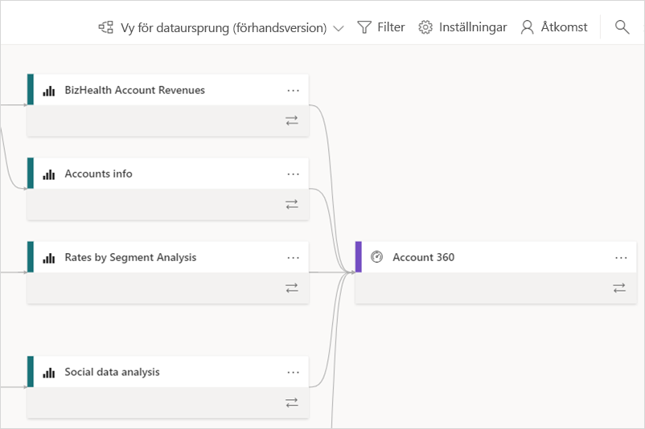
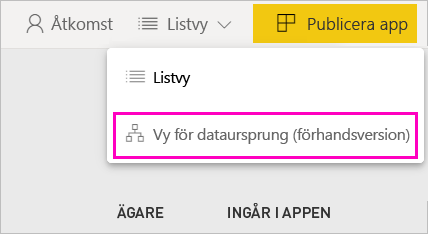
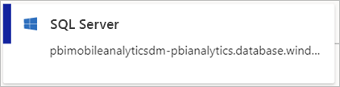
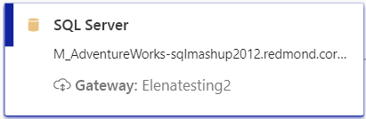
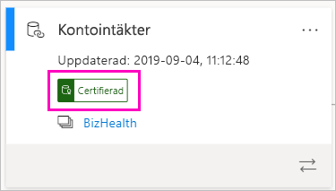
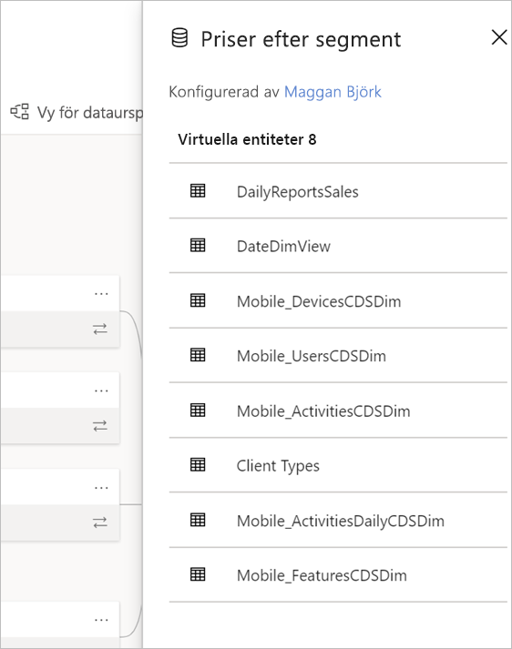
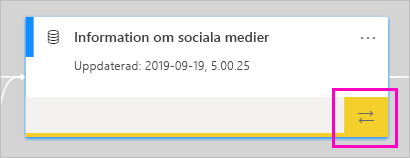
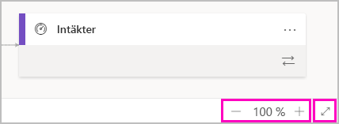

# Dataursprung (förhandsversion)
I moderna Business Intelligence-projekt kan det vara svårt att förstå dataflödet från datakällan till målet. Det kan vara ännu svårare om du har byggt avancerade analysprojekt som omfattar flera datakällor, artefakter och beroenden.  Frågor som ”vad händer om jag ändrar dessa data?” eller ”varför är inte den här rapporten uppdaterad?” kan vara svåra att svara på. Det kan krävas ett team av experter eller en djupgående undersökning för att hitta svaren. Vi har skapat en dataursprungsvy för att hjälpa dig att besvara dessa frågor.

 
I Power BI finns flera artefakttyper, till exempel instrumentpaneler, rapporter, datauppsättningar och dataflöden. Många datauppsättningar och dataflöden ansluter till externa datakällor, till exempel SQL Server, och till externa datauppsättningar i andra arbetsytor. När en datauppsättning är extern i förhållande till en arbetsyta som du äger, kan den ingå i en arbetsyta som ägs av någon annan, till exempel någon på IT-avdelningen eller någon annan analytiker. Externa datakällor och datauppsättningar gör att det blir svårare att veta var data kommer från. Vi har introducerat ursprungsvyn för både komplexa och enkla projekt. 

I ursprungsvyn visas ursprungsrelationerna mellan alla artefakter i en arbetsyta och alla deras externa beroenden. Dataflöden har redan en diagramvy, och ursprungsvyn utökar den vyn. Den visar anslutningar mellan alla artefakter på arbetsytan, inklusive anslutningar till dataflöden, både uppströms och nedströms. Den separata vyn med dataflödesdiagram tas bort i november.

## Utforska ursprungsvyn

Alla arbetsytor, oavsett om de är nya eller klassiska, har automatiskt en ursprungsvy, med undantag för Min arbetsyta. Du behöver minst en deltagarroll i arbetsytan för att kunna visa den. Mer information finns under [Behörigheter](#permissions) i den här artikeln. 

- Om du vill öppna ursprungsvyn går du till vyn med listan över arbetsytor. Tryck på pilen bredvid **Listvy** och välj **Ursprungsvy**.

    

    I den här vyn visas alla artefakter på arbetsytan och hur data flödar från en artefakt till en annan.

**Datakällor**

Du kan se de datakällor som datauppsättningar och dataflöden hämtar sina data från. På korten för datakällor visas mer information som kan hjälpa dig att identifiera källan. För Azure SQL Server visas till exempel även databasnamnet.

 
**Gatewayer**

Om en datakälla är ansluten via en lokal gateway läggs gatewayinformationen till på datakällans kort. Om du har behörighet som antingen gatewayadministratör eller användare av en datakälla, kan du se mer information, till exempel gatewaynamnet.

**Datauppsättningar och dataflöden**
 
På datauppsättningar ser du den senaste uppdateringstiden och om en datauppsättning är certifierad eller uppflyttad.

 
Om en rapport på arbetsytan bygger på en datauppsättning i en annan arbetsyta visas källarbetsytans namn på datauppsättningskortet. Välj källarbetsytans namn för att gå till den arbetsytan.
 
- Välj **Fler alternativ** (...) för valfri artefakt om du vill visa alternativmenyn. Den innehåller samma åtgärder som listvyn.
  
Om du vill se mer metadata om datauppsättningar väljer du själva datauppsättningskortet. Ytterligare information om datauppsättningen visas på en sidopanel.

 
## Visa ursprung för artefakter 

Anta att du vill se ursprunget för en specifik artefakt.

- Välj de dubbla pilarna under en artefakt.

    

    Power BI markerar alla artefakter som är relaterade till artefakten och resten tonas ned. 

## Navigering och helskärmsläge 

Ursprungsvyn är en interaktiv arbetsyta. Du kan använda musen och pekplattan för att navigera i arbetsytan och zooma in eller ut.  

- Om du vill zooma in och ut kan du använda menyn i det nedre högra hörnet eller musen eller pekplattan. 

- Om du vill ha mer utrymme för själva grafen använder du helskärmsalternativet i det nedre högra hörnet. 

    

## Behörigheter

- Du behöver en Power BI Pro-licens för att kunna visa ursprungsvyn.
- Ursprungsvyn är bara tillgänglig för användare som har åtkomst till arbetsytan.
- Användare måste ha en administratörs-, medlems- eller deltagarroll på arbetsytan. Användare med en visningsroll kan inte växla till ursprungsvyn.

## Överväganden och begränsningar

- Ursprungsvyn är inte tillgänglig i Internet Explorer. Mer information finns i [Webbläsare som stöds för Power BI](power-bi-browsers.md).
- Ursprungsvyn är inte tillgänglig i Min arbetsyta.

## Nästa steg

- [Introduktion till datamängder mellan arbetsytor (förhandsversion)](service-datasets-across-workspaces.md)
