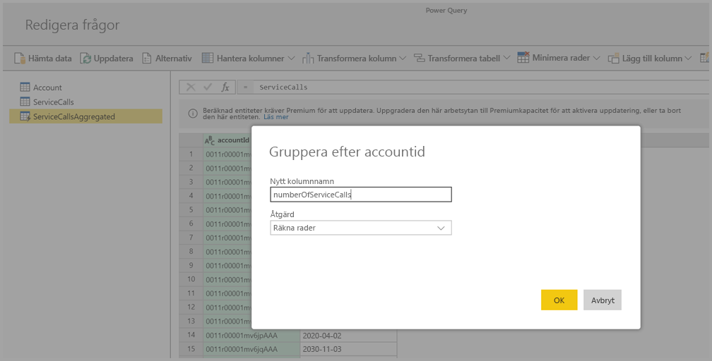
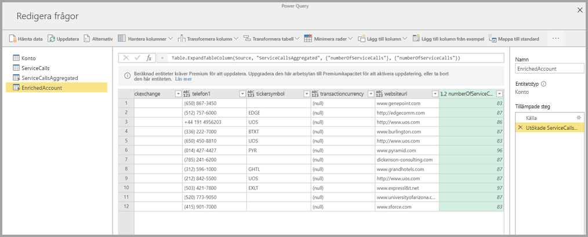

# Använda beräknade entiteter i Power BI Premium

Du kan göra **lagerberäkningar** när du använder **dataflöden** med en Power BI Premium-prenumeration. På så sätt kan du göra beräkningar på dina befintliga dataflöden och returnera resultat som hjälper dig att fokusera på att skapa rapporter och göra analyser. 

Om du vill göra **lagerberäkningar** måste du först skapa ett dataflöde och sedan hämta data till detta Power BI-dataflödeslager. När du har en dataflöde som innehåller data kan du skapa **beräknade entiteter**, vilket är enheter som utför lagerberäkningar. 

Det finns två sätt på vilka du kan ansluta dataflödesdata till Power BI:

* [Med självbetjäningsredigering av ett dataflöde](service-dataflows-create-use.md)
* Använda ett externt dataflöde

I följande avsnitt beskriver vi hur du kan skapa beräknade entiteter för dina dataflödesdata.

## Skapa beräknade entiteter 

När du har ett dataflöde med en lista över entiteter kan du utföra beräkningar på dessa entiteter.

Välj **Redigera entiteter** i Power BI-tjänstens redigeringsverktyg för dataflöde, högerklicka på det entitet som du vill använda som underlag för den beräknade entiteten och på vilken du vill att utföra beräkningar. Välj **Referens** på snabbmenyn.

Om entiteten ska kunna användas som en beräknad entitet måste avsnittet **Aktivera inläsning** ha markerats, så som visas på följande bild. Visa den här snabbmenyn genom att högerklicka på entiteten.

Genom att välja **Aktivera inläsning** skapar du en ny entitet för vilken källan är den refererade entiteten. Ikonen ändras och ikonen för **beräknad** visas som på följande bild.

Alla transformering du utför på den skapade nya entiteten körs med de data som redan finns i Power BI:s dataflödeslager. Det innebär att frågan inte körs mot den externa datakälla från vilken data importerades (t.ex. den SQL-databas från vilken data hämtades), utan i stället utförs på de data som finns i dataflödeslagret.

### Användningsexempel
Vilka typer av transformeringar kan utföras med beräknade entiteter? Alla transformeringar som du normalt anger med hjälp av användargränssnittet för transformering i Power BI eller i M-redigeraren stöds när du utför lagerberäkningar. 

Låt oss ta ett exempel: Du har en *Konto*-entitet som innehåller rådata för alla kunder i din Dynamics 365-prenumeration. Du har också *ServiceCalls*-rådata från Service Center med data från de supportsamtal som förts från annat konto under årets alla dagar.

Anta att du vill utöka *Konto*-entiteten med data från *ServiceCalls*. 

Först måste du aggregera data från ServiceCalls, så att du kan beräkna antalet supportsamtal som har gjorts för varje konto under det senaste året. 

Nu ska du vill slå ihop *Konto*-entiteten med *ServiceCallsAggregated*-entiteten, så att vi kan beräkna den utökade **Konto**-tabellen.

Sedan visas resultaten, vilka visas som *EnrichedAccount* på följande bild.

Och det var det hela! Transformeringen utförs på data i det dataflöde som finns i din Power BI Premium-prenumeration, och inte på källdata.

## Överväganden och begränsningar

Observera att om du tar bort arbetsytan från Power BI Premium-kapaciteten, så uppdateras inte det tillhörande dataflödet längre. 

När du arbetar med dataflöden som skapats enbart i en organisations Azure Data Lake Storage Gen2-konto, fungerar länkade entiteter och beräknade entiteter bara korrekt när entiteterna finns i samma lagringskonto. Du hittar mer information i [Ansluta Azure Data Lake Storage Gen2 för lagring av dataflöde (förhandsversion)](service-dataflows-connect-azure-data-lake-storage-gen2.md).

Länkade entiteter är inte tillgängliga för dataflöden som skapas från CDM-mappar (Common Data Model). Läs mer i informationen om hur du [lägger till en CDM-mapp i Power BI som ett dataflöde (förhandsversion)](service-dataflows-add-cdm-folder.md).

Ett metodtips är att du när du utför databeräkningar på data som är kopplade med lokala data och molndata alltid skapar en ny entitet för att utföra beräkningarna. Detta ger en bättre användarupplevelse än att använda en befintlig entitet för beräkningar, till exempel en entitet som också frågar efter data från båda källorna och gör transformeringar i datasjön.

## Nästa steg

I den här artikeln har vi beskrivit de beräknade entiteter och dataflöden som är tillgängliga i Power BI-tjänsten. Här följer några fler artiklar som kan vara användbara.

* [Dataförberedelser med självbetjäning för dataflöden](service-dataflows-overview.md)
* [Skapa och använda dataflöden i Power BI](service-dataflows-create-use.md)
* [Med hjälp av dataflöden med lokala datakällor](service-dataflows-on-premises-gateways.md)
* [Resurser för utvecklare för Power BI dataflöden](service-dataflows-developer-resources.md)
* [Konfigurera inställningar för arbetsytans dataflöde (förhandsversion)](service-dataflows-configure-workspace-storage-settings.md)
* [Lägga till en CDM-mapp i Power BI som ett dataflöde (förhandsversion)](service-dataflows-add-cdm-folder.md)
* [Ansluta Azure Data Lake Storage Gen2 för lagring av dataflöde (förhandsversion)](service-dataflows-connect-azure-data-lake-storage-gen2.md)

Mer information om Power Query och schemalagd uppdatering finns i följande artiklar:
* [Frågeöversikt i Power BI Desktop](desktop-query-overview.md)
* [Konfigurera schemalagd uppdatering](refresh-scheduled-refresh.md)

Mer information om Common Data Service finns i dess översiktsartikel:
* [Common Data Service – översikt ](https://docs.microsoft.com/powerapps/common-data-model/overview)

