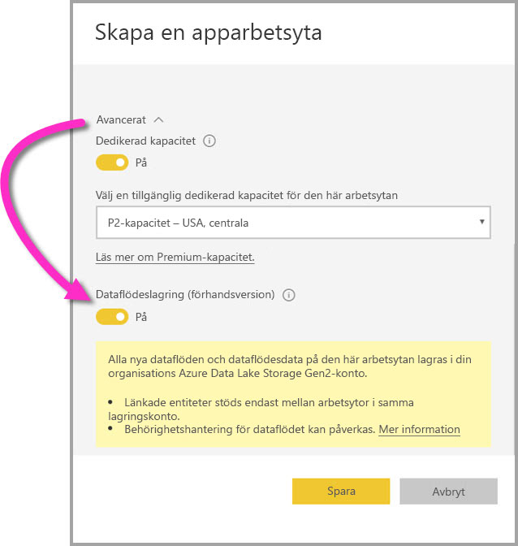

# Konfigurera inställningar för arbetsytans dataflöde (förhandsversion)

Med Power BI och dataflöden kan du lagra en arbetsytas definitionsfil för dataflöde och datafiler på ditt Azure Data Lake Storage Gen2-konto. Administratörer av arbetsytan kan konfigurera Power BI på detta vis och den här artikeln beskriver de olika stegen. 

Innan du kan konfigurera en lagringsplats för arbetsytans dataflöde måste företagets globala administratör ansluta organisationens lagringskonto till Power BI och aktivera behörigheter att tilldela lagring till det lagringskontot. *[Ansluta Azure Data Lake Storage Gen2 för lagring av dataflöde (förhandsversion)](service-dataflows-connect-azure-data-lake-storage-gen2.md)* 

Det finns två sätt att konfigurera lagringsinställningar för arbetsytans dataflöde: 

* När du skapar arbetsytan
* Genom att redigera en befintlig arbetsyta

Vi tar en titt på båda sätten i följande avsnitt. 

> [!IMPORTANT]
> Lagringsinställningen för arbetsytans dataflöde kan bara ändras om arbetsytan inte innehåller några dataflöden. Dessutom är den här funktionen endast tillgänglig i den nya arbetsyteversionen. Du kan läsa mer om den nya arbetsytan i artikeln [Skapa nya arbetsytor (Förhandsversion) i Power BI](service-create-the-new-workspaces.md).

## Skapa en ny arbetsyta, konfigurera dess dataflödeslagring

Om du vill skapa en ny apparbetsyta i Power BI-tjänsten väljer du **Arbetsytor > Skapa en apparbetsyta**.

I dialogrutan Skapa apparbetsyta kan en gul ruta visas med rubriken **Förbättrade arbetsytor i förhandsversion**. Där ska du välja **Prova nu**.

I dialogrutan som visas kan du ge den nya arbetsytan ett unikt namn. Klicka inte på **Spara** ännu, eftersom du behöver göra avancerade inställningar.

Expandera sedan området **Avancerat** i dialogrutan **Skapa en apparbetsyta** där du kan aktivera inställningen **Dataflödeslagring (förhandsgranskning)** .

Välj **Spara** för att skapa den nya arbetsytan. Alla nya dataflöden som skapas i den här arbetsytan lagrar nu sin definitionsfil (sin Model.json-fil) och sina data på organisationens Azure Data Lake Storage Gen2-konto. 

## Uppdatera dataflödeslagring för en befintlig arbetsyta

Istället för att skapa en ny arbetsyta kan du uppdatera en befintlig arbetsyta så att den lagrar definitionsfil och data på organisationens Azure Data Lake Storage Gen2-konto. Kom ihåg att lagringsinställningen för arbetsytans dataflöde bara kan ändras om arbetsytan inte redan innehåller något dataflöde.

Redigera en apparbetsyta genom att välja ellipsen **(...)** och välj sedan **Redigera arbetsyta**. 

Expandera **Avancerat** i fönstret **Redigera arbetsyta** som visas och ställ sedan in inställningen **Dataflödeslagring (förhandsgranskning)** på **På**. 

Välj sedan **Spara**, så lagrar alla nya dataflöden som skapas i den här arbetsytan sin definitionsfil och sina data på organisationens Azure Data Lake Storage Gen2-konto.

## Hämta URI för lagrade dataflödesfiler

När du har skapat ett dataflöde i en arbetsyta som är tilldelad organisationens Azure Data Lake-konto kan du komma åt dess definition och datafiler direkt. Deras plats är tillgänglig på sidan **Dataflödesinställningar**. Följ dessa steg för att komma dit:

Välj ellipsen **(...)**  bredvid ett dataflöde som visas under **Dataflöden** i arbetsytan. Välj **Inställningar** på menyn som visas.

I den angivna informationen visas platsen för dataflödets CDM-mapp under **Dataflödets lagringsplats**, som på följande bild.

> [!NOTE]
> Power BI ger dataflödesägaren skrivbehörighet till CDM-mappen där dataflödesfilerna lagras. Ägaren till lagringskontot måste bevilja åtkomst i Azure för att kunna bevilja andra personer eller tjänster åtkomst till dataflödesfilernas lagringsplats.

## Överväganden och begränsningar

Vissa dataflödesfunktioner stöds inte när dataflödeslagring finns i Azure Data Lake Storage Gen2: 

Power BI Pro, Premium och inbäddade arbetsytor:
* Funktionen **länkade entiteter** stöds bara bland arbetsytor i samma lagringskonto
* Behörigheter för arbetsytan gäller inte för dataflöden som lagras i Azure Data Lake Storage Gen2: endast ägaren av dataflödet kan komma åt den.
* I annat fall är alla funktioner för datapreparation desamma som för dataflöden som lagras i Power BI-lagring

Det finns några ytterligare överväganden, som beskrivs i följande lista:

* När du har konfigurerat en lagringsplats för dataflöden kan den inte ändras.
* Endast ägaren till ett dataflöde som lagrats i Azure Data Lake Storage Gen2 kan komma åt dess data.
* Lokala datakällor i Power BI-delade kapaciteter stöds inte i dataflöden som lagras i organisationens Azure Data Lake Storage Gen2.

**Power BI Desktop**-kunder kan inte komma åt dataflöden som lagrats på Azure Data Lake Storage Gen2-konton, såvida de inte är ägare till dataflödet. Se följande situation:

1.  Anna skapar en ny apparbetsyta och konfigurerar den så att den lagrar dataflöden i organisationens data lake.
2.  Ben, som också är medlem i arbetsytan som Anna skapade, vill använda Power BI Desktop och anslutningsappen för dataflöden för att hämta data från det dataflöde som Anna skapade.
3.  Ben får ett fel eftersom han inte har lagts till som behörig användare av det dataflödets CDM-mapp i aktuell datasjö.

    

## Nästa steg

Den här artikeln får du information om hur du konfigurerar arbetsytans lagring av dataflöden. Mer information finns i följande artiklar:

Mer information om dataflöden, CDM och Azure Data Lake Storage Gen2 finns i följande artiklar:

* [Dataflöden och Azure Data Lake-integrering (förhandsversion)](service-dataflows-azure-data-lake-integration.md)
* [Lägga till en CDM-mapp i Power BI som ett dataflöde (förhandsversion)](service-dataflows-add-cdm-folder.md)
* [Ansluta Azure Data Lake Storage Gen2 för lagring av dataflöde (förhandsversion)](service-dataflows-connect-azure-data-lake-storage-gen2.md)

Allmän information om dataflöden finns i de här artiklarna:

* [Skapa och använda dataflöden i Power BI](service-dataflows-create-use.md)
* [Använda beräknade entiteter i Power BI Premium (förhandsversion)](service-dataflows-computed-entities-premium.md)
* [Använda dataflöden med lokala datakällor (förhandsversion)](service-dataflows-on-premises-gateways.md)
* [Resurser för utvecklare för Power BI-dataflöden (förhandsversion)](service-dataflows-developer-resources.md)

Mer information om Azure Storage finns i de här artiklarna:

* [Säkerhetsguiden för Azure Storage](https://docs.microsoft.com/azure/storage/common/storage-security-guide)
* [Kom igång med github-exempel från Azure Data Services](https://aka.ms/cdmadstutorial)

Mer information om Common Data Service finns i dess översiktsartikel:

* [Common Data Service – översikt ](https://docs.microsoft.com/powerapps/common-data-model/overview)
* [CDM-mappar](https://go.microsoft.com/fwlink/?linkid=2045304)
* [CDM-modellfildefinition](https://go.microsoft.com/fwlink/?linkid=2045521)

Och du kan alltid prova att [ställa frågor till Power BI Community](http://community.powerbi.com/).
