# Ansluta Azure Data Lake Storage Gen2 för lagring av dataflöde (förhandsversion)

Du kan konfigurera Power BI-arbetsytor till att lagra dataflöden på din organisations Azure Data Lake Storage Gen2-konto. Den här artikeln beskriver de allmänna stegen som krävs för att göra det och innehåller vägledning och bästa praxis längs vägen. Det finns några fördelar med att konfigurera arbetsytor för att lagra dataflödesdefinitioner och datafiler i din data lake, inklusive följande:

* Azure Data Lake Storage Gen2 ger ett oerhört skalbart lagringsutrymme för data
* Dataflödesdata och definitionsfiler kan utnyttjas av din IT-avdelnings utvecklare för att dra nytta av Azure-data och AI-tjänster (artificiell intelligens) som visas i[github-exempel från Azure Data Services](https://aka.ms/cdmadstutorial)
* Gör att utvecklare i din organisation kan integrera dataflödesdata till interna program och branschspecifika affärslösningar med resurser för utvecklare för dataflöden och Azure

Om du vill använda Azure Data Lake Storage Gen2 för dataflöden, behöver du följande:

* **Power BI-klient** – Minst ett konto i din AAD-klienten (Azure Active Directory) måste vara registrerat för Power BI
* **Ett globalt administratörskonto** – Det här kontot krävs för att ansluta och konfigurera Power BI för att lagra definitionen för dataflöde och data i ditt konto för Azure Data Lake Storage Gen2
* **En Azure-prenumeration** – Du behöver en Azure-prenumeration för att använda Azure Data Lake Storage Gen2
* **Resursgrupp** – Använd en resursgrupp som du redan har eller skapa en ny
* **Ett Azure Storage-konto med funktionen Data Lake Storage Gen2 (förhandsgranskning) aktiverad** – Om du vill ansluta till Azure Data Lake Storage Gen2 måste du registrera dig för den offentliga förhandsversionen

> [!TIP]
> Om du inte har någon Azure-prenumeration kan du [skapa ett kostnadsfritt konto](https://azure.microsoft.com/free/) innan du börjar.

## Förbereda din Azure Data Lake Storage Gen2 för Power BI

Innan du kan konfigurera Power BI med ett Azure Data Lake Storage Gen2-konto, måste du skapa och konfigurera ett lagringskonto. Låt oss ta en titt på kraven för Power BI:

1. Storage-kontot måste skapas i samma Microsoft Azure Active Directory-klient som Power BI-klienten.
2. Storage-kontot måste skapas i samma-region som Power BI-klienten. Om du vill ta reda på var din Power BI-klientorganisation finns kan du läsa [Var finns min Power BI-klientorganisation?](service-admin-where-is-my-tenant-located.md).
3. Lagringskontot måste ha funktionen *Hierarkiskt namnområde* aktiverad.
4. Power BI-tjänsten måste beviljas en roll som *Läsare* på lagringskontot.
5. Ett filsystem med namnet **powerbi** måste skapas.
6. Power BI-tjänster måste ha behörighet till filsystemet **powerbi** som du skapar.

I följande avsnitt beskrivs de steg som krävs för att konfigurera ditt Azure Data Lake Storage Gen2-konto i detalj.

> [!NOTE]
> Dataflödesfunktionen är en förhandsversion och kan komma att ändras och uppdateras innan den är allmänt tillgänglig.

### Skapa lagringskontot

Följ stegen i artikeln [Skapa ett lagringskonto i Azure Data Lake Storage Gen2](https://docs.microsoft.com/azure/storage/blobs/data-lake-storage-quickstart-create-account).

1. Kontrollera att du väljer samma plats som Power BI-klienten och ange din lagring som **StorageV2 (generell användning v2)**
2. Kontrollera att du aktiverar funktionen för hierarkiskt namnrymd
3. Vi rekommenderar att ställa in inställningen för lagringsreplikering på **Read-access geo-redundant-lagring (RA-GRS)**

### Bevilja Power BI-tjänsten en läsarroll

Därefter måste du ge Power BI-tjänsten en läsarroll i ditt skapade lagringskonto. Det är en inbyggd roll så stegen är enkla. 

Följ stegen i artikeln [Tilldela en roll till en säkerhetsprincip](https://docs.microsoft.com/azure/storage/common/storage-auth-aad-rbac#assign-a-role-to-a-security-principal).

I fönstret **Lägg till rolltilldelning** väljer du rollen **Läsare** för att tilldela Power BI-tjänsten. Använd sedan sökfunktionen för att hitta **Power BI-tjänsten**. Följande bild visar rolltilldelningen **Läsare** för Power BI-tjänsten.

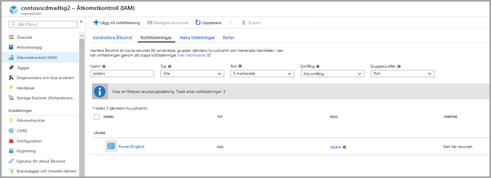

### Skapa ett filsystem för Power BI

Du måste skapa ett filsystem med namnet *powerbi* innan ditt lagringskontot kan läggas till i Power BI. Det finns många sätt att skapa sådana ett filsystem, inklusive användning av Azure Databricks, HDInsight, AZCopy eller Azure Storage Explorer. Det här avsnittet visas ett enkelt sätt att skapa ett filsystem med hjälp av Azure Storage Explorer.

Det här steget kräver att du installerar Azure Storage Explorer version 1.6.2 eller senare. Om du vill installera Azure Storage Explorer för Windows, Macintosh eller Linux, se [Azure Storage Explorer](https://azure.microsoft.com/features/storage-explorer/).

1. När du har installerat Azure Storage Explorer, kommer Microsoft Azure Storage Explorer – Anslut fönster att visas. Storage Explorer ger flera sätt att ansluta till lagringskonton,men för närvarande stöds bara ett sätt för de nödvändiga inställningarna. 

2. I det vänstra fönstret letar du upp och expanderar det lagringskonto som du skapade ovan.

3. Högerklicka på Blob-behållare och från snabbmenyn väljer du – Skapa Blob-behållare.

   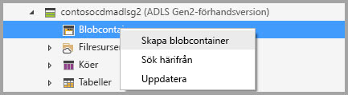

4. En textruta visas nedanför mappen Blob-behållare. Ange namnet *powerbi* 

   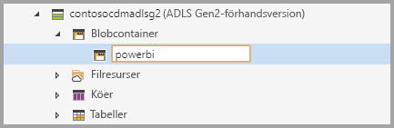

5. Tryck på RETUR när du har skapat blob-behållaren

   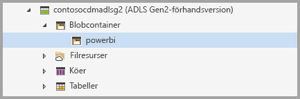

I nästa avsnitt, kan du ge Power BI-gruppen av tjänster fullständig åtkomst till filsystemet som du skapade. 

### Bevilja Power BI tillstånd till filsystemet

För att tilldela behörigheter till filsystemet, kan du använda inställningar för åtkomstkontrollistan (ACL) som beviljar åtkomst för Power BI-tjänsten. Det första steget för detta är att skaffa Power BI-tjänsteidentitet i din klient. Du kan visa dina Microsoft Azure Active Directory (AAD)-program i avsnittet **företagsappar** i Azure Portal.

Följ dessa steg om du vill hitta dina klientprogram:

1. Välj **Azure Active Directory** i [Azure-portalen](https://portal.azure.com/) från vänster navigeringspanel.
2. I bladet Azure **Active Directory** väljer du **företagsprogram**.
3. Från den nedrullningsbara menyn **Programtyp** väljer du **Alla program** och välj sedan **Tillämpa**. Ett exempel på klient-program visas som liknar följande bild.

    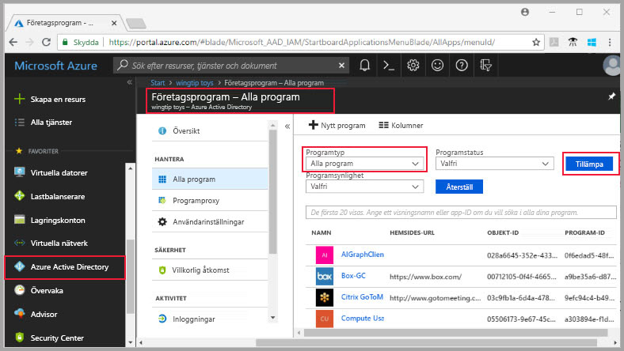

4. I sökfältet skriver du in *Power* och en samling objekt-ID för Power BI- och Power Query-program visas. Du behöver alla tre värden i efterföljande steg.  

    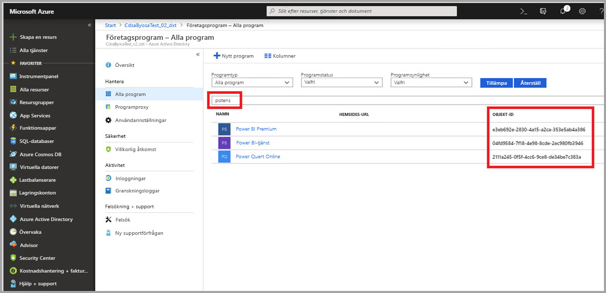

5. Markera och kopiera objekt-ID för både Power BI-tjänsten och Power BI Premium från sökresultatet. Var redo att klistra in värdena i efterföljande steg.

7. Använd sedan **Azure Storage Explorer** för att navigera till filsystemet *powerbi* som du skapade i föregående avsnitt. Följ instruktionerna i delen [Hantera åtkomst](https://docs.microsoft.com/azure/storage/blobs/data-lake-storage-how-to-set-permissions-storage-explorer#managing-access) av artikeln [Ange behörigheter på fil- och kolumnnivå med Azure Storage-utforskaren](https://docs.microsoft.com/azure/storage/blobs/data-lake-storage-how-to-set-permissions-storage-explorer).

8. För vart och ett av de två Power BI-objekt-ID:n som samlats in i steg 5 tilldela **Läs**-, **Skriv**- och **Kör**-åtkomst och standard-ACL till ditt *powerbi*-filsystem.

   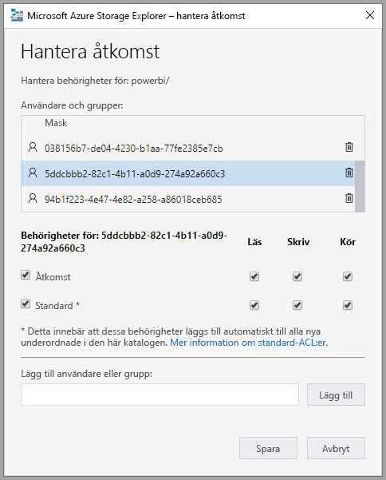

9. För Power Query Online-objekt-ID som samlats in i steg 4 tilldelar du **Skriv**- och **Kör**åtkomst samt standard-ACL till ditt *powerbi*-filsystem.

   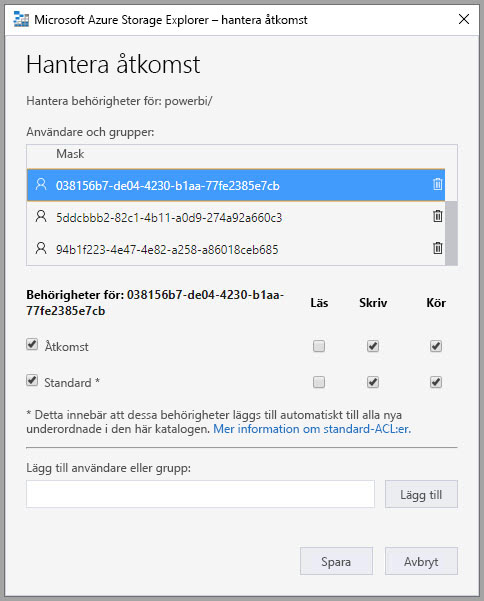

10. Dessutom för den **Andra**, tilldela **kör**-åtkomst och standard-ACL:er också.

    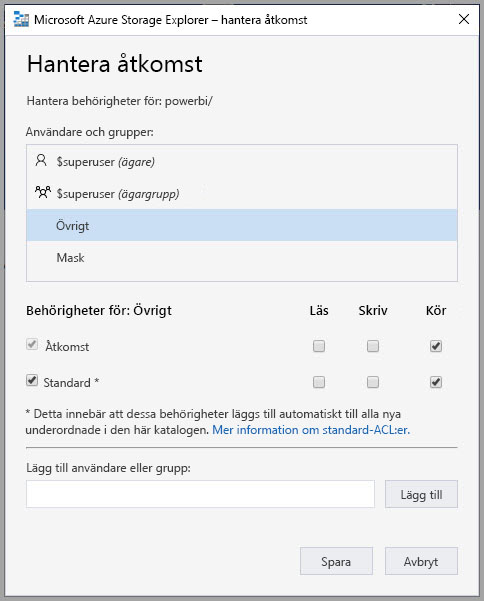

## Anslut din Azure Data Lake Storage Gen2 till Power BI

När du har konfigurerat ditt Azure Data Lake Storage Gen2-konto i Azure Portal kan du ansluta det till Power BI i **Power BI-administratörsportalen**. Du också hantera Power BI-dataflödeslagring i inställningen **Dataflödeslagring (förhandsversion)** i Power BI-administratörsportalen. Anvisningar för start och grundläggande användning finns i [Hur du kommer till administrationsportalen](service-admin-portal.md) med detaljerad information.

Du ansluter ditt **Azure Data Lake Storage Gen2**-konto med följande steg:

1. Navigera till fliken **Dataflödesinställningar (förhandsgranskning)** i **Power BI-administratörsportalen**

    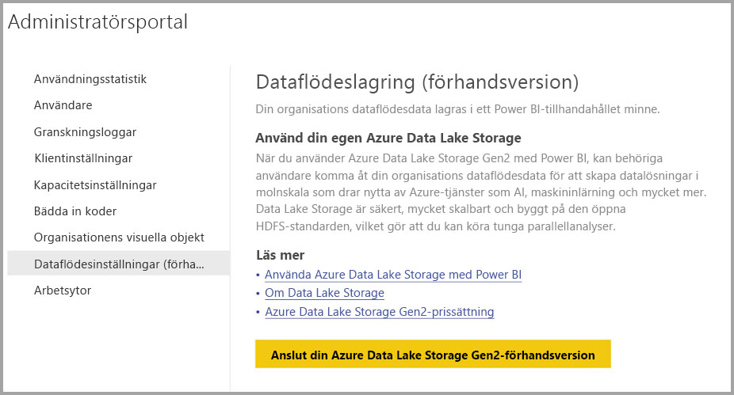 

2. Välj knappen **Anslut din Azure Data Lake Storage Gen2-förhandsgranskning**. Följande fönster visas.

    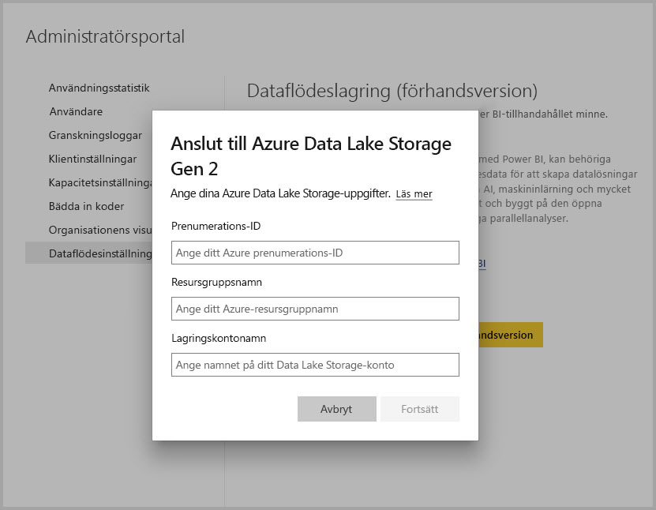 

3. Ange **Prenumerations-ID** för Storage-kontot.
4. Ange **Resursgruppnamnet** i vilket lagringskontot har skapats.
5. Tillhandahåll **lagringskontots namn**.
6. Välj **Anslut**.

När de här stegen har slutförts, är ditt Azure Data Lake Storage Gen2-konto anslutet till Power BI. 

Därefter måste du göra det möjligt personer i din organisation att konfigurera sina arbetsytor där de kan använda det här lagringskontot för dataflödesdefinition och datalagring. Låt oss göra det i nästa avsnitt. 

## Tillåt att administratörer kan tilldela arbetsytor

Som standard lagras dataflödesdefinition och datafiler i det lagringsutrymme som ingår i Power BI. För att komma åt dataflödesfiler i ditt eget lagringskonto måste administratörer för arbetsytan först konfigurera arbetsytan för att tillåta tilldelning och lagring av dataflöden i det nya lagringskontot. Innan en administratör för arbetsytan kan konfigurera inställningarna för dataflöde måste administratören beviljas behörighet att tilldela lagring i **Power BI-administratörsportalen**.

Om du vill bevilja behörighet för lagringstilldening, går du till fliken **dataflöde inställningar (förhandsgranskning)** i **Power BI-administratörsportalen**. Det finns en alternativknapp *Administratörer av arbetsytan kan tilldela arbetsytor till det här lagringskontot* som måste anges till **Tillåt**. När du aktiverar skjutreglaget, väljer du knappen **Tillämpa** för att ändringen ska börja gälla. 

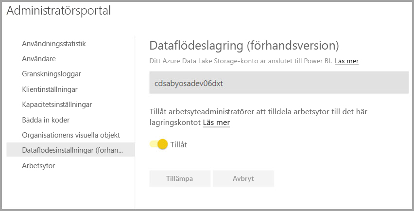 

Och sedan är du klar. Administratörer för Power BI-arbetsytan kan nu tilldela arbetsflöden till filsystemet som du skapade.

## Överväganden och begränsningar

Den här funktionen är en förhandsgranskningsfunktion och dess beteende kan ändras när lanseringen närmar sig. Det finns några överväganden och begränsningar som du bör tänka på när du arbetar med din dataflödeslagring:

* När du har konfigurerat en lagringsplats för dataflöden kan den inte ändras.
* Endast ägare till ett dataflöde som lagrats i Azure Data Lake Storage Gen2 kan komma åt dess data som standard. För att auktorisera ytterligare personer till de dataflöden som lagras i Azure måste du lägga till dem till dataflödets Common Data Service-mapp 
* Skapa dataflöden med länkade entiteter är endast möjligt om de lagras i samma lagringskonto
* Lokala datakällor i Power BI-delade kapaciteter stöds inte i dataflöden som lagras i organisationens data lake

Det finns också några kända problem som beskrivs i det här avsnittet.

Power BI Desktop-kunder kan inte komma åt dataflöden som lagrats på ett **Azure Data Lake Storage-konton**, såvida de inte är ägare till dataflödet eller har getts behörighet till Common Data Service-mappen i sjön. Scenariot är följande:

1. Anna har skapat en ny apparbetsyta och konfigurerat den så att den lagrar dataflöden i organisationens data lake. 
2. Ben, som också är medlem i arbetsytan som Anna skapade, vill använda Power BI Desktop och anslutningsappen för dataflöden för att hämta data från det dataflöde som Anna skapade.
3. Ben får ett fel som liknar följande bild, eftersom han inte var behörig användare av det dataflödets CDM-mapp i aktuell sjö

Här följer några vanliga frågor och svar:

**Fråga:** Vad händer om jag tidigare har skapat dataflöden i en arbetsyta och vill ändra deras lagringsplats?

**Svar:** Du kan inte ändra lagringsplatsen för ett dataflöde efter att det har skapats. 

**Fråga:** När kan jag ändra dataflödets lagringsplatsen för en arbetsyta?

**Svar:** Det är bara tillåtet att ändra dataflödets lagringsplats för en arbetsyta om arbetsytan inte innehåller några dataflöden.

## Nästa steg

Den här artikeln ger information om hur du ansluter en Azure Data Lake Gen2 för lagring av dataflöde. Mer information finns i följande artiklar:

Mer information om dataflöden, CDM och Azure Data Lake Storage Gen2 finns i följande artiklar:

* [Dataflöden och Azure Data Lake-integrering (förhandsversion)](service-dataflows-azure-data-lake-integration.md)
* [Konfigurera inställningar för arbetsytans dataflöde (förhandsversion)](service-dataflows-configure-workspace-storage-settings.md)
* [Lägga till en CDM-mapp i Power BI som ett dataflöde (förhandsversion)](service-dataflows-add-cdm-folder.md)

Allmän information om dataflöden finns i de här artiklarna:

* [Skapa och använda dataflöden i Power BI](service-dataflows-create-use.md)
* [Använda beräknade entiteter i Power BI Premium (förhandsversion)](service-dataflows-computed-entities-premium.md)
* [Använda dataflöden med lokala datakällor (förhandsversion)](service-dataflows-on-premises-gateways.md)
* [Resurser för utvecklare för Power BI-dataflöden (förhandsversion)](service-dataflows-developer-resources.md)

Mer information om Azure Storage finns i de här artiklarna:
* [Säkerhetsguiden för Azure Storage](https://docs.microsoft.com/azure/storage/common/storage-security-guide)

Mer information om Common Data Service finns i dess översiktsartikel:
* [Common Data Service – översikt ](https://docs.microsoft.com/powerapps/common-data-model/overview)
* [CDM-mappar](https://go.microsoft.com/fwlink/?linkid=2045304)
* [CDM-modellfildefinition](https://go.microsoft.com/fwlink/?linkid=2045521)

Och du kan alltid prova att [ställa frågor till Power BI Community](http://community.powerbi.com/).
