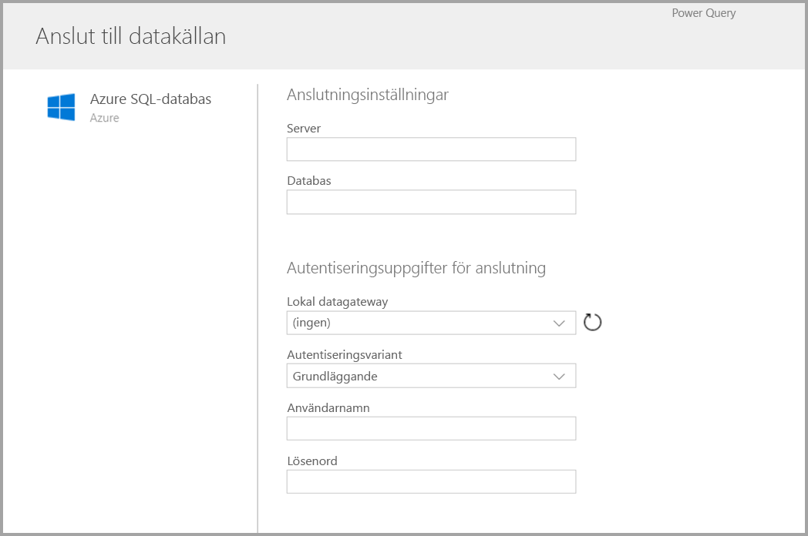
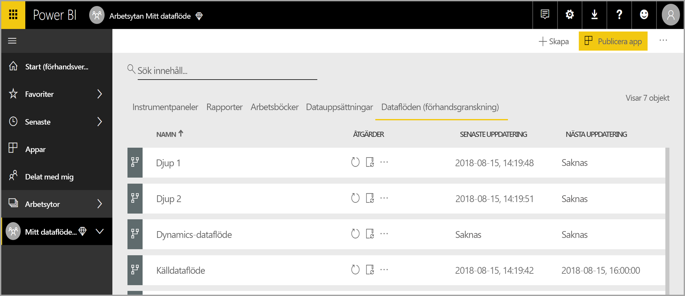
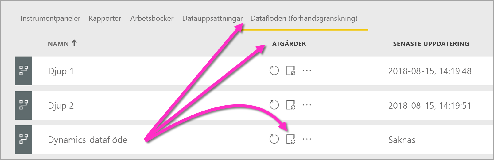
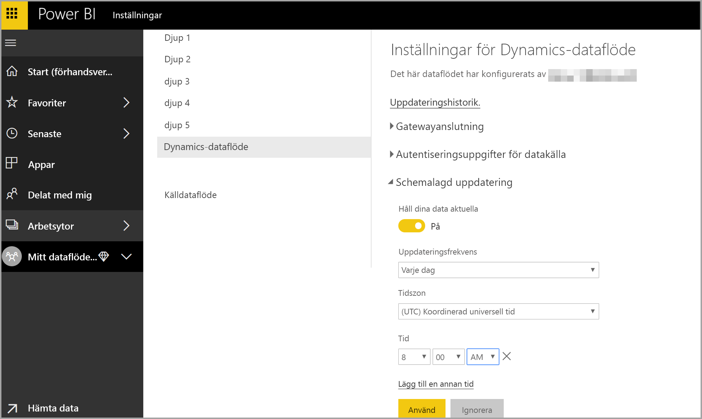

# Skapa och använda dataflöden i Power BI (förhandsversion)

Med avancerad databearbetning som är tillgänglig i **Power BI**, kan du skapa en samling som kallas ett dataflöde som du sedan kan använda för att ansluta till affärsdata från olika källor, rensa data, omvandla dem och sedan läsa in dem till Power BI-lagring.

Ett **dataflöde** är en samling *entiteter* (entiteter är likt tabeller) som skapas och hanteras i app-arbetsytor i Power BI-tjänsten. Du kan lägga till och redigera entiteter i ditt dataflöde samt hantera scheman för uppdatering av data direkt från arbetsytan där ditt dataflöde skapades.

När du skapar ett dataflöde kan du använda **Power BI Desktop** och **Power BI-tjänsten** för att skapa datauppsättningar, rapporter, instrumentpaneler och appar som baseras på de data som du lägger till i Power BI-dataflöden, och därmed få insikter om din verksamhet.

Det finns tre huvudsakliga steg för att använda ett dataflöde:

1. Redigera dataflöde med hjälp av Microsoft-verktyg som är utformade för att göra detta väldigt enkelt
2. Schemalägga uppdateringsfrekvensen för de data du vill ta till ditt dataflöde
3. Skapa datauppsättningen med hjälp av ditt dataflöde, med hjälp av Power BI Desktop 

I följande avsnitt kommer vi att titta på vart och ett av de här stegen och bekanta oss med de verktyg som finns för att slutföra varje steg. Då sätter vi igång.

> [!NOTE]
> Dataflödesfunktionen är en förhandsversion och kan komma att ändras och uppdateras innan den är allmänt tillgänglig.

## Skapa ett dataflöde
Om du vill skapa ett dataflöde, starta Power BI-tjänsten i en webbläsare och välj sedan en **apparbetsyta** (dataflöden är inte tillgängliga i *Min arbetsyta* i Power BI-tjänsten) i navigeringsfönstret till vänster som visas i följande skärmbild. Du kan också skapa en ny arbetsyta där du kan skapa ditt nya dataflöde. 

När du arbetar i ett område i **apparbetsytan** där du kan skapa ett dataflöde, visas knappen **+ Skapa** i det övre högra hörnet av arbetsytan. Välj knappen **+ Skapa** och välj **Dataflöde** från den nedrullningsbara listan. 

Det är viktigt att veta att det endast finns *en ägare* för varje dataflöde, vilket är den person som skapar det. Endast ägaren kan redigera dataflödet. Alla medlemmar i **apparbetsytan** som har läs- eller skrivbehörighet till apparbetsytan där dataflödet skapas kan ansluta till dataflödet inifrån **Power BI Desktop**, såsom beskrivs senare i den här artikeln.

Därifrån kan du lägga till **entiteter**, som beskrivs mer i nästa avsnitt.

### Lägg till entiteter

En **entitet** är en uppsättning fält som används för att lagra data, ungefär som en tabell i en databas. I följande bild ser du urvalet av datakällor som kan du hämta data till Power BI.

När du väljer en datakälla kan du uppmanas om att ange anslutningsinställningar, inklusive kontot som ska användas vid anslutning till datakällan, enligt följande bild.

När du är ansluten, kan du välja vilka data som ska användas för entiteten. När du väljer data och en källa, kommer Power BI därefter att återansluta till datakällan för att behålla data i ditt dataflöde uppdaterade, med den frekvens som du väljer senare i installationen.

När du har valt data för användning i entiteten kan du använda dataflödesredigeraren för att forma eller transformera dessa data till det format som krävs för användning i ditt dataflöde.

### Använda redigeraren för dataflöde

När du har valt vilka data från källan som ska användas för entiteten, kan du forma den brytpunkt i ett formulär som fungerar bäst för din entitet med en Power Query-redigeringsegenskap, som liknar **Power Query Editor** i  **Power BI Desktop**. Du kan läsa mer om Power Query (Power Query ingår i Power BI Desktop precis som Power Query Editor) i [artikeln Frågeöversikt](desktop-query-overview.md) för Power BI Desktop. 

Om du vill se den kod som frågeredigeraren skapar för varje steg eller om du vill skapa din egen utformningskod, kan du använda **Avancerad redigerare**. 

### Dataflöden och Common Data Model (CDM)

Dataflödesentiteter innehåller nya verktyg för att enkelt mappa dina affärsdata till Common Data Model (Microsofts standardiserade schema), berika dem med Microsoft- och tredjepartsdata och få förenklad åtkomst till maskininlärning. De här nya funktionerna kan användas för att ge intelligenta och värdefulla insikter om dina affärsdata. När du har slutfört alla transformeringar i steget Redigera frågor, kan du mappa kolumner från dina datakälltabeller till standardentitetsfält som definieras av den gemensamma datamodellen. Standardentiteter innehåller ett känt schema som definierats av den gemensamma datamodellen.

Få mer information om den här metoden och den gemensamma datamodellen i artikeln [vad är Common Data Model](https://docs.microsoft.com/powerapps/common-data-model/overview).

Om du vill utnyttja den gemensamma datamodellen med ditt dataflöde, klickar du på omvandlingen **Mappa till standard** i dialogrutan **Redigera frågor**. På skärmen **Mappa entiteter** som visas kan du välja den standardentitet som du vill mappa till.

När du mappar en källkolumn till standardfältet inträffar följande:

1. Källkolumnen får standardfältnamnet (kolumnen döps om ifall namnen skiljer sig åt)
2. Källkolumnen får datatypen standardfält

Om du vill behålla standardentitet för Common Data Model får alla standardfält som inte är mappade *Null*-värden.

Alla källkolumner som inte är mappade förblir som de är, för att kontrollera att resultatet av mappningen är en standardentitet med anpassade fält.

När du har slutfört dina val och entiteten och dess inställningar är klara att sparas kan du välja **Spara** på menyn. Observera att du kan skapa flera entiteter genom att välja knappen **Lägg till entiteter** och att du kan redigera entiteter för att förfina de frågor och entiteter som du har skapat.

När du väljer **Spara**, uppmanas du att namnge ditt dataflöde och ange en beskrivning.

När du är klar och väljer knappen **Spara** visas ett fönster som talar om att ditt **dataflöde** har skapats. 

Utmärkt – nu är du redo för nästa steg, vilket är att schemalägga uppdateringsfrekvensen för dina datakällor.

## Schemalägga uppdateringsfrekvensen

När du har sparat ditt dataflöde bör du schemalägga uppdateringsfrekvensen för var och en av dina anslutna datakällor.

Power BI-dataflöden använder datauppdateringsprocessen för Power BI för att hålla dina data uppdaterade. I **Power BI-tjänsten** i avsnittet **apparbetsyta** finns en samling av områden där din information kan visas, inklusive dataflöden, enligt följande bild.

Posten *Dynamics dataflöde* i föregående bild är det dataflöde som vi skapade i föregående avsnitt. För att schemalägga en uppdatering, väljer du ikonen **Schemauppdatering** under avsnittet **Åtgärder** som visas i följande bild. 

När du väljer ikonen **Schemauppdatering** kommer du till fönstret **Schemauppdatering** där du kan ange uppdateringsfrekvensen och -tiden för dataflödet.

Mer information om att schemalägga uppdateringar finns i artikeln [konfigurera schemalagd uppdatering](refresh-scheduled-refresh.md), som beskriver uppdateringsbeteendet för Power BI-datauppsättningar. Dataflöden fungerar på samma sätt som Power BI-datauppsättningar när det gäller uppdateringsinställningarna. 

## Anslut till ditt dataflöde i Power BI Desktop

När du har skapat ditt dataflöde och du har schemalagt uppdateringsfrekvensen för varje datakälla som fyller i modellen, är du redo för det tredje och sista steget som är att ansluta till ditt dataflöde inifrån **Power BI Desktop**. 

För att ansluta till dataflödet i Power BI Desktop väljer du **Hämta Data > Power BI > Power BI dataflöden (Beta)** enligt följande bild.

Därifrån kan du gå till **apparbetsytan** där du har sparat ditt dataflöde, välja dataflödet och sedan välja de entiteter som du skapade från listan.

Du kan också använda **sökfältet**, högst upp i fönstret för att snabbt hitta namnet på ditt dataflöde eller entiteter bland många dataflödesentiteter.

När du väljer entiteten och sedan väljer knappen **Ladda** visas entiteter i fönstret **Fält** i **Power BI Desktop**, och de visas och fungerar precis som **tabeller** från alla andra datauppsättningar.

## Med hjälp av dataflöden som lagras i Azure Data Lake Storage Gen2

Vissa organisationer kan vilja använda sin egen lagring för skapande och hantering av dataflöden. Du kan integrera dataflöden med Azure Data Lake Storage Gen2 om du följer kraven och hanterar behörigheter korrekt. Dokumentation om alla krav för den här metoden finns från och med dokumentöversikten, [dataflöden och Azure Data Lake-integration (förhandsversion)](service-dataflows-azure-data-lake-integration.md).

## Felsökning av dataanslutningar

Det kan finnas tillfällen när anslutningen till datakällor för dataflöden stöter på problem. Det här avsnittet innehåller felsökningstips när sådana problem uppstår. 

* **Salesforce-anslutningsprogrammet** – Att använda ett konto för Salesforce-dataflöden leder till ett anslutningsfel men ingen information tillhandahålls. Lös detta genom att använda ett Salesforce-konto för produktion eller ett utvecklarkonto för testning.

* **SharePoint-anslutningsappen** – Kontrollera att du anger rotadressen för SharePoint-webbplatsen utan undermappar eller dokument. Använd till exempel länken som liknar följande: https://microsoft.sharepoint.com/teams/ObjectModel/ 

## Nästa steg

Den här artikeln beskriver hur du kan skapa ditt egna **dataflöde** och skapa en datauppsättning och rapport i **Power BI Desktop** för att dra nytta av den. Följande artiklar är användbara för ytterligare information och scenarier när du använder dataflöden:

* [Dataförberedelser med självbetjäning för dataflöden](service-dataflows-overview.md)
* [Använda beräknade entiteter på Power BI Premium (förhandsversion)](service-dataflows-computed-entities-premium.md)
* [Använda dataflöden med lokala datakällor (förhandsversion)](service-dataflows-on-premises-gateways.md)
* [Resurser för utvecklare för Power BI-dataflöden (förhandsversion)](service-dataflows-developer-resources.md)
* [Dataflöden och Azure Data Lake-integrering (förhandsversion)](service-dataflows-azure-data-lake-integration.md)

Mer information om Common Data Service finns i dess översiktsartikel:
* [Common Data Service – översikt](https://docs.microsoft.com/powerapps/common-data-model/overview)
* [Läs mer om Common Data Model-schemat och -entiteter på GitHub](https://github.com/Microsoft/CDM)

Relaterade artiklar i Power BI Desktop:

* [Ansluta till datauppsättningar i Power BI-tjänsten från Power BI Desktop](desktop-report-lifecycle-datasets.md)
* [Frågeöversikt i Power BI Desktop](desktop-query-overview.md)

Relaterade artiklar för Power BI-tjänsten:
* [Konfigurera schemalagd uppdatering](refresh-scheduled-refresh.md)
