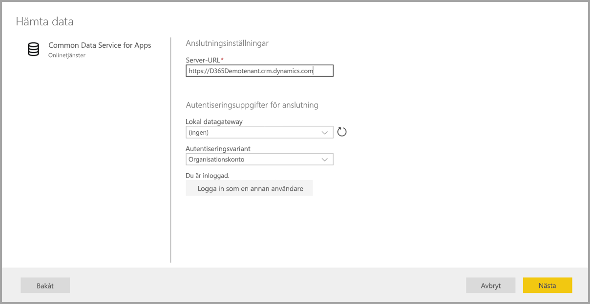

# Ansluta till datakällor för Power BI-dataflöden (förhandsversion)

Med Power BI-dataflöden kan du ansluta till många olika datakällor för att skapa nya dataflöden eller lägga till nya entiteter i ett befintligt dataflöde.

I den här artikeln listas de många tillgängliga datakällorna för att skapa eller lägga till dataflöden och det beskrivs hur du skapar dessa dataflöden med hjälp av datakällorna.

En översikt i hur du skapar och använder dataflöden finns i [Skapa och använda dataflöden i Power BI (förhandsversion)](service-dataflows-create-use.md).

## Skapa ett dataflöde från en datakälla

Anslut till data från **Power BI-tjänsten** genom att välja menyalternativet **+ Skapa**. Välj sedan **dataflöde** på menyn som visas. När du har valt visas följande bild på arbetsytan i Power BI-tjänsten. 

Om dataflödet redan finns kan du lägga till nya entiteter i dataflödet genom att välja **Lägg till entiteter** (visas nedan) eller genom att välja **Hämta data** i redigeringsverktyget för dataflöden.

I följande bild visas knappen **Hämta data** i redigeringsverktyget för dataflöden. 

## Datakällor för dataflöden

Du kan visa de tillgängliga datakällorna genom att välja **Hämta Data** i redigeringsverktyget för dataflöden, som sedan visar en dialogruta för att välja kategorierna och varje datakälla, enligt följande bild.

Datakällor för dataflöden är ordnade i följande kategorier, som visas högst upp i dialogrutan **Hämta data**:

* Alla kategorier
* Fil
* Databas
* Power BI
* Azure
* Onlinetjänster
* Övrigt

Kategorin **Alla kategorier** innehåller alla datakällor, från alla kategorier. 

Kategorin **Fil** innehåller följande tillgängliga dataanslutningar för dataflöden:

* Åtkomst
* Excel
* JSON
* Text/CSV
* XML

Kategorin **Databas** innehåller följande tillgängliga dataanslutningar för dataflöden:

* IBM DB2-databas
* MySQL-databas
* Oracle-databas
* PostgreSQL-databas
* SQL Server-databas
* Sybase-databas
* Teradata-databas

Kategorin **Power BI** innehåller följande tillgängliga dataanslutningar för dataflöden:

* Power BI-dataflöden

Kategorin **Azure** innehåller följande tillgängliga dataanslutningar för dataflöden:

* Azure-blobbar
* Azure Data Explorer
* Azure SQL Data Warehouse
* Azure SQL Database
* Azure-tabeller

Kategorin **Onlinetjänster** innehåller följande tillgängliga dataanslutningar för dataflöden:

* Common Data Service för appar
* Microsoft Exchange Online
* Salesforce-objekt
* Salesforce-rapporter
* SharePoint Online-lista
* Smartsheet

Kategorin **Övriga** innehåller följande tillgängliga dataanslutningar för dataflöden:

* Active Directory
* OData
* SharePoint-lista
* Webb-API
* Webbsida
* Tom tabell
* Tom fråga

## Ansluta till en datakälla

Välj den datakälla du vill ansluta till. Vi använder ett exempel för att visa hur processen fungerar, men varje dataanslutning för dataflöden är en liknande process. Olika anslutningsappar kan kräva specifika autentiseringsuppgifter eller annan information men flödet är liknande. I vårt exempel ser du i följande bild att **Common Data Service for Apps** har valts i dataanslutningskategorin **Onlinetjänster**.

Ett anslutningsfönster för den valda dataanslutningen visas. Om det krävs autentiseringsuppgifter uppmanas du att ange dem. I följande bild visas hur en server-URL anges för att ansluta till en Common Data Service for Apps-server.

När server-URL:en eller resursanslutningsinformation har angetts väljer du **Logga in** för att ange de autentiseringsuppgifter som ska användas för dataåtkomst. Välj sedan **Nästa**.

**Power Query Online** startar och upprättar anslutningen till datakällan, och visar sedan de tillgängliga tabellerna från den datakällan i **Navigatör**-fönstret, som visas i följande bild.

Du kan välja tabeller och data som ska läsas in genom att markera kryssrutan bredvid varje i det vänstra fönstret. Läs in data genom att välja **OK** längst ned i **Navigatör**-fönstret. En Power Query Online-dialogruta visas, där du kan redigera frågor och utföra andra transformeringar på valda data.

Det är allt det är. Andra datakällor har liknande flöden och använder Power Query Online för att redigera och transformera de data du för in i dataflödet.

## Ansluta till ytterligare datakällor

Det finns ytterligare dataanslutningar som inte visas i användargränssnittet för Power BI-dataflöden, men stöds med några få ytterligare steg. 

Du kan göra följande för att skapa en anslutning till en anslutningsapp som inte visas i användargränssnittet:

1. Öppna **Power BI Desktop** och välj **Hämta data**.
2. Öppna **Power Query Editor** i Power BI Desktop, högerklicka sedan på relevant fråga och öppna **Avancerad redigerare**, enligt följande. Där kan du kopiera M-skriptet som visas i Avancerad redigerare.

     

3. Öppna Power BI-dataflödet och välj **Hämta data** för en tom fråga, enligt följande bild.

     

4. Klistra in den kopierade frågan i den tomma frågan för dataflödet.

     

Sedan ansluter skriptet till datakällan du har angett. 

I följande lista visas vilka anslutningsappar du för närvarande kan använda genom att kopiera och klistra in M-frågan i en tom fråga:

* Amazon Redshift
* SAP Business Warehouse 
* SAP HANA
* Analysis Services
* Azure Analysis Services
* Google Analytics
* Adobe Analytics
* ODBC
* OLE DB
* Mapp
* SharePoint Online-mapp
* SharePoint-mapp
* Hadoop HDFS
* Azure HDInsight (HDFS)
* Hadoop-fil HDFS
* Informix (beta)
* Vertica

Det är allt du behöver veta om att ansluta till datakällor i Power BI-dataflöden.

## Nästa steg

Den här artikeln har visat vilka datakällor du kan ansluta till för dataflöden. Följande artiklar går in mer i detalj på vanliga användningsscenarier för dataflöden. 

* [Dataförberedelser med självbetjäning i Power BI (förhandsversion)](service-dataflows-overview.md)
* [Skapa och använda dataflöden i Power BI](service-dataflows-create-use.md)
* [Använda beräknade entiteter i Power BI Premium (förhandsversion)](service-dataflows-computed-entities-premium.md)
* [Använda dataflöden med lokala datakällor (förhandsversion)](service-dataflows-on-premises-gateways.md)
* [Resurser för utvecklare för Power BI-dataflöden (förhandsversion)](service-dataflows-developer-resources.md)
* [Dataflöden och Azure Data Lake-integrering (förhandsversion)](service-dataflows-azure-data-lake-integration.md)

Mer information om Power Query och schemalagd uppdatering finns i följande artiklar:
* [Frågeöversikt i Power BI Desktop](desktop-query-overview.md)
* [Konfigurera schemalagd uppdatering](refresh-scheduled-refresh.md)

Mer information om Common Data Service finns i dess översiktsartikel:
* [Common Data Service – översikt ](https://docs.microsoft.com/powerapps/common-data-model/overview)

