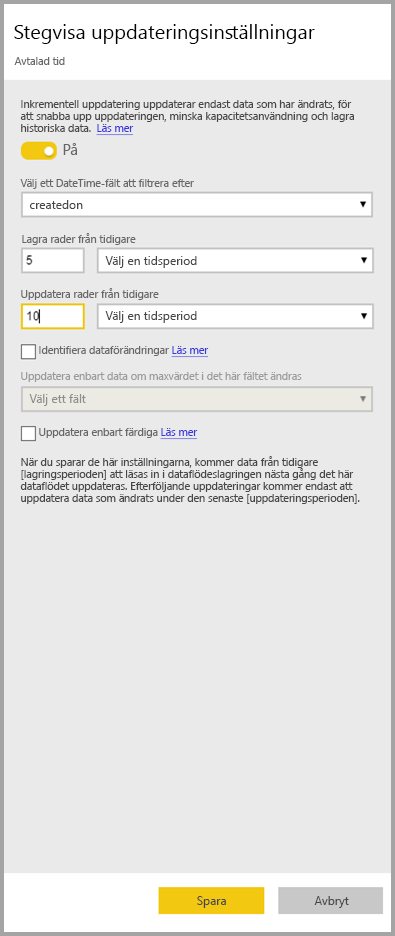
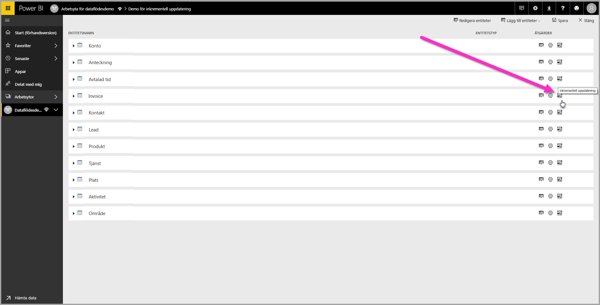
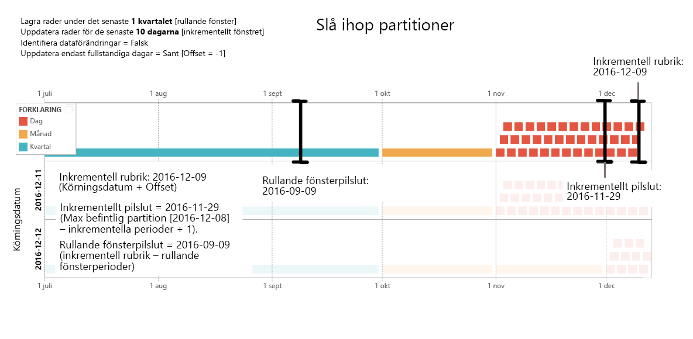

# Använda inkrementell uppdatering med Power BI-dataflöden

Med dataflöden kan du hämta stora mängder data till Power BI för att skapa övertygande rapporter och analyser. I vissa fall är det dock inte praktiskt att uppdatera en fullständig kopia av källdata i varje uppdatering. Ett bra alternativ är **inkrementell uppdatering**, vilket ger följande fördelar för dataflöden:

* **Uppdatering sker snabbare** – endast data som ändras behöver uppdateras. Exempelvis kan en uppdatering göras på de senaste fem dagarna i ett dataflöde som spänner över 10 år.
* **Uppdatering är mer tillförlitligt** –exempelvis krävs inte långvariga anslutningar till instabila källsystem.
* **Resursförbrukning minskas** – när färre data behöver uppdateras minskar den totala förbrukningen av minne och andra resurser.

Med inkrementell uppdatering för Power BI-dataflöden krävs att arbetsytan där dataflödet finns har [Premiumkapacitet](service-premium-what-is.md) för att köras, och den datakälla som matas in i dataflödet måste ha ett fält med *datetime* på vilket inkrementell uppdatering kan filtrera. 

## Konfigurera inkrementell uppdatering för dataflöden

Ett dataflöde kan innehålla många entiteter. Inkrementell uppdatering har ställts in på enhetsnivå, vilket tillåter att ett dataflöde har både fullständigt uppdaterade entiteter och stegvis uppdaterade entiteter.

Om du vill konfigurera en inkrementell uppdaterad entitet, börja med att konfigurera din entitet precis som vilken annan entitet som helst. Mer information om hur du ställer in dataflöde finns i [Självbetjänad dataförberedelse i Power BI](service-dataflows-overview.md).

När dataflödet skapas och sparas, väljer du ikonen **inkrementell uppdatering** i entitetsvyn enligt följande bild:

När du klickar på ikonen visas fönstret **inkrementella uppdateringsinställningar**. När du växlar inkrementell uppdatering till läget **på**, kan du konfigurera din inkrementella uppdatering.

I följande lista beskrivs inställningarna i fönstret **Inkrementella uppdateringsinställningar**. 

1. **Växla inkrementell uppdatering på/av** – det här reglaget växlar policyn för inkrementell uppdatering till på/av för entiteten
2. **Nedrullningsbart filterfält** – väljer den fältfråga där entiteten ska filtreras för ökningar. Det här fältet innehåller endast *datetime*-fält. Du kan inte använda inkrementell uppdatering om enheten inte innehåller ett *datetime*-fält.
3. **Lagra rader från tidigare** – exemplen nedan hjälper dig att förklara nästkommande inställningar.

    För detta exempel definieras en uppdateringsprincip som lagrar sammanlagt fem års data, med inkrementell uppdatering av tio dagars data. Om entiteten uppdateras dagligen utförs följande åtgärder i varje uppdateringsåtgärd:

    * Lägg till en ny dag med data.
    * Uppdatera tio dagar fram till det aktuella datumet.
    * Ta bort kalenderår som är äldre än fem år räknat från det aktuella datumet. Om det aktuella datumet exempelvis är den 1 januari 2019, tas år 2013 bort.

    Det kan ta en stund att importera alla fem år vid den första dataflödesuppdateringen, men efterföljande uppdateringar kommer sannolikt att slutföras under en bråkdel av den initiala uppdateringstiden.

4. **Identifiera dataförändringar** – inkrementell uppdatering på 10 dagar är mycket mer effektivt än fullständig uppdatering på 5 år, men vi kanske kan göra ännu bättre ifrån oss. När du markerar kryssrutan **Identifiera dataförändringar** kan du välja en datum/tid-kolumn för att identifiera och uppdatera endast de dagar då data har ändrats. Detta förutsätter att den här typen av kolumn finns i källsystemet, vilket är vanligt för granskningsändamål. Maxvärdet i den här kolumnen utvärderas för varje period i det inkrementella intervallet. Om dessa data inte har ändrats sedan den senaste uppdateringen behöver perioden inte uppdateras. I exemplet kan detta ytterligare minska antalet dagar som uppdateras inkrementellt från tio till kanske bara två.

> [!TIP]
> Den aktuella designen kräver att kolumnen som identifierar dataförändringar är beständig och att den cachelagras i minnet. Överväg att använda någon av följande tekniker för att minska kardinalitet och minnesförbrukning:
>
>    * Spara endast maxvärdet i den här kolumnen vid tidpunkten för uppdateringen, t.ex. genom att använda en Power Query-funktion.
>    * Minska precisionen till en godtagbar nivå beroende på dina krav på uppdateringsfrekvens.

5. **Uppdatera endast fullständiga perioder** –anta att uppdateringen är schemalagd att köras 04:00:00 varje morgon. Om data matas in i källsystemet under dessa första fyra timmar på denna dag, kanske du inte vill att de ska registreras. Vissa företagsmätvärden, till exempel fat per dag i olje- och gasbranschen är inte praktiska eller känsliga för beräkning baserat på delar av dagar.

    Ett annat exempel där uppdatera endast fullständiga perioder är lämpligt är vid uppdatering av data från ett finansiellt system. Anta ett ekonomisystem där data för den föregående månaden godkänns på kalenderdag tolv i månaden. Du kan ange det inkrementella intervallet till en månad och schemalägga körningen av uppdateringen på den tolfte dagen i månaden. Med det här alternativet markerat, skulle den uppdatera januaridata (den senaste fullständiga månaden) den 12 februari.

> [!NOTE]
> Inkrementell uppdatering för dataflöden avgör datum enligt följande logik: om en uppdatering har schemalagts använder inkrementell uppdatering för dataflöden den tidszon som definierats i policyn för uppdatering. Om det inte finns något schema för uppdatering, använder inkrementell uppdatering tiden från den dator som kör uppdateringen.

## Den inkrementella uppdateringsfrågan

När du har konfigurerat inkrementell uppdatering ändrar dataflödet automatiskt din fråga till att inkludera filter enligt datum. Du kan redigera en automatiskt genererad fråga med hjälp av **Avancerad Power Query Editor** för att finjustera eller anpassa uppdateringen. Läs mer om inkrementell uppdatering och hur det fungerar i följande avsnitt.

## Inkrementell uppdatering och länkad jämfört med beräknade entiteter

För *länkade* entiteter, uppdaterar inkrementell uppdatering källentiteten. Eftersom länkade entiteter helt enkelt är en pekare till den ursprungliga entiteten har inkrementell uppdatering ingen inverkan på den länkade entiteten. När källentiteten har uppdaterats enligt sin definierade uppdateringspolicy antar länkade entiteter att data i källan ska uppdateras.

*Beräknade* entiteter baseras på frågor som körs under ett datalager som kan vara ett annat dataflöde. Därför fungerar beräknade entiteter på samma sätt som länkade entiteter.

Eftersom beräknade entiteter och länkade entiteter fungerar på liknande sätt, är kraven och konfigurationsstegen samma för båda. En skillnad är att inkrementell uppdatering inte kan köras för beräknade entiteter i vissa konfigurationer på ett optimerat sätt beroende på det sätt som partitioner är byggda på. 

## Växla mellan inkrementell och fullständig uppdatering

Dataflöden stöder föränderlig uppdateringspolicy mellan inkrementella och fullständiga uppdateringar. När en ändring sker i båda riktningarna (fullständig till inkrementell eller inkrementell till fullständig uppdatering), påverkar ändringen dataflödet efter nästa uppdatering.

När du flyttar ett dataflöde från fullständig uppdatering till inkrementell, uppdaterar den nya uppdateringslogiken det dataflöde som följer med uppdateringsfönstret och ökar såsom definierats i inställningarna för inkrementell uppdatering.

När du flyttar ett dataflöde från inkrementell till fullständig uppdatering, skrivs alla data som samlats i inkrementell uppdatering över av principen som definierats i fullständig uppdatering. Du måste godkänna den här åtgärden.

## Inkrementell uppdatering för dataflöde och datauppsättningar

Inkrementell uppdatering för dataflöde och inkrementell uppdatering för datauppsättningar är utformade att fungera tillsammans. Det är godkänt och stöds att ha en inkrementell uppdateringsentitet i ett dataflöde, fullständigt inläst i en datauppsättning, eller en fullständigt inläst entitet i dataflödet inkrementellt inläst i en datauppsättning. 

Båda metoderna enligt angivna definitioner i uppdateringsinställningarna.
Du kan läsa mer om inkrementell uppdatering i [inkrementell uppdatering i Power BI Premium](service-premium-incremental-refresh.md).

## Stöd för tidszoner i inkrementell uppdatering

Inkrementell uppdatering av dataflöde är beroende av den tid då den körs. Filtrering av frågan är beroende av den dag då den körs.

För dessa beroenden och för att säkerställa datakonsekvens, implementerar inkrementell uppdatering av dataflöden följande tumregeln för *Uppdatera nu*-scenarier:

* I de fall där en schemalagd uppdatering har definierats i systemet, använder inkrementell uppdatering tidszonsinställningarna från den schemalagda uppdateringen. Detta säkerställer att den tidszon som den person som uppdaterar dataflödet är i alltid är konsekvent med systemets definition.

* Om inga schemauppdatering har definierats använder dataflöden tidszonen på användarens dator.

Inkrementell uppdatering kan också anropas med API:er. i det här fallet kan API-anrop innehålla en inställning för tidszonen som används i uppdateringen. Det kan vara användbar att använda API:er för testning och verifiering.

## Implementeringsdetaljer för inkrementell uppdatering

Dataflöden använder partitionering för inkrementell uppdatering. När XMLA-slutpunkter för Power BI Premium är tillgängligt blir partitionerna synliga. Inkrementell uppdatering av dataflöden behåller det minsta antalet partitioner för att uppfylla kraven för uppdateringsprincipen. Gamla partitioner som går utanför intervallet släpps vilket underhåller ett rullande fönster. Partitioner slås samman opportunistiskt, vilket minskar det totala antalet partitioner som krävs. Detta ger bättre komprimering och i vissa fall kan det förbättra frågeprestandan.

Exemplen i det här avsnittet delar följande uppdateringspolicy:

* Lagra rader under det senaste kvartalet
* Uppdatera rader under de senaste 10 dagarna
* Identifiera dataförändringar = Falsk
* Uppdatera endast fullständiga dagar = Sant

### Slå ihop partitioner

I det här exemplet sammanfogas dagpartitioner automatiskt till månadsnivån när de går utanför det inkrementella intervallet. Partitioner i det inkrementella intervallet måste summeras per dag för att endast tillåta de dagar som ska uppdateras.
Uppdateringsåtgärden med *Kör datum 2016/11/12* slår samma dagar i november eftersom de faller utanför det inkrementella intervallet.

### Ta bort gamla partitioner

Gamla partitioner som inte omfattas av det totala intervallet tas bort. Uppdateringsåtgärden med *Kör datum 1/2/2017* tar bort partitionen för kvartal 3 2016 eftersom den hamnar utanför det totala intervallet.

### Återställning från långvarigt fel

Det här exemplet simulerar hur systemet på ett smidigt sätt återställs från ett långvarigt fel. Vi antar att uppdateringen inte kördes korrekt eftersom datakällans autentiseringsuppgifter har upphört att gälla och problemet tar 13 dagar att lösa. Det inkrementella intervallet är endast 10 dagar.

Nästa lyckade uppdateringsåtgärd med *Kör datum 1/15/2017*, måste återfylla de saknade 13 dagarna och uppdatera dem. Den måste också uppdatera de senaste 9 dagarna eftersom de inte uppdaterades enligt normalt schema. Med andra ord har det inkrementella intervallet ökat från 10 till 22 dagar.

Nästa uppdateringsåtgärd, med *Kör datum 1/16/2017*, tar tillfället att slå samman dagarna i december och månaderna i kvartal 4 2016.

## Nästa steg

Den här artikeln beskriver inkrementell uppdatering av dataflöden. Här följer några fler artiklar som kan vara användbara.

* [Dataförberedelser med självbetjäning för dataflöden](service-dataflows-overview.md)
* [Skapa och använda dataflöden i Power BI](service-dataflows-create-use.md)
* [Använda dataflöden med lokala datakällor](service-dataflows-on-premises-gateways.md)
* [Resurser för utvecklare för Power BI-dataflöden](service-dataflows-developer-resources.md)

Mer information om Power Query och schemalagd uppdatering finns i följande artiklar:
* [Frågeöversikt i Power BI Desktop](desktop-query-overview.md)
* [Konfigurera schemalagd uppdatering](refresh-scheduled-refresh.md)

För mer information om den gemensamma datamodellen kan du läsa dess översiktsartikel:
* [Common Data Service – översikt ](https://docs.microsoft.com/powerapps/common-data-model/overview)

