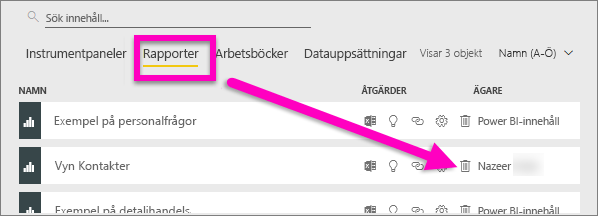
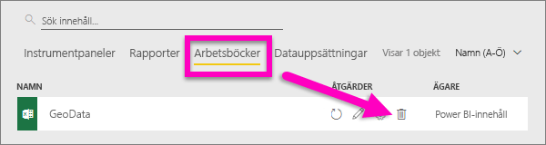
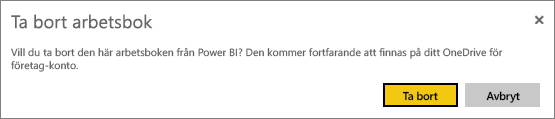
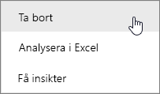
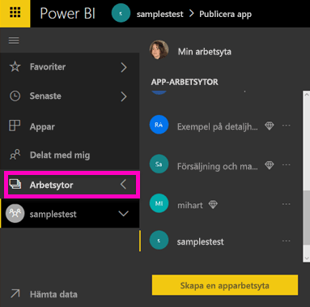
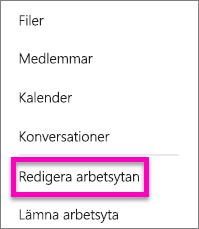
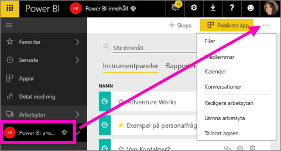
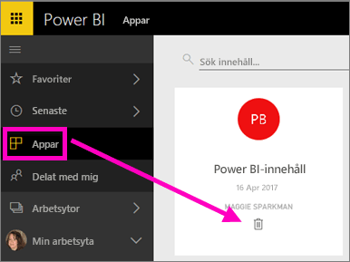

# Ta bort på nästan vad som helst i Power BI-tjänsten
Den här artikeln lär dig hur du tar bort en instrumentpanel, rapport, rapportsida, arbetsbok, datauppsättning, app, visualisering och arbetsyta i Power BI-tjänsten.

## Ta bort en instrumentpanel
Instrumentpaneler kan tas bort. När du tar bort en instrumentpanel tas inte den underliggande datauppsättningen eller rapporter som associeras med instrumentpanelen bort.

* Om du är ägaren av instrumentpanelen kan du ta bort den. Om du har delat instrumentpanelen med dina kollegor kommer instrumentpanelen att tas bort från deras Power BI-arbetsyta när du tar bort instrumentpanelen från din Power BI-arbetsyta.
* Om en instrumentpanel har delats med dig och du inte längre vill se den kan du ta bort den.  Att ta bort en instrumentpanel tar inte bort den från någon annan persons Power BI-arbetsyta.
* Om du använder en instrumentpanel som ingår i en [organisations innehållspaketet](service-organizational-content-pack-disconnect.md) är det enda sättet att ta bort den att ta bort den associerade datauppsättningen.

### Ta bort en instrumentpanel
1. Stanna kvar på arbetsytan och välj fliken **Datauppsättningar**.
2. Leta upp instrumentpanelen som du vill ta bort och välj ikonen Ta bort .

    

## Ta bort en rapport
Oroa dig inte, att ta bort en rapport påverkar inte datauppsättningen som den bygger på.  Och alla visualiseringar som du har fäst i rapporten är också säkra – de blir kvar i instrumentpanelen tills du tar bort dem individuellt.

### Så här tar du bort en rapport
1. Stanna kvar på arbetsytan och välj fliken **Rapporter**.
2. Leta upp rapporten du vill ta bort och välj ikonen Ta bort   .   

    
3. Bekräfta borttagningen.

   

   > [!NOTE]
   > Om rapporten är en del av ett [innehållspaket](service-organizational-content-pack-introduction.md) kan du inte ta bort den med den här metoden.  Se [Ta bort din anslutning till ett organisationsinnehållspaket](service-organizational-content-pack-disconnect.md).
   >
   >

## Ta bort en arbetsbok
Arbetsböcker kan tas bort. Men om du tar bort en arbetsbok tar också bort alla rapporter och instrumentpaneler som innehåller data bort från den här arbetsboken.

Om arbetsboken lagras på OneDrive för företag raderas den inte från OneDrive när du tar bort den från Power BI.

### Så här tar du bort en arbetsbok
1. Stanna kvar på arbetsytan och välj fliken **Arbetsböcker**.
2. Leta upp arbetsboken du vill ta bort och välj ikonen Ta bort  .

    
3. Bekräfta borttagningen.

   

## Ta bort en datauppsättning
Datauppsättningar kan tas bort. Men om du tar bort en datauppsättning tas även alla rapporter och instrumentpaneler bort som innehåller data från den datauppsättningen.

Om en datauppsättning är en del av en eller flera [organisationsinnehållspaket](service-organizational-content-pack-disconnect.md) är det enda sättet att ta bort den att ta bort den från innehållshanteringspaketet där den har används, vänta tills den bearbetas och sedan försöka ta bort den igen.

### Ta bort en datauppsättning
1. Stanna kvar på arbetsytan och välj fliken **Datauppsättningar**.
2. Leta upp datauppsättningen att ta bort och välj ellipserna (...).  

    
3. I listrutan väljer du **Ta bort**.

   
4. Bekräfta borttagningen.

   

## Ta bort en apparbetsyta
> [!WARNING]
> När du skapar en apparbetsyta skapar du en grupp för Office 365. Och när du tar bort en apparbetsyta tar du bort den gruppen för Office 365. Det innebär att gruppen tas bort från andra O365 produkter som SharePoint och Microsoft-Teams.
>
>

Som författare av apparbetsytan kan du ta bort den. När du tar bort den tas den kopplade appen bort för alla medlemmar i gruppen och tas bort från din AppSource om du har publicerat appen till hela organisationen. Att ta bort en apparbetsyta skiljer sig från att lämna en apparbetsyta.

### Ta bort en apparbetsyta – om du är administratör
1. Välj **Arbetsytor** i det vänstra navigeringsfältet

    
2. Välj ellipserna (...) till höger om arbetsytan som ska tas bort och välj **Redigera arbetsyta**.

   
3. I fönstret **Redigera arbetsyta** väljer du **Ta bort arbetsyta** > **Ta bort**.

    

### Ta bort en apparbetsyta från listan
Om du inte längre vill vara medlem i en apparbetsyta kan du ***lämna*** den så tas den bort från listan. När du lämnar en arbetsyta förblir den på plats för andra användare av arbetsytan.  

> [!IMPORTANT]
> Om du är den enda administratören för apparbetsytan kommer inte Power BI att låta dig lämna den.
>
>

1. Börja i apparbetsytan som du vill ta bort.
2. Välj ellipserna (...) i det övre högra hörnet och välj **Lämna arbetsytan** > **Lämna**.

      

   > [!NOTE]
   > Vilka alternativ som visas i listrutan beror på om du är en administratör eller medlem i apparbetsytan.
   >
   >

## Radera eller ta bort en App
Appar kan enkelt tas bort från listan med appar. Men endast administratörer kan ta bort en app permanent.

### Ta bort en app från din lista med appar
Om du tar bort en app från applistan tas den inte bort för andra medlemmar.

1. Välj **Appar** i det vänstra navigeringsfältet för att öppna sidan med appar.
2. Håll muspekaren över en app för att ta bort den och välj ikonen Ta bort .

   

   Om du tar bort en app av misstag har du flera alternativ för att få den tillbaka.  Du kan be appskaparen att skicka den igen, du kan hitta det ursprungliga e-postmeddelandet med länken till appen, du kan kolla i ditt [Aktivitetscenter](service-notification-center.md) för att se om meddelandet för den appen fortfarande listas eller så kan du kontrollera din organisations [AppSource](service-install-use-apps.md).

## Överväganden och felsökning
Den här artikeln visar hur du tar bort de primära byggstenarna för Power BI-tjänsten. Men det finns flera saker som du kan ta bort i Power BI.  

* [Ta bort din aktuella instrumentpanel](service-dashboard-featured.md#change-the-featured-dashboard)
* [Ta bort en instrumentpanel från favoriter](service-dashboard-favorite.md)
* [Ta bort en rapportsida](service-delete.md)
* [Ta bort en instrument](service-dashboard-edit-tile.md)
* [Ta bort en rapportvisualisering](service-delete.md)

Har du fler frågor? [Prova Power BI Community](http://community.powerbi.com/)
