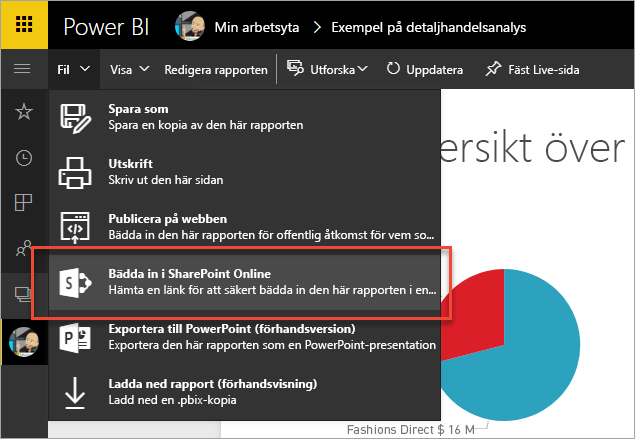
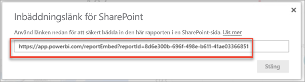
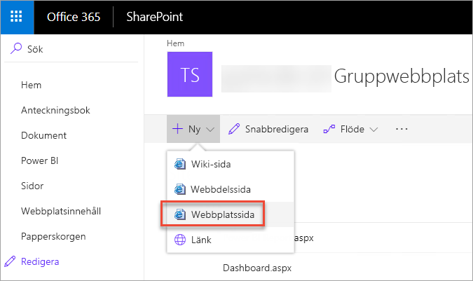
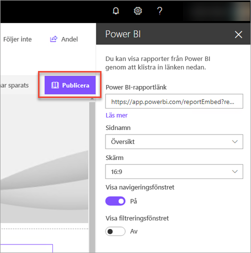
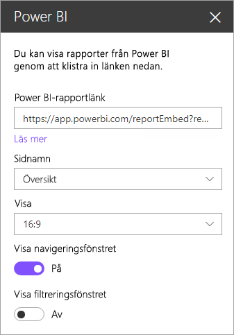

# Bädda in med rapportwebbdel i SharePoint Online

Med den nya rapportwebbdelen för SharePoint Online i Power BI kan du enkelt bädda in interaktiva Power BI-rapporter i SharePoint Online-sidor.

När du använder det nya alternativet **Bädda in i SharePoint Online** är de inbäddade rapporterna helt säkra. Du kan därför enkelt skapa säkra interna portaler.

## Krav

Det finns några krav för att rapporter som har **bäddats in i SharePoint Online** ska fungera.

* Power BI-webbdelen för SharePoint Online kräver [moderna sidor](https://support.office.com/article/Allow-or-prevent-creation-of-modern-site-pages-by-end-users-c41d9cc8-c5c0-46b4-8b87-ea66abc6e63b).

## Bädda in rapporten

För att bädda in rapporten i SharePoint Online måste du först hämta en URL för rapporten och sedan använda den med den nya Power BI-webbdelen i SharePoint Online.

### Hämta en URL för din rapport

1. Visa rapporten i Power BI-tjänsten.

2. Välj menyalternativet **Arkiv**.

3. Välj **Bädda in i SharePoint Online**.
   
    

4. Kopiera URL:en från dialogrutan.

    

   > [!NOTE]
   > Du kan också använda URL:en som visas i webbläsarens adressfält när du visar en rapport. URL:en innehåller den aktuella rapportsidan. Du måste ta bort rapportavsnittet från URL:en om du vill använda en annan sida.

### Lägga till en Power BI-rapport på en SharePoint Online-sida

1. Öppna den önskade sidan i SharePoint Online och välj **Redigera**.

    

    Eller skapa en ny modern webbplats genom att välja **+ Nytt** i SharePoint Online.

    

2. Välj **+** och välj den **Power BI**-webbdel.

    

3. Välj **Lägg till rapport**.

    

4. Klistra in rapport-URL:en i egenskapsrutan. Detta är den URL som du kopierade från stegen ovan. Rapporten laddas automatiskt.

    

5. Välj **Publicera** så att ändringen visas för användarna i SharePoint Online.

    

## Bevilja åtkomst till rapporter

När du bäddar in en rapport i SharePoint Online medges inte användarbehörighet att visa rapporten automatiskt. Behörighet att visa i rapporten anges i Power BI-tjänsten.

> [!IMPORTANT]
> Se till att granska vem som kan visa rapporten i Power BI-tjänsten och bevilja åtkomst till de som inte visas i listan.

Det finns två sätt att bevilja åtkomst till rapporten i Power BI-tjänsten. Om du använder en Office 365-grupp för att skapa webbplatsen i SharePoint Online kan du lista användaren som en medlem i apparbetsytan i Power BI-tjänsten. Det säkerställer att användare kan läsa innehållet i den gruppen. Mer information finns i [Skapa och distribuera en app i Power BI](service-create-distribute-apps.md).

Du kan också ge användarna åtkomst till din rapport genom att göra följande.

1. Lägg till en panel från rapporten i en instrumentpanel.

2. Dela instrumentpanelen med användare som behöver åtkomst till rapporten. Mer information finns i [Dela en instrumentpanel med kollegor och andra](service-share-dashboards.md).

## Inställningar för webbdel

Nedan visas en beskrivning av de inställningar som kan ställas in för Power BI-webbdelen för SharePoint Online.

| Egenskap | Beskrivning |
| --- | --- |
| Sidnamn |Ställer in standardsidan som visas av webbdelen. Välj ett värde från listrutan. Om inga sidor visas innehåller rapporten endast en sida eller också innehåller URL:en du klistrade in ett sidnamn. Ta bort rapportdelen av URL:en för att välja en specifik sida. |
| Skärm |Alternativ för att justera hur rapporten passar på sidan SharePoint Online. |
| Visa navigeringsfönstret |Visar eller döljer navigeringsfönstret. |
| Visa filtreringsfönstret |Visar eller döljer filtreringsfönstret. |

## Multifaktorautentisering

Om din Power BI-miljö kräver att du loggar in med multifaktorautentisering, kan du uppmanas att logga in med en säkerhetsenhet för att verifiera din identitet. Detta kan inträffa om du inte loggade in på SharePoint Online med hjälp av multifaktorautentisering, men din Power BI-miljö kräver ett konto som har godkänts med en säkerhetsenhet.

> [!NOTE]
> Multifaktorautentisering stöds inte ännu i Azure Active Directory 2.0. Användare får ett *felmeddelande*. Om användaren loggar in igen på SharePoint Online med hjälp av en säkerhetsenhet kan de eventuellt visa rapporten.

## Rapporter som inte kan läsas in

Rapporten kan kanske inte läsas in inom webbdelen i Power BI. I sådant fall visas följande meddelande.

*Det här innehållet är inte tillgängligt.*

Det finns två vanliga orsaker till det här meddelandet.

1. Du har inte åtkomst till rapporten.
2. Rapporten har tagits bort.

Du bör kontakta ägaren av SharePoint Online-sidan för att hjälpa dig att lösa problemet.

## Kända problem och begränsningar

* **Fel: ”Ett fel uppstod. Försök att logga ut och igen och gå sedan tillbaka till den här sidan. Korrelations-id: Odefinierad HTTP-svarsstatus: 400, serverfelkod 10001, meddelande: uppdateringstoken saknas”**
  
  Försök något av följande om du får detta felmeddelande.
  
  1. Logga ut från SharePoint och logga in igen. Glöm inte att stänga alla webbläsarfönster innan du loggar in igen.

  2. Om ditt konto kräver multifaktorautentisering (MFA), kontrollera att du loggar in till SharePoint med enheten för multifaktorautentisering (telefonapp, smartkort, osv.)

* Power BI stöder inte samma språk som SharePoint Online. Det innebar att den inbäddade rapporten kanske inte är helt lokaliserad.

* Problem kan också uppstå om du använder Internet Explorer 10. Du kan titta på [webbläsarstöd för Power BI](service-browser-support.md) och [Office 365](https://products.office.com/office-system-requirements#Browsers-section).

* Power BI-webbdelen är inte tillgänglig i [nationella moln](https://powerbi.microsoft.com/en-us/clouds/). 

## Nästa steg

[Tillåt eller förhindra att moderna webbplatssidor skapas av slutanvändare](https://support.office.com/article/Allow-or-prevent-creation-of-modern-site-pages-by-end-users-c41d9cc8-c5c0-46b4-8b87-ea66abc6e63b)  
[Skapa och distribuera en app i Power BI](service-create-distribute-apps.md)  
[Dela en instrumentpanel med kollegor och andra](service-share-dashboards.md)  
[Power BI Premium – vad är det?](service-premium.md)  

Har du fler frågor? [Fråga Power BI Community](http://community.powerbi.com/) 

