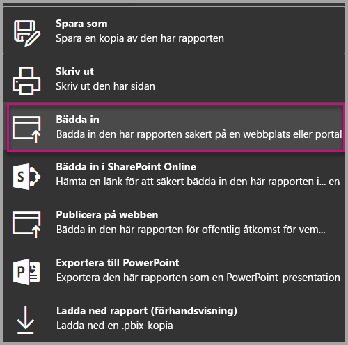

# <a name="embed-a-report-in-a-secure-portal-or-website"></a>Bädda in en rapport i en säker portal eller webbplats

Med det nya säkra alternativet **Bädda in** för rapporter i Power BI kan användarna enkelt och säkert bädda in rapporter i interna webbportaler, oavsett om de är **molnbaserade** eller **lokala**, t.ex. SharePoint 2019. Rapporter som är inbäddade på det här sättet följer all objektbehörighet och datasäkerhet genom säkerhet på radnivå (RLS). Funktionen har utformats för att inbäddning utan kod i en valfri portal som accepterar en URL eller iFrame för inbäddning.

Alternativet **Bädda in** stöder även [URL-filter](service-url-filters.md) och URL-inställningar. Med alternativet **Bädda in** kan du integrera med portaler med en mindre mängd kod som enbart kräver grundläggande kunskaper om HTML och JavaScript.

## <a name="how-to-embed-power-bi-reports-into-portals"></a>**Bädda in** Power BI-rapporter i portaler

1. Det nya alternativet **Bädda in** finns på **Arkiv**-menyn i rapporter i Power BI-tjänsten.

    

2. Välj alternativet Bädda in om du vill öppna en dialogruta som tillhandahåller en länk och en iFrame som du kan använda till att bädda in rapporten på ett säkert sätt.

    

3. När du har bäddat in URL:en i webbportalen, eller om du öppnar URL:en direkt, så autentiseras du innan du får åtkomst till rapporten. Här nedan har användaren inte loggat in till Power BI i webbläsarsessionen. När du klickar på **logga in** kan ett nytt webbläsarfönster eller en ny flik behöva öppnas. Sök efter popup-blockerare om du inte får någon uppmaning om att logga in.

    

4. När du har loggat in öppnas rapporten. Den visar data och låter dig navigera mellan sidor och konfigurera filter. Rapporten visas bara för användare som har behörighet att visa rapporten i Power BI. Alla regler för säkerhet på radnivå (RLS) tillämpas också. Slutligen måste användaren även vara korrekt licensierad – antingen genom att ha en Power BI Pro-licens, eller så måste rapporten finnas på en arbetsyta som finns i en Power BI Premium-kapacitet. Du måste logga in varje gång du öppnar ett nytt webbläsarfönster, men efter det att du har loggat in läses övriga rapporter in automatiskt.

    

5. När du använder iFrame-alternativet är det bäst om du redigerar tillhandahållen HTML till önskad höjd och bredd så att den passar din portals webbsida.

    

## <a name="granting-access-to-reports"></a>Bevilja åtkomst till rapporter

Alternativet Bädda in tillåter inte automatiskt användare att visa rapporten. Behörighet att visa i rapporten anges i Power BI-tjänsten.

Du kan ge åtkomst till rapporten i Power BI-tjänsten genom att dela rapporten med de användare som behöver åtkomst till den inbäddade rapporten. Om du använder en Office 365-grupp kan du lista användaren som en medlem i apparbetsytan i Power BI-tjänsten. Mer information finns i [hantera en apparbetsyta](service-manage-app-workspace-in-power-bi-and-office-365.md).

## <a name="licensing"></a>Licensiering

Användare som visar den inbäddade rapporten måste antingen ha en Power BI Pro-licens eller så måste innehållet finnas på en arbetsyta som är i en [Power BI Premium-kapacitet (EM eller P SKU)](service-admin-premium-purchase.md).

## <a name="customize-your-embed-experience-using-url-settings"></a>Anpassa den inbäddade upplevelsen med hjälp av URL-inställningar

Inbäddnings-URL:en stöder flera indatainställningar som hjälper dig att anpassa användarupplevelsen. Om du använder den iFrame som tillhandahålls så var noga med att uppdatera URL:en i iFrame src-inställningarna.

| Egenskap  | Beskrivning  |  |  |  |
|--------------|-----------------------------------------------------------------------------------------------------------------------------------------------------------------------------------------------------------------------|---|---|---|
| pageName  | Du kan använda frågesträngsparametern **pageName** om du vill ange vilken sida i rapporten som ska öppnas. **pageName**-värdet motsvarar slutet av rapport-URL:en när du visar en rapport i Power BI-tjänsten så som visas nedan. |  |  |  |
| URL-filter  | Du kan använda [URL-filter](service-url-filters.md) i den inbäddnings-URL som du fått från Power BI-användargränssnittet för att filtrera inbäddningsinnehållet. På så sätt kan du skapa integreringar som bara använder lite kod integreringar med enbart grundläggande HTML och JavaScript.  |  |  |  |

## <a name="set-which-page-opens-when-the-report-is-embedded"></a>Ange vilken sida som ska öppnas när rapporten bäddas in

Det värde som tillhandahålls i *pageName*-inställningen motsvarar slutet av rapport-URL:en när du visar en rapport i Power BI-tjänsten.

1. Öppna rapporten från Power BI-tjänsten i webbläsaren och kopiera URL:en från adressfältet.

    

2. Lägg till inställningen *pageName* i URL:en.

    

## <a name="filter-report-content-using-url-filters"></a>Filtrera rapportinnehåll med hjälp av URL-filter

För vissa avancerade funktioner kan du använda [URL-filter](service-url-filters.md) att skapa fler upplevelser med hjälp av rapporten. URL:en nedan filtrerar t.ex. rapporten för att visa data för energibranschen.

Att använda kombination av **pageName** och [URL-filter](service-url-filters.md) kan vara effektivt. Du kan skapa upplevelser med grundläggande HTML och JavaScript.

Här är t.ex. ett exempel på hur du kan lägga till en knapp på en HTML-sida:

```html
<button class="textLarge" onclick='show("ReportSection", "Energy");' style="display: inline-block;">Show Energy</button>
```

När du trycker på knappen anropas på en funktion för att uppdatera iFrame med en uppdaterad URL, vilken innehåller filtret för energibranschen.

```javascript
function show(pageName, filterValue)

{

var newUrl = baseUrl + "&pageName=" + pageName;

if(null != filterValue && "" != filterValue)

{

newUrl += "&$filter=Industries/Industry eq '" + filterValue + "'";

}

//Assumes there’s an iFrame on the page with id=”iFrame”

var report = document.getElementById("iFrame")

report.src = newUrl;

}
```


Du kan lägga till så många knappar du vill skapa en anpassad upplevelse med lite kod. 

## <a name="considerations-and-limitations"></a>Överväganden och begränsningar

* Stöder inte externa gästanvändare med Azure företag till företag (B2B).

* Säker inbäddning fungerar för rapporter som publicerats i Power BI-tjänsten.

* Användaren måste logga in för att kunna visa rapporten varje gång hen öppnar ett nytt webbläsarfönster.

* Vissa webbläsare kräver att du uppdaterar sidan efter inloggning, i synnerhet om du använder InPrivate- eller Incognito-läget.

* Om du vill uppnå en enkel inloggningsupplevelse använder du alternativet Bädda in i SharePoint Online eller skapar en anpassad integrering med hjälp av metoden [användaren äger data](developer/embed-sample-for-your-organization.md). Läs mer om [användaren äger data](developer/embed-sample-for-your-organization.md).

* Den automatiska autentiseringsfunktionen som tillhandahålls av alternativet **Bädda in** fungerar inte med Power BI JavaScript-API:et. När det gäller Power BI JavaScript-API:et använder du metoden [användaren äger data](developer/embed-sample-for-your-organization.md) för inbäddning. Läs mer om [användaren äger data](developer/embed-sample-for-your-organization.md).

## <a name="next-steps"></a>Nästa steg

* [Olika sätt att dela ditt arbete på](service-how-to-collaborate-distribute-dashboards-reports.md)

* [URL-filter](service-url-filters.md)

* [SharePoint Onlines rapportwebbdel](service-embed-report-spo.md)

* [Publicera på webben](service-publish-to-web.md)