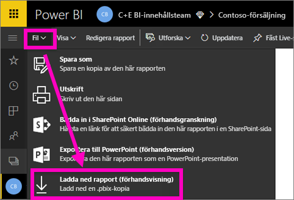

# Exportera en rapport från Power BI-tjänsten till skrivbordet (förhandsgranskning)
I Power BI Desktop kan du exportera (kallas även *hämta*) en rapport till Power BI-tjänsten genom att spara rapporten och välja **Publicera**. Du kan även exportera i omvänd ordning samt och ladda ned en rapport från Power BI-tjänsten till skrivbordet. Filnamnstillägget för filer som exporteras i endera riktningen är *.pbix*.

Det finns några begränsningar och saker du bör tänka på, vilket beskrivs längre fram i den här artikeln.

## Ladda ned rapporten som en .pbix-fil
Hämta .pbx-filen genom att följa dessa steg:

1. Öppna rapporten i [redigeringsvyn](consumer/end-user-reading-view.md) i **Power BI-tjänsten**.
2. Välj **Arkiv > Hämta rapport** på menyraden.
   
   > [!NOTE]
   > Rapporten måste ha [skapats med Power BI Desktop](guided-learning/publishingandsharing.yml?tutorial-step=2) efter den 23 november 2016, och ha uppdaterats sedan dess, för att du ska kunna hämta rapporten. Om så inte är fallet är menyalternativet *Ladda ned rapport* i Power BI-tjänsten nedtonat.
   > 
   > 
3. Medan .pbx-filen skapas, visas förloppet i en statusbanderoll. När filen är klar ombeds du att öppna eller spara .pbx-filen. Filens namn matchar rapportens titel.
   
    
   
    Nu kan du öppna .pbx-filen i Power BI-tjänsten (app.powerbi.com) eller Power BI Desktop.     
4. Välj **Öppna** om du vill öppna rapporten direkt på skrivbordet. Om du vill spara filen till en specifik plats, väljer du **Spara > Spara som**. [Installera Power BI Desktop](desktop-get-the-desktop.md) om du inte redan har gjort det.
   
    När du öppnar rapporten på skrivbordet visas ett varningsmeddelande om att vissa funktioner som är tillgängliga i rapporten i Power BI-tjänsten kanske inte är tillgängliga i Desktop.
   
    

5. Rapportredigeraren i Desktop liknar rapportredigeraren i Power BI-tjänsten.  
   
    

## Överväganden och felsökning
Det finns några viktiga överväganden och begränsningar att ta hänsyn till när man hämtar (exporterar) en *.pbix*-fil från Power BI-tjänsten.

* Du måste ha redigeringsåtkomst till rapporten för att kunna hämta filen
* Rapporten måste ha skapats med **Power BI Desktop** och *publicerats* till **Power BI-tjänsten**, eller så måste .pbix-filen ha *laddats upp* till tjänsten.
* Rapporter måste ha publicerats eller uppdaterats efter den 23 november 2016. Rapporter som publicerats tidigare än så kan inte hämtas.
* Den här funktionen fungerar inte med rapporter som ursprungligen skapades i **Power BI-tjänsten**, inklusive innehållspaket.
* Du bör alltid använda den senaste versionen av **Power BI Desktop** när du öppnar filer som hämtats. Hämtade *.pbix*.filer öppnas inte i gamla versioner av **Power BI Desktop**.
* Om administratören har stängt av möjligheten att exportera data visas den här funktionen inte i **Power BI-tjänsten**.
* Datauppsättningar med inkrementell uppdatering kan inte hämtas till en *PBIX*-fil.

## Nästa steg
Visa enminutsvideon **Kille i en kub** om den här funktionen:

<iframe width="560" height="315" src="https://www.youtube.com/embed/ymWqU5jiUl0" frameborder="0" allowfullscreen></iframe>

Här följer ytterligare artiklar som kan hjälpa dig att lära känna **Power BI-tjänsten**:

* [Rapporter i Power BI](consumer/end-user-reports.md)
* [Power BI – grundläggande begrepp](consumer/end-user-basic-concepts.md)

När du har installerat **Power BI Desktop** kan du komma igång med hjälp av följande innehåll:

* [Komma igång med Power BI Desktop](desktop-getting-started.md)

Har du fler frågor? [Prova Power BI Community](http://community.powerbi.com/)   

