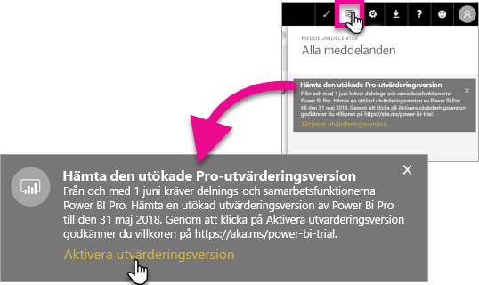
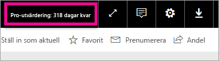

# Aktivering av utökad Pro-utvärderingsversion
Med start den 1 juni 2017 kommer alla berättigade användare att kunna delta i den utökade Pro-utvärderingsversionen för Power BI-tjänsten.

<iframe width="640" height="360" src="https://www.youtube.com/embed/tPsNoPyY9aA?showinfo=0" frameborder="0" allowfullscreen></iframe>

Som en del av [tillkännagivandet den 3 maj 2017 för Power BI Premium](https://powerbi.microsoft.com/blog/microsoft-accelerates-modern-bi-adoption-with-power-bi-premium/), kommunicerade Microsoft att ändringar av den kostnadsfria Power BI-tjänsten blev effektiva den 1 juni 2017. De här förändringarna innefattar utökad åtkomst till alla datakällor, högre lagringsgränser för arbetsytan och högre uppdaterings- och strömningshastigheter till den kostnadsfria tjänsten, vilket gör att den motsvarar Power BI Pro.

Det meddelandes också att delnings- och samarbetsfunktionerna kommer att vara exklusiva för Power BI Pro-användare, inklusive delning av peer-to-peer-instrumentpanelen, grupparbetsytor (nu kallade app-arbetsytor), exportera till PowerPoint och analysera i Excel med Power BI-appar. Att exportera till CSV/Excel och PowerPoint identifierades i kommunikationen den 3:e maj som en funktion som är begränsad till Power BI Pro, men efter feedback från den breda användarcommunityn, har strategin utvecklats för att göra kapaciteten tillgänglig för användare av gratistjänsten också.

Med start den 1 juni 2017 är existerande användare av gratistjänsten som har varit aktiva under det senaste året (på eller innan den 2 maj 2017) berättigade till en kostnadsfri 12 månaders utökad utvärderingsversion av Power BI Pro. Erbjudandet gör att användare kan utnyttja alla funktioner i Power BI Pro under nästa år som ett tecken på uppskattning till communityn och för att ge användarna tid att vänja sig vid ändringarna.

Den 1 juni 2017 får behöriga användare ett meddelande när de loggar in på tjänsten som meddelar dem om ändringarna som har genomförts med en uppmaning om att registrera sig för den utökade Power BI Pro-utvärderingsversionen. En användares IT-administratör styr inte meddelanden i produkten och IT-administratören kan inte heller registrera sig för den utökade Power BI Pro-utvärderingsversionen för en användares räkning. Varje behörig användare måste individuellt vidta åtgärder för att slutföra processen.

Användarna kan välja om de vill registrera sig för erbjudandet när som helst under 12 månader, men den utökade Pro-utvärderingsversionen kommer att upphöra för alla användare den 31 maj 2018 oavsett när de accepterar erbjudandet. Just nu kan användare antingen köpa Power BI Pro eller konverteras till den kostnadsfria versionen av Power BI utan delnings- och samarbetsfunktioner, om de väljer att inte köpa Power BI Pro.

Inga ändringar görs till Power BI Pro. Dessa användare påverkas inte och kommer inte att ta emot meddelanden när de loggar in på tjänsten den 1 juni 2017 eller senare. Användare som tackar nej till erbjudandet om den utökade Power BI Pro-utvärderingsversionen eller som inte är berättigade till erbjudandet kommer att fortsätta använda den kostnadsfria versionen av Power BI utan delnings- och samarbetsfunktionerna. De kan registrera sig när som helst för en normal 60 dagars utvärderingsversion av Power BI Pro genom att gå till Power BI:s [webbplats](https://powerbi.microsoft.com/get-started/).

## Berättigande till utökad Pro-utvärderingsversion
Ditt konto måste uppfylla följande krav för att vara berättigat till erbjudandet om den utökade Pro-utvärderingsversionen.

* Användare av den kostnadsfria Power BI som är aktiva mellan 3 maj 2016 och 2 maj 2017 är berättigade till en utökad Pro-utvärderingsversion.
* Användare som tidigare eller för närvarande använder *60 dagar Pro-utvärderingsversion av produkten* är fortfarande berättigade till den utökade Pro-utvärderingsversion.

> [!NOTE]
> Användare som har licenser som tilldelats från prenumerationer för Power BI Pro eller Power BI Pro –utvärderingsversion i Office 365, undantas från det här erbjudandet.
> 
> 

## Så här aktiverar du
Det finns två sätt att aktivera den utökade Pro-utvärderingsversionen. Det första är när du loggar in på Power BI. Om du har avvisat detta visas också ett alternativ i meddelandefältet.

> [!NOTE]
> Produktkommunikationer styrs inte av administratören och kommer att gå ut till behöriga användare.
> 
> 

### Upplevelse vid inloggning
När du loggar in på Power BI-tjänsten och är behörig, får du ett popup-meddelande. Genom att välja **Aktivera utvärderingsversionen** börjar den utökade Pro-utvärderingsversion. Ingen ytterligare åtgärd krävs.

Du kan sedan komma åt alla befintliga delade instrumentpaneler och rapporter under hela utvärderingsperioden.

Om du har valt **Inte nu**, kan den utökade Pro-utvärderingsversion aktiveras när som helst fram till slutet av utvärderingsperioden den 31 maj 2018.

### Aktivera vid ett senare tillfälle
Om du avvisat popup-meddelandet genom att välja **Inte nu**, kan den utökade Pro-utvärderingsversion aktiveras när som helst fram till slutet av utvärderingsperioden den 31 maj 2018. Detta kan göras i **Meddelandecentret**.

I meddelandecentret visas ett meddelande om den utökade Pro-utvärderingsversionen. Meddelandet är tillgängligt tills användaren avvisar det.

I meddelandet kan du välja **Aktivera utvärderingsversion** för att börja utvärderingsversionen. Ingen ytterligare åtgärd krävs.

Du kan sedan komma åt alla befintliga delade instrumentpaneler och rapporter under hela utvärderingsperioden.

## Efter aktivering
Efter aktiveringen ser du hur många dagar som är kvar i din utvärderingsversion längst upp till höger.

Du kan granska villkoren i [Villkor för erbjudandet om utökad Pro-utvärderingsversion](https://aka.ms/power-bi-trial). Den utökade Pro-utvärderingsversionen körs till den 31 maj 2018 för alla berättigade användare.

## Vanliga frågor och svar
**Vad händer med nya användare som registrerat sig efter 3 maj 2017?**

Användare som registrerat sig för kostnadsfri Power BI på eller efter den 3 maj 2017 är inte berättigade till den utökade Pro-utvärderingsversionen. De är emellertid berättigade till normal Pro 60 dagars utvärderingsversion.

**Hur gör jag för att få reda på vilka i organisationen som är berättigade till den utökade Pro-utvärderingsversionen?**

Eftersom det inte finns ett enkelt sätt att identifiera det här kan du se Azure Active Directory-rapporten för integrerade program för Power BI för att se vilka som är aktiva användare inom organisationen under de senaste 30 dagarna. Detta kan ge dig en uppfattning om vem som kan beviljas. Mer information finns i [Hitta Power BI-användare som har loggat in](service-admin-access-usage.md).

De aktiva användare under behörighetsperioden som har kostnadsfria licenser får popup-meddelandet. 

> [!NOTE]
> Azure Active Directory-rapport anger inte om en användare använder den kostnadsfria versionen eller Pro av Power BI. Den rapporterar endast vilka användare har loggat in till Power BI och när de har loggat in. Om en användare visas i den här rapporten betyder det inte nödvändigtvis att de är behöriga för den utökade Pro-utvärderingsversionen.
> 
> 

**Kan administratörer hindra en användare från att aktivera den utökade Pro-utvärderingsversionen?**

Nej. Administratörer kan inte hindra användare från att aktivera den utökade Pro-utvärderingsversionen eller utvärderingsversionen på 60 dagar av Power BI Pro.

## Nästa steg
[Villkor för erbjudandet om den utökade Pro-utvärderingsversionen](https://aka.ms/power-bi-trial)  
[Power BI-serviceavtal för enskilda användare](https://powerbi.microsoft.com/terms-of-service/)  
[Power BI Premium-meddelande](https://aka.ms/pbipremium-announcement)  
[Hitta Power BI-användare som har loggat in](service-admin-access-usage.md)

Har du fler frågor? [Fråga Power BI Community](https://community.powerbi.com/)

