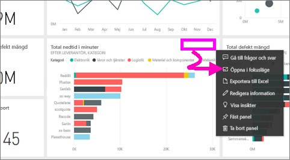
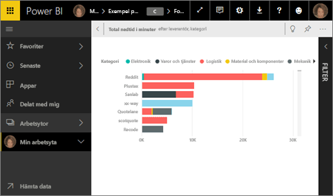
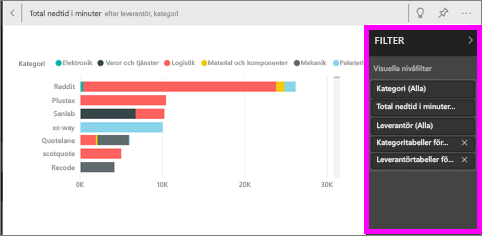
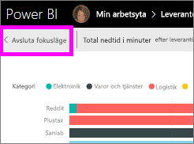
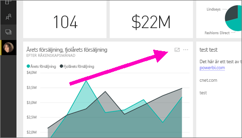
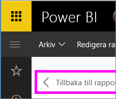

# Visa instrumentpanelen eller rapportvisualiseringen i läget Fokus

<iframe width="560" height="315" src="https://www.youtube.com/embed/dtdLul6otYE" frameborder="0" allowfullscreen></iframe>

## Vad är läget Fokus?

Med***Fokus***-läget kan du utvidga innehåll när du vill se mer information.  I Fokusläget kan du visa och ändra de filter som tillämpades när det här visuella objektet skapades.  I Power BI-tjänsten kan du använda fokusläge för en instrumentpanelsikon eller ett visuellt rapportobjekt, och i Power BI Desktop kan du använda fokusläge för e [visuellt rapportobjekt](desktop-report-view.md).

> [!NOTE]
> Fokus skiljer sig från [helskärmsläge](service-fullscreen-mode.md).
> 

## Fokusläge för instrumentpaneler

1. Hovra över visualiseringspanelen, välj ellipsen (...) och välj **Öppna i fokusläge**. 

    .

2. Panelen öppnas och fyller hela rapportarbetsytan. 

   

3. Expandera fönstret Filter om du vill se alla filter för den här visualiseringen.
   
   

4. Utforska ytterligare genom att ändra filtren och om du upptäcker något intressant fäst det visuella objektet till en instrumentpanel.

5. Lämna Fokusläget och återgå till instrumentpanelen genom att välja **< Avsluta Fokusläge** (i det övre vänstra hörnet av visualiseringen).
   
        

## Fokusläge för rapportvisualiseringar

1. Hovra över rapportvisualiseringen och välj ikonen för **fokusläge** .  
   
   
2. Visualiseringen öppnas och fyller hela arbetsytan. 

   
3. Expandera fönstret Filter om du vill se alla filter för den här visualiseringen.
   
   
4. Utforska ytterligare genom att ändra filtren och om du upptäcker något intressant fäst det visuella objektet till en instrumentpanel.   
5. Lämna Fokusläget och gå tillbaka till rapporten genom att välja **Tillbaka till rapporten** (i det övre vänstra hörnet av visualiseringen). 
   
      

## Gå från Fokusläget till fullskärmsläget
När du är i Fokusläget, kan panelen eller visualiseringen [visas på fullskärm (TV-läge.)](service-fullscreen-mode.md) Fullskärmsläget visas utan störande menyer och navigeringsknappar.

## Överväganden och felsökning
* När du använder Fokusläget med en visualisering i en rapport kan du visa och ändra alla filter: visuell nivå, sidnivå, detaljinformationsnivå och rapportnivå.    
* När du använder Fokusläget med en visualisering på en instrumentpanel kan du endast visa och ändra filtret för den visuella nivån.

Har du fler frågor? [Prova Power BI Community](http://community.powerbi.com/)

