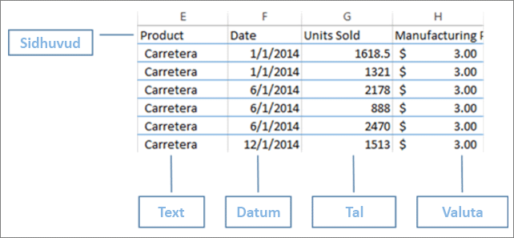
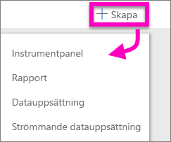
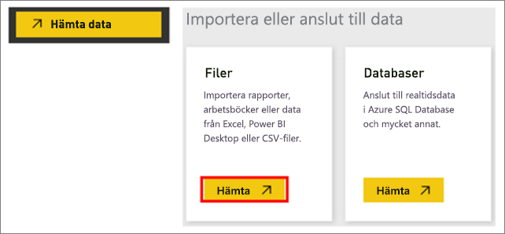
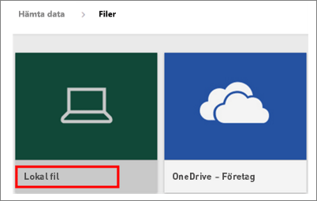
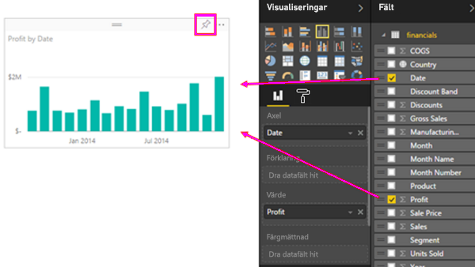
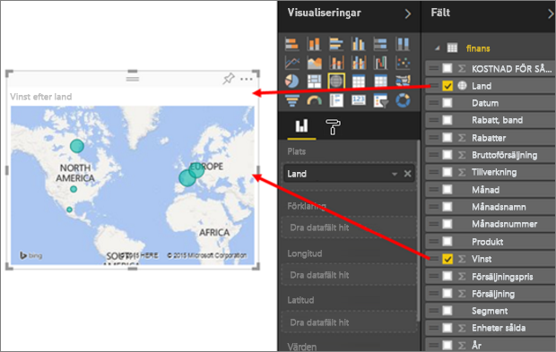
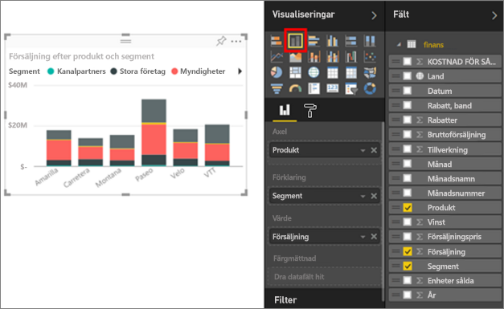
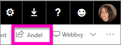
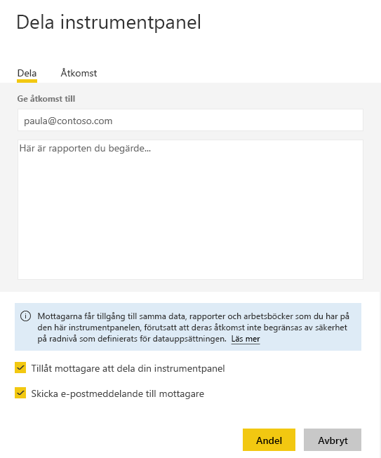

# Från Excel-arbetsbok till otrolig rapport på nolltid
Chefen vill se en rapport om de senaste försäljningssiffrorna som kombineras med dina intryck från den senaste kampanjen i slutet av dagen. Men den senaste informationen finns i olika tredjepartssystem och i filer på din bärbara dator. Tidigare har det tagit timmar att skapa visuella objekt och bygga upp en rapport. Du börjar känna dig bekymrad.

Inga problem. Med Power BI kan du skapa en fantastisk rapport på nolltid.

I det här exemplet ska vi överföra en Excel-fil från ett lokalt system, skapa en ny rapport och dela den med kollegor – allt från Power BI.

## Förbereda dina data
Låt oss ta en enkel Excel-fil som exempel. Innan du kan läsa in din Excel-fil till Power BI, måste du organisera dina data i en platt tabell. Det innebär att varje kolumn innehåller samma datatyp – exempelvis text, datum, tal eller valuta. Du bör ha en rubrikrad, men det får inte finnas någon kolumn eller rad som visar sammanlagda värden.

Därefter formaterar du dina data som en tabell. Välj **Formatera som tabell** i gruppen Format på fliken Start i Excel. Välj ett tabellformat för kalkylbladet. Excel-kalkylbladet är nu redo att läsas in till Power BI.

## Överföra din Excel-fil till Power BI
Power BI kan ansluta till flera datakällor, inklusive Excel-filer som finns på din dator. Logga in till Power BI för att komma igång. Om du inte har registrerat dig, [kan du göra det gratis](https://powerbi.com).

Du vill skapa en ny instrumentpanel. Öppna **Min arbetsyta** och välj ikonen **+ Skapa**.

Välj **Instrumentpanel**, ange ett namn och välj **Skapa**. Den nya instrumentpanelen visas – utan data.

Välj **Hämta data** längst ned till vänster i navigeringsfönstret. På sidan Hämta data, under Importera eller Anslut till Data i rutan Filer, väljer du **Hämta**.

Välj **Lokal fil** på sidan Filer. Navigera till Excel-arbetsboksfilen på datorn och väl den för att läsa in den till Power BI. Välj **Importera**.

> **OBS**: Om du vill följa resten av självstudierna använder du [arbetsboken med finansiella exempel](sample-financial-download.md).
> 
> 

## Bygga upp din rapport
När Power BI har importerat din Excel-fil kan du börja skapa rapporten. När meddelandet **Datauppsättningen är klar** visas, väljer du **Visa datauppsättning**.  Power BI öppnas i redigeringsvyn och visar rapportarbetsytan. På höger sida visas fönstren Visualiseringar, Filter och Fält.

Observera att din Excel-arbetsboks tabelldata visas i fönstret Fält. Under namnet på tabellen visar Power BI kolumnrubrikerna som enskilda fält.

Nu kan du börja skapa visualiseringar. Chefen vill se vinsten över tid. I fönstret Fält drar du **Vinst** till rapportarbetsytan. Power BI visar ett stapeldiagram som standard. Dra därefter **Datum** till rapportarbetsytan. Power BI uppdaterar stapeldiagrammet för att visa vinst per datum.

> **Tips**: Kontrollera din aggregeringar om diagrammet ser inte ut som du förväntade dig. Som exempel kan du högerklicka på det fält som du just har lagt till i området **Värde** och se till att dina data aggregeras på det sätt som du önskar.  I det här exemplet använder vi **Summa**.
> 
> 

Chefen vill veta vilka länder som är mest lönsamma. Imponera henne med en kartvisualisering. Välj ett tomt område på arbetsytan och dra fälten **Land** och **Vinst** från Fält-fönstret. Power BI skapar ett visuellt kartobjekt med bubblor som representerar den relativa vinsten för varje plats.

Vad sägs om att visa ett visuell objekt där man kan avläsa försäljning per produkt och marknadssegment? Enkelt. I fönstret Fält markerar du kryssrutorna bredvid fälten Försäljning, Produkt och Segment. Power BI skapar ett stapeldiagram omedelbart. Ändra diagramtypen genom att välja en av ikonerna i menyn Visualiseringar. Ändra till exempel till ett liggande stapeldiagram.  Om du vill sortera diagrammet väljer du ellipserna (...) > **Sortera efter**.

Fäst alla dina visuella objekt på instrumentpanelen. Nu är du redo att dela den med dina kollegor.

## Dela instrumentpanelen
Nu vill du dela din instrumentpanel med din chef Paula. Du kan dela din instrumentpanel och dess underliggande rapport med alla kollegor som har ett Power BI-konto. De kan interagera med rapporten men inte spara ändringarna.

Om du vill dela din rapport väljer du **Dela** överst på instrumentpanelen.

Power BI visar sidan Dela instrumentpanel. Ange e-postadresser till mottagarna i det översta området. Lägg till ett meddelande i fältet nedan. Om du vill att dina medarbetare ska kunna dela instrumentpanelen med andra, väljer du **Tillåt mottagarna att dela din instrumentpanel**. Välj **Dela**.

Nästa steg

* [Kom igång med Power BI-tjänsten](service-get-started.md)
* [Kom igång med Power BI Desktop](desktop-getting-started.md)
* [Power BI – grundläggande begrepp](service-basic-concepts.md)
* Har du fler frågor? [Prova Power BI Community](http://community.powerbi.com/)

