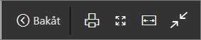
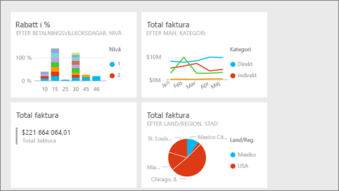
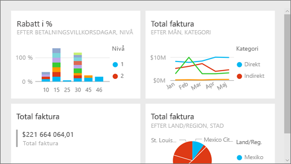
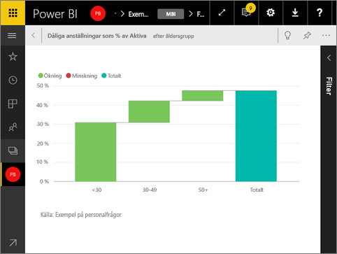

# Fullskärmsläge i Power BI-tjänsten
## Vad är fullskärmsläge?

Du kan visa ditt Power BI-innehåll (instrumentpaneler, rapportsidor, paneler och visualiseringar) utan störande menyer och navigeringsfält.  Du får en oförstörd, fullständig översikt över ditt innehåll på ett överblick, vid alla tidpunkter. Detta kallas ibland för TV-läge. Vilka funktioner som är tillgängliga i fullskärmsläge varierar beroende på innehållet. 

Om du använder Power BI Mobile är [fullskärm är tillgängligt för mobila Windows 10-appar](mobile-windows-10-app-presentation-mode.md). Power BI Desktop har inte något fullskärmsläge för rapporter eller visualiseringar, men har Anpassa till sida för [Relationsvy](desktop-report-view.md) och [fokusläge för visuella rapportobjekt](service-focus-mode.md).

 

Några användningsområden för fullskärmsläge:

* presentera instrumentpanelen, panelen, visuella objekt eller en rapport under ett möte eller en konferens
* visa bilden på kontoret på en dedikerad stor bildskärm eller projektor
* visa på en liten skärm
* granska i låst läge – du kan röra skärmen eller musen över panelerna utan att öppna den underliggande rapporten eller instrumentpanelen

> **OBS**: Fullskärmsläge skiljer sig åt från [fokusläge (frigörs)](service-focus-mode.md).
> 
> 

Titta på hur Amanda öppnar och navigerar sin instrumentpanel i fullskärmsläge och sedan tillämpar vissa URL-parametrar för att styra standardvisningen. Prova sedan själv genom att följa de stegvisa anvisningarna under videon.

<iframe width="560" height="315" src="https://www.youtube.com/embed/c31gZkyvC54" frameborder="0" allowfullscreen></iframe>

## Instrumentpaneler och rapporter i fullskärmsläge
1. Välj **fullskärmsikonen**  från Power BI-menyraden ovanför din instrumentpanel eller rapport. Din instrumentpanelsarbetsyta eller rapportsida fyller hela skärmen. Exemplet nedan är en instrumentpanel.
   
      
2. I fullskärmsläge har du flera menyalternativ.  Om du vill visa menyn flyttar du bara musen eller markören. 
   
     Menyn för instrumentpaneler    
         
   
     Menyn för rapportsidor    
        
   
        
    Använd knappen **Tillbaka** för att gå till föregående sida i webbläsaren. Om föregående sida var en Power BI-sida, visas även den i fullskärmsläge.  Fullskärmsläget behålls tills du avslutar.
   
        
    Använd den här knappen om du vill skriva ut din instrumentpanel eller rapportsida i fullskärmsläge. 
   
        
    Använd knappen **Anpassa till skärm** för att visa instrumentpanelen i största möjliga storlek utan att behöva använda rullningslisterna.     
   
    
   
           
    Ibland bryr man sig inte om rullningslisterna utan vill att instrumentpanelen ska fylla hela bredden på det tillgängliga utrymmet. Välj knappen **Anpassa till bredd**.    
   
    
   
           
    Använd de här pilarna i helskärmsrapporter för att gå mellan sidorna i rapporten.    
3. Om du vill avsluta fullskärmsläget väljer du ikonen **Avsluta fullskärmsläge**.
   
      

## Visualiseringar och paneler på instrumentpaneler i fullskärmsläge
1. Om du vill visa instrumentpaneler och rapportvisualiseringar i fullskärmsläge, måste du starta med panelen eller visualiseringen redan i [Fokusläge](service-focus-mode.md). 
   
    
2. Välj sedan ikonen Fullskärm   för den panelen eller det visuella objektet. Panelen eller det visuella objektet visas på helskärm utan menyer eller navigeringsfält.
   
    

## Nästa steg
[Instrumentpaneler i Power BI](service-dashboards.md)  
[Fokusläge](service-focus-mode.md)    

Har du fler frågor? [Prova Power BI Community](http://community.powerbi.com/)

