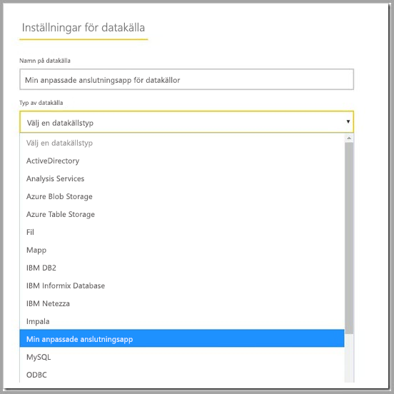

# Använda anpassade dataanslutningar med den lokala datagatewayen

Med dataanslutningar för Power BI kan du ansluta till och komma åt data från ett program, en tjänst eller en datakälla. Du kan utveckla anpassade dataanslutningar och använda dem i Power BI Desktop.

Mer information om hur du skapar anpassade dataanslutningar för Power BI finns i vår dokumentation [här](http://aka.ms/dataconnectors).

När du skapar rapporter i Power BI Desktop som använder anpassade dataanslutningar kan du använda den lokala datagatewayen för att uppdatera dessa rapporter från Power BI-tjänsten.

## Här är en guide som beskriver hur du aktiverar och använder den här funktionen

I versionen för juli 2018 och i senare versioner av den lokala datagatewayen visas fliken ”Anslutningar” i konfiguratorn. På den här fliken kan du välja vilken mapp som du vill läsa in anpassade anslutningar från. Välj en mapp som kan nås av användaren som kör gatewaytjänsten (som standard är det ”NT SERVICE\PBIEgwService”). Gatewayen läser automatiskt in filerna med anpassade anslutningar i mappen, och du bör se dem i listan med dataanslutningar.

Om du använder den personliga versionen av den lokala datagatewayen bör du i detta läge kunna ladda upp Power BI-rapporten till Power BI-tjänsten och använda gatewayen för att uppdatera den.

För Enterprise-versionen av gatewayen måste du fortfarande skapa en datakälla för din anpassade anslutning. När du väljer gatewayklustret på sidan för gatewayinställningar i Power BI-tjänsten bör du se ett nytt alternativ som du kan använda för att tillåta användningen av anpassade anslutningar med klustret. För att det här alternativet ska vara tillgängligt måste uppdateringen för juli 2018 eller en senare uppdatering vara installerad på alla gatewayer i klustret. Välj alternativet för att tillåta användning av anpassade anslutningar med det här klustret.

När det här alternativet är aktiverat visas dina anpassade anslutningar som tillgängliga datakällor som du kan skapa under gatewayklustret. När du har skapat en datakälla med hjälp av den nya anpassade anslutningen kan du uppdatera Power BI-rapporter med hjälp av den anpassade anslutningen i Power BI-tjänsten.

## Överväganden och begränsningar

* Kontrollera att mappen som du skapar är tillgänglig för gatewaytjänsten som körs i bakgrunden. Normalt kan mappar under din användares Windows-mapp eller systemmappar inte nås. Gatewaykonfiguratorn visar ett meddelande om mappen inte kan nås (detta gäller inte för den personliga versionen av gatewayen)
* För att anpassade anslutningar ska fungera med den lokala datagatewayen måste de implementera ett ”TestConnection”-avsnitt i den anpassade anslutningens kod. Detta krävs inte när du använder anpassade anslutningar med Power BI Desktop. Det betyder att du kan ha en som fungerar med Desktop, men inte med gatewayen. Information om hur du implementerar ett TestConnection-avsnitt finns i [den här dokumentationen](https://github.com/Microsoft/DataConnectors/blob/master/docs/m-extensions.md#implementing-testconnection-for-gateway-support).
* Anpassade anslutningar med OAuth-autentisering stöds inte.
* Anpassade anslutningar med Direct Query stöds inte.

## Nästa steg

* [Hantera din datakälla – Analysis Services](service-gateway-enterprise-manage-ssas.md)  
* [Hantera din datakälla – SAP HANA](service-gateway-enterprise-manage-sap.md)  
* [Hantera din datakälla – SQL Server](service-gateway-enterprise-manage-sql.md)  
* [Hantera din datakälla – Oracle](service-gateway-onprem-manage-oracle.md)  
* [Hantera din datakälla – Import/schemalagd uppdatering](service-gateway-enterprise-manage-scheduled-refresh.md)  
* [Lokal datagateway – på djupet](service-gateway-onprem-indepth.md)  
* [Lokal datagateway (personligt läge)](service-gateway-personal-mode.md)
* [Konfigurera proxyinställningar för den lokala datagatewayen](service-gateway-proxy.md)  
* [Använda Kerberos för SSO (enkel inloggning) från Power BI till lokala datakällor](service-gateway-kerberos-for-sso-pbi-to-on-premises-data.md)  

Har du fler frågor? [Prova Power BI Community](http://community.powerbi.com/)
