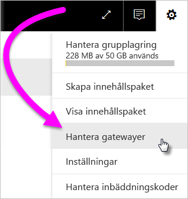
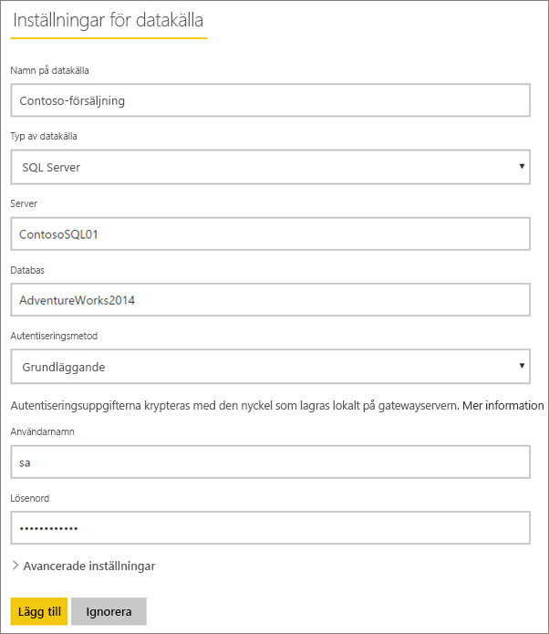
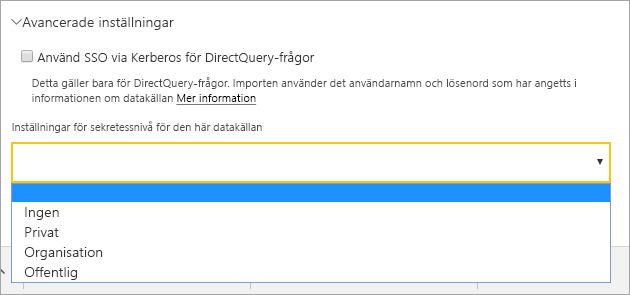

# Hantera datakällor

[!INCLUDE [gateway-rewrite](includes/gateway-rewrite.md)]

Power BI stöder många lokala datakällor och var och en har sina egna krav. Gatewayer kan användas för en enstaka datakälla eller flera datakällor. Vi visar hur du lägger till SQL Server som datakälla i det här exemplet, men stegen ser ungefär likadana ut för andra datakällor.

>[!NOTE]
>De flesta hanteringsåtgärder för datakällor kan även utföras med hjälp av API:er. Mer information finns i [REST-API:er (gatewayer)](/rest/api/power-bi/gateways).

## Lägga till en datakälla

>[!NOTE]
>Det går inte att lägga till grupper utan en e-postadress.

1. Välj kugghjulsikonen  > **Hantera gatewayer** i det övre högra hörnet av Power BI-tjänsten.

    

2. Välj antingen en gateway > **Lägg till datakälla** eller gå till Gatewayer > **Lägg till datakälla**.

    

3. Välj **Typ av datakälla**.

    

4. Ange information för datakällan. I det här exemplet är det **Server**, **Databas** och annan information.  

    

5. För SQL Server väljer du en **Autentiseringsmetod** som är **Windows** eller **Grundläggande** (SQL-autentisering). Om du väljer **Grundläggande** ska du ange autentiseringsuppgifterna för datakällan.

6. Under **Avancerade inställningar** kan du som alternativ konfigurera [sekretessnivån](https://support.office.com/article/Privacy-levels-Power-Query-CC3EDE4D-359E-4B28-BC72-9BEE7900B540) för datakällan (gäller inte för [DirectQuery](desktop-directquery-about.md)).

    

7. Välj **Lägg till**. Du ser *Anslutningen lyckades* om processen lyckas.

    

Du kan nu använda den här datakällan för att ta med data från SQL Server i Power BI-instrumentpaneler och rapporter.

## Ta bort en datakälla

Du kan ta bort en datakälla om du inte längre använder den. Kom ihåg att du vid borttagning av en datakälla bryter alla anslutningar till instrumentpaneler och rapporter som förlitar sig på den datakällan.

Du tar bort en datakälla genom att gå till datakällan och sedan välja **Ta bort**.

## Använda datakällan för schemalagd uppdatering eller DirectQuery

När du har skapat datakällan blir den tillgänglig för användning med antingen DirectQuery-anslutningar eller genom schemalagd uppdatering.

> [!NOTE]
>Server- och databasnamnen måste överensstämma mellan Power BI Desktop och datakällan i den lokala datagatewayen.

Länken mellan din datamängd och datakällan i gatewayen är baserad på servernamnet och databasnamnet. Dessa namn måste stämma överens. Om du exempelvis anger en IP-adress för servernamnet i Power BI Desktop måste du använda den IP-adressen för datakällan i gatewaykonfigurationen. Om du använder *SERVER\INSTANS* i Power BI Desktop, måste du använda samma i den datakälla som konfigureras för gatewayen.

Om du finns med på fliken **Användare** för den datakälla som konfigurerats i gatewayen, och om server- och databasnamnen matchar, visas gatewayen som ett alternativ för användning med schemalagd uppdatering.

> [!WARNING]
> Om datamängden innehåller flera datakällor måste du lägga varje datakälla i gatewayen. Om en eller flera datakällor inte har lagts till i gatewayen, visas inte gatewayen som tillgänglig för schemalagd uppdatering.

### Begränsningar

OAuth är ett schema för autentiseringsmetoder som stöds endast för anpassade anslutningar med den lokala datagatewayen. Du kan inte lägga till andra datakällor som kräver OAuth. Om datamängden har en datakälla som kräver OAuth, och datakällan inte är en anpassad anslutning, kan du inte använda gatewayen för schemalagd uppdatering.

## Hantera användare

När du har lagt till en datakälla till en gateway ger du användarna och de e-postaktiverade säkerhetsgrupperna åtkomst till den specifika datakällan (inte hela gatewayen). Datakällans användarlista styr endast vem som får publicera rapporter som innehåller data från datakällan. Rapportägare kan skapa instrumentpaneler, innehållspaket och appar och dela dem med andra användare.

Du kan även ge användare och säkerhetsgrupper administrativ åtkomst till gatewayen.

### Lägga till användare till en datakälla

1. Välj kugghjulsikonen  > **Hantera gatewayer** i det övre högra hörnet av Power BI-tjänsten.

2. Välj den datakälla där du vill lägga till användare.

3. Välj **Användare** och ange en användare från organisationen som du vill bevilja åtkomst till den valda datakällan. Till exempel ser du på följande skärm att du lägger till Maggie och Adam.

    

4. Välj **Lägg till** så visas den tillagda medlemmen i rutan.

    

Det är allt. Kom ihåg att du behöver lägga till användare i varje datakälla som du vill bevilja åtkomst till. Varje datakälla har en separat lista med användare och du måste lägga till användare i varje datakälla separat.

### Ta bort användare från en datakälla

På datakällans flik **Användare** kan du ta bort användare och säkerhetsgrupper som använder den här datakällan.

## Lagra krypterade autentiseringsuppgifter i molnet

När du lägger till en datakälla till gatewayen, måste du ange autentiseringsuppgifter för datakällan. Alla frågor till datakällan kommer att köras med dessa autentiseringsuppgifter. Innan autentiseringsuppgifterna lagras i molnet krypteras de på ett säkert sätt, med hjälp av symmetrisk kryptering, så att de inte kan dekrypteras i molnet. Autentiseringsuppgifterna skickas till den dator som kör gatewayen, lokalt, där de dekrypteras när datakällorna används.

## Lista över tillgängliga typer av datakällor

Den lokala datagatewayen stöder följande datakällor för Power BI. Utöver lokala datakällor kan källor bakom en brandvägg, ett VPN eller ett virtuellt nätverk även behöva en datagateway.

| **Datakälla** | **Live/DirectQuery** | **Användarkonfigurerad manuell eller schemalagd uppdatering** |
| --- | --- | --- |
| ActiveDirectory |Nej |Ja |
| Amazon Redshift |Ja |Ja |
| Analysis Services |Ja |Ja |
| AtScale-kuber |Ja |Ja |
| Azure Blob Storage |Nej |Ja |
| Azure DevOps Server |Nej |Ja |
| Azure Table Storage |Nej |Ja |
| BI-anslutningsapp |Ja |Ja |
| Denodo |Ja |Ja |
| Dremio |Ja |Ja |
| EmigoDataSourceConnector |Nej |Ja |
| Essbase |Ja |Ja |
| Exasol |Ja |Ja |
| Fil |Nej |Ja |
| Mapp |Nej |Ja |
| Paxata |Nej |Ja |
| IBM DB2 |Ja |Ja |
| IBM Informix-databas |Nej |Ja |
| IBM Netezza |Ja |Ja |
| Impala |Ja |Ja |
| Jethro ODBC |Ja |Ja |
| Kyligence Enterprise |Ja |Ja |
| MarkLogic ODBC |Ja |Ja |
| Microsoft Graph Security |Nej |Ja |
| MySQL |Nej |Ja |
| ODBC |Nej |Ja |
| OData |Nej |Ja |
| OleDb |Nej |Ja |
| Oracle |Ja |Ja |
| PostgreSQL |Nej |Ja |
| QubolePresto |Ja |Ja |
| Quick Base-anslutning |Nej |Ja |
| SAP Business Warehouse Message Server |Ja |Ja |
| SAP Business Warehouse Server |Ja |Ja |
| SAP HANA |Ja |Ja |
| SQL Server |Ja |Ja |
| SharePoint |Nej |Ja |
| Snowflake |Ja |Ja |
| Spark |Ja |Ja |
| SurveyMonkey |Nej |Ja |
| Sybase |Nej |Ja |
| TeamDesk.Database |Nej |Ja |
| Teradata |Ja |Ja |
| Vertica |Ja |Ja |
| Webb |Nej |Ja |
| Workforce Dimensions |Nej |Ja |

## Nästa steg

* [Hantera din datakälla – Analysis Services](service-gateway-enterprise-manage-ssas.md)
* [Hantera din datakälla – SAP HANA](service-gateway-enterprise-manage-sap.md)
* [Hantera din datakälla – SQL Server](service-gateway-enterprise-manage-sql.md)
* [Hantera din datakälla – Oracle](service-gateway-onprem-manage-oracle.md)
* [Hantera din datakälla – Import/schemalagd uppdatering](service-gateway-enterprise-manage-scheduled-refresh.md)
* [Vägledning för distribution av en datagateway](service-gateway-deployment-guidance.md)

Har du fler frågor? [Prova Power BI Community](http://community.powerbi.com/)
