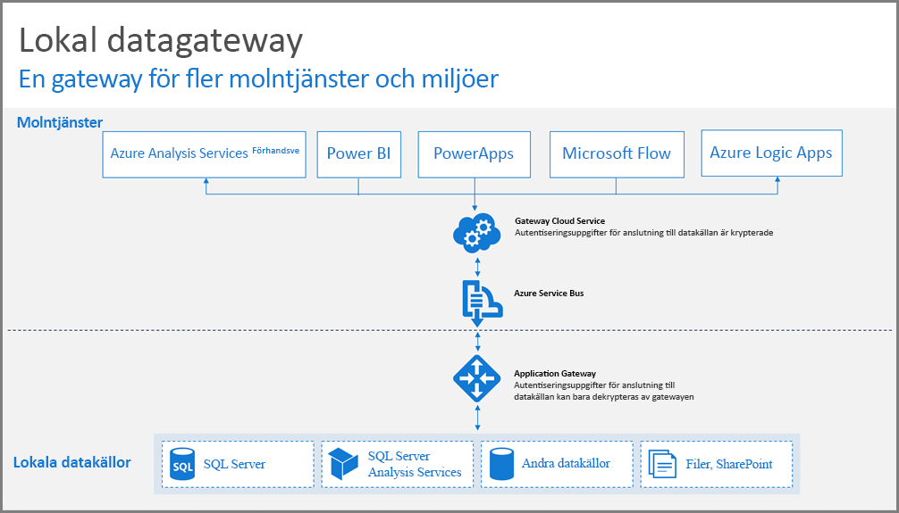
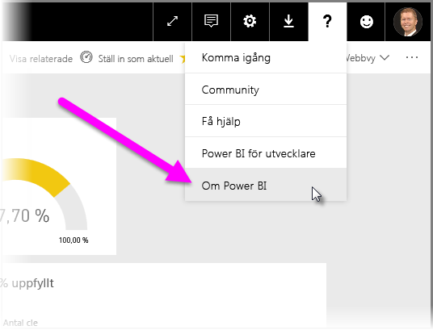
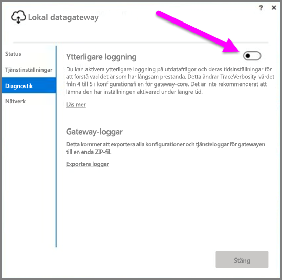
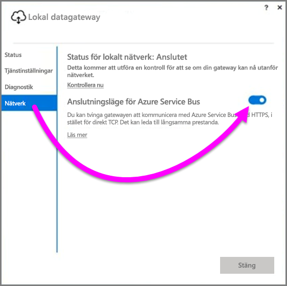
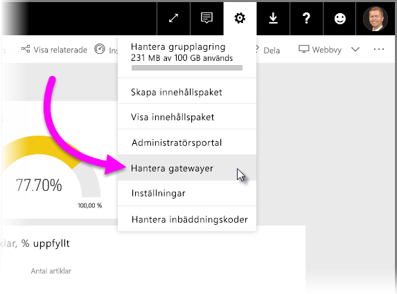

# Vägledning för distribution av en datagateway för Power BI
Den här artikeln innehåller vägledning och överväganden för distribution av en datagateway i din nätverksmiljö. En **gateway** är programvara som möjliggör åtkomst till data som finns på ett privat lokalt nätverk för senare användning i en molnbaserad tjänst som Power BI. Den här artikeln vägleder dig genom distributionen och installationen av din **lokala datagateway**.

Mer information om **lokal datagateway**, inklusive en installationslänk, finns i detta [blogginlägg](https://powerbi.microsoft.com/blog/power-bi-gateways-march-update/).

## Installationsöverväganden för lokal datagateway
Det finns en handfull överväganden som du bör tänka på innan du lägger för mycket tid på att lära dig att installera och distribuera en lokal datagateway. I följande avsnitt följer viktiga överväganden.

### Antal användare
Antalet användare som använder en rapport som använder gatewayen är ett viktigt mått när du bestämmer var du vill installera gatewayen. Här följer några saker att tänka på:

* Använder användarna dessa rapporter vid olika tidpunkter på dagen?
* Vilka sorts anslutningar använder de (DirectQuery eller Importera)?
* Använder alla användare samma rapport?

Om användarna kommer alla åt en viss rapport på samma tid på dagen, ska du installera en gateway på en dator som kan hantera alla autentiseringsbegäranden (se följande avsnitt för prestandaräknare och minimikraven som kan hjälpa dig att fastställa detta).

Det finns en begränsning i **Power BI** som endast tillåter *en* gateway per *rapport*, så även om en rapport är baserad på flera datakällor måste alla dessa datakällor gå via samma gateway. Men om en instrumentpanel baseras på *flera* rapporter kan du använda en dedikerad gateway för varje bidragande rapport och därmed distribuera gateway-belastningen på flera rapporter som bidrar till en enda instrumentpanel.

### Anslutningstyp
**Power BI** har två typer av anslutningar, **DirectQuery** och **Importera**. Alla datakällor stöder inte båda anslutningstyper och det kan finnas många anledningar till att välja den ena över den andra, till exempel säkerhetskrav, prestanda, databegränsningar och storleken på datamodellen. Du kan lära dig mer om anslutningstyper och datakällor som stöds i avsnittet *lista med tillgängliga typer av datakällor* i artikeln [Lokal datagateway](service-gateway-onprem.md).

Beroende på vilken typ av anslutning som används kan gateway-användningen variera. Du bör till exempel försöka skilja **DirectQuery**-datakällor från datakällor med **Schemalagd uppdatering** när det är möjligt (förutsatt att de är i olika rapporter och kan delas upp). Därmed kommer gatewayen inte att ha tusentals DirectQuery-begäranden i kö vid samma tid som morgonens schemalagda uppdatering av en storskalig datamodell som används för företagets huvudinstrumentpanel. Tänk på följande för varje:

* För **Schemalagd uppdatering**: beroende på storleken på din fråga och antalet uppdateringar som utförs per dag, räcker det att vara inom de rekommenderade minimikraven för maskinvara eller uppgradera till en dator med bättre prestanda. Om en given fråga inte är vikt utförs omvandlingar på gatewaydatorn och därmed är det bra om gatewaydatorn har mer tillgängligt minne.
* För **DirectQuery**: en fråga skickas varje gång en användare öppnar rapporten eller tittar på data. Så om du tror att mer än 1 000 användare har åtkomst till data samtidigt måste datorn ha tåliga och högpresterande maskinvarukomponenter. Flera processorkärnor resulterar i bättre genomströmning för en **DirectQuery**-anslutning.

Kraven för datorn där du installerar en **lokal datagateway** är följande:

**Minsta:**

* .NET 4.5 Framework
* 64-bitars version av Windows 7 eller Windows Server 2008 R2 (eller senare)

**Rekommenderas:**

* Processor med 8 kärnor
* 8 GB minne
* 64-bitarsversionen av Windows 2012 R2 (eller senare)

### Plats
Platsen för gatewayinstallationen kan ha stor inverkan på hur din fråga presterar. Kontrollera att din gateway, dina datakällor och Power BI-klienten befinner sig så nära varandra som möjligt för att minimera nätverksfördröjningen. Välj ikonen **?** i det övre högre hörnet Power BI-tjänsten för att fastställa platsen för din Power BI-klient och välj sedan **Om Power BI**.

### Övervaka gatewayer
Det finns några verktyg som du kan använda för att övervaka användningen och prestanda för dina installerade gatewayer.

#### Prestandaräknare
Det finns många prestandaräknare som kan användas för att utvärdera och analysera aktiviteten på gatewayen. Räknarna kan hjälpa dig att förstå om du har en stor volym aktiviteter av en viss typ vilket kan vara en anledning att distribuera en ny gateway.

> [!NOTE]
> Räknarna kan inte avgöra hur länge specifika uppgifter varar.
> 
> 

*Gateway-räknaren* kompletterar din dators räknare och låter dig bilda dig en uppfattning om datorns arbetsbelastning och indikera om serverresurskapaciteten har överskridits eller riskerar att överskridas.

Dessa räknare kan nås från **Windows-prestandaövervakaren** och kan användas av alla verktyg du använder för detta ändamål. För en detaljerad genomgång av hur du använder prestandaövervakaren för gateway med Power BI kan du läsa följande blogginlägg på communityn.

* [Övervaka lokala datagatewayer](https://insightsquest.com/2016/08/08/monitor-on-premises-data-gateways/)

#### Loggar
Konfigurations- och service-loggarna ger ett annat perspektiv på vad som händer med din gateway. Läs alltid gatewayloggarna när anslutningen inte fungerar som förväntat eftersom alla felmeddelanden inte alltid visas på Power BI-tjänsten.

Ett enkelt sätt att visa loggfilerna på den lokala datorn är att använda knappen *Exportera loggar* på den **Lokala datagatewayen** när du öppnar gatewayen efter installationen. Välj sedan **Diagnostik > Exportera loggar**.

#### Ytterligare loggning
Som standard utför gatewayen grundläggande loggning. Om du undersöker ett gatewayproblem och behöver mer information om att felsöka anslutningsproblem kan du tillfälligt aktivera *utförlig loggning* att samla in ytterligare logginformation. Välj **Diagnostik > Utförlig loggning** i den installerade gatewayen.

När du aktiverar den här inställningen kommer loggstorleken sannolikt att öka avsevärt baserat på gatewayanvändningen. Vi rekommenderar att du inaktiverar **Utförlig loggning** när du har granskat loggarna. Vi rekommenderar inte att lämna den här inställningen aktiv under normal gatewayanvändning.

#### Nätverkskonfiguration
Gatewayen skapar en utgående anslutning till **Azure Service Bus**. Gatewayen kommunicerar via följande utgående portar:

* TCP 443 (standard)
* 5671
* 5672
* 9350 till och med 9354

Gatewayen behöver *inga* ingående portar. Alla nödvändiga portar visas i listan ovan.

Vi rekommenderar att du vitlistar IP-adresserna för ditt dataområde i brandväggen. Du kan hämta listan över IP-adresser som finns i IP-listan för [Microsoft Azure-Datacenter](https://www.microsoft.com/download/details.aspx?id=41653). Listan uppdateras varje vecka. Gatewayen kommer att kommunicera med **Azure Service Bus** via den angivna IP-adressen, tillsammans med det fullständiga kvalificerade domännamnet (FQDN). Om du tvingar gatewayen att kommunicera via HTTPS kommer gatewayen endast att använda DQDN och kommunikationen kommer att ske via IP-adresser.

#### Tvinga HTTPS-kommunikation med Azure Service Bus
Du kan tvinga gatewayen att kommunicera med **Azure Service Bus** med HTTPS i stället för direkt TCP. Detta kan försämra prestandan något. Du kan också tvinga gatewayen att kommunicera med **Azure Service Bus** med HTTPS med användargränssnittet för en gateway (från och med gatewaylanseringen i mars 2017).

Om du vill göra det i gatewayen väljer **nätverk**, sedan aktivera den **Azure Service Bus anslutningsläget** **på**.

### Mer information
Det här avsnittet innehåller ytterligare vägledning för att distribuera och hantera gateways.

* Undvik att ha en enskild felpunkt. Distribuera om möjligt dina lokala datakällor på flera gatewayar. Därmed, om en dator blir otillgänglig kan du uppdatera delar av dina data och inte förlora funktionen helt.
* Gatewayen kan inte installeras på en domänkontrollant så undvik att planera eller försöka detta.
* Du bör inte installera en gateway på en dator eller en bärbar dator, som kan stängas av, försättas i viloläge eller frånkopplas från Internet, eftersom en gateway inte kan köras under dessa omständigheter.
* Undvik att installera en gateway på ett trådlöst nätverk eftersom prestandan försämras på trådlösa nätverk.

#### Gatewayåterställning
Du kan återställa din befintliga gateway eller flytta den till en ny dator med hjälp av **återställningsnyckeln**. Återställningsnyckeln har tilldelats för den användare som installerade gatewayen och *kan inte* ändras senare. Återställningsnyckeln används både för kryptering och gateway-återställning.

Om du vill återställa din gateway måste du vara administratör. Kontrollera att du känner till gatewayens namn, att du har rätt återställningsnyckel och att du har en ny tillgänglig dator med liknande prestandaegenskaper.

När du har loggat in väljer du alternativet **Migrera en befintlig gateway**. Därefter måste du välja den gateway som du vill återställa eller migrera och slutligen ange återställningsnyckeln och trycka på konfigurera. När det steget är klart kommer den gamla gatewayen att ersättas av den nya gatewayen så att den nya gatewayen ärver dess namn och alla datakällor som redan har konfigurerats. Alla datakällor går nu genom den nya datorn utan att något behöver publiceras om. Automatisk redundans stöds inte ännu, men det är en funktion som gateway-teamet överväger aktivt.

#### Administratörer
Du hittar en lista över gatewayadministratörer i **Power BI-tjänsten**. När du har loggat in på **Power BI**-tjänsten, väljer du **Inställningar** (kugghjulsikonen) **> Hantera gateways > Gateway-gränssnitt**.  

Här kan du välja en gateway och se en lista över gatewayadministratörer. Administratörerna i listan kan komma åt, återställa och ta bort denna gateway. De kan också lägga till och ta bort datakällor i gatewayen. Om du vill kontrollera att alla administratörer i organisationen har åtkomst till alla gatewayer i sin grupp rekommenderas följande:

* Skapa en **AAD**-säkerhetsgrupp och lägg till andra användare.Lägg därefter till den här säkerhetsgruppen i listan med respektive gatewayadministratörer. Detta säkerställer att mer än en person har tillgång till gatewayen om ett fel uppstår eller när du behöver återställa eller migrera gatewayen. Det ger även andra administratörer en överblick över vilka gateways som används i deras grupper och vilka datakällor som finns på varje gateway.

## Nästa steg
[Konfigurera proxyinställningar](service-gateway-proxy.md)  
[Felsökning av den lokala datagatewayen](service-gateway-onprem-tshoot.md)  
[Vanliga frågor och svar om lokal datagateway](service-gateway-onprem-faq.md)  

Har du fler frågor? [Prova Power BI Community](http://community.powerbi.com/)

