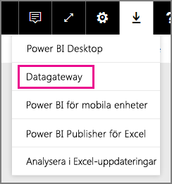
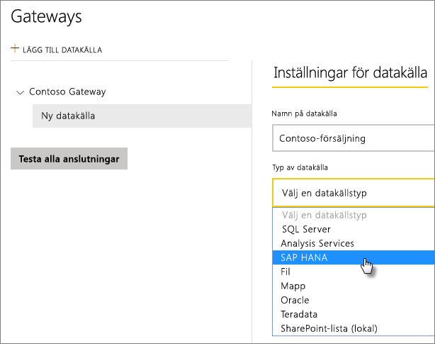

# Hantera din SAP HANA-datakälla
När du har installerat den lokala datagatewayen behöver du lägga till datakällor som kan användas med gatewayen. I den här artikeln tittar vi på hur du kan använda gatewayer och datakällor. Du kan använda SAP HANA-datakällan för schemalagd uppdatering eller DirectQuery.

## Ladda ned och installera gatewayen
Du kan ladda ned gatewayen från Power BI-tjänsten. Välj **Nedladdningar** > **Datagateway** eller gå till [nedladdningssidan för gatewayer](https://go.microsoft.com/fwlink/?LinkId=698861).

## Lägga till en gateway
Du lägger till en gateway genom att helt enkelt [ladda ned](https://go.microsoft.com/fwlink/?LinkId=698861) och installera gatewayen på en server i din miljö. När du har installerat gatewayen visas den i listan med gatewayer under **Hantera gatewayer**.

> [!NOTE]
> **Hantera gatewayer** visas inte förrän du är administratör för minst en gateway. Detta kan inträffa antingen genom att du läggs till som en administratör eller om du installerar och konfigurerar en gateway.
> 
> 

## Ta bort en gateway
Om en gateway tas bort raderas även alla datakällor under gatewayen.  Detta bryter också anslutningen till alla instrumentpaneler och rapporter som är beroende av dessa datakällor.

1. Välj kugghjulsikonen  i det övre högra hörnet > **Hantera gatewayer**.
2. Gateway > **Ta bort**
   
   

## Lägga till en datakälla
Du kan lägga till en datakälla genom att antingen välja en gateway och klicka på **Lägg till datakälla** eller gå till Gateway > **Lägg till datakälla**.

Du kan sedan välja **Typ av datakälla** i listan.

Därefter kan du fylla i informationen för datakällan med **Server**, **Användarnamn** och **Lösenord**.

> [!NOTE]
> Alla frågor till datakällan kommer att köras med dessa autentiseringsuppgifter. Mer information finns i den övergripande lokala artikeln om datagatewayer, där du lär dig mer om hur [autentiseringsuppgifter](service-gateway-onprem.md#credentials) lagras.
> 
> 

Klicka på **Lägg till** när allt har fyllts i.  Du kan nu använda datakällan för schemalagd uppdatering eller DirectQuery mot en lokal SAP HANA-server. *Anslutningen lyckades* visas.

### Avancerade inställningar
Du kan konfigurera sekretessnivån för datakällan. Detta styr hur data kan kombineras. Det används endast vid schemalagd uppdatering. Det gäller inte för DirectQuery. [Läs mer](https://support.office.com/article/Privacy-levels-Power-Query-CC3EDE4D-359E-4B28-BC72-9BEE7900B540)

## Ta bort en datakälla
Om en datakälla tas bort bryts alla anslutningar till instrumentpaneler och rapporter som är beroende av den.  

Ta bort en datakälla genom att gå till Datakälla > **Ta bort**.

## Hantera administratörer
På fliken Administratörer för gatewayen kan du lägga till och ta bort användare (eller säkerhetsgrupper) som kan administrera gatewayen.

## Hantera användare
På datakällans flik Användare kan du lägga till och ta bort användare eller säkerhetsgrupper som kan använda datakällan.

> [!NOTE]
> Användarlistan styr enbart vem som har behörighet att publicera rapporter. Rapportägare kan skapa instrumentpaneler eller innehållspaket och dela dem med andra användare.
> 
> 

## Använda datakällan
När du har skapat datakällan blir den tillgänglig för användning med antingen DirectQuery-anslutningar eller genom schemalagd uppdatering.

> [!NOTE]
> Server- och databasnamnen måste vara samma mellan Power BI Desktop och datakällan i den lokala datagatewayen!
> 
> 

Länken mellan din datauppsättning och datakällan i gatewayen är baserad på servernamnet och databasnamnet. Dessa måste stämma överens. Om du exempelvis anger en IP-adress för servernamnet i Power BI Desktop, måste du använda den IP-adressen för datakällan i gatewaykonfigurationen. Om du använder *SERVER\INSTANCE* i Power BI Desktop måste du använda samma i datakällan som konfigurerats för gatewayen.

Detta gäller både DirectQuery och schemalagd uppdatering.

### Använda datakällan med DirectQuery-anslutningar
Du måste se till att server- och databasnamnet matchar mellan Power BI Desktop och den konfigurerade datakällan för gatewayen. Du måste också kontrollera att användaren finns med på fliken **Användare** för datakällan för att DirectQuery-datauppsättningar ska kunna publiceras. Valet för DirectQuery uppstår i Power BI Desktop när du importerar data första gången. [Läs mer](desktop-use-directquery.md)

När du har publicerat, antingen från Power BI Desktop eller **Hämta Data**, borde dina rapporter fungera. Det kan ta ett par minuter efter att du har skapat datakällan i gatewayen innan anslutningen kan användas.

### Använda datakällan med schemalagd uppdatering
Om du finns med på fliken **Användare** i den datakälla som konfigurerats i gatewayen, samt om server- och databasnamnen matchar, visas gatewayen som ett alternativ för schemalagd uppdatering.

## Nästa steg
[Lokal datagateway](service-gateway-onprem.md)  
[Lokal datagateway – på djupet](service-gateway-onprem-indepth.md)  
[Felsöka den lokala datagatewayen](service-gateway-onprem-tshoot.md)  
Har du fler frågor? [Prova Power BI Community](http://community.powerbi.com/)

