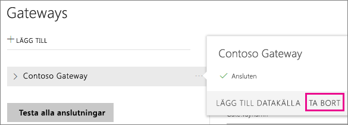
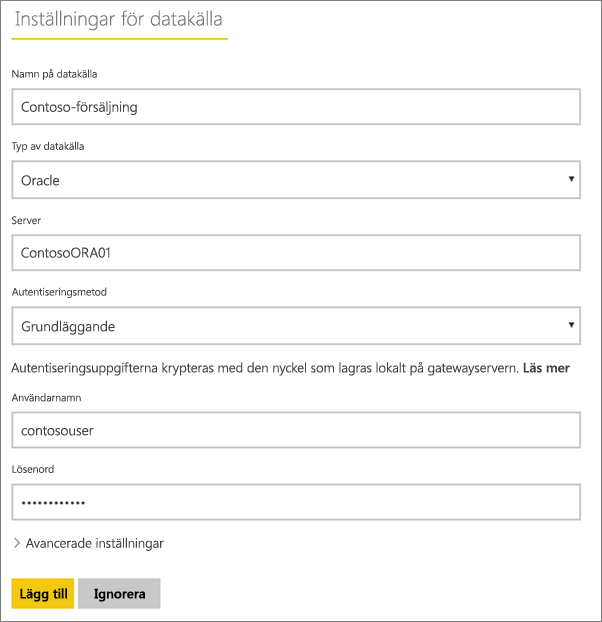
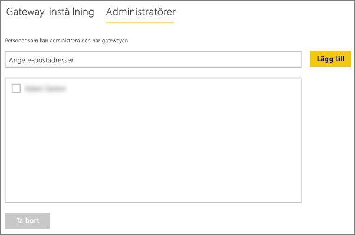
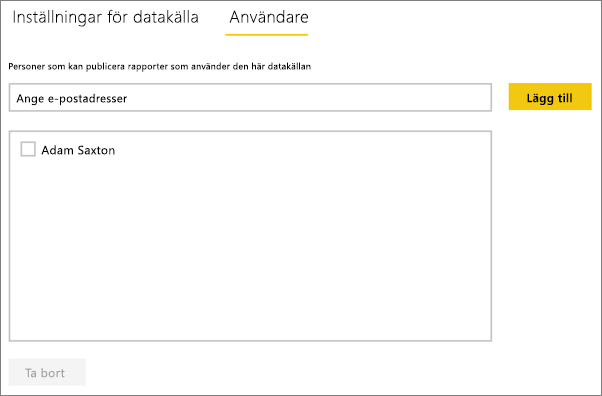
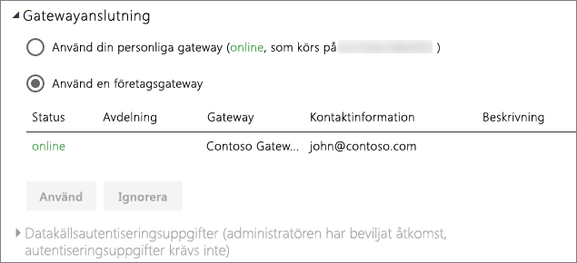

# Hantera din datakälla – Import/schemalagd uppdatering
När du har installerat den lokala datagatewayen behöver du lägga till datakällor som kan användas med gatewayen. Den här artikeln tittar på hur du kan arbeta med gatewayer och datakällor som används för schemalagd uppdatering i stället för DirectQuery- eller live-anslutningar.

## Ladda ned och installera gatewayen
Du kan ladda ned gatewayen från Power BI-tjänsten. Välj **Nedladdningar** > **Datagateway** eller gå till [nedladdningssidan för gatewayer](https://go.microsoft.com/fwlink/?LinkId=698861).

## Lägga till en gateway
Du lägger till en företagsgateway genom att helt enkelt [ladda ned](https://go.microsoft.com/fwlink/?LinkId=698863) och installera gatewayen på en server i din miljö. När du har installerat gatewayen visas den i listan med gatewayer under **Hantera gatewayer**.

> [!NOTE]
> **Hantera gatewayer** visas inte förrän du är administratör för minst en gateway. Detta kan inträffa antingen genom att du läggs till som en administratör eller om du installerar och konfigurerar en gateway.
> 
> 

## Ta bort en gateway
Om en gateway tas bort raderas även alla datakällor under gatewayen.  Detta bryter också anslutningen till alla instrumentpaneler och rapporter som är beroende av dessa datakällor.

1. Välj kugghjulsikonen  i det övre högra hörnet > **Hantera gatewayer**.
2. Gateway > **Ta bort**
   
   

## Lägga till en datakälla
Du kan lägga till en datakälla genom att antingen välja en gateway och klicka på **Lägg till datakälla** eller gå till Gateway > **Lägg till datakälla**.

Du kan sedan välja **Typ av datakälla** i listan. Alla datakällor i listan kan användas för schemalagd uppdatering med företagsgateway. Analysis Services, SQL Server och SAP HANA kan användas för schemalagd uppdatering eller DirectQuery-/live-anslutningar.

Du kan fylla i informationen för datakällan, inklusive källinformation eller autentiseringsuppgifter som används för att få åtkomst till datakällan.

> [!NOTE]
> Alla frågor till datakällan kommer att köras med dessa autentiseringsuppgifter. Mer information finns i den övergripande lokala artikeln om datagatewayer, där du lär dig mer om hur [autentiseringsuppgifter](service-gateway-onprem.md#credentials) lagras.
> 
> 

Klicka på **Lägg till** när allt har fyllts i.  Nu kan du använda den här datakällan för schemalagd uppdatering med dina lokala data. *Anslutningen lyckades* visas om anslutningen har lyckats.

<!-- Shared Install steps Include -->
[!INCLUDE [gateway-onprem-datasources-include](./includes/gateway-onprem-datasources-include.md)]

### Avancerade inställningar
Du kan konfigurera sekretessnivån för datakällan. Detta styr hur data kan kombineras. Det används endast vid schemalagd uppdatering. [Läs mer](https://support.office.com/article/Privacy-levels-Power-Query-CC3EDE4D-359E-4B28-BC72-9BEE7900B540)

## Ta bort en datakälla
Om en datakälla tas bort bryts alla anslutningar till instrumentpaneler och rapporter som är beroende av den.  

Ta bort en datakälla genom att gå till Datakälla > **Ta bort**.

## Hantera administratörer
På fliken Administratörer för gatewayen kan du lägga till och ta bort användare som kan administrera gatewayen. Du kan bara lägga till användare för tillfället. Det går inte att lägga till säkerhetsgrupper.

## Hantera användare
På datakällans flik Användare kan du lägga till och ta bort användare eller säkerhetsgrupper som kan använda datakällan.

> [!NOTE]
> Användarlistan styr enbart vem som har behörighet att publicera rapporter. Rapportägare kan skapa instrumentpaneler eller innehållspaket och dela dem med andra användare.
> 
> 

## Använda datakällan med schemalagd uppdatering
När du har skapat datakällan blir den tillgänglig för användning med antingen DirectQuery-anslutningar eller genom schemalagd uppdatering.

> [!NOTE]
> Server- och databasnamnen måste vara samma mellan Power BI Desktop och datakällan i den lokala datagatewayen!
> 
> 

Länken mellan din datauppsättning och datakällan i gatewayen är baserad på servernamnet och databasnamnet. Dessa måste stämma överens. Om du exempelvis anger en IP-adress för servernamnet i Power BI Desktop, måste du använda den IP-adressen för datakällan i gatewaykonfigurationen. Om du använder *SERVER\INSTANS* i Power BI Desktop, måste du använda samma i den datakälla som konfigureras för gatewayen.

Om du finns med på fliken **Användare** i den datakälla som konfigurerats i gatewayen, samt om server- och databasnamnen matchar, visas gatewayen som ett alternativ för schemalagd uppdatering.

> [!WARNING]
> Om datamängden innehåller flera datakällor måste du lägga varje datakälla i gatewayen. Om en eller flera datakällor inte har lagts till i gatewayen, visas inte gatewayen som tillgänglig för schemalagd uppdatering.
> 
> 

## Begränsningar
* OAuth är inte ett schema för autentiseringsmetoder som stöds med en lokal datagateway. Du kan inte lägga till datakällor som kräver OAuth. Om datauppsättningen har en datakälla som kräver OAuth, kan du inte använda en gateway för schemalagd uppdatering.

## Nästa steg
[Lokal datagateway](service-gateway-onprem.md)  
[Lokal datagateway – på djupet](service-gateway-onprem-indepth.md)  
[Felsökning av den lokala datagatewayen](service-gateway-onprem-tshoot.md)  
Har du fler frågor? [Prova Power BI Community](http://community.powerbi.com/)

