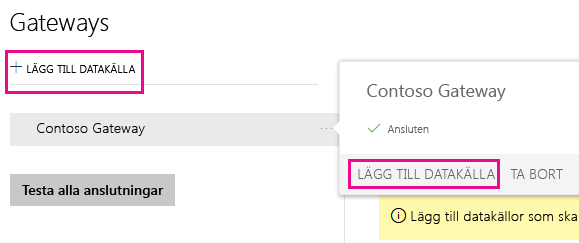
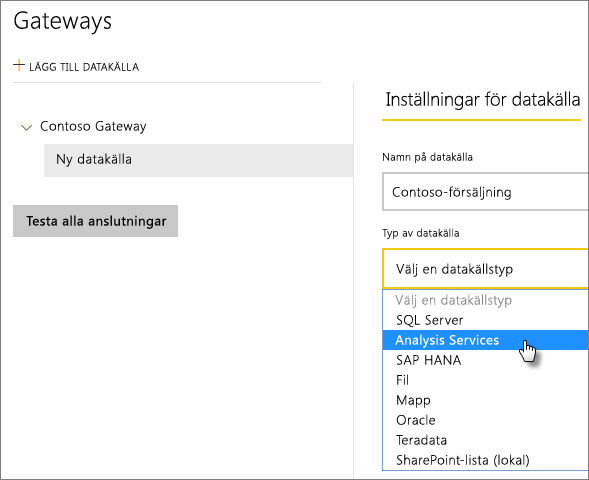
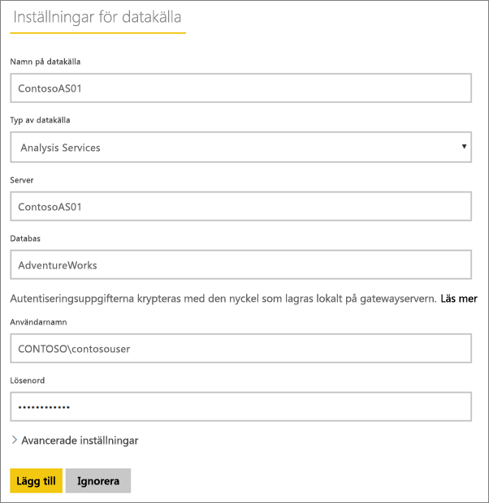
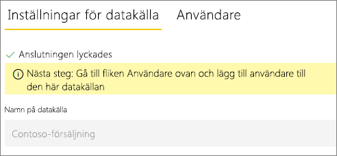
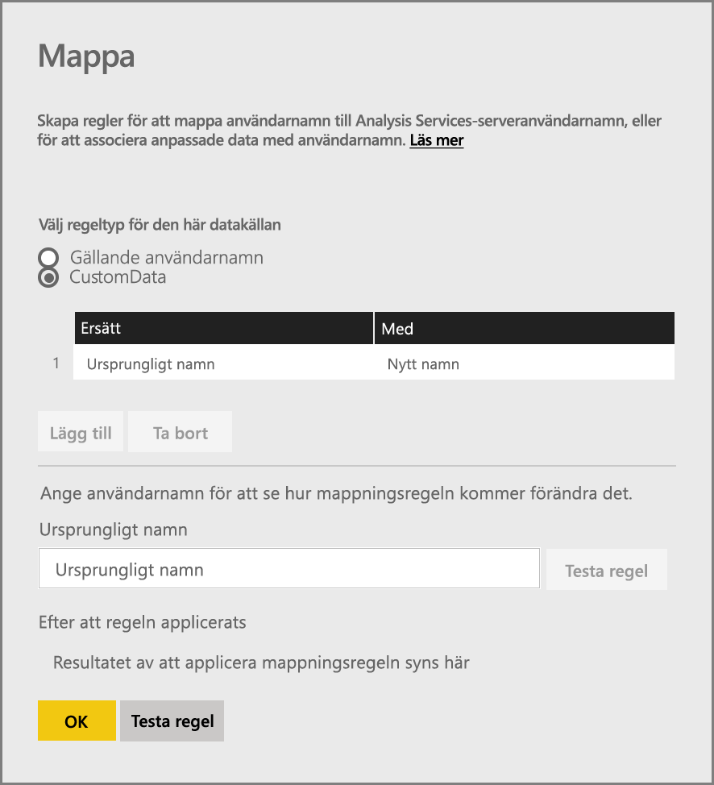
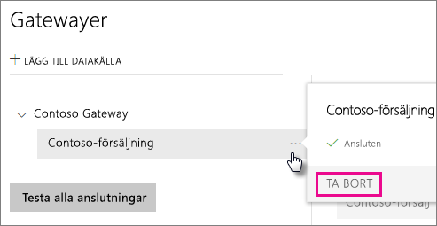
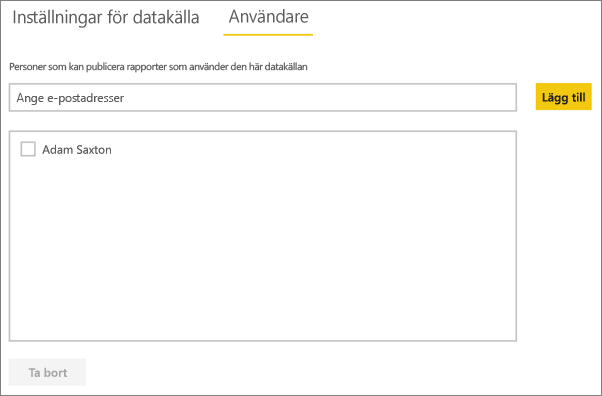
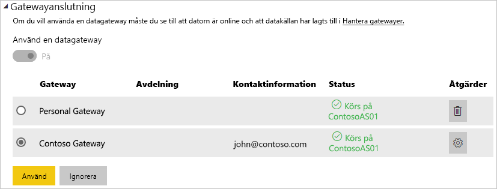

# <a name="manage-your-data-source---analysis-services"></a>Hantera din datakälla – Analysis Services
När du har installerat den lokala datagatewayen behöver du lägga till datakällor som kan användas med gatewayen. I den här artikeln tittar vi på hur du kan använda gatewayer och datakällor. Du kan använda Analysis Services-datakällan antingen för schemalagd uppdatering eller för realtidsanslutningar.

<iframe width="560" height="315" src="https://www.youtube.com/embed/ownIGbcRAAU" frameborder="0" allowfullscreen></iframe>

## <a name="download-and-install-the-gateway"></a>Ladda ned och installera gatewayen
Du kan ladda ned gatewayen från Power BI-tjänsten. Välj **Nedladdningar** > **Datagateway** eller gå till [nedladdningssidan för gatewayer](https://go.microsoft.com/fwlink/?LinkId=698861).


## <a name="limitations-of-analysis-services-live-connections"></a>Begränsningar för Analysis Services realtidsanslutningar
Du kan använda en realtidsanslutning för tabellinstanser eller flerdimensionella instanser.

| **Serverversion** | **Obligatorisk SKU** |
| --- | --- |
| 2012 SP1 CU4 eller senare |Business Intelligence och Enterprise SKU |
| 2014 |Business Intelligence och Enterprise SKU |
| 2016 |Standard-SKU eller högre |

* Formatering på cellnivå och översättningsfunktioner stöds inte.
* Åtgärder och namngivna mängder exponeras inte för Power BI, men du kan fortfarande ansluta till flerdimensionella kuber som också innehåller åtgärder eller namngivna mängder och skapa visuella objekt och rapporter.

## <a name="add-a-gateway"></a>Lägga till en gateway
Du lägger till en gateway genom att helt enkelt [ladda ned](https://go.microsoft.com/fwlink/?LinkId=698861) och installera gatewayen på en server i din miljö. När du har installerat gatewayen visas den i listan med gatewayer under **Hantera gatewayer**.

> [!NOTE]
> **Hantera gatewayer** visas inte förrän du är administratör för minst en gateway. Detta kan inträffa antingen genom att du läggs till som en administratör eller om du installerar och konfigurerar en gateway.
> 
> 

## <a name="remove-a-gateway"></a>Ta bort en gateway
Om en gateway tas bort raderas även alla datakällor under gatewayen.  Detta bryter också anslutningen till alla instrumentpaneler och rapporter som är beroende av dessa datakällor.

1. Välj kugghjulsikonen  i det övre högra hörnet > **Hantera gatewayer**.
2. Gateway > **Ta bort**

   

## <a name="add-a-data-source"></a>Lägga till en datakälla
Du kan lägga till en datakälla genom att antingen välja en gateway och klicka på **Lägg till datakälla** eller gå till Gateway > **Lägg till datakälla**.



Du kan sedan välja **Typ av datakälla** i listan. Välj Analysis Services om du ansluter till en flerdimensionell server eller tabellserver.



Du kan fylla i informationen för datakällan med **Server** och **Databas**.  

Den **användarnamn** och **lösenord** som du anger används av gatewayen för att ansluta till Analysis Services-instansen.

> [!NOTE]
> Det Windows-konto som du anger måste ha serveradministratörsbehörighet för den instans som du ansluter till. Om det här kontots lösenord upphör att gälla, kan användaren få ett anslutningsfel om lösenordet inte uppdateras för datakällan. Mer information finns i den övergripande lokala artikeln om datagatewayer, där du lär dig mer om hur [autentiseringsuppgifter](service-gateway-onprem.md#credentials) lagras.
> 
> 



Klicka på **Lägg till** när allt har fyllts i.  Du kan nu använda den här datakällan för schemalagd uppdatering eller realtidsanslutningar mot en lokal Analysis Services-instans.  *Anslutningen lyckades* visas om anslutningen har lyckats.



### <a name="advanced-settings"></a>Avancerade inställningar
Du kan konfigurera sekretessnivån för datakällan. Detta styr hur data kan kombineras. Det används endast för schemalagd uppdatering. Det gäller inte för realtidsanslutningar. [Läs mer](https://support.office.com/article/Privacy-levels-Power-Query-CC3EDE4D-359E-4B28-BC72-9BEE7900B540)


## <a name="usernames-with-analysis-services"></a>Användarnamn med Analysis Services
Varje gång en användare interagerar med en rapport ansluten till Analysis Services, skickas det effektiva användarnamnet till gatewayen och sedan vidare till den lokala Analysis Services-servern. Den e-postadress som du loggar in i molnet med, är vad vi skickar till Analysis Services som den effektiva användaren. Detta skickas vidare i anslutningsegenskapen [EffectiveUserName](https://msdn.microsoft.com/library/dn140245.aspx#bkmk_auth). E-postadressen måste matcha en definierad UPN i den lokala Active Directory-domänen. UPN är en egenskap för ett Active Directory-konto. Det Windows-kontot måste sedan vara förekomma i en Analysis Services-roll. Om ingen matchning hittas i Active Directory, lyckas inte inloggningen. [Läs mer](https://msdn.microsoft.com/library/ms677605.aspx)

Du kan också mappa ditt Power BI-inloggningsnamn med en lokal katalog-UPN. [Läs mer](service-gateway-enterprise-manage-ssas.md#map-user-names)

<iframe width="560" height="315" src="https://www.youtube.com/embed/Qb5EEjkHoLg" frameborder="0" allowfullscreen></iframe>

### <a name="how-do-i-tell-what-my-upn-is"></a>Hur vet jag vilken UPN jag har?
Du kanske inte vet vilken din UPN är, och du är kanske inte domänadministratör. Du kan använda följande kommando från din arbetsstation för att ta reda på ditt kontos UPN.

    whoami /upn

Resultatet ser ut ungefär som en e-postadress, men detta är det UPN som finns på ditt domänkonto. Om du använder en Analysis Services-datakälla för realtidsanslutningar och om denna inte stämmer överens med den e-postadress som du loggar in i Power BI med, kan du titta närmare på hur man [mappar användarnamn](#map-user-names).

## <a name="map-user-names"></a>Mappa användarnamn
<iframe width="560" height="315" src="https://www.youtube.com/embed/eATPS-c7YRU" frameborder="0" allowfullscreen></iframe>

Du kan mappa användarnamn för Analysis Services på två olika sätt:

1. Manuell användarmappning 
2. Lokal Active Directory-egenskapssökning för att mappa om AAD UPN:er till Active Directory-användare (AD-sökningsmappning)

Trots att det är möjligt att utföra manuell mappning med den andra metoden skulle det vara tidsödande och svårt att upprätthålla, det är särskilt svårt när mönstermatchning inte är tillräckligt – till exempel när domännamn skiljer sig åt mellan AAD och lokal AD, eller när användarkontonamn skiljer sig åt mellan AAD och AD. Därför rekommenderas inte manuell mappning med den andra metoden.

Dessa två metoder beskrivs i tur och ordning i följande två avsnitt.

### <a name="manual-user-name-re-mapping"></a>Manuell mappning av användarnamn
Du kan konfigurera anpassade regler för UPN (User Principal Name) för Analysis Services-datakällor. Detta hjälper dig om dina inloggningsuppgifter för Power BI-tjänsten inte överensstämmer med din lokala katalog-UPN. Om du till exempel loggar in i Power BI med john@contoso.com, men din lokala katalog-UPN är john@contoso.local, kan du konfigurera en mappningsregel för att skicka john@contoso.local till Analysis Services.

Gör följande för att komma till UPN-mappningsskärmen.

1. Gå till **kugghjulsikonen** och välj **Hantera gatewayer**.
2. Expandera den gateway som innehåller Analysis Services-datakällan. Om du inte har skapat Analysis Services-datakällan än, kan du göra det nu.
3. Välj datakällan och välj sedan fliken **Användare**.
4. Välj **Mappa användarnamn**.

    

Därefter visas alternativen för att lägga till regler samt test för en viss användare.

> [!NOTE]
> Du kan hända att du oavsiktligt ändrar en användare som du inte hade för avsikt att ändra. Om till exempel **Ersätt (ursprungligt värde)** är <em>@contoso.com</em> och **Med (nytt namn)** är <em>@contoso.local</em>, kommer alla användare med en inloggning som innehåller <em>@contoso.com</em> att ersättas med <em>@contoso.local</em>. Om **Ersätt (ursprungligt namn)** är <em>dave@contoso.com</em> och **Med (nytt namn)** är <em>dave@contoso.local</em>, skickas en användare med inloggningen v-dave@contoso.com som v-dave<em>@contoso.local</em>.

### <a name="ad-lookup-mapping"></a>Mappning av AD-sökningar
Följ stegen i det här avsnittet om du vill mappa om AAD UPN:er till Active Directory-användare för att utföra en lokal AD-egenskapssökning. Vi börjar med att titta närmare på hur det här fungerar.

I **Power BI-tjänsten** inträffar följande:

- För varje fråga från en Power BI AAD-användare till en lokal SSAS-server skickas en UPN-sträng vidare, exempelvis: firstName.lastName@contoso.com

> [!NOTE]
> Alla manuella UPN-användarmappningar som definierats i Power BI-datakällskonfigurationen används fortfarande *innan* användarnamnssträngen skickas till den lokala datagatewayen.
> 
> 

Gör följande på den lokala datagatewayen med konfigurerbar anpassad användarmappning:

1. Hitta Active Directory för att söka (automatiskt eller konfigurerbart).
2. Leta upp attributet för AD-personen (till exempel *e-post*) baserat på inkommande UPN-sträng (”firstName.lastName@contoso.com”) från **Power BI-tjänsten**.
3. Om AD-sökningen misslyckas, försöker den använda den vidareskickade UPN:en som EffectiveUser till SSAS.
4. Om AD-sökningen lyckas, hämtas *UserPrincipalName* för AD-personen. 
5. Den vidarebefordrar e-posten *UserPrincipalName* som *EffectiveUser* till SSAS, exempelvis:<em>Alias@corp.on-prem.contoso</em>

Konfigurera gatewayen för att utföra AD-sökning:

1. Hämta och installera den senaste gatewayen

2. I gatewayen behöver du ändra den **lokala datagatewaytjänsten** för att köras med ett domänkonto (i stället för ett lokalt tjänstkonto – annars fungerar inte AD-sökningen vid körning). Du måste starta om gatewaytjänsten för att ändringen ska börja gälla.  Gå till gatewayappen på din dator (sök efter ”lokal datagateway”). Det gör du genom att gå till **Tjänstinställningar > Byt tjänstkonto**. Kontrollera att du har återställningsnyckeln för gatewayen eftersom du behöver återställa den på samma dator om du inte vill skapa en ny gateway i stället. 

3. Gå till installationsmappen för denna gateway, *C:\Program\Lokal datagateway* som administratör, så att du har behörighet att skriva och redigera följande fil: Microsoft.PowerBI.DataMovement.Pipeline.GatewayCore.dll.config 

4. Redigera följande två konfigurationsvärden enligt *dina* Active Directory-attributkonfigurationer för AD-användarna. Konfigurationsvärdena nedan är bara exempel – du måste ange dem baserat på din Active Directory-konfiguration. De här konfigurationerna är skiftlägeskänsliga så se till att de matchar värdena i Active Directory.

    

    Om inget värde har angetts för ADServerPath-konfigurationen använder gatewayen standardvärdet, Global katalog. Du kan också ange flera värden för ADServerPath. Varje värde måste vara avgränsat med semikolon som i följande exempel.

    ```xml
    <setting name="ADServerPath" serializeAs="String">
        <value> >GC://serverpath1; GC://serverpath2;GC://serverpath3</value>
    </setting>
    ```
    Gatewayen parsar värdena för ADServerPath från vänster till höger tills den hittar en matchning. Om ingen matchning hittas används ursprunglig UPN. Kontrollera att det konto som kör gatewaytjänsten (PBIEgwService) har behörighet att skicka frågor till alla AD-servrar som du angett i ADServerPath.

    Gatewayen stöder två typer av ADServerPath, som i följande exempel.

    **WinNT**

    ```xml
    <value="WinNT://usa.domain.corp.contoso.com,computer"/>
    ```

    **GC**

    ```xml
    <value> GC://USA.domain.com </value>
    ```

5. Du måste starta om den **lokala datagatewaytjänsten** för att konfigurationsändringen ska börja gälla.

### <a name="working-with-mapping-rules"></a>Arbeta med mappningsregler
För att skapa en mappningsregel anger du ett värde för **Ursprungligt namn** och **Nytt namn** och väljer sedan **Lägg till**.

| Fält | Beskrivning |
| --- | --- |
| Ersätt (ursprungligt namn) |Den e-postadress som du loggade in i Power BI med. |
| Med (nytt namn) |Det värde som du vill ersätta det med. Resultatet av ersättningen är vad som skickas till egenskapen *EffectiveUserName* för Analysis Services-anslutningen. |


När du markerar ett objekt i listan kan du välja att ordna om det med hjälp av **sparrikonerna** eller **Ta bort** posten.


### <a name="using-wildcard-"></a>Använda jokertecken (\*)
Du kan använda ett jokertecken för din sträng **Ersätt (ursprungligt namn)**. Det kan bara användas på egen hand och inte med någon annan strängdel. På så vis kan du ta med alla användare och skicka ett enda värde till datakällan. Detta är användbart när du vill att alla användare i din organisation ska använda samma användare i den lokala miljön.

### <a name="test-a-mapping-rule"></a>Testa en mappningsregel
Du kan verifiera vad ett ursprungligt namn kommer att ersättas med genom att ange ett värde för **Ursprungligt namn** och välja **Testa regel**.


> [!NOTE]
> Det tar några minuter för tjänsten att börja använda de regler som sparas. I webbläsaren fungerar regeln omedelbart.
> 
> 

### <a name="limitations-for-mapping-rules"></a>Begränsningar för mappningsregler
* Mappningen gäller för den specifika datakälla som konfigureras. Det är inte en global inställning. Om du har flera Analysis Services-datakällor måste du mappa användarna för varje datakälla.

## <a name="remove-a-data-source"></a>Ta bort en datakälla
Om en datakälla tas bort, bryts alla anslutningar till instrumentpaneler och rapporter som är beroende av den aktuella datakällan.  

Du tar bort en datakälla genom att gå till Datakälla > **Ta bort**.



## <a name="manage-administrators"></a>Hantera administratörer
På fliken Administratörer för gatewayen kan du lägga till och ta bort användare (eller säkerhetsgrupper) som kan administrera gatewayen.


## <a name="manage-users"></a>Hantera användare
På fliken Användare för datakällan kan du lägga till och ta bort de användare eller säkerhetsgrupper som kan använda den här datakällan.

> [!NOTE]
> Användarlistan styr enbart vem som har behörighet att publicera rapporter. Rapportägare kan skapa instrumentpaneler eller innehållspaket och dela dem med andra användare.
> 
> 



## <a name="using-the-data-source"></a>Använda datakällan
När du har skapat datakällan går den att använda med realtidsanslutningar eller med schemalagda uppdateringar.

> [!NOTE]
> Server- och databasnamnen måste vara samma mellan Power BI Desktop och datakällan i den lokala datagatewayen!
> 
> 

Länken mellan din datauppsättning och datakällan i gatewayen är baserad på servernamnet och databasnamnet. Dessa måste stämma överens. Om du exempelvis anger en IP-adress för servernamnet i Power BI Desktop, måste du använda den IP-adressen för datakällan i gatewaykonfigurationen. Om du använder *SERVER\INSTANS* i Power BI Desktop, måste du använda samma i den datakälla som konfigureras för gatewayen.

Detta gäller för både realtidsanslutningar och schemalagd uppdatering.

### <a name="using-the-data-source-with-live-connections"></a>Använda datakällan med realtidsanslutningar
Du måste se till att server- och databasnamnen matchar mellan Power BI Desktop och den konfigurerade datakällan för gatewayen. Du måste också kontrollera att användaren finns med på fliken **Användare** för datakällan för att datauppsättningar med realtidsanslutning ska kunna publiceras. Valet rörande realtidsanslutningar sker i Power BI Desktop när du importerar data för första gången.

Efter din publicering, antingen från Power BI Desktop eller från **Hämta data**, ska dina rapporter börja fungera. Det kan ta ett par minuter efter att du har skapat datakällan i gatewayen innan anslutningen kan användas.

### <a name="using-the-data-source-with-scheduled-refresh"></a>Använda datakällan med schemalagd uppdatering
Om du finns med på fliken **Användare** i den datakälla som konfigurerats i gatewayen, samt om server- och databasnamnen matchar, visas gatewayen som ett alternativ för schemalagd uppdatering.



## <a name="next-steps"></a>Nästa steg
[Lokal datagateway](service-gateway-onprem.md)  
[Lokal datagateway – på djupet](service-gateway-onprem-indepth.md)  
[Felsöka den lokala datagatewayen](service-gateway-onprem-tshoot.md)  
Har du fler frågor? [Prova Power BI Community](http://community.powerbi.com/)

