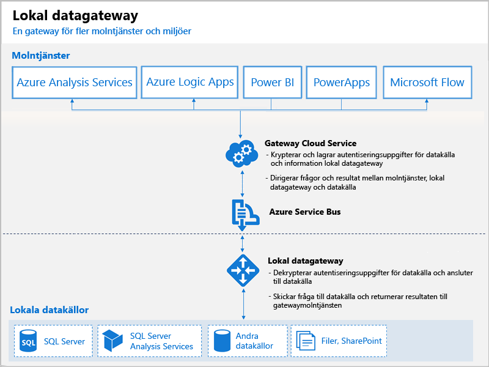

# Vad är Power BI-gatewayer?

En Power BI-gateway är en programvara som du installerar i ett lokalt nätverk. Den möjliggör åtkomst till data i nätverket. Den är som en grindvakt som lyssnar efter anslutningsbegäranden och bara beviljar dem när användarens begäranden uppfyller vissa villkor. Detta gör att organisationer kan förvara databaser och andra datakällor i sina lokala nätverk, men ändå använda dem på ett säkert sätt i Power BI-rapporter och instrumentpaneler.

Gatewayer kan användas för en enstaka datakälla eller flera datakällor. Följande diagram visar en grundläggande vy där gatewayen hanterar begäranden från molnet för tre lokala datorer. Vi kommer att gå in på detta mer i detalj senare i artikeln.

## Typer av gatewayer

Power BI har två olika gatewayer för olika scenarier:

* **Lokal datagateway (personligt läge)** – tillåter en användare att ansluta till källor och kan inte delas med andra. Kan endast användas med Power BI. Den här gatewayen är väl lämpad för scenarier där du är den enda personen som skapar rapporter och du inte behöver dela datakällorna med andra.

* **Lokal datagateway** – flera användare kan ansluta till flera lokala datakällor. Kan användas av Power BI, PowerApps, Flow, Azure Analysis Services och Azure Logic-appar, allt med en enda gatewayinstallation. Den här gatewayen är väl lämpad för mer komplicerade scenarier där flera personer har åtkomst till flera olika datakällor. 

## Använda en gateway

Det finns fyra huvudsakliga steg för att använda en gateway:

1. **Installera gatewayen** med hjälp av lämpligt läge på en lokal dator.
2. **Lägg till användare till gatewayen** så att de kan få åtkomst till lokala datakällor.
3. **Anslut till datakällor** så att de kan användas i rapporter och instrumentpaneler.
4. **Uppdatera lokala data** så att Power BI-rapporterna är uppdaterade.

Du kan installera en fristående gateway eller lägga till en gateway till ett *kluster*, vilket rekommenderas för hög tillgänglighet.

## Så här fungerar gatewayer

Den gateway som du installerar körs som en Windows-tjänst, en **lokal datagateway**. Den här lokala tjänsten registreras för gatewaymolntjänsten via Azure Service Bus. Följande diagram visar flödet mellan lokala data och de molntjänster som använder gatewayen.

Frågor och dataflöde:

1. En fråga skapas av molntjänsten med de krypterade autentiseringsuppgifterna för den lokala datakällan. Därefter skickas den till en kö för gatewaybehandling.
2. Gatewaymolntjänsten analyserar frågan och skickar en begäran till Azure Service Bus.
3. Den lokala datagatewayen avsöker Azure Service Bus efter väntande begäranden.
4. Gatewayen hämtar frågan, dekrypterar autentiseringsuppgifterna och ansluter till datakällorna med autentiseringsuppgifterna.
5. Gatewayen skickar frågan till datakällan för körning.
6. Resultaten skickas från datakällan tillbaka till gatewayen och sedan till molntjänsten och din server.

## Nästa steg
[Installera den lokala datagatewayen](service-gateway-install.md)

Har du fler frågor? [Prova Power BI Community](http://community.powerbi.com/)

