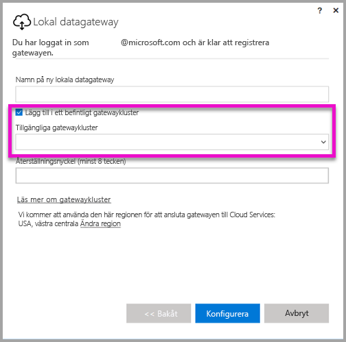
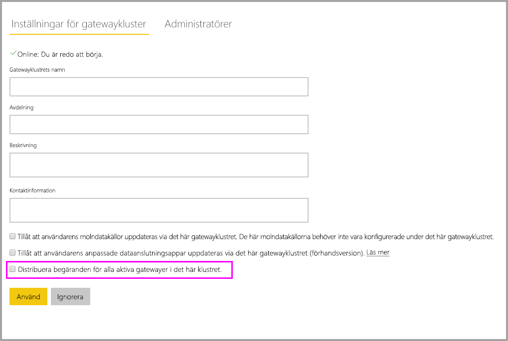

# <a name="high-availability-clusters-for-on-premises-data-gateway"></a>Kluster med hög tillgänglighet för lokal datagateway

Du kan skapa **högtillgängliga kluster** av **lokala datagatewayer**, för att se till att din organisation kan komma åt lokala dataresurser som används i Power BI-rapporter och instrumentpaneler. Sådana kluster gör att gateway-administratörer kan gruppera gatewayer för att undvika enskilda felpunkter för åtkomst av lokala dataresurser. Power BI-tjänsten använder alltid den primära gatewayen i klustret, förutsatt att den inte är otillgänglig. I så fall växlar tjänsten till nästa gateway i klustret och så vidare.

Den här artikeln beskriver de steg du följer för att skapa ett kluster med hög tillgänglighet med lokala datagatewayer, samt bästa praxis när du konfigurerar dem. Gatewaykluster för hög tillgänglighet kräver uppdateringen från november 2017 eller senare för lokal datagateway.

## <a name="setting-up-high-availability-clusters-of-gateways"></a>Ställa in kluster för hög tillgänglighet av gatewayer

Under installationen **lokal datagateway**, kan du ange om gatewayen ska läggas till i ett befintlig gatewaykluster. 



För att lägga till en gateway till ett befintligt kluster måste du ange *återställningsnyckeln* för den primära gatewayinstansen för det kluster som du vill att den nya gatewayen ska ansluta till. Den primära gatewayen för klustret måste köra gatewayuppdateringen från november 2017 eller senare. 

## <a name="managing-a-gateway-cluster"></a>Hantera ett gatewaykluster

När ett gatewaykluster består av två eller flera gatewayer, gäller alla gatewayhanteringsåtgärder, till exempel att lägga till en datakälla eller att bevilja administratörsbehörighet till en gateway, för alla gatewayer som ingår i klustret.

När administratörer använder menyalternativet **Hantera gatewayer** som finns under kugghjulsikonen i **Power BI-tjänsten**, kan de se en lista över registrerade kluster eller enskilda gatewayer, men de ser inte de enskilda gatewayinstanser som är medlemmar i klustret.

Alla nya begäranden om **schemalagd uppdatering** och DirectQuery-åtgärder dirigeras automatiskt till den primära instansen av ett visst gatewaykluster. Om den primära gatewayinstansen inte är online, omdirigeras begäran till en annan gatewayinstans i klustret.

## <a name="distribute-requests-traffic-across-all-gateways-in-a-cluster"></a>Distribuera begäranden mellan alla gatewayer i ett kluster

Du kan välja att tillåta att trafik distribueras mellan alla gatewayer i ett kluster. När du klickar på ett gatewaykluster i listan i det vänstra navigeringsträdet på sidan **Hantera gatewayer** i **Power BI-tjänsten** kan du aktivera alternativet ”Distribute requests across all active gateways in this cluster” (Distribuera begäranden mellan alla aktiva gatewayer i det här klustret).



## <a name="powershell-support-for-gateway-clusters"></a>PowerShell-stöd för gatewaykluster

PowerShell-skript finns i installationsmappen för lokal datagateway. Filen finns som standard på *C:\Program Files\Lokal datagateway*. Du måste använda PowerShell version 5 eller senare för att skripten ska fungera korrekt. Med PowerShell-skript kan användarna utföra följande åtgärder:

-   Hämta listan med gatewaykluster som är tillgängliga för en användare
-   Hämta listan med gatewayinstanser som är registrerade i ett kluster, samt deras online- eller offline-status
-   Ändra status till aktivera/inaktivera för en gatewayinstans i ett kluster, samt andra gatewayegenskaper
-   Ta bort en gateway

Innan du kan köra PowerShell-kommandona i tabellen måste du göra följande:

1. Öppna ett PowerShell-kommandofönster som administratör
2. Kör sedan följande engångskommando för PowerShell (detta förutsätter att du aldrig har kört PowerShell-kommandon på den aktuella datorn):

    ```
    Set-ExecutionPolicy -ExecutionPolicy Unrestricted -Force
    ```

3. Sedan går du till installationsmappen för lokala datagateway i PowerShell-fönstret och importerar nödvändig modul med följande kommando:

    ```
    Import-Module .\OnPremisesDataGatewayHAMgmt.psm1
    ```

När du är klar kan du använda kommandona i följande tabell för att hantera dina gatewaykluster.

| **Kommando** | **Beskrivning** | **Parametrar** |
| --- | --- | --- |
| *Login-OnPremisesDataGateway* |Med det här kommandot kan användaren logga in för att hantera sina kluster för lokal datagateway.  Du måste köra det här kommandot och logga in *innan* andra kommandon med hög tillgänglighet fungerar korrekt. Obs! AAD-auth-token som anskaffats som en del av ett anrop för inloggning är endast giltig under en timme, därefter upphör den. Du kan köra kommandot för inloggning igen för att få en ny token.| Användarnamn och lösenord för Microsoft Azure Active Directory (ingår som en del av kommandokörningen, inte som inledande anrop)|
| *Get-OnPremisesDataGatewayClusters* | Hämtar listan över gatewaykluster för den inloggade användaren. | Om du vill kan du använda formateringsparametrar med kommandot så att det blir lättare att läsa resultatet, t.ex. *Format-Table-AutoSize-Wrap* |
| *Get-OnPremisesDataClusterGateways* | Hämtar listan över gatewayer inom det angivna klustret, samt ytterligare information för varje gateway (online-/offline-status, datornamn, o.s.v.) | *-ClusterObjectID xyz* (där *xyz* ersätts med ett ID-värde för ett faktiskt klusterobjekt, som kan hämtas med hjälp av kommandot *Get-OnPremisesDataGatewayClusters*)|
| *Set-OnPremisesDataGateway* | Gör att du kan ange egenskapsvärden för en viss gateway i ett kluster, inklusive möjligheten att aktivera och inaktivera en specifik gatewayinstans  | *-ClusterObjectID xyz* (*xyz* ska ersättas med det faktiska ID-värdet för klustret, som kan hämtas med hjälp av kommandot *Get-OnPremisesDataGatewayClusters*) *- GatewayObjectID abc* (*abc* ska ersättas med det faktiska ID-värdet för klustret, som kan hämtas med hjälp av kommandot *Get-OnPremisesDataClusterGateways*, för ett givet klusterobjekt-ID) |
| *Get-OnPremisesDataGatewayStatus* | Låter dig hämta statusen för en given gatewayinstans i ett kluster  | *-ClusterObjectID xyz* (*xyz* ska ersättas med det faktiska ID-värdet för klustret, som kan hämtas med hjälp av kommandot *Get-OnPremisesDataGatewayClusters*) *- GatewayObjectID abc* (*abc* ska ersättas med det faktiska ID-värdet för klustret, som kan hämtas med hjälp av kommandot *Get-OnPremisesDataClusterGateways*, vid ett givet klusterobjekt-ID) |
| *Remove-OnPremisesDataGateway*  | Låter dig ta bort en gatewayinstans från ett kluster. Observera att den primära gatewayen i klustret inte kan tas bort förrän alla gatewayer i klustret har tagits bort.| *-ClusterObjectID xyz* (*xyz* ska ersättas med det faktiska ID-värdet för klustret, som kan hämtas med hjälp av kommandot *Get-OnPremisesDataGatewayClusters*) *- GatewayObjectID abc* (*abc* ska ersättas med det faktiska ID-värdet för klustret, som kan hämtas med hjälp av kommandot *Get-OnPremisesDataClusterGateways*, vid ett givet klusterobjekt-ID) |

## <a name="next-steps"></a>Nästa steg

-   [Hantera din datakälla – Analysis Services](service-gateway-enterprise-manage-ssas.md)  
-   [Hantera din datakälla – SAP HANA](service-gateway-enterprise-manage-sap.md)  
-   [Hantera din datakälla – SQL Server](service-gateway-enterprise-manage-sql.md)  
-   [Hantera din datakälla – Oracle](service-gateway-onprem-manage-oracle.md)  
-   [Hantera din datakälla – Import/schemalagd uppdatering](service-gateway-enterprise-manage-scheduled-refresh.md)  
-   [Lokal datagateway – på djupet](service-gateway-onprem-indepth.md)  
-   [Lokal datagateway (personligt läge)](service-gateway-personal-mode.md)
-   [Konfigurera proxyinställningar för den lokala datagatewayen](service-gateway-proxy.md)  
-   [Använda Kerberos för SSO (enkel inloggning) från Power BI till lokala datakällor](service-gateway-kerberos-for-sso-pbi-to-on-premises-data.md)  

Har du fler frågor? [Prova Power BI Community](http://community.powerbi.com/)
