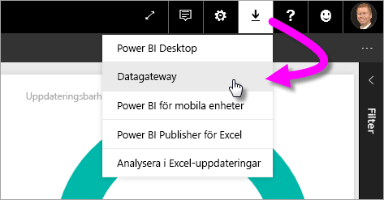
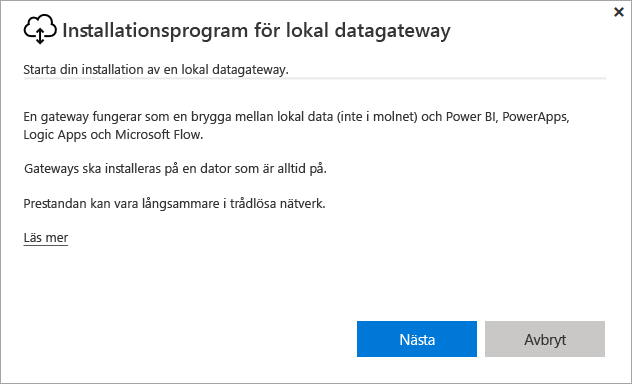
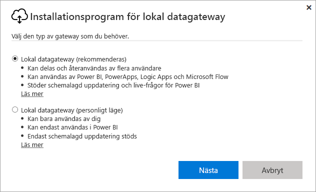
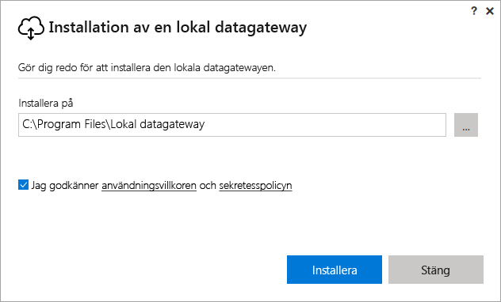
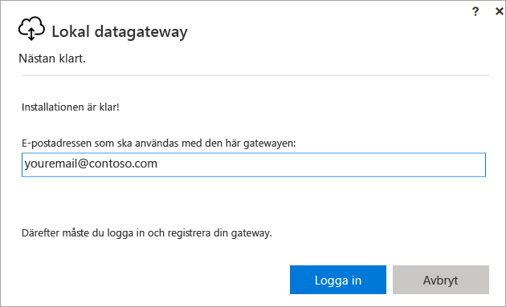
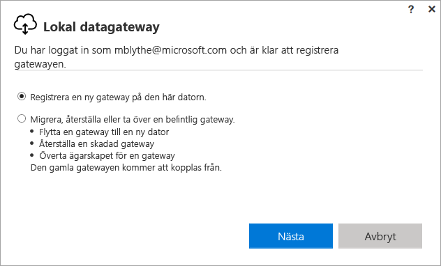
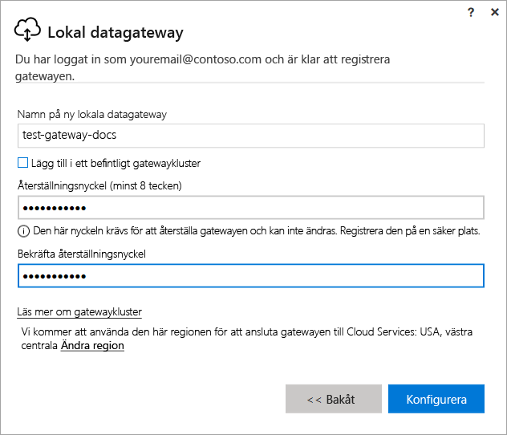
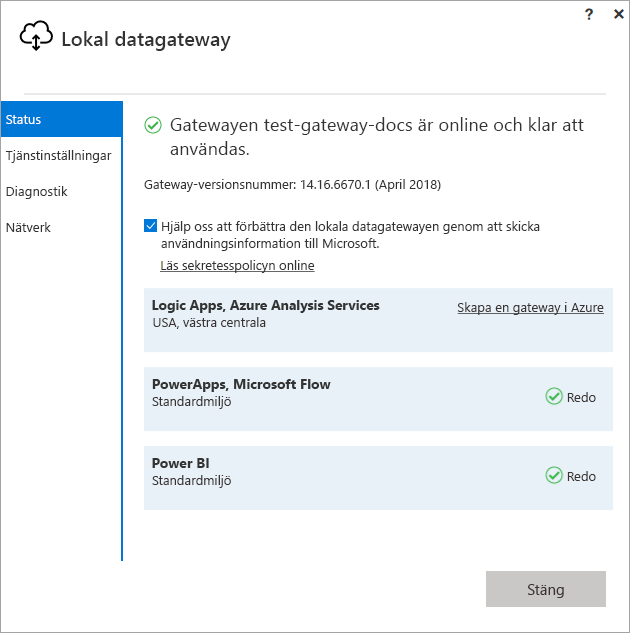
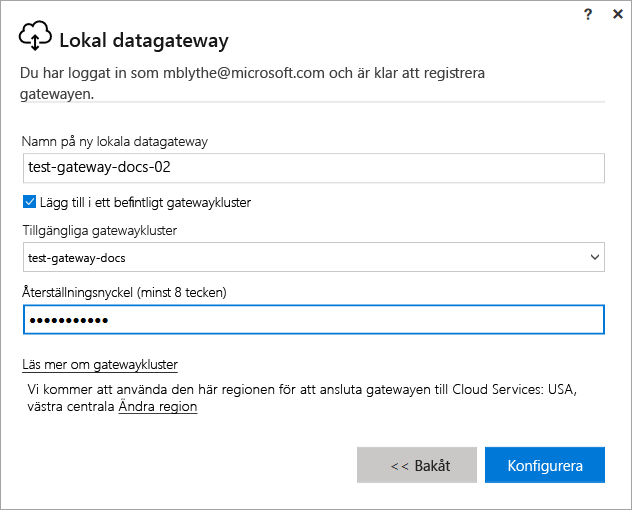

# Installera en gateway för Power BI

En Power BI-gateway är en programvara som du installerar i ett lokalt nätverk. Det möjliggör åtkomst till data i nätverket. Enligt beskrivningen i [översikten](service-gateway-getting-started.md), kan du installera en gateway i personligt eller standardläge (rekommenderas). I standardläge kan du installera en fristående gateway eller lägga till en gateway till ett *kluster*, vilket rekommenderas för hög tillgänglighet. I den här artikeln visar vi hur du installerar en standardgateway och lägger till en annan gateway för att skapa ett kluster.

Om du inte har registrerat dig för Power BI [registrerar du dig för en kostnadsfri utvärderingsversion](https://app.powerbi.com/signupredirect?pbi_source=web) innan du börjar.

## Ladda ned och installera en gateway

Gatewayen körs på datorn där du installerar den så se till att du installerar den på en dator som alltid är på. För bättre prestanda och tillförlitlighet, rekommenderar vi att datorn är på ett kabelanslutet nätverk istället för ett trådlöst.

1. Välj i Power BI-tjänsten i det övre högra hörnet, väljer du **hämta-ikonen**  > **Datagateway**.

    

2. På nedladdningssidan, väljer du knappen **Hämta gateway**.

3. Välj **Nästa**.     

    

4. Välj **Lokal datagateway (rekommenderas)** > **Nästa**.

    

5. Behåll standardsökvägen för installationen och acceptera villkoren > **Installera**.

    

6. Ange det konto som används för att logga in på Power BI > **Logga in**.

    

    Gatewayen är kopplad till ditt Power BI-konto och du hanterar gateways inuti Power BI-tjänsten. Du är nu inloggad på ditt konto.

7. Välj **Registrera en ny gateway på den här datorn** > **Nästa**.

    

8. Ange ett namn för gatewayen (måste vara unikt inom klientorganisationen) och en återställningsnyckel. Du behöver den här nyckeln om du vill återställa eller flytta din gateway. Välj **Konfigurera**.

    

    Lägg märke till alternativet **Lägg till i ett befintligt gatewaykluster**. Vi använder det här alternativet i nästa avsnitt av artikeln.

9. Granska informationen i det sista fönstret. Observera att gatewayen är tillgänglig för Power BI, PowerApps och Flow, eftersom jag använder samma konto för alla tre. Välj **Stäng**.

    

Nu när du har installerat en gateway, kan du lägga till en till gateway för att skapa ett kluster.

## Lägg till en till gateway för att skapa ett kluster

Ett kluster gör att gateway-administratörer slipper ha en enskild felpunkt för lokal dataåtkomst. Om den primära gatewayen inte är tillgänglig, dirigeras databegäranden till den andra gatewayen som du lägger till och så vidare. Du kan bara installera en standard-gateway på en dator så du måste installera den andra gatewayen för klustret på en annan dator. Det är logiskt eftersom du vill ha redundans i klustret.

Gatewaykluster för hög tillgänglighet kräver uppdateringen från november 2017 eller senare för lokal datagateway.

1. Ladda ned gatewayen till en annan dator och installera den.

2. När du har loggat in på ditt Power BI-konto registrerar du gatewayen. Välj **Lägg till i ett befintligt kluster**. Under **Tillgängliga gateway-kluster**, väljer du den första gatewayen du installerade (den *primära gatewayen*) och anger återställningsnyckeln för gatewayen. Välj **Konfigurera**.

    

## Nästa steg

[Hantera en Power BI-gateway](service-gateway-manage.md)

Har du fler frågor? [Prova Power BI Community](http://community.powerbi.com/)