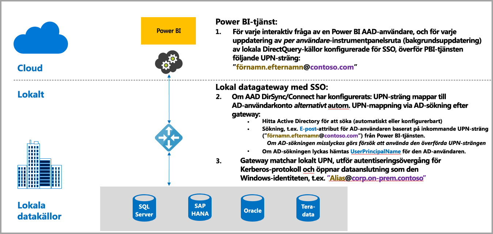
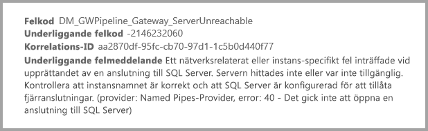
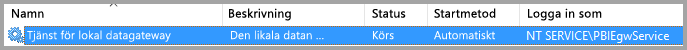
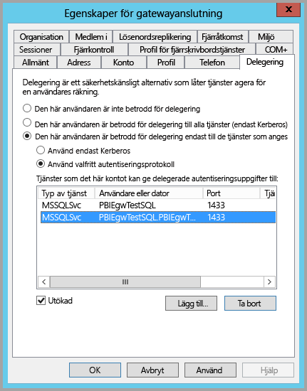
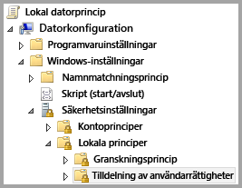
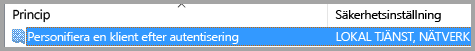
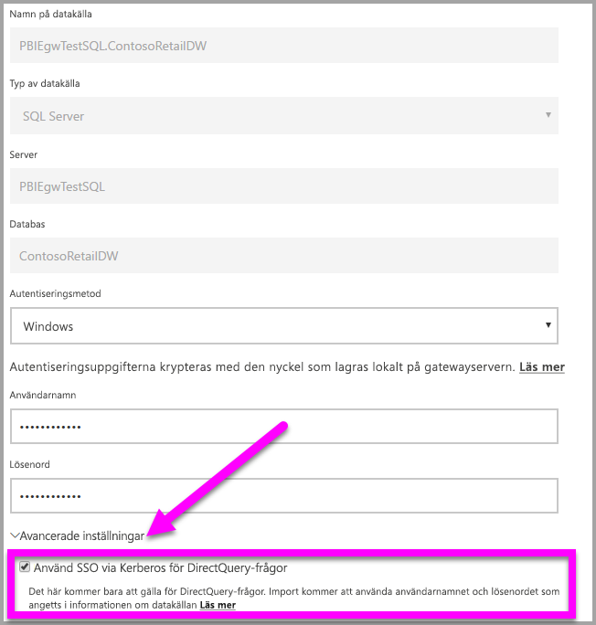
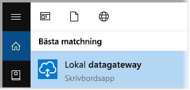
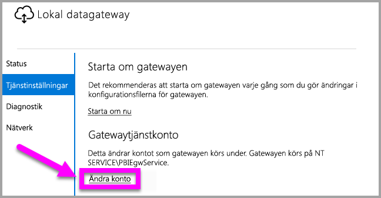

# Använda Kerberos för SSO (enkel inloggning) från Power BI till lokala datakällor
Du kan få en sömlös enkel inloggningsanslutning, vilket medför att Power BI-rapporter och -instrumentpaneler kan uppdateras från lokala data, genom att konfigurera din lokala datagateway med Kerberos. Den lokala datagatewayen genomför SSO (enkel inloggning) med hjälp av DirectQuery, som används för att ansluta till lokala datakällor.

Nedanstående datakällor stöds för närvarande baserat på [Kerberos-begränsad delegering](https://technet.microsoft.com/library/jj553400.aspx).

* SQL Server
* SAP HANA
* Teradata

När en användare interagerar med en DirectQuery-rapport i Power BI-tjänsten, kan varje åtgärd relaterad till korsfiltrering, sektor, sortering och rapportredigering resultera i frågor som körs i realtid mot den underliggande lokala datakällan.  När enkel inloggning har konfigurerats för datakällan, körs frågorna under identiteten för den användare som interagerar med Power BI (det vill säga via webbläsaren eller Power BI Mobile-appar). Därmed ser varje användare exakt de data som han eller hon har behörighet för i den underliggande datakällan – med enkel inloggning konfigurerad finns det ingen delad datacachelagring för olika användare.

## Köra en fråga med SSO – steg för steg
En fråga som körs med SSO (enkel inloggning) består av tre steg, vilket visas i följande diagram.

> [!NOTE]
> SSO för Oracle har inte aktiverats ännu, men är under utveckling och kommer snart.
> 
> 

Här finns mer information om de här stegen:

1. För varje fråga inkluderar **Power BI-tjänsten** *användarens huvudnamn* (UPN) vid sändning av en fråga till den konfigurerade gatewayen.
2. Gatewayen måste mappa Microsoft Azure Active Directorys UPN till en lokal Active Directory-identitet.
   
   a.  Om AAD DirSync (även kallat *AAD Connect*) har konfigurerats, fungerar mappningen automatiskt i gatewayen.
   
   b.  I annat fall kan gatewayen söka upp och mappa Microsoft Azure AD UPN:en till en lokal användare genom att utföra en sökning mot den lokala Active Directory-domänen.
3. Gatewaytjänstprocessen personifierar den mappade lokala användaren, öppnar anslutningen till den underliggande databasen och skickar frågan. Gatewayen måste inte vara installerad på samma dator som databasen.
   
   - Användarpersonifieringen och anslutningen till databasen lyckas bara om gatewaytjänstkontot är ett domänkonto (eller tjänst-SID) och om Kerberos-begränsad delegering har konfigurerats för databasen för att acceptera Kerberos-biljetter från gatewaytjänstkontot.  
   
   > [!NOTE]
   > Om AAD DirSync/Connect har konfigurerats och användarkonton har synkroniserats, behöver inte gatewaytjänsten utföra lokala AD-sökningar vid körning och du kan använda ditt lokala tjänst-SID (i stället för att kräva ett domänkonto) för gatewaytjänsten.  Konfigurationsstegen för Kerberos-begränsad delegering som beskrivs i det här dokumentet är desamma (tillämpas bara baserat på ditt tjänst-SID i stället för domänkonto).
   > 
   > 

> [!NOTE]
> Du måste tillämpa följande SAP HANA-specifika konfigurationer för SAP för att aktivera enkel inloggning för SAP HANA:
> 1. Kontrollera att SAP HANA-servern har den lägsta versionen som krävs, vilket beror på nivån för SAP Hana-serverplattformen:
> * [HANA 2 SPS 01 Rev 012.03](https://launchpad.support.sap.com/#/notes/2557386)
> * [HANA 2 SPS 02 Rev 22](https://launchpad.support.sap.com/#/notes/2547324)
> * [HANA 1 SP 12 Rev 122.13](https://launchpad.support.sap.com/#/notes/2528439)
>
> 2. Installera SAP:s senaste HANA ODBC-drivrutin på gatewaydatorn.  Den lägsta möjliga versionen är HANA ODBC version 2.00.020.00 från augusti 2017.
>
> Följande länkar till korrigeringar och uppgraderingar från SAP kan vara användbara. Observera att du måste logga in på följande resurser med ditt SAP Support-konto för att SAP ska kunna ändra eller uppdatera de här länkarna.
> 
> * [HANA 2 SPS 01 Rev 012.03](https://launchpad.support.sap.com/#/notes/2557386) 
> * [HANA 2 SPS 02 Rev 22](https://launchpad.support.sap.com/#/notes/2547324) 
> * [HANA 1 SP 12 Rev 122.13](https://launchpad.support.sap.com/#/notes/2528439)

## Fel från en otillräcklig Kerberos-konfiguration
Om den underliggande databasservern och gatewayen inte är korrekt konfigurerade för **Kerberos-begränsad delegering**, kan du få följande felmeddelande:

Och den tekniska informationen som åtföljer felmeddelandet kan se ut ungefär så här:

Kontentan är att gatewayen, på grund av otillräcklig Kerberos-konfiguration, inte kunde personifiera den ursprungliga användaren korrekt och databasanslutningen misslyckades.

## Förbereda för Kerberos-begränsad delegering
Flera objekt måste konfigureras för att Kerberos-begränsad delegering ska fungera korrekt, inklusive *Tjänsternas huvudnamn* (SPN) och delegeringsinställningar på tjänstkonton.

### Förutsättning 1: Installera och konfigurera den lokala datagatewayen
Den här versionen av den lokala datagatewayen stöder en uppgradering på plats, samt inställningsövertagning för befintliga gatewayer.

### Förutsättning 2: Kör gatewayens Windows-tjänst som ett domänkonto
I en standardinstallation körs gatewayen som ett datorlokalt tjänstkonto för (särskilt *NT Service\PBIEgwService*), som till exempel det som visas i följande bild:

För att aktivera **Kerberos-begränsad delegering**, måste gatewayen köras som ett domänkonto, om inte din AAD redan har synkroniserats med din lokala Active Directory (med AAD DirSync/Connect). För att den här ändringen av tjänstkontot ska fungera korrekt, har du två alternativ:

* Om du utgick från en tidigare version av den lokala datagatewayen, ska du följa exakt alla fem stegen i sekvensen (inklusive köra gatewaykonfiguratorn i steg 3) som beskrivs i följande artikel:
  
  * [Ändra gatewayens tjänstkonto till en domänanvändare](https://powerbi.microsoft.com/documentation/powerbi-gateway-proxy/#changing-the-gateway-service-account-to-a-domain-user)
  * Om du redan har installerat förhandsversionen av den lokala datagatewayen, finns det en ny användargränssnittsstyrd metod för att byta tjänstkonto direkt i gatewayens konfigurator. Mer information finns i avsnittet **Ändra gatewayen till ett domänkonto** i slutet av den här artikeln.

> [!NOTE]
> Om AAD DirSync/Connect har konfigurerats och användarkonton har synkroniserats, behöver inte gatewaytjänsten utföra lokala AD-sökningar vid körning och du kan använda ditt lokala tjänst-SID (i stället för att kräva ett domänkonto) för gatewaytjänsten. Konfigurationsstegen för Kerberos-begränsad delegering som beskrivs i den här artikeln motsvarar den konfigurationen (de tillämpas helt enkelt baserat på ditt tjänst-SID, i stället för domänkonto).
> 
> 

### Förutsättning 3: Se till att du har administratörsbehörighet för att konfigurera inställningar för SPN:er (SetSPN) och Kerberos-begränsad delegering
Även om det är tekniskt möjligt för en domänadministratör att tillfälligt eller permanent tilldela behörighet till någon annan för att konfigurera SPN:er och Kerberos-delegering, utan att kräva domänadministratörsbehörighet, är det inte något vi rekommenderar. I följande avsnitt redovisar vi de konfigurationssteg som krävs för **Förutsättning 3** i detalj.

## Konfigurera Kerberos-begränsad delegering för gatewayen och datakällan
Om du vill konfigurera systemet korrekt, måste du konfigurera eller verifiera följande två objekt:

1. Konfigurera vid behov ett SPN för gatewaytjänstens domänkonto (om inget skapats ännu).
2. Konfigurera delegeringinställningarna på gatewaytjänstens domänkonto.

Observera att du måste vara domänadministratör för att utföra dessa två konfigurationssteg.

I följande avsnitt beskrivs de här stegen i tur och ordning.

### Konfigurera ett SPN för gatewaytjänstkontot
Börja med att kontrollera om ett SPN redan har skapats för det domänkonto som används som gatewaytjänstkonto, och följ då dessa steg:

1. Starta **Active Directory-användare och datorer** som domänadministratör.
2. Högerklicka på domänen, välj **Hitta** och ange gatewaytjänstkontots kontonamn.
3. Högerklicka på gatewayens tjänstkonto i sökresultatet och välj **Egenskaper**.
   
   * Om fliken **Delegering** visas i dialogrutan **Egenskaper** hade ett SPN redan skapats och du kan gå vidare till nästa underavsnitt om att konfigurera delegeringsinställningar.

Om det inte finns någon **Delegering**-flik i dialogrutan **Egenskaper**, kan du manuellt skapa ett SPN på det kontot som lägger till **Delegering**-fliken (detta är den enklaste metoden för att konfigurera delegeringsinställningarna). Du kan skapa ett SPN med hjälp av [setspn-verktyget](https://technet.microsoft.com/library/cc731241.aspx) som medföljer Windows (du behöver domänadministratörsbehörighet för att skapa ett SPN).

Anta till exempel att gatewaytjänstkontot är ”PBIEgwTest\GatewaySvc” och att datorn där gatewaytjänsten körs kallas **Dator1**. För att ställa in SPN:et för gatewaytjänstkontot för den datorn i det här exemplet skulle du köra följande kommando:

Då den åtgärden är slutförd kan vi gå vidare till att konfigurera delegeringsinställningarna.

### Konfigurera delegeringinställningarna på gatewaytjänstkontot
Det andra konfigurationskravet rör delegeringsinställningarna på gatewaytjänstkontot. Det finns flera olika verktyg som du kan använda för att utföra dessa steg. I den här artikeln använder vi **Active Directory-användare och datorer**, vilket är en snapin-modul i Microsoft Management Console (MMC) som du kan använda för att administrera och publicera information i katalogen och som är tillgänglig på domänkontrollanter som standard. Du kan också utföra aktiveringen genom konfiguration av **Windows-funktionen** på andra datorer.

Vi behöver konfigurera **Kerberos-begränsad delegering** med protokollövergång. Med begränsad delegering måste du vara explicit med vilka tjänster som du vill delegera till – som exempel accepterar endast din SQL Server eller din SAP HANA-server delegeringsanrop från gatewaytjänstkontot.

Det här avsnittet förutsätter att du redan har konfigurerat SPN:er för dina underliggande datakällor (som SQL Server, SAP HANA, Teradata och så vidare). Mer information om hur du konfigurerar dessa datakällors server-SPN:er finns i den tekniska dokumentationen för respektive databasserver. Du kan också titta på blogginlägget som beskriver [*vilket SPN som din app kräver*](https://blogs.msdn.microsoft.com/psssql/2010/06/23/my-kerberos-checklist/).

I följande steg använder vi oss av en lokal miljö med två datorer: en gatewaydator och en databasserver (SQL Server-databas) och för det här exemplet använder vi oss också av följande inställningar och namn:

* Gatewaydatornamn: **PBIEgwTestGW**
* Gatewaytjänstkonto: **PBIEgwTest\GatewaySvc** (kontots visningsnamn: Gatewayanslutning)
* Datornamn för SQL Server-datakälla: **PBIEgwTestSQL**
* Tjänstkonto för SQL Server-datakälla: **PBIEgwTest\SQLService**

Baserat på dessa exempelnamn och -inställningar, blir konfigurationsstegen följande:

1. Starta **Active Directory-användare och datorer** med domänadministratörsbehörighet.
2. Högerklicka på gatewayens tjänstkonto (**PBIEgwTest\GatewaySvc**) och välj **Egenskaper**.
3. Välj fliken **Delegering**.
4. Välj **Lita på den här datorn enbart för delegering till angivna tjänster**.
5. Välj **Använd valfritt autentiseringsprotokoll**.
6. Under **Tjänster som det här kontot kan ge delegerade autentiseringsuppgifter till:** väljer du **Lägg till**.
7. I den nya dialogrutan väljer du **Användare eller datorer**.
8. Ange tjänstkontot för SQL Server-databastjänsten (**PBIEgwTest\SQLService**) och välj **OK**.
9. Välj det SPN som du skapade för databasservern. I vårt exempel börjar SPN:et med **MSSQLSvc**. Om du har lagt till både FQDN- och NetBIOS-SPN:et för din databastjänst, väljer du båda. Du kan hända att du bara ser en.
10. Välj **OK**. Du bör nu se SPN:et i listan.
11. Du kan också markera **Expanderat** för att visa både FQDN- och NetBIOS-SPN:et.
12. Dialogrutan ser ut ungefär som följande när du har markerat **Expanderat**.
    
    
13. Välj **OK**.
    
    Till slut måste gatewaytjänstkontot på den dator som kör gatewaytjänsten (**PBIEgwTestGW** i vårt exempel), beviljas den lokala principen ”Personifiera en klient efter autentisering”. Du kan utföra/kontrollera detta med Redigeraren för lokala grupprinciper (**gpedit**).
14. På gatewaydatorn kör du: *gpedit.msc*
15. Gå till **Lokal datorprincip > Datorkonfiguration > Windows-inställningar > Säkerhetsinställningar > Lokala principer > Tilldelning av användarrättigheter**, enligt följande bild.
    
    
16. I listan med principer under **Tilldelning av användarrättigheter** väljer du **Personifiera en klient efter autentisering**.
    
    
    
    Högerklicka på och öppna **Egenskaper** för **Personifiera en klient efter autentisering** och kontrollera listan över konton. Det måste innehålla gatewaytjänstkontot (**PBIEgwTest\GatewaySvc**).
17. I listan med principer under **Tilldelning av användarrättigheter** väljer du **Agera som del av operativsystemet (SeTcbPrivilege)**. Se till att gatewaytjänstkontot även finns med i listan över konton.
18. Starta om den **lokala datagatewaytjänsten**.

## Köra en Power BI-rapport
När alla konfigurationssteg som beskrivs tidigare i den här artikeln har slutförts, kan du använda sidan **Hantera gateway** i Power BI för att konfigurera datakällan. Under **Avancerade inställningar** aktiverar du SSO (enkel inloggning) och publicerar sedan rapporter och datauppsättningar med bindning till datakällan.

Den här konfigurationen fungerar i de flesta fall. Med Kerberos kan det dock förekomma olika konfigurationer beroende på din miljö. Om rapporten fortfarande inte kan läsas in, behöver du kontakta domänadministratören för att undersöka saken vidare.

## Ändra gatewayen till ett domänkonto
Tidigare i den här artikeln diskuterade vi att man kan byta gatewayen från ett lokalt tjänstkonto till att köras som ett domänkonto med hjälp av användargränssnittet för den **lokala datagatewayen**. Här följer de steg som krävs för att göra detta.

1. Starta den **lokala datagatewayens** konfigurationsverktyg.
   
   
2. Välj **inloggningknappen** på huvudsidan och logga in med ditt Power BI-konto.
3. När inloggningen är klar väljer du fliken **Tjänstinställningar**.
4. Klicka på **Ändra konto** för att starta den guidade genomgången, enligt följande bild.
   
   

## Nästa steg
Mer information om den **lokala datagatewayen** och **DirectQuery** finns i följande resurser:

* [Lokal datagateway](service-gateway-onprem.md)
* [DirectQuery i Power BI](desktop-directquery-about.md)
* [Datakällor som stöds av DirectQuery](desktop-directquery-data-sources.md)
* [DirectQuery och SAP BW](desktop-directquery-sap-bw.md)
* [DirectQuery och SAP HANA](desktop-directquery-sap-hana.md)

