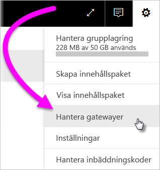
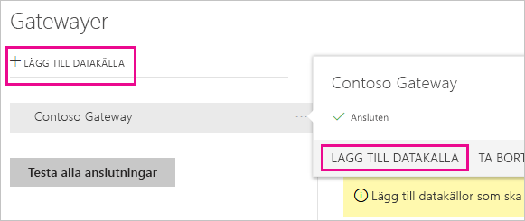
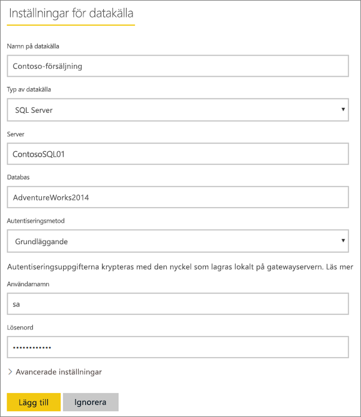
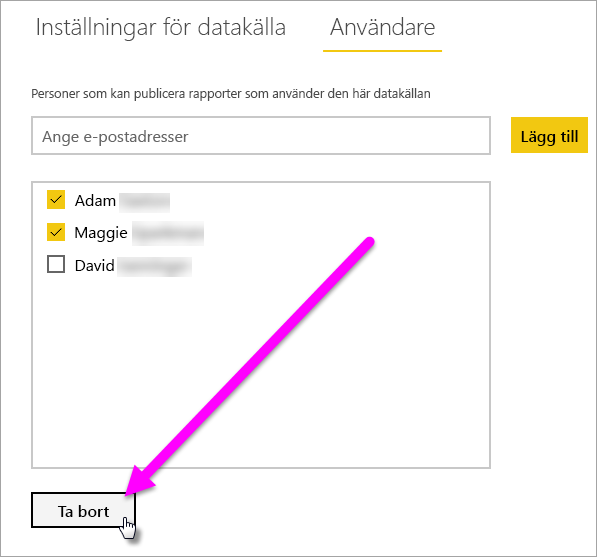
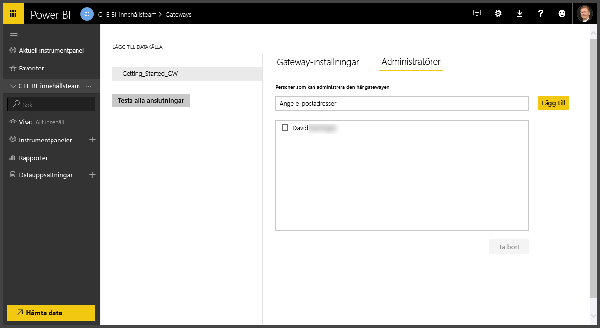
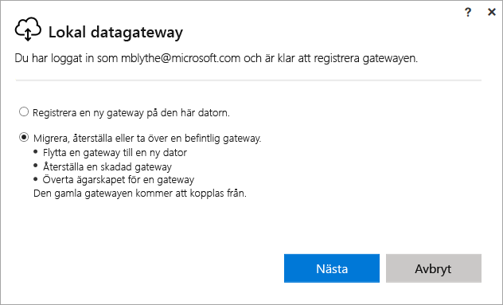
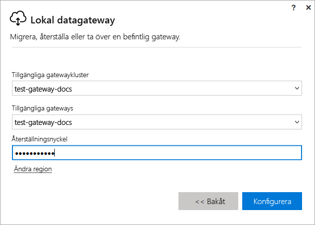

# Hantera en lokal Power BI-gateway

När du har [installerat en Power BI-datagateway](service-gateway-install.md) hanterar du den baserat på dina krav. I det här avsnittet lär du dig att: lägga till och ta bort datakällor och användare, starta om en gateway, samt migrera, återställa, ta över och ta bort en gateway. 

Du kan hantera en gateway via området **Hantera gatewayer** i Power BI-tjänsten, i gateway-appen på din lokala dator och med PowerShell-skript. Den här artikeln fokuserar på Power BI-tjänsten. 

Om du precis har installerat en gateway, rekommenderar vi att dig att [lägga till en datakälla](#add-a-data-source) och sedan [lägga till användare](#add-users-to-a-data-source) så att de kan få åtkomst till datakällan.

## Hantera datakällor

Power BI stöder många lokala datakällor och var och en har sina egna krav. Gatewayer kan användas för en enstaka datakälla eller flera datakällor. Vi visar hur du lägger till SQL Server som datakälla i det här exemplet, men stegen ser ungefär likadana ut för andra datakällor.

### Lägga till en datakälla

1. Välj kugghjulsikonen  > **Hantera gatewayer** i det övre högra hörnet av Power BI-tjänsten.

    

2. Välj antingen en gateway > **Lägg till datakälla** eller gå till Gatewayer > **Lägg till datakälla**.

    

3. Välj **Typ av datakälla**.

    

4. Ange information för datakällan. I det här exemplet är det **Server**, **Databas** och annan information.  

    

5. För SQL Server, väljer du en **autentiseringsmetod** för **Windows** eller **Grundläggande** (SQL-autentisering).  Om du väljer **Grundläggande** ska du ange autentiseringsuppgifterna för datakällan.

6. Under **Avancerade inställningar** kan du som alternativ konfigurera [sekretessnivån](https://support.office.com/article/Privacy-levels-Power-Query-CC3EDE4D-359E-4B28-BC72-9BEE7900B540) för datakällan (gäller inte för [DirectQuery](desktop-directquery-about.md)).

    

7. Välj **Lägg till**. Du ser *Anslutningen lyckades* om processen lyckas.

    

Du kan nu använda den här datakällan för att ta med data från SQL Server i Power BI-instrumentpaneler och rapporter.

### Ta bort en datakälla

Du kan ta bort en datakälla om du inte längre använder den. Kom ihåg att du vid borttagning av en datakälla bryter alla anslutningar till instrumentpaneler och rapporter som förlitar sig på den datakällan.

Du tar bort en datakälla genom att gå till datakällan och sedan välja **Ta bort**.

## Hantera användare och administratörer

När du har lagt till en datakälla till en gateway ger du användarna och säkerhetsgrupperna åtkomst till den specifika datakällan (inte hela gatewayen). Datakällans användarlista styr endast vem som får publicera rapporter som innehåller data från datakällan. Rapportägare kan skapa instrumentpaneler, innehållspaket och appar och dela dem med andra användare.

Du kan även ge användare och säkerhetsgrupper administrativ åtkomst till gatewayen.

### Lägga till användare till en datakälla

1. Välj kugghjulsikonen  > **Hantera gatewayer** i det övre högra hörnet av Power BI-tjänsten.

2. Välj den datakälla där du vill lägga till användare.

3. Välj **Användare** och ange en användare från organisationen som du vill bevilja åtkomst till den valda datakällan. På följande skärm ser du att jag lägger till Maggie och Adam.

    

4. Välj **Lägg till** så visas den tillagda medlemmen i rutan.

    

Det är allt. Kom ihåg att du behöver lägga till användare i varje datakälla som du vill bevilja åtkomst. Varje datakälla har en separat lista med användare och du måste lägga till användare i varje datakälla separat.

### Ta bort användare från en datakälla

På datakällans flik **Användare** kan du ta bort användare och säkerhetsgrupper som använder den här datakällan.

### Lägga till och ta bort administratörer

På fliken **Administratörer** för gatewayen kan du lägga till och ta bort användare (eller säkerhetsgrupper) som kan administrera gatewayen.

## Hantera ett gatewaykluster

När du har skapat ett gatewaykluster som består av två eller flera gatewayer, gäller alla gatewayhanteringsåtgärder, till exempel att lägga till en datakälla eller att bevilja administratörsbehörighet till en gateway, för alla gatewayer som ingår i klustret. 

När administratörer använder menyalternativet **Hantera gatewayer** som finns under kugghjulsikonen i **Power BI-tjänsten**, kan de se en lista över registrerade kluster eller enskilda gatewayer, men de ser inte de enskilda gatewayinstanser som är medlemmar i klustret.

Alla nya begäranden om **schemalagd uppdatering** och DirectQuery-åtgärder dirigeras automatiskt till den primära instansen av ett visst gatewaykluster. Om den primära gatewayinstansen inte är online, omdirigeras begäran till en annan gatewayinstans i klustret.

## Dela en gateway

Det går inte att *dela* en gateway som den är, men du kan lägga till administratörer till gatewayen och du kan lägga till användare till gatewayens datakällor. 

När du har installerat en gateway är du som standard administratör för denna gateway. Som vi visade tidigare kan du lägga till andra personer som administratörer. Dessa administratörer kan lägga till datakällor, konfigurera och ta bort gatewayen.

Du kan också tilldela användare till de datakällor som du skapar under varje gateway. Användarna kan sedan använda dessa datakällor till att uppdatera Power BI-rapporterna. De kan dock inte ändra några av datakällorna eller gateway-inställningarna.

## Migrera, återställa eller ta över en gateway

Kör gatewayens installationsprogram på datorn där du vill migrera, återställa eller ta över gatewayen.

1. Ladda ned och installera gatewayen.

2. När du har loggat in på ditt Power BI-konto registrerar du gatewayen. Välj **Migrera, återställa eller ta över en befintlig gateway** > **Nästa**.

    

3. Välj från de tillgängliga klustren och gatewayerna och ange återställningsnyckeln för den valda gatewayen. Välj **Konfigurera**.

    

## Starta om en gateway

Gatewayen körs som en Windows-tjänst. Precis som för en Windows-tjänst finns det flera olika sätt att starta och stoppa den. Här visar vi hur du gör det från kommandotolken.

1. Starta en kommandotolk med administratörsbehörighet på datorn där gatewayen körs.

2. Ange `net stop PBIEgwService` för att stoppa tjänsten.

3. Ange `net start PBIEgwService` för att starta om tjänsten.

## Ta bort en gateway

Du kan ta bort en gateway om du inte längre använder den. Men tänk på att borttagning av en gateway även tar bort alla datakällor under den. Detta bryter också anslutningen till alla instrumentpaneler och rapporter som är beroende av dessa datakällor.

1. Välj kugghjulsikonen  > **Hantera gatewayer** i det övre högra hörnet av Power BI-tjänsten.

2. Välj gatewayen > **Ta bort**
   
   

## Nästa steg

[Vägledning för distribution av en datagateway](service-gateway-deployment-guidance.md)

Har du fler frågor? [Prova Power BI Community](http://community.powerbi.com/)
