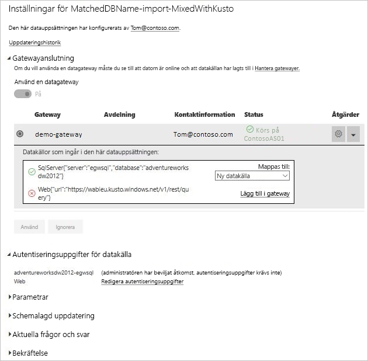

# Slå ihop eller lägga till lokala och molnbaserade datakällor

Med den lokala datagatewayen kan du slå ihop eller lägga till lokala och molnbaserade datakällor i samma fråga. Detta är praktiskt om du vill kombinera data från flera källor utan att använda separata frågor.

## Förutsättningar

- En [gateway som har installerats](service-gateway-install.md) på en lokal dator.
- En Power BI Desktop-fil med frågor som kombinerar lokala och molnbaserade datakällor.

1. Välj kugghjulsikonen  > **Hantera gatewayer** i det övre högra hörnet av Power BI-tjänsten.

    

2. Välj den gateway som du vill konfigurera.

3. Välj **Tillåt att användarens datakällor i molnet uppdateras via det här gatewayklustret** > **Använd** under **Inställningar för gatewaykluster**.

    

4. Lägg till [lokala datakällor](service-gateway-enterprise-manage-scheduled-refresh.md#add-a-data-source) som används i dina frågor under gatewayklustret. Du behöver inte lägga till de molnbaserade datakällorna här.

5. Ladda upp Power BI Desktop-filen med frågorna som kombinerar lokala och molnbaserade datakällor till Power BI-tjänsten.

6. På sidan **Datamängdsinställningar** för den nya datauppsättningen:

   - Som lokal källa väljer du gatewayen som associeras med den här datakällan.

   - Redigera autentiseringsuppgifterna för den molnbaserade datakällan efter behov under **Autentiseringsuppgifter för datakälla**.

     

7. När du har angett autentiseringsuppgifter för molnet kan du uppdatera datauppsättningen med hjälp av alternativet **Uppdatera nu**, eller schemalägga en regelbunden uppdatering.

## Nästa steg

Mer information om datauppdatering för gateways finns i [Använda datakällan med schemalagd uppdatering](service-gateway-enterprise-manage-scheduled-refresh.md#using-the-data-source-for-scheduled-refresh).