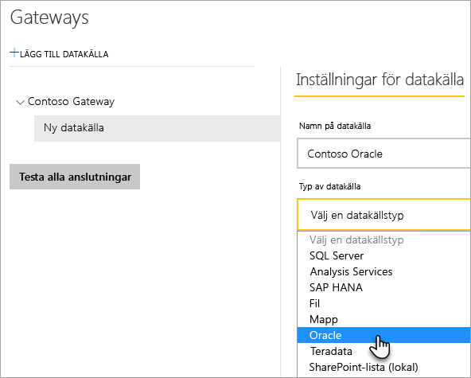
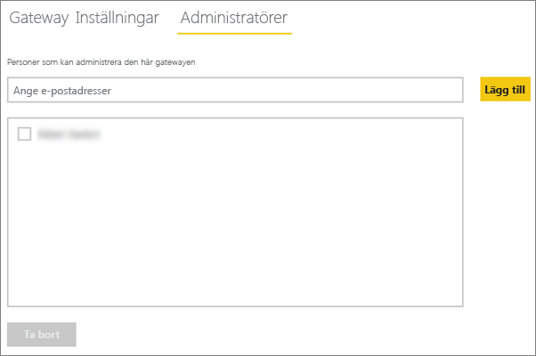
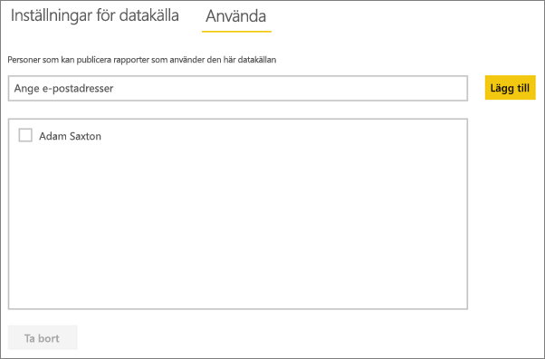

# <a name="manage-your-data-source---oracle"></a>Hantera din datakälla – Oracle
När du har installerat den lokala datagatewayen behöver du lägga till datakällor som kan användas med gatewayen. I den här artikeln tittar vi på hur du kan använda gatewayer och datakällor. Du kan använda Oracle-datakällan för schemalagd uppdatering eller DirectQuery.

## <a name="download-and-install-the-gateway"></a>Ladda ned och installera gatewayen
Du kan ladda ned gatewayen från Power BI-tjänsten. Välj **Nedladdningar** > **Datagateway** eller gå till [nedladdningssidan för gatewayer](https://go.microsoft.com/fwlink/?LinkId=698861).


> [!WARNING]
> För att gatewayen ska kunna ansluta till Oracle-servern, måste Oracle Data Provider för .NET (ODP.NET) installeras och konfigureras. Detta är del av Oracle Data Access Components (ODAC). Mer information om hur du hämtar Oracle-providern finns i [Installera klienten för Oracle](#installing-the-oracle-client) nedan.
> 
> 

## <a name="installing-the-oracle-client"></a>Installera klienten för Oracle
För **32-bitars** versionen av Power BI Desktop använder du följande länk för att hämta och installera **32-bitars** Oracle-klient:

* [32-bitars Oracle Data Access Components (ODAC) med Oracle Developer Tools för Visual Studio (12.1.0.2.4)](http://www.oracle.com/technetwork/topics/dotnet/utilsoft-086879.html)

För **64-bitars** versionen av Power BI Desktop, eller den lokala datagatewayen, använder du följande länk för att hämta och installera **64-bitars** Oracle-klient:

* [64-bitars ODAC 12.2c version 1 (12.2.0.1.0) för Windows x64](http://www.oracle.com/technetwork/database/windows/downloads/index-090165.html)

När detta är installerat måste du konfigurera din tnsnames.ora-fil med rätt information för din databas. Power BI Desktop och gatewayen utgår från net_service_name som definieras i tnsnames.ora-filen. Om detta inte konfigureras kan du inte ansluta. Standardsökvägen för tnsnames.ora är följande: `[Oracle Home Directory]\Network\Admin\tnsnames.ora`. Mer information om hur du konfigurerar tnsnames.ora-filer finns i [Oracle: lokala namnparametrar (tnsnames.ora)](https://docs.oracle.com/cd/B28359_01/network.111/b28317/tnsnames.htm).

### <a name="example-tnsnamesora-file-entry"></a>Exempelpost i tnsnames.ora-fil
Det grundläggande formatet för en post i tnsname.ora är följande.

```
net_service_name=
 (DESCRIPTION=
   (ADDRESS=(protocol_address_information))
   (CONNECT_DATA=
     (SERVICE_NAME=service_name)))
```

Här är ett exempel på hur server- och portinformation anges.

```
CONTOSO =
  (DESCRIPTION =
    (ADDRESS = (PROTOCOL = TCP)(HOST = oracleserver.contoso.com)(PORT = 1521))
    (CONNECT_DATA =
      (SERVER = DEDICATED)
      (SERVICE_NAME = CONTOSO)
    )
  )
```

## <a name="add-a-gateway"></a>Lägga till en gateway
Du lägger till en gateway genom att helt enkelt [ladda ned](https://go.microsoft.com/fwlink/?LinkId=698861) och installera gatewayen på en server i din miljö. När du har installerat gatewayen visas den i listan med gatewayer under **Hantera gatewayer**.

> [!NOTE]
> **Hantera gatewayer** visas inte förrän du är administratör för minst en gateway. Detta kan inträffa antingen genom att du läggs till som en administratör eller om du installerar och konfigurerar en gateway.
> 
> 

## <a name="remove-a-gateway"></a>Ta bort en gateway
Om en gateway tas bort raderas även alla datakällor under gatewayen.  Detta bryter också anslutningen till alla instrumentpaneler och rapporter som är beroende av dessa datakällor.

1. Välj kugghjulsikonen  i det övre högra hörnet > **Hantera gatewayer**.
2. Gateway > **Ta bort**
   
   

## <a name="add-a-data-source"></a>Lägga till en datakälla
Du kan lägga till en datakälla genom att antingen välja en gateway och klicka på **Lägg till datakälla** eller gå till Gateway > **Lägg till datakälla**.


Du kan sedan välja **Typ av datakälla** i listan.



Du kan fylla i informationen för datakällan med **Server** och **Databas**.  

Du måste också välja en **Autentiseringsmetod**.  Det kan antingen vara **Windows** eller **Grundläggande**.  Välj **Grundläggande** om du tänker använda ett konto som har skapats i Oracle i stället för Windows-autentisering. Ange sedan de autentiseringsuppgifter som ska användas för datakällan.

> [!NOTE]
> Alla frågor till datakällan kommer att köras med dessa autentiseringsuppgifter. Mer information finns i den övergripande lokala artikeln om datagatewayer, där du lär dig mer om hur [autentiseringsuppgifter](service-gateway-onprem.md#credentials) lagras.
> 
> 


Klicka på **Lägg till** när allt har fyllts i.  Nu kan du använda den här datakällan för schemalagd uppdatering, eller DirectQuery mot en lokal Oracle-Server. *Anslutningen lyckades* visas om anslutningen har lyckats.


### <a name="advanced-settings"></a>Avancerade inställningar
Du kan konfigurera sekretessnivån för datakällan. Detta styr hur data kan kombineras. Det används endast vid schemalagd uppdatering. Det gäller inte för DirectQuery. [Läs mer](https://support.office.com/article/Privacy-levels-Power-Query-CC3EDE4D-359E-4B28-BC72-9BEE7900B540)


## <a name="remove-a-data-source"></a>Ta bort en datakälla
Om en datakälla tas bort bryts alla anslutningar till instrumentpaneler och rapporter som är beroende av den.  

Ta bort en datakälla genom att gå till Datakälla > **Ta bort**.


## <a name="manage-administrators"></a>Hantera administratörer
På fliken Administratörer för gatewayen kan du lägga till och ta bort användare (eller säkerhetsgrupper) som kan administrera gatewayen.



## <a name="manage-users"></a>Hantera användare
På datakällans flik Användare kan du lägga till och ta bort användare eller säkerhetsgrupper som kan använda datakällan.

> [!NOTE]
> Användarlistan styr enbart vem som har behörighet att publicera rapporter. Rapportägare kan skapa instrumentpaneler eller innehållspaket och dela dem med andra användare. Rapporten eller instrumentpanelens användare behöver inte finnas på listan över användare.
> 
> 



## <a name="using-the-data-source"></a>Använda datakällan
När du har skapat datakällan blir den tillgänglig för användning med antingen DirectQuery-anslutningar eller genom schemalagd uppdatering.

> [!WARNING]
> Server- och databasnamnen måste vara samma mellan Power BI Desktop och datakällan i den lokala datagatewayen!
> 
> 

Länken mellan din datauppsättning och datakällan i gatewayen är baserad på servernamnet och databasnamnet. Dessa måste stämma överens! Om du exempelvis anger en IP-adress för servernamnet i Power BI Desktop, måste du använda den IP-adressen för datakällan i gatewaykonfigurationen. Det här namnet måste även matcha ett alias som har definierats i filen tnsnames.ora. Mer information om tnsnames.org-filen finns i [Installera Oracle-klienten](#installing-the-oracle-client).

Detta gäller både DirectQuery och schemalagd uppdatering.

### <a name="using-the-data-source-with-directquery-connections"></a>Använda datakällan med DirectQuery-anslutningar
Du måste se till att server- och databasnamnet matchar mellan Power BI Desktop och den konfigurerade datakällan för gatewayen. Du måste också kontrollera att användaren finns med på fliken **Användare** för datakällan för att DirectQuery-datauppsättningar ska kunna publiceras. Valet för DirectQuery inträffar i Power BI Desktop när du importerar data första gången. [Läs mer](desktop-use-directquery.md)

När du har publicerat, antingen från Power BI Desktop eller **Hämta Data**, borde dina rapporter fungera. Det kan ta ett par minuter efter att du har skapat datakällan i gatewayen innan anslutningen kan användas.

### <a name="using-the-data-source-with-scheduled-refresh"></a>Använda datakällan med schemalagd uppdatering
Om du finns med på fliken **Användare** i den datakälla som konfigurerats i gatewayen, samt om server- och databasnamnen matchar, visas gatewayen som ett alternativ för schemalagd uppdatering.


## <a name="troubleshooting"></a>Felsökning
Upprepade fel från Oracle kan uppstå när namnsyntaxen är felaktig eller inte har konfigurerats korrekt.

* ORA-12154: TNS: det gick inte att matcha angivet anslutnings-ID  
* ORA-12514: TNS-lyssnaren känner för närvarande inte till tjänsten som begärdes i anslutningsbeskrivningen  
* ORA-12541: TNS: det finns ingen lyssnare  
* ORA-12170: TNS: anslutnings-timeout uppstod  
* ORA-12504: TNS-lyssnare angavs inte på SERVICE_NAME i CONNECT_DATA  

Dessa fel kan inträffa om Oracle-klienten inte är installerad eller om den inte har konfigurerats korrekt. Om den är installerad bör du kontrollera att filen tnsnames.ora är korrekt konfigurerat och att du använder rätt net_service_name. Du måste också se till att net_service_name är samma mellan datorn med Power BI Desktop och datorn som kör gatewayen. Mer information finns i [Installera Oracle-klienten](#installing-the-oracle-client).

> [!NOTE]
> Du kan också träffa på ett problem på grund av kompatibiliteten mellan Oracle serverversionen och Oracle-klientversionen. Vanligtvis vill att de ska matcha.
> 
> 

Ytterligare felsökningsinformation som är relaterad till gateway finns i [Felsökning av lokal datagateway](service-gateway-onprem-tshoot.md).

## <a name="next-steps"></a>Nästa steg
[Lokal datagateway](service-gateway-onprem.md)  
[Lokal datagateway – på djupet](service-gateway-onprem-indepth.md)  
[Felsöka den lokala datagatewayen](service-gateway-onprem-tshoot.md)  
[Power BI Premium](service-premium.md)

Har du fler frågor? [Fråga Power BI Community](http://community.powerbi.com/)

