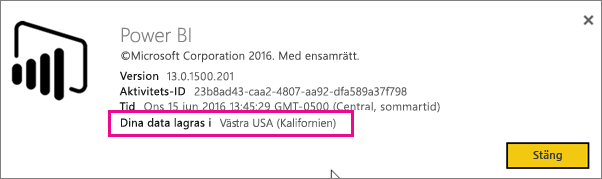
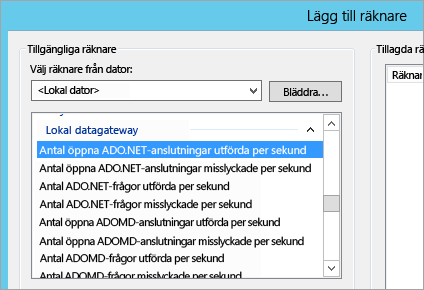
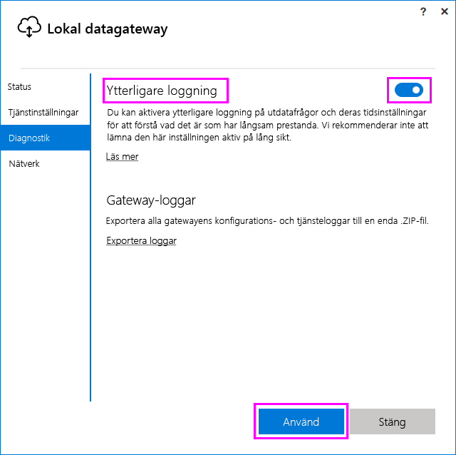
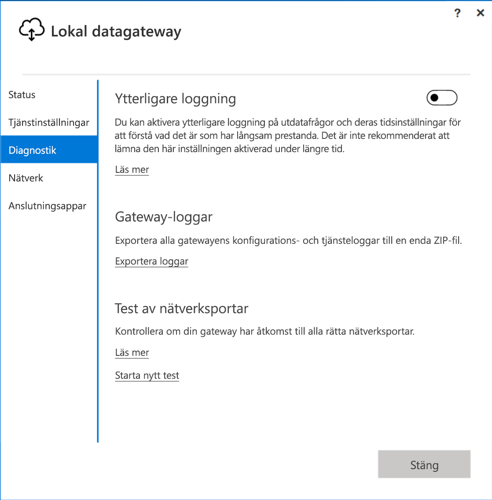
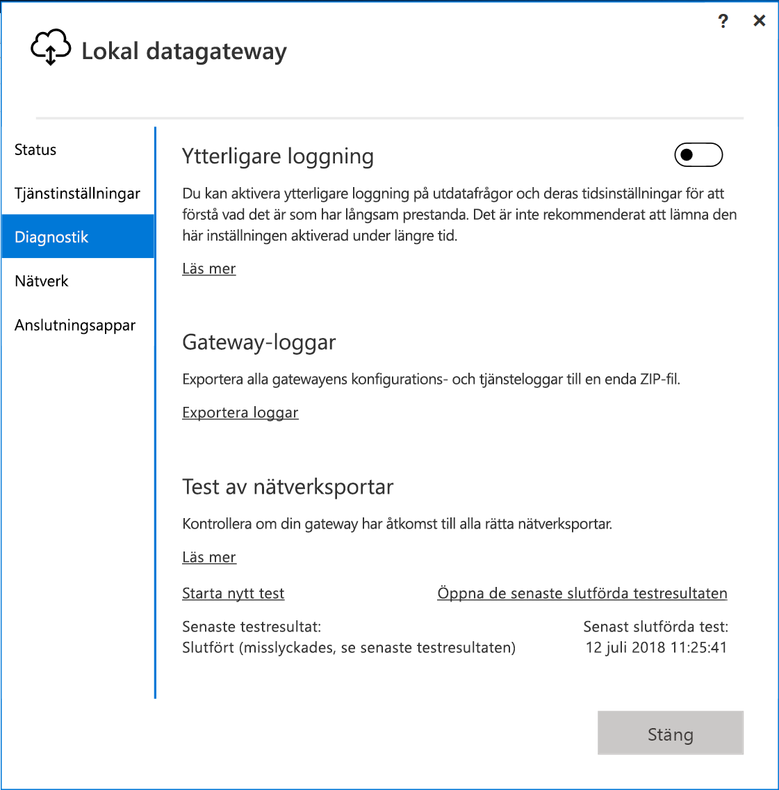

# <a name="troubleshooting-the-on-premises-data-gateway"></a>Felsökning av den lokala datagatewayen

Den här artikeln beskriver några vanliga problem som kan uppstå när du använder **den lokala datagatewayen**.

<!-- Shared Community & support links Include -->
[!INCLUDE [gateway-onprem-tshoot-support-links-include](./includes/gateway-onprem-tshoot-support-links-include.md)]

<!-- Shared Troubleshooting Install Include -->
[!INCLUDE [gateway-onprem-tshoot-install-include](./includes/gateway-onprem-tshoot-install-include.md)]

## <a name="configuration"></a>Konfiguration

### <a name="how-to-restart-the-gateway"></a>Starta om gatewayen

Eftersom gatewayen körs som en Windows-tjänst kan du starta och stoppa den på några olika sätt. Du kan till exempel öppna en kommandotolk med förhöjd behörighet på den dator där gatewayen körs och sedan köra något av följande kommandon:

* Stoppa tjänsten genom att köra det här kommandot:

    '''   net stop PBIEgwService   '''

* Starta tjänsten genom att köra det här kommandot:

    '''   net start PBIEgwService   '''

### <a name="log-file-configuration"></a>Konfiguration av loggfil

Gatewaytjänstloggar är indelade i tre buckets: information, fel och nätverk. Den här kategorisering ger en bättre felsökningsupplevelse som gör det möjligt att fokusera på ett visst område beroende på felet eller problemet. Du kan se de tre kategorierna i följande kodavsnitt från gatewaykonfigurationsfilen: `GatewayInfo.log,GatewayErrors.log,GatewayNetwork.log`.

```xml
  <system.diagnostics>
    <trace autoflush="true" indentsize="4">
      <listeners>
        <remove name="Default" />
        <add name="ApplicationFileTraceListener"
             type="Microsoft.PowerBI.DataMovement.Pipeline.Common.Diagnostics.RotatableFilesManagerTraceListener, Microsoft.PowerBI.DataMovement.Pipeline.Common"
             initializeData="%LOCALAPPDATA%\Microsoft\On-premises data gateway\,GatewayInfo.log,GatewayErrors.log,GatewayNetwork.log,20,50" />
      </listeners>
    </trace>
  </system.diagnostics>
```

Den här filen finns som standard i: *\Program Files\On-premises data gateway\Microsoft.PowerBI.EnterpriseGateway.exe.config*. Om du vill konfigurera antalet loggfiler som ska behållas ändrar du den första siffran (20 i det här exemplet): `GatewayInfo.log,GatewayErrors.log,GatewayNetwork.log,20,50`.

### <a name="error-failed-to-create-a-gateway-try-again"></a>Fel: Det gick inte att skapa en gateway. Försök igen

Alla detaljer är tillgängliga, men anropet till Power BI-tjänsten returnerade ett fel. Felet och ett aktivitets-ID visas. Detta kan inträffa av olika skäl. Du kan samla in och granska loggar, enligt beskrivningen nedan, för mer information.

Det kan också bero på problem med konfigurationen av en proxy. Användargränssnittet tillåter nu proxykonfiguration. Du kan lära dig mer om att [ändra konfigurationen av en proxy](service-gateway-proxy.md)

### <a name="error-failed-to-update-gateway-details-please-try-again"></a>Fel: Det gick inte att uppdatera gatewayinformationen. Försök igen

Information togs emot från Power BI-tjänsten till gatewayen. Informationen skickades till den lokala Windows-tjänsten men det kom inget svar. Eller så gick det inte att skapa en symmetrisk nyckel. Ursprungsundantaget visas under **Visa information**. Om du vill ha mer information kan du samla in och granska loggarna som anges nedan.

### <a name="error-power-bi-service-reported-local-gateway-as-unreachable-restart-the-gateway-and-try-again"></a>Fel: Power BI-tjänsten rapporterade att den lokala gatewayen inte gick att nå. Starta om gatewayen och försök igen

I slutet av konfigurationen anropas Power BI-tjänsten igen för att verifiera gatewayen. Power BI-tjänsten rapporterar inte gatewayen som *live*. Starta om Windows-tjänsten för att kommunikationen ska lyckas. Du kan samla in och granska loggar, enligt beskrivningen nedan, för mer information.

### <a name="script-error-during-sign-into-power-bi"></a>Skriptfel vid inloggning på Power BI

Du kan se ett skriptfel när du loggar in på Power BI som del av konfigurationen av den lokala datagatewayen. Du kan åtgärda problemet genom att installera följande säkerhetsuppdatering. Detta kan installeras via Windows Update.

[MS16-051: Säkerhetsuppdatering för Internet Explorer: 10 maj 2016 (KB 3154070)](https://support.microsoft.com/kb/3154070)

### <a name="gateway-configuration-failed-with-a-null-reference-exception"></a>Gateway-konfigurationen misslyckades med ett null-referensundantag

Du kan stöta på ett fel som liknar följande.

        Failed to update gateway details.  Please try again.
        Error updating gateway configuration.

Detta omfattar en stackspårning, som kan innehålla följande meddelande.

        Microsoft.PowerBI.DataMovement.Pipeline.Diagnostics.CouldNotUpdateGatewayConfigurationException: Error updating gateway configuration. ----> System.ArgumentNullException: Value cannot be null.
        Parameter name: serviceSection

Om du uppgraderar från en äldre gateway bevarar vi konfigurationsfilen. Det kan finnas ett avsnitt som saknas. När gatewayen försöker läsa det kan ovanstående null-referensundantag returneras.

Du kan åtgärda problemet genom att följa stegen nedan.

1. Avinstallera gatewayen.
2. Ta bort följande mapp.

        c:\Program Files\On-premises data gateway
3. Installera om gatewayen.
4. Du kan också använda återställningsnyckeln för att återställa en befintlig gateway.

## <a name="support-for-tls-12"></a>Stöd för TLS 1.2

Den lokala datagatewayen använder som standard TLS (Transport Layer Security) 1.2 för att kommunicera med Power BI-tjänsten. För att säkerställa att all gatewaytrafik använder TLS 1.2, kan du behöva lägga till eller ändra följande registernycklar på den dator som kör gatewaytjänsten:

```
[HKEY_LOCAL_MACHINE\SOFTWARE\Microsoft\.NETFramework\v4.0.30319]"SchUseStrongCrypto"=dword:00000001
[HKEY_LOCAL_MACHINE\SOFTWARE\Wow6432Node\Microsoft\.NETFramework\v4.0.30319]"SchUseStrongCrypto"=dword:00000001
```

> [!NOTE]
> När du lägger till eller ändrar registernycklarna tillämpas ändringen på alla .NET-program. Information om registerändringar som påverkar TLS för andra program finns i [Registerinställningar för Transport Layer Security (TLS)](https://docs.microsoft.com/windows-server/security/tls/tls-registry-settings).

## <a name="data-sources"></a>Datakällor

### <a name="error-unable-to-connect-details-invalid-connection-credentials"></a>Fel: Det går inte att ansluta. Details: Ogiltiga autentiseringsuppgifter för anslutning

I **Visa information** visas felmeddelandet som togs emot från datakällan. För SQL Server ser du något liknande följande.

    Login failed for user 'username'.

Kontrollera att du har rätt användarnamn och lösenord. Kontrollera också att dessa autentiseringsuppgifter kan ansluta till datakällan. Se till att kontot som används matchar **autentiseringsmetoden**.

### <a name="error-unable-to-connect-details-cannot-connect-to-the-database"></a>Fel: Det går inte att ansluta. Details: Det går inte att ansluta till databasen

Det gick att ansluta till servern men inte på den angivna databasen. Kontrollera namnet på databasen och att användarens autentiseringsuppgifter har rätt behörighet för att komma åt databasen.

I **Visa information** visas felmeddelandet som togs emot från datakällan. För SQL Server ser du något liknande följande.

    Cannot open database "AdventureWorks" requested by the login. The login failed. Login failed for user 'username'.

### <a name="error-unable-to-connect-details-unknown-error-in-data-gateway"></a>Fel: Det går inte att ansluta. Details: Okänt fel i datagateway

Det här felet kan inträffa av olika skäl. Glöm inte att verifiera att du kan ansluta till datakällan på datorn som är värd för gatewayen. Detta kan bero på att servern inte är tillgänglig.

I **Visa information** visas felkoden **DM_GWPipeline_UnknownError**.

Du kan också leta i Händelseloggarna > **Program- och tjänstloggar** > **Lokal datagateway-tjänst** för mer information.

### <a name="error-we-encountered-an-error-while-trying-to-connect-to-server-details-we-reached-the-data-gateway-but-the-gateway-cant-access-the-on-premises-data-source"></a>Fel: Ett fel påträffades vid försök att ansluta till <server>. Details: Vi nådde datagatewayen men gatewayen kommer inte åt den lokala datakällan.

Det gick inte att ansluta till den angivna datakällan. Glöm inte att validera informationen för datakällan.

I **Visa information** visas felkoden **DM_GWPipeline_Gateway_DataSourceAccessError**.

Om det underliggande felmeddelandet liknar det följande, innebär det att det konto som du använder för datakällan inte är en serveradministratör för den Analysis Services-instansen. [Läs mer](https://docs.microsoft.com/sql/analysis-services/instances/grant-server-admin-rights-to-an-analysis-services-instance)

    The 'CONTOSO\account' value of the 'EffectiveUserName' XML for Analysis property is not valid.

Om det underliggande felmeddelandet liknar det följande kan det betyda att tjänstkontot för Analysis Services kan saknas i katalogattributet för [token-groups-global-and-universal](https://msdn.microsoft.com/library/windows/desktop/ms680300.aspx) (TGGAU).

    The username or password is incorrect.

Domäner med åtkomst för äldre operativsystem än Windows 2000-kompatibilitet har attributet TGGAU aktiverat. I de flesta fall har nya domäner inte det här attributet som standard. Läs mer om det [här](https://support.microsoft.com/kb/331951).

Du kan kontrollera detta genom att göra följande.

1. Anslut till Analysis Services-datorn i SQL Server Management Studio. Lägg till EffectiveUserName i avancerade anslutningsegenskaper för användaren i fråga och se om felet återges.
2. Du kan använda dsacls-verktyget i Active Directory för att verifiera om attributet anges. Det här är ett verktyg som finns på en domänkontrollant. Du måste känna till det unika domännamnet för kontot och skicka det till verktyget.

        dsacls "CN=John Doe,CN=UserAccounts,DC=contoso,DC=com"

    Du vill se något som liknar följande i resultaten.

            Allow BUILTIN\Windows Authorization Access Group
                                          SPECIAL ACCESS for tokenGroupsGlobalAndUniversal
                                          READ PROPERTY

För att åtgärda problemet måste du aktivera TGGAU för kontot som används för Windows-tjänsten Analysis Services.

#### <a name="another-possibility-for-username-or-password-incorrect"></a>En annan möjlighet för felaktigt användarnamn eller lösenord

Det här felet kan också bero på att Analysis Services-servern finns i en annan domän än användarna och ett dubbelriktat förtroende kan inte upprättas.

Du måste arbeta tillsammans med dina administratörer för att verifiera förtroendet mellan domäner.

#### <a name="unable-to-see-the-data-gateway-data-sources-in-the-get-data-experience-for-analysis-services-from-the-power-bi-service"></a>Det går inte att visa datagatewayens datakällor i ”Hämta data” för Analysis Services från Power BI-tjänsten

Kontrollera att ditt konto är med på fliken **Användare** i datakällan i gateway-konfigurationen. Om du inte har åtkomst till gatewayen ber du gatewayadministratören att verifiera. Endast konton i listan **Användare** kan se datakällan som visas i Analysis Services-listan.

### <a name="error-you-dont-have-any-gateway-installed-or-configured-for-the-data-sources-in-this-dataset"></a>Fel: Du har inte någon gateway installerad eller konfigurerad för datakällor i den här datauppsättningen

Se till att du har lagt till en eller flera datakällor till gatewayen enligt beskrivningen i [Lägga till en datakälla](service-gateway-manage.md#add-a-data-source). Om gatewayen inte visas i administratörsportalen under **Hantera gatewayer** kan du försöka att rensa webbläsarens cache eller logga ut från tjänsten och sedan logga in igen.

## <a name="datasets"></a>Datauppsättningar

### <a name="error-there-is-not-enough-space-for-this-row"></a>Fel: Otillräckligt med utrymme för den här raden

Detta inträffar om du har en enskild rad som är större än 4 MB. Du måste avgöra vad raden är utifrån din datakälla och försöka filtrera bort den eller minska dess storlek.

### <a name="error-the-server-name-provided-doesnt-match-the-server-name-on-the-sql-server-ssl-certificate"></a>Fel: Servernamnet matchar inte servernamnet på SQL Server SSL-certifikatet

Detta kan inträffa när certifikat-CN är för serverns fullständigt kvalificerade domännamn (FQDN), men du endast har angett NetBIOS-namnet för servern. Detta leder till ett matchningsfel för certifikatet. För att lösa problemet måste du göra så att servernamnet i gatewaydatakällan, och PBIX-filen, använder serverns fullständigt kvalificerade domännamn.

### <a name="i-dont-see-the-on-premises-data-gateway-present-when-configuring-scheduled-refresh"></a>Den lokala datagatewayen visas inte när jag konfigurerar en schemalagd uppdatering

Detta kan bero på ett par olika scenarier.

1. Server- och databasnamnen matchar inte mellan Power BI Desktop och den konfigurerade datakällan för gatewayen. Dessa måste vara samma värden. De är inte skiftlägeskänsliga.
2. Ditt konto är inte med på fliken **Användare** i datakällan i gateway-konfigurationen. Du måste kontakta administratören för gatewayen för att läggas till i listan.
3. Power BI Desktop-filen innehåller flera datakällor och alla datakällorna har inte konfigurerats med gatewayen. Varje datakälla måste definieras med en gateway för att gatewayen ska visas i Schemalagd uppdatering.

### <a name="error-the-received-uncompressed-data-on-the-gateway-client-has-exceeded-the-limit"></a>Fel: Mottagna okomprimerade data på gatewayklienten har överskridit gränsen

Den exakta begränsningen är 10 GB okomprimerad data per tabell. Om du stöter på problemet finns det bra alternativ för att optimera och undvika problemet. Framför allt, minska mycket konstanta, långa strängvärden och ersätt dem med en normaliserad nyckel eller ta bort kolumnen (om den inte används).

## <a name="reports"></a>Rapporter

### <a name="report-could-not-access-the-data-source-because-you-do-not-have-access-to-our-data-source-via-an-on-premises-data-gateway"></a>Rapporten kunde inte nå datakällan eftersom du inte har åtkomst till vår datakälla via en lokal datagateway

Detta beror vanligtvis på något av följande.

1. Informationen om datakällan matchar inte den underliggande datauppsättningen. Server- och databasnamnen måste vara likadana i Power BI Desktop som i datakällan i den lokala datagatewayen. Om du använder en IP-adress i Power BI Desktop måste datakällan för den lokala datagatewayen också använda en IP-adress.
2. Det finns ingen tillgänglig datakälla på någon gateway i din organisation. Du kan konfigurera datakällan på en ny eller befintlig lokal datagateway.

### <a name="error-data-source-access-error-please-contact-the-gateway-administrator"></a>Fel: Åtkomstfel till datakälla. Kontakta gatewayadministratören

Om den här rapporten använder en Analysis Services-liveanslutning kan det hända att ett värde skickas till EffectiveUserName som antingen inte är giltigt eller som saknar behörighet på Analysis Services-datorn. Autentiseringsproblem beror vanligtvis på att värdet som skickades som EffectiveUserName inte matchar en lokal användares huvudnamn (UPN).

Du kan göra följande för att kontrollera detta.

1. Hitta det effektiva användarnamnet i [gateway-loggarna](#logs).
2. När du har det skickade värdet kan du bekräfta att det stämmer. Om det är din användare kan du använda följande kommando från en kommandotolk för att visa UPN-namnet. UPN-namnet ser ut som en e-postadress.

        whoami /upn

Du kan eventuellt se vad Power BI hämtar från Azure Active Directory.

1. Bläddra till [https://developer.microsoft.com/graph/graph-explorer](https://developer.microsoft.com/graph/graph-explorer).
2. Välj **Logga in** i det övre högra hörnet.
3. Kör följande fråga. Du ser ett ganska stort JSON-svar.

        https://graph.windows.net/me?api-version=1.5
4. Leta efter **UserPrincipalName**.

Om ditt Azure Active Directory-UPN inte stämmer med ditt lokala Active Directory-UPN, kan du använda funktionen [Kartlägg användarnamn](service-gateway-enterprise-manage-ssas.md#map-user-names) för att ersätta det med ett giltigt värde. Du kan också be din klientadministratör eller lokala Active Directory-administratör om hjälp med att ändra ditt UPN.

<!-- Shared Troubleshooting Firewall/Proxy Include -->
[!INCLUDE [gateway-onprem-tshoot-firewall-include](./includes/gateway-onprem-tshoot-firewall-include.md)]

Du kan hitta datacenterområdet genom att göra följande:

1. Välj **?** längst upp till höger i Power BI-tjänsten.
2. Välj **Om Power BI**.
3. Ditt dataområde visas i **Dina data lagras i**.

    

Om du fortfarande inte lyckas kan du försöka få en nätverksspårning med ett verktyg som [fiddler](#fiddler) eller netsh, även om de är avancerade samlingsmetoder och du kan behöva hjälp med att analysera insamlade data. Du kan kontakta [supporten](https://support.microsoft.com) om du behöver hjälp.

## <a name="performance"></a>Prestanda

<iframe width="560" height="315" src="https://www.youtube.com/embed/IJ_DJ30VNk4?showinfo=0" frameborder="0" allowfullscreen></iframe>

### <a name="performance-counters"></a>Prestandaräknare

Det finns ett antal prestandaräknare som kan användas för att mäta gatewayens aktiviteter. De kan vara användbara för att se om belastningsaktiviteten är hög och en ny gateway behövs. Dessa räknare visar inte hur lång tid det tar.

Du får åtkomst till dessa räknare med verktyget Windows Performance Monitor.



Det finns typiska grupperingar av dessa räknare.

| Räknartyp | Beskrivning |
| --- | --- |
| ADO.NET |Det här används för alla DirectQuery-anslutning. |
| ADOMD |Det här används för Analysis Services 2014 och tidigare. |
| OLEDB |Vissa datakällor använder detta. Det här inkluderar SAP HANA och Analysis Service 2016 eller senare. |
| Kombinationsprogram |Detta inkluderar alla importerade datakällor. Om du schemalägger en uppdatering eller vill uppdatera på plats går den genom kombinationsmotorn. |

Här följer en lista över tillgängliga prestandaräknare.

| Räknare | Beskrivning |
| --- | --- |
| Antal öppna ADO.NET-anslutningar utförda per sekund |Antalet utförda öppna ADO.NET-anslutningsåtgärder per sekund (lyckade eller misslyckade). |
| Antal öppna ADO.NET-anslutningar misslyckade per sekund |Antalet misslyckade öppna ADO.NET -anslutningsåtgärder per sekund. |
| Antal ADO.NET-frågor utförda per sekund |Antalet utförda ADO.NET-frågor per sekund (lyckade eller misslyckade). |
| Antal ADO.NET-frågor misslyckade per sekund |Antalet misslyckade ADO.NET-frågor per sekund. |
| Antal öppna ADOMD-anslutningar utförda per sekund |Antalet utförda öppna ADOMD-anslutningsåtgärder per sekund (lyckade eller misslyckade). |
| Antal öppna ADOMD-anslutningar misslyckade per sekund |Antalet misslyckade öppna ADOMD-anslutningsåtgärder per sekund. |
| Antal ADOMD-frågor utförda per sekund |Antalet utförda ADOMD-frågor per sekund (lyckade eller misslyckade). |
| Antal ADOMD-frågor misslyckade per sekund |Antalet misslyckade ADOMD-frågor per sekund. |
| Antal samtliga öppna anslutningar utförda per sekund |Antalet utförda öppna anslutningsåtgärder per sekund (lyckade eller misslyckade). |
| Antal samtliga öppna anslutningar misslyckade per sekund |Antalet misslyckade öppna anslutningsåtgärder per sekund. |
| Antal frågor utförda per sekund |Antalet frågor utförda per sekund (lyckade eller misslyckade). |
| Antal objekt i ADO.NET-anslutningspoolen |Antalet objekt i ADO.NET-anslutningspoolen. |
| Antal objekt i OLEDB-anslutningspoolen |Antalet objekt i OLEDB-anslutningspoolen. |
| Antal objekt i Service Bus-portalen |Antalet objekt i Service Bus-portalen. |
| Antal öppna kombinationsprogramanslutningar utförda per sekund |Antalet utförda öppna anslutningsåtgärder för kombinationsprogram per sekund (lyckade eller misslyckade). |
| Antal öppna kombinationsprogramanslutningar misslyckade per sekund |Antalet misslyckade öppna anslutningsåtgärder för kombinationsprogram per sekund. |
| Antal frågor för kombinationsprogram utförda per sekund |Antalet utförda frågor för kombinationsprogram per sekund (lyckade eller misslyckade). |
| Antal frågor för kombinationsprogram misslyckade per sekund |Antalet misslyckade frågor för kombinationsprogram per sekund |
| Antal OLEDB-frågor för flera resultatuppsättningar misslyckade per sekund |Antalet misslyckade OLEDB-frågor för flera resultatuppsättningar per sekund. |
| Antal utförda OLEDB-frågor för flera resultatmängder per sekund |Antalet utförda OLEDB-frågor för flera resultatuppsättningar per sekund (lyckade eller misslyckade). |
| Antal öppna OLEDB-anslutningar utförda per sekund |Antalet utförda öppna OLEDB-anslutningsåtgärder per sekund (lyckade eller misslyckade). |
| Antal öppna OLEDB-anslutningar misslyckade per sekund |Antalet misslyckade öppna OLEDB-anslutningsåtgärder per sekund. |
| Antal OLEDB-frågor utförda per sekund |Antalet utförda OLEDB-frågor för flera resultatuppsättningar per sekund (lyckade eller misslyckade). |
| Antal OLEDB-frågor misslyckade per sekund |Antalet misslyckade OLEDB-frågor för flera resultatuppsättningar per sekund. |
| Antal OLEDB-frågor för enkla resultatuppsättningar utförda per sekund |Antalet utförda OLEDB-frågor för enkla resultatuppsättningar per sekund (lyckade eller misslyckade). |
| Antal frågor misslyckade per sekund |Antalet misslyckade frågor per sekund. |
| Antal OLEDB-frågor för enkla resultatuppsättningar misslyckade per sekund |Antalet misslyckade OLEDB-frågor för enkla resultatuppsättningar per sekund. |

## <a name="reviewing-slow-performing-queries"></a>Granska långsamma frågor

Du kanske märker att svaren genom gatewayen är långsamma. Detta kan gälla DirectQuery-frågor eller när du uppdaterar din importerade datauppsättning. Du kan aktivera ytterligare loggning på utdatafrågor och deras tidsinställningar för att förstå vad det är som har långsam prestanda. När du hittar en tidskrävande fråga kan det krävas ytterligare ändringar i datakällan för att optimera frågeprestanda. Det kan handla om att justera index för en SQL-serverfråga.

Du behöver ändra två konfigurationsfiler för att fastställa varaktigheten för en fråga.

### <a name="microsoftpowerbidatamovementpipelinegatewaycoredllconfig"></a>Microsoft.PowerBI.DataMovement.Pipeline.GatewayCore.dll.config

I filen *Microsoft.PowerBI.DataMovement.Pipeline.GatewayCore.dll.config*, ändra `EmitQueryTraces`-värdet från `False` till `True`. Den här filen finns som standard på *C:\Program\Lokal datagateway*. När du aktiverar `EmitQueryTraces` kommer frågor som skickas från gatewayen till en datakälla att loggas.

> [!IMPORTANT]
> Att aktivera EmitQueryTraces kan öka loggstorleken avsevärt beroende på gatewayens användning. När du har granskat loggarna kan du behöva ändra EmitQueryTraces till False. Det är inte rekommenderat att lämna den här inställningen aktiverad under längre tid.

```
<setting name="EmitQueryTraces" serializeAs="String">
    <value>True</value>
</setting>
```

**Exempel på fråga**

```
DM.EnterpriseGateway Information: 0 : 2016-09-15T16:09:27.2664967Z DM.EnterpriseGateway    4af2c279-1f91-4c33-ae5e-b3c863946c41    d1c77e9e-3858-4b21-3e62-1b6eaf28b176    MGEQ    c32f15e3-699c-4360-9e61-2cc03e8c8f4c    FF59BC20 [DM.GatewayCore] Executing query (timeout=224) "<pi>
SELECT
TOP (1000001) [t0].[ProductCategoryName],[t0].[FiscalYear],SUM([t0].[Amount])
 AS [a0]
FROM
(
(select [$Table].[ProductCategoryName] as [ProductCategoryName],
    [$Table].[ProductSubcategory] as [ProductSubcategory],
    [$Table].[Product] as [Product],
    [$Table].[CustomerKey] as [CustomerKey],
    [$Table].[Region] as [Region],
    [$Table].[Age] as [Age],
    [$Table].[IncomeGroup] as [IncomeGroup],
    [$Table].[CalendarYear] as [CalendarYear],
    [$Table].[FiscalYear] as [FiscalYear],
    [$Table].[Month] as [Month],
    [$Table].[OrderNumber] as [OrderNumber],
    [$Table].[LineNumber] as [LineNumber],
    [$Table].[Quantity] as [Quantity],
    [$Table].[Amount] as [Amount]
from [dbo].[V_CustomerOrders] as [$Table])
)
 AS [t0]
GROUP BY [t0].[ProductCategoryName],[t0].[FiscalYear] </pi>"
```

### <a name="microsoftpowerbidatamovementpipelinediagnosticsdllconfig"></a>Microsoft.PowerBI.DataMovement.Pipeline.Diagnostics.dll.config

I filen *Microsoft.PowerBI.DataMovement.Pipeline.Diagnostics.dll.config*, ändra `TracingVerbosity`-värdet från `4` till `5`. Den här filen finns som standard på *C:\Program\Lokal datagateway*. När du ändrar den här inställningen kommer utförliga poster att loggas i gatewayloggen. Detta inkluderar poster som visar varaktighet. Du kan också aktivera utförliga poster genom att aktivera knappen ”Ytterligare loggning” i programmet för lokal gateway.

   

> [!IMPORTANT]
> Genom att aktivera TracingVerbosity till `5` ökar loggstorleken avsevärt beroende på gatewayens användning. När du har granskat loggarna måste du ställa in TraceVerbosity på `4`. Det är inte rekommenderat att lämna den här inställningen aktiverad under längre tid.

```
<setting name="TracingVerbosity" serializeAs="String">
    <value>5</value>
</setting>
```

<a name="activities"></a>

### <a name="activity-types"></a>Aktivitetstyper

| Aktivitetstyp | Beskrivning |
| --- | --- |
| MGEQ |Frågor utförda över ADO.NET. Detta inkluderar DirectQuery-datakällor. |
| MGEO |Utförda frågor över OLEDB. Det här inkluderar SAP HANA och Analysis Services 2016. |
| MGEM |Frågor som har körts från Mashup-motorn. Det här används med importerade datauppsättningar som använder schemalagd uppdatering eller uppdatera på begäran. |

### <a name="determine-the-duration-of-a-query"></a>Bestämma varaktigheten för en fråga
Du kan göra följande för att fastställa den tid det tog för att fråga datakällan.

1. Öppna gatewayloggen.
2. Söka efter en [Aktivitetstyp](#activities) att hitta frågan. Ett exempel på detta är MGEQ.
3. Anteckna det andra GUID:et eftersom detta är ID:t för begäran.
4. Fortsätta att söka efter MGEQ tills du hittar FireActivityCompletedSuccessfullyEvent posten med varaktigheten. Du kan kontrollera att posten har samma id för begäran. Varaktigheten anges i millisekunder.

        DM.EnterpriseGateway Verbose: 0 : 2016-09-26T23:08:56.7940067Z DM.EnterpriseGateway    baf40f21-2eb4-4af1-9c59-0950ef11ec4a    5f99f566-106d-c8ac-c864-c0808c41a606    MGEQ    21f96cc4-7496-bfdd-748c-b4915cb4b70c    B8DFCF12 [DM.Pipeline.Common.TracingTelemetryService] Event: FireActivityCompletedSuccessfullyEvent (duration=5004)

   > [!NOTE]
   > FireActivityCompletedSuccessfullyEvent är en utförlig post. Den här posten loggas inte om inte TraceVerbosity är på nivå 5.

## <a name="firewall-or-proxy"></a>Brandvägg eller proxy

Mer information om att tillhandahålla proxyinformation för din gateway finns i [Konfigurera proxyinställningar för Power BI-gatewayer](service-gateway-proxy.md).

Du kan kontrollera om din brandvägg eller proxy blockerar anslutningar genom att köra [Test-NetConnection](https://docs.microsoft.com/powershell/module/nettcpip/test-netconnection) från en PowerShell-kommandotolk. När du gör det testas anslutningen till Azure Service Bus. Endast nätverksanslutningen testas, och det har ingenting att göra med molnservertjänsten eller gatewayen. Det hjälper dig att avgöra om din dator verkligen kan få åtkomst till Internet.

    Test-NetConnection -ComputerName watchdog.servicebus.windows.net -Port 9350

> [!NOTE]
> Test-NetConnection är bara tillgängligt i Windows Server 2012 R2 och senare. Det finns också i Windows 8.1 och senare. Du kan använda Telnet för tidigare OS-versioner om du vill testa portanslutningen.

Resultatet liknar följande. Skillnaden är TcpTestSucceeded. Om **TcpTestSucceeded** inte är *sant* kan det finnas en brandvägg som blockerar dig.

    ComputerName           : watchdog.servicebus.windows.net
    RemoteAddress          : 70.37.104.240
    RemotePort             : 5672
    InterfaceAlias         : vEthernet (Broadcom NetXtreme Gigabit Ethernet - Virtual Switch)
    SourceAddress          : 10.120.60.105
    PingSucceeded          : False
    PingReplyDetails (RTT) : 0 ms
    TcpTestSucceeded       : True

Om du vill vara grundlig ersätter du värdena **ComputerName** och **Port** med de som anges för [portarna](https://docs.microsoft.com/power-bi/service-gateway-onprem#ports)

Brandväggen kan även blockera anslutningarna som Azure Service Bus upprättar till Azure-datacentra. I så fall kan du godkänna (avblockera) IP-adresserna för din region för dessa datacenter. Du kan hämta en lista med Azures IP-adresser [här](https://www.microsoft.com/download/details.aspx?id=41653).

### <a name="network-ports-test"></a>Test av nätverksportar

Test av nätverksportar är ett verktyg som kontrollerar om din gateway kan komma åt rätt portar för alla fjärrservrar som krävs för att gatewayen ska kunna överföra data. Om verktyget Test av nätverksportar inte kan ansluta till portarna, kan gatewayen få nätverksproblem. Om du för närvarande har nätverksproblem med din gateway kan du köra Test av nätverksportar för att säkerställa att din nätverksmiljö är optimal.  

#### <a name="start-a-new-test"></a>Starta ett nytt test

Du kan köra ett nytt test av nätverksportar från användargränssnittet för den lokal datagatewayen.



När du kör Test av nätverksportar hämtar din gateway en lista över portar och servrar från Azure Service Bus och försöker sedan ansluta till alla servrar och portar. Test av nätverksportar har slutförts när länken Starta nytt test visas igen.  

#### <a name="test-results"></a>Testresultat

En sammanfattning av testet visas som Senaste testresultat under länken Starta nytt test. Två typer av resultat visas: Slutfört (lyckades) och Slutfört (misslyckades, se senaste testresultat). Om testet lyckades innebär det att din gateway kunde ansluta till alla nödvändiga portar. Om testet misslyckades innebär det att din nätverksmiljö kanske blockera dessa nödvändiga portar och servrar. 



Om du vill visa resultatet av det senaste slutförda testet väljer du länken Öppna senast slutförda testresultat, som du ser nedan. Testresultatet öppnas i standardtextredigeraren i Windows.  

Testresultatet visar alla servrar, portar och IP-adresser som krävs av din gateway. Om Stängd visas i resultatet för någon port, som du ser nedan, kontrollerar du att din nätverksmiljö inte blockerar anslutningen. Du kan behöva kontakta din nätverksadministratör för att öppna de portar som krävs.


## <a name="kerberos"></a>Kerberos

Om den underliggande databasservern och lokala datagatewayen inte har konfigurerats korrekt för [Kerberos-begränsad delegering](service-gateway-sso-kerberos.md) aktiverar du [utförlig loggning](#microsoftpowerbidatamovementpipelinediagnosticsdllconfig) på gatewayen och börjar felsökningen genom att undersöka problemet baserat på fel/spår i gatewayens loggfiler.

### <a name="impersonationlevel"></a>ImpersonationLevel

ImpersonationLevel relaterar till SPN-installationsprogrammet eller den lokala principinställningen.

```
[DataMovement.PipeLine.GatewayDataAccess] About to impersonate user DOMAIN\User (IsAuthenticated: True, ImpersonationLevel: Identification)
```

**Lösning**

Följ dessa steg för att lösa problemet:
1. Konfigurera ett SPN för lokal gateway
2. Konfigurera begränsad delegering i din Active Directory (AD)

### <a name="failedtoimpersonateuserexception-failed-to-create-windows-identity-for-user-userid"></a>FailedToImpersonateUserException: Det gick inte att skapa en Windows-identitet för användarens Användar-ID

FailedToImpersonateUserException returneras om du inte kan personifiera för en annan användares räkning. Detta kan också inträffa om det konto som du försöker att personifiera är från en annan domän än den som gatewaytjänstdomänen är på (detta är en begränsning).

**Lösning**

* Kontrollera att konfigurationen är korrekt enligt anvisningarna i avsnittet ImpersonationLevel ovan
* Se till att det användar-ID som den försöker att personifiera ett giltigt AD-kontot

### <a name="general-error-1033-error-while-parsing-the-protocol"></a>Allmänt fel. 1033-fel vid parsning av protokollet

Felet 1033 returneras om ditt externa ID som har konfigurerats i SAP HANA inte matchar inloggningen om användaren personifieras med UPN (alias@domain.com). I loggarna kommer du att se ”Ursprungligt UPN alias@domain.com ersatt med nytt UPN alias@domain.com överst i felloggarna som visas nedan”.

```
[DM.GatewayCore] SingleSignOn Required. Original UPN 'alias@domain.com' replaced with new UPN 'alias@domain.com.'
```

**Lösning**

* SAP HANA kräver att den personifierade användaren använder attributet sAMAccountName i AD (användaralias). Annars returneras 1033-felet.

    

* I loggarna visas sAMAccountName (alias) och inte UPN, vilket är aliaset följt av domänen (alias@doimain.com)

    

```
      <setting name="ADUserNameReplacementProperty" serializeAs="String">
        <value>sAMAccount</value>
      </setting>
      <setting name="ADServerPath" serializeAs="String">
        <value />
      </setting>
      <setting name="CustomASDataSource" serializeAs="String">
        <value />
      </setting>
      <setting name="ADUserNameLookupProperty" serializeAs="String">
        <value>AADEmail</value>
```

### <a name="sap-aglibodbchdb-dllhdbodbc-communication-link-failure-10709-connection-failed-rte-1-kerberos-error-major-miscellaneous-failure-851968-minor-no-credentials-are-available-in-the-security-package"></a>[SAP AG][LIBODBCHDB DLL][HDBODBC] Kommunikationslänkfel 10709 Anslutningen misslyckades (RTE: [-1] Kerberos-fel. Större: Övrigt fel [851968], mindre: Inga autentiseringsuppgifter är tillgängliga i säkerhetspaketet

Du får felmeddelandet 10709 Anslutningen misslyckades om delegeringen inte har konfigurerats korrekt i AD.

**Lösning**

* Se till att du har SAP Hana-servern i delegeringsfliken i AD för gatewaytjänstkontot

   

<!-- Shared Troubleshooting tools Include -->
[!INCLUDE [gateway-onprem-tshoot-tools-include](./includes/gateway-onprem-tshoot-tools-include.md)]

### <a name="refresh-history"></a>Uppdateringshistorik

När du använder gatewayen för schemalagd uppdatering kan du se vilka fel som har inträffat och få användbara data med **Uppdateringshistorik** om du behöver skapa en supportbegäran. Du kan visa både schemalagda uppdateringar och sådana som görs på begäran. Så här går du till **Uppdateringshistorik**.

1. I Power BI-navigeringsfönstret i **Datauppsättningar** väljer du en datauppsättning &gt;Öppna meny&gt; **Schemalägg uppdatering**.

    
2. I **Inställningar för...** &gt;**Schemalägg uppdatering**, väljer du **Uppdateringshistorik**.

    

    

Mer information om felsökning av uppdateringsscenarier finns i artikeln [Felsöka uppdateringsscenarier](refresh-troubleshooting-refresh-scenarios.md).

## <a name="next-steps"></a>Nästa steg
[Konfigurera proxyinställningar för Power BI-gatewayerna](service-gateway-proxy.md)  
[Lokal datagateway](service-gateway-onprem.md)  
[Lokal datagateway – på djupet](service-gateway-onprem-indepth.md)  
[Hantera din datakälla – Analysis Services](service-gateway-enterprise-manage-ssas.md)  
[Hantera din datakälla – SAP HANA](service-gateway-enterprise-manage-sap.md)  
[Hantera din datakälla – SQL Server](service-gateway-enterprise-manage-sql.md)  
[Hantera din datakälla – Import/schemalagd uppdatering](service-gateway-enterprise-manage-scheduled-refresh.md)  
Har du fler frågor? [Prova Power BI Community](http://community.powerbi.com/)
