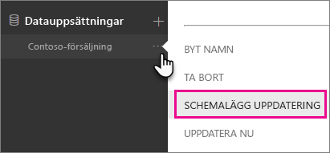
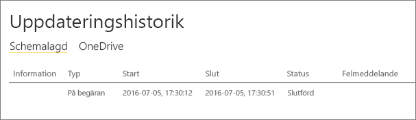

# <a name="troubleshoot-gateways---power-bi"></a>Felsöka gatewayer – Power BI

[!INCLUDE [gateway-rewrite](includes/gateway-rewrite.md)]

Den här artikeln beskriver några vanliga problem som kan uppstå när du använder den lokala datagatewayen med Power BI. Om du stöter på ett problem som inte finns med i listan kan du ta hjälp av [Power BI Community](https://community.powerbi.com)-webbplatsen. Eller så kan du skapa ett [supportärende](https://powerbi.microsoft.com/support).

## <a name="configuration"></a>Konfiguration

### <a name="error-power-bi-service-reported-local-gateway-as-unreachable-restart-the-gateway-and-try-again"></a>Fel: Power BI-tjänsten rapporterade att den lokala gatewayen inte gick att nå. Starta om gatewayen och försök igen.

I slutet av konfigurationen anropas Power BI-tjänsten igen för att verifiera gatewayen. Power BI-tjänsten rapporterar inte gatewayen som live. Starta om Windows-tjänsten för att kommunikationen ska lyckas. Om du behöver mer information kan du samla in och granska loggarna enligt beskrivningen i [Samla in loggar från appen för lokal datagateway](/data-integration/gateway/service-gateway-tshoot#collect-logs-from-the-on-premises-data-gateway-app).

## <a name="data-sources"></a>Datakällor

### <a name="error-unable-to-connect-details-invalid-connection-credentials"></a>Fel: Det går inte att ansluta. Detaljer: Ogiltiga autentiseringsuppgifter för anslutning

I **Visa information** visas felmeddelandet som togs emot från datakällan. För SQL Server ser du något liknande följande:

    Login failed for user 'username'.

Kontrollera att du har rätt användarnamn och lösenord. Kontrollera också att dessa autentiseringsuppgifter kan ansluta till datakällan. Se till att kontot som används matchar autentiseringsmetoden.

### <a name="error-unable-to-connect-details-cannot-connect-to-the-database"></a>Fel: Det går inte att ansluta. Detaljer: Det går inte att ansluta till databasen

Det gick att ansluta till servern men inte till den angivna databasen. Kontrollera namnet på databasen och att användarens autentiseringsuppgifter har rätt behörighet för att komma åt databasen.

I **Visa information** visas felmeddelandet som togs emot från datakällan. För SQL Server ser du något liknande följande:

    Cannot open database "AdventureWorks" requested by the login. The login failed. Login failed for user 'username'.

### <a name="error-unable-to-connect-details-unknown-error-in-data-gateway"></a>Fel: Det går inte att ansluta. Detaljer: Okänt fel i datagateway

Det här felet kan inträffa av olika skäl. Glöm inte att verifiera att du kan ansluta till datakällan på datorn som är värd för gatewayen. Den här situationen kan uppstå på grund av att servern inte är tillgänglig.

I **Visa information** visas felkoden **DM_GWPipeline_UnknownError**.

Du kan också leta i **Händelseloggarna** > **Program- och tjänstloggar** > **Lokal datagateway-tjänst** för mer information.

### <a name="error-we-encountered-an-error-while-trying-to-connect-to-server-details-we-reached-the-data-gateway-but-the-gateway-cant-access-the-on-premises-data-source"></a>Fel: Ett fel påträffades vid försök att ansluta till \<server\>. Detaljer: Vi nådde datagatewayen men gatewayen kommer inte åt den lokala datakällan.

Det gick inte att ansluta till den angivna datakällan. Glöm inte att validera informationen för datakällan.

I **Visa information** visas felkoden **DM_GWPipeline_Gateway_DataSourceAccessError**.

Om det underliggande felmeddelandet liknar det följande, innebär det att det konto som du använder för datakällan inte är en serveradministratör för den Analysis Services-instansen. Mer information finns i [Grant server admin rights to an Analysis Services instance](https://docs.microsoft.com/sql/analysis-services/instances/grant-server-admin-rights-to-an-analysis-services-instance).

    The 'CONTOSO\account' value of the 'EffectiveUserName' XML for Analysis property is not valid.

Om det underliggande felmeddelandet liknar det följande kan det betyda att tjänstkontot för Analysis Services kan saknas i katalogattributet för [token-groups-global-and-universal](https://msdn.microsoft.com/library/windows/desktop/ms680300.aspx) (TGGAU).

    The username or password is incorrect.

Domäner med åtkomst för äldre operativsystem än Windows 2000 har attributet TGGAU aktiverat. De flesta nya domäner har inte det här attributet aktiverat som standard. Mer information finns i [Vissa program och API: er kräver åtkomst till autentiseringsinformation för kontoobjekt](https://support.microsoft.com/kb/331951).

Följ dessa steg för att kontrollera om attributet är aktiverat.

1. Anslut till Analysis Services-datorn i SQL Server Management Studio. Lägg till EffectiveUserName i avancerade anslutningsegenskaper för användaren i fråga och se om felet återskapas med det här tillägget.
2. Du kan använda dsacls-verktyget i Active Directory för att verifiera om attributet anges. Det här verktyget finns på en domänkontrollant. Du måste känna till det unika domännamnet för kontot och skicka det namnet till verktyget.

        dsacls "CN=John Doe,CN=UserAccounts,DC=contoso,DC=com"

    Du vill se något som liknar följande i resultaten:

            Allow BUILTIN\Windows Authorization Access Group
                                          SPECIAL ACCESS for tokenGroupsGlobalAndUniversal
                                          READ PROPERTY

För att åtgärda problemet måste du aktivera TGGAU för kontot som används för Windows-tjänsten Analysis Services.

#### <a name="another-possibility-for-the-username-or-password-is-incorrect"></a>Eller ”Användarnamnet eller lösenordet är felaktigt”.

Det här felet kan också uppstå om Analysis Services-servern finns i en annan domän än användarna och det inte har upprättats ett dubbelriktat förtroende.

Arbeta tillsammans med domänadministratörerna för att verifiera förtroendet mellan domäner.

#### <a name="unable-to-see-the-data-gateway-data-sources-in-the-get-data-experience-for-analysis-services-from-the-power-bi-service"></a>Det går inte att visa datagatewayens datakällor i Hämta data-gränssnittet för Analysis Services från Power BI-tjänsten

Kontrollera att ditt konto är med på fliken **Användare** i datakällan i gateway-konfigurationen. Om du inte har åtkomst till gatewayen ska du be gatewayadministratören att verifiera. Endast konton i listan **Användare** kan se datakällan som visas i Analysis Services-listan.

### <a name="error-you-dont-have-any-gateway-installed-or-configured-for-the-data-sources-in-this-dataset"></a>Fel: Du har inte någon gateway installerad eller konfigurerad för datakällor i den här datauppsättningen.

Se till att du har lagt till en eller flera datakällor till gatewayen enligt beskrivningen i [Lägga till en datakälla](service-gateway-data-sources.md#add-a-data-source). Om gatewayen inte visas i administratörsportalen under **Hantera gatewayer** kan du försöka att rensa webbläsarens cache eller logga ut från tjänsten och sedan logga in igen.

## <a name="datasets"></a>Datauppsättningar

### <a name="error-there-is-not-enough-space-for-this-row"></a>Fel: Otillräckligt med utrymme för den här raden.

Det här felet inträffar om du har en enskild rad som är större än 4 MB. Ta reda på vad raden är utifrån din datakälla och försök filtrera bort den eller minska dess storlek.

### <a name="error-the-server-name-provided-doesnt-match-the-server-name-on-the-sql-server-ssl-certificate"></a>Fel: Servernamnet matchar inte servernamnet på SQL Server SSL-certifikatet.

Det här felet kan inträffa när det egna namnet på certifikatet är för serverns fullständigt kvalificerade domännamn (FQDN), men du endast har angett NetBIOS-namnet för servern. Detta leder till ett matchningsfel för certifikatet. Du löser problemet genom att se till att servernamnet i gatewaydatakällan och PBIX-filen använder serverns fullständigt kvalificerade domännamn.

### <a name="error-you-dont-see-the-on-premises-data-gateway-present-when-you-configure-scheduled-refresh"></a>Fel: Den lokala datagatewayen visas inte när du konfigurerar en schemalagd uppdatering.

Det här felet kan bero på några olika saker:

- Server- och databasnamnen matchar inte det som angavs i Power BI Desktop och den konfigurerade datakällan för gatewayen. Dessa namn måste vara desamma. De är inte skiftlägeskänsliga.
- Ditt konto är inte med på fliken **Användare** i datakällan i gateway-konfigurationen. Administratören för gatewayen måste lägga till dig i listan.
- Power BI Desktop-filen innehåller flera datakällor och alla datakällorna har inte konfigurerats med gatewayen. Varje datakälla måste definieras med en gateway för att gatewayen ska visas i en schemalagd uppdatering.

### <a name="error-the-received-uncompressed-data-on-the-gateway-client-has-exceeded-the-limit"></a>Fel: Mottagna okomprimerade data på gatewayklienten har överskridit gränsen.

Den exakta begränsningen är 10 GB okomprimerad data per tabell. Om du stöter på det här problemet finns det bra alternativ för att optimera och undvika det. Minska användningen av långa strängkonstanter och använd i stället en normaliserad nyckel. Eller ta bort kolumnen om den inte används.

## <a name="reports"></a>Rapporter

### <a name="error-report-could-not-access-the-data-source-because-you-do-not-have-access-to-our-data-source-via-an-on-premises-data-gateway"></a>Fel: Rapporten kunde inte nå datakällan eftersom du inte har åtkomst till vår datakälla via en lokal datagateway.

Det här felet beror vanligtvis på något av följande:

- Informationen om datakällan matchar inte den underliggande datamängden. Server- och databasnamnen måste vara likadana i Power BI Desktop som i datakällan i den lokala datagatewayen. Om du använder en IP-adress i Power BI Desktop måste datakällan för den lokala datagatewayen också använda en IP-adress.
- Det finns ingen tillgänglig datakälla på någon gateway i din organisation. Du kan konfigurera datakällan på en ny eller befintlig lokal datagateway.

### <a name="error-data-source-access-error-please-contact-the-gateway-administrator"></a>Fel: Åtkomstfel till datakälla. Kontakta gatewayadministratören.

Om den här rapporten använder en Analysis Services-realtidsanslutning kan det hända att ett värde skickas till EffectiveUserName som antingen inte är giltigt eller som saknar behörighet på Analysis Services-datorn. Autentiseringsproblem beror vanligtvis på att värdet som skickades som EffectiveUserName inte matchar en lokal användares huvudnamn (UPN).

Följ de här stegen för att bekräfta det gällande användarnamnet.

1. Hitta det effektiva användarnamnet i [gateway-loggarna](/data-integration/gateway/service-gateway-tshoot#collect-logs-from-the-on-premises-data-gateway-app).
2. När du har det skickade värdet kan du bekräfta att det stämmer. Om det är din användare kan du använda följande kommando från en kommandotolk för att visa UPN-namnet. UPN-namnet ser ut som en e-postadress.

        whoami /upn

Du kan eventuellt se vad Power BI hämtar från Azure Active Directory.

1. Bläddra till [https://developer.microsoft.com/graph/graph-explorer](https://developer.microsoft.com/graph/graph-explorer).
2. Välj **Logga in** i det övre högra hörnet.
3. Kör följande fråga. Du ser ett ganska stort JSON-svar.

        https://graph.windows.net/me?api-version=1.5
4. Leta efter **UserPrincipalName**.

Om ditt Azure Active Directory-UPN inte stämmer med ditt lokala Active Directory-UPN, kan du använda funktionen [Kartlägg användarnamn](service-gateway-enterprise-manage-ssas.md#map-user-names-for-analysis-services-data-sources) för att ersätta det med ett giltigt värde. Du kan också be din klientadministratör eller lokala Active Directory-administratör om hjälp med att ändra ditt UPN.

## <a name="kerberos"></a>Kerberos

Om den underliggande databasservern och lokala datagatewayen inte är korrekt konfigurerade för [Kerberos-begränsad delegering](service-gateway-sso-kerberos.md) aktiverar du [utförlig loggning](/data-integration/gateway/service-gateway-performance#slow-performing-queries) på gatewayen. Börja sedan felsöka med felen eller spårningarna i gatewayens loggfiler som utgångspunkt. Information om hur du samlar in gatewayloggarna för visning finns i [Samla in loggar från appen för lokal datagateway](/data-integration/gateway/service-gateway-tshoot#collect-logs-from-the-on-premises-data-gateway-app).

### <a name="impersonationlevel"></a>ImpersonationLevel

ImpersonationLevel relaterar till SPN-installationsprogrammet eller den lokala principinställningen.

```
[DataMovement.PipeLine.GatewayDataAccess] About to impersonate user DOMAIN\User (IsAuthenticated: True, ImpersonationLevel: Identification)
```

**Lösning**

Följ dessa steg för att lösa problemet.

1. Konfigurera ett SPN för den lokala gatewayen.
2. Konfigurera begränsad delegering i din Active Directory.

### <a name="failedtoimpersonateuserexception-failed-to-create-windows-identity-for-user-userid"></a>FailedToImpersonateUserException: Det gick inte att skapa en Windows-identitet för användarens användar-ID

FailedToImpersonateUserException inträffar om du inte kan personifiera för en annan användares räkning. Det här felet kan även inträffa om det konto som du försöker personifiera kommer från en annan domän än den som gatewaytjänstdomänen är på. Detta är en begränsning.

**Lösning**

* Kontrollera att konfigurationen är korrekt enligt anvisningarna i föregående avsnittet ImpersonationLevel.
* Se till att det användar-ID som den försöker att personifiera är ett giltigt Active Directory-konto.

### <a name="general-error-1033-error-while-you-parse-the-protocol"></a>Allmänt fel: 1033-fel vid parsning av protokollet

Felet 1033 returneras om ditt externa ID som har konfigurerats i SAP HANA inte matchar inloggningen om användaren personifieras med hjälp av UPN (alias@domain.com). I loggarna kommer du att se ”Ursprungligt UPN alias@domain.com ersatt med nytt UPN alias@domain.com” överst i felloggarna, som du kan se här:

```
[DM.GatewayCore] SingleSignOn Required. Original UPN 'alias@domain.com' replaced with new UPN 'alias@domain.com.'
```

**Lösning**

* SAP HANA kräver att den personifierade användaren använder attributet sAMAccountName i Active Directory (användaralias). Om attributet inte är korrekt visas 1033-felet.

    

* I loggarna visas sAMAccountName (alias) och inte UPN, vilket är aliaset följt av domänen (alias@doimain.com).

    

```xml
      <setting name="ADUserNameReplacementProperty" serializeAs="String">
        <value>sAMAccount</value>
      </setting>
      <setting name="ADServerPath" serializeAs="String">
        <value />
      </setting>
      <setting name="CustomASDataSource" serializeAs="String">
        <value />
      </setting>
      <setting name="ADUserNameLookupProperty" serializeAs="String">
        <value>AADEmail</value>
```

### <a name="sap-aglibodbchdb-dllhdbodbc-communication-link-failure-10709-connection-failed-rte-1-kerberos-error-major-miscellaneous-failure-851968-minor-no-credentials-are-available-in-the-security-package"></a>[SAP AG][LIBODBCHDB DLL][HDBODBC] Kommunikationslänkfel:-10709 Anslutningen misslyckades (RTE: [-1] Kerberos-fel. Större: ”Övrigt fel [851968].” Mindre: ”Inga autentiseringsuppgifter är tillgängliga i säkerhetspaketet”.

Du får felmeddelandet ”-10709 Anslutningen misslyckades” om delegeringen inte har konfigurerats korrekt i Active Directory.

**Lösning**

* Se till att du har SAP Hana-servern på delegeringsfliken i Active Directory för gatewaytjänstkontot.

   

## <a name="refresh-history"></a>Uppdateringshistorik

När du använder en gateway för en schemalagd uppdatering, kan **uppdateringshistoriken** hjälpa dig att se vilka fel som har inträffat. Det kan också ge användbara data om du behöver skapa en supportbegäran. Du kan visa schemalagda uppdateringar och sådana som görs på begäran. Följande steg visar hur du går till uppdateringshistoriken.

1. Välj en datauppsättning i **Datauppsättningar** i Power BI-navigeringsfönstret. Öppna menyn och välj **Schemalägg uppdatering**.

    

2. I **Inställningar för...** &gt; **Schemalägg uppdatering**, väljer du **Uppdateringshistorik**.

    

    

Mer information om felsökning av olika uppdateringsscenarier finns i [Felsöka uppdateringsscenarier](refresh-troubleshooting-refresh-scenarios.md).

## <a name="fiddler-trace"></a>Fiddlerspårning

[Fiddler](https://www.telerik.com/fiddler) är ett kostnadsfritt verktyg från Telerik som övervakar HTTP-trafik. Du kan se trafiken från och till med Power BI-tjänsten från klientdatorn. Den här trafiklistan visar fel och annan relaterad information.


## <a name="next-steps"></a>Nästa steg

* [Felsöka den lokala datagatewayen](/data-integration/gateway/service-gateway-tshoot)
* [Konfigurera proxyinställningar för den lokala datagatewayen](/data-integration/gateway/service-gateway-proxy)  
* [Hantera din datakälla – Analysis Services](service-gateway-enterprise-manage-ssas.md)  
* [Hantera din datakälla – SAP HANA](service-gateway-enterprise-manage-sap.md)  
* [Hantera din datakälla – SQL Server](service-gateway-enterprise-manage-sql.md)  
* [Hantera din datakälla – Import/schemalagd uppdatering](service-gateway-enterprise-manage-scheduled-refresh.md)  

Har du fler frågor? Testa [Power BI Community](https://community.powerbi.com/).
