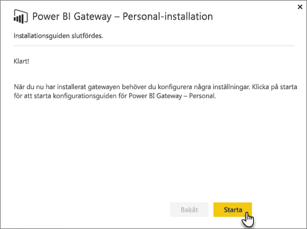
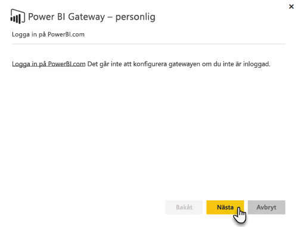
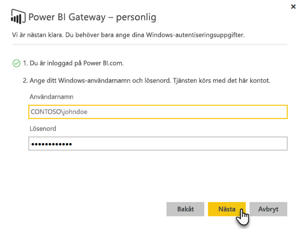

# Lokal datagateway
Den lokala datagatewayen fungerar som en brygga med snabb och säker dataöverföring mellan lokala data (data som inte finns i molnet) och tjänsterna Power BI, Microsoft Flow, Logic Apps och PowerApps.

Du kan använda en enda gateway med flera olika tjänster samtidigt. Om du använder både Power BI och PowerApps kan du använda en enda gateway för båda. Det beror på vilket konto som du loggar in med.

> [!NOTE]
> Den lokala datagatewayen implementerar datakomprimering och transportkryptering i alla lägen.
> 
> 

<!-- Shared Requirements Include -->
[!INCLUDE [gateway-onprem-requirements-include](./includes/gateway-onprem-requirements-include.md)]

### Begränsningar för Analysis Services realtidsanslutningar
Du kan använda en realtidsanslutning för tabellinstanser eller flerdimensionella instanser.

| **Serverversion** | **Obligatorisk SKU** |
| --- | --- |
| 2012 SP1 CU4 eller senare |Business Intelligence och Enterprise SKU |
| 2014 |Business Intelligence och Enterprise SKU |
| 2016 |Standard-SKU eller högre |

* Formatering på cellnivå och översättningsfunktioner stöds inte.
* Åtgärder och namngivna mängder exponeras inte för Power BI, men du kan fortfarande ansluta till flerdimensionella kuber som också innehåller åtgärder eller namngivna mängder och skapa visuella objekt och rapporter.

<!-- Shared Install steps Include -->
[!INCLUDE [gateway-onprem-datasources-include](./includes/gateway-onprem-datasources-include.md)]

## Hämta och installera den lokala datagatewayen
Om du vill hämta gatewayen, väljer du **Datagateway** under menyn Hämtningar. Hämta den [lokala datagatewayen](http://go.microsoft.com/fwlink/?LinkID=820925).

<!-- Shared Install steps Include -->
[!INCLUDE [gateway-onprem-install-include](./includes/gateway-onprem-install-include.md)]

## Installera gatewayen i personligt läge
> [!NOTE]
> Personal-varianten fungerar bara med Power BI.
> 
> 

När den personliga gatewayen har installerats behöver du starta **konfigurationsguiden för Power BI Gateway – Personal**.

Du måste sedan logga in till Power BI för att registrera gatewayen för molntjänsten.

Du måste också ange Windows-användarnamnet och -lösenordet för Windows-tjänsten. Du kan ange ett annat Windows-konto än ditt egna. Gatewaytjänsten körs med det här kontot.

När installationen är klar behöver du gå till dina datauppsättninger i Power BI och kontrollera att autentiseringsuppgifterna har angetts för dina lokala datakällor.

## Lagra krypterade autentiseringsuppgifter i molnet
När du lägger till en datakälla till gatewayen, måste du ange autentiseringsuppgifter för datakällan. Alla frågor till datakällan kommer att köras med dessa autentiseringsuppgifter. Autentiseringsuppgifterna krypteras på ett säkert sätt, med hjälp av asymmetrisk kryptering så att de inte kan dekrypteras i molnet, innan de lagras i molnet. Autentiseringsuppgifterna skickas till den dator som kör gatewayen, lokalt där de dekrypteras när datakällorna används.

<!-- Account and Port information -->
[!INCLUDE [gateway-onprem-accounts-ports-more](./includes/gateway-onprem-accounts-ports-more.md)]

<!-- How the gateway works -->
[!INCLUDE [gateway-onprem-how-it-works-include](./includes/gateway-onprem-how-it-works-include.md)]

## Felsökning
Om du får problem när du installerar och konfigurerar en gateway, hittar du mer information under [Felsökning av lokal datagateway](service-gateway-onprem-tshoot.md). Om du tror att du har ett problem med brandväggen kan du läsa mer i avsnittet om [brandvägg eller proxy](service-gateway-onprem-tshoot.md#firewall-or-proxy) i felsökningsartikeln.

Gå till [Konfigurera proxyinställningar för Power BI-gatewayerna](service-gateway-proxy.md) om du tror att du har fått proxyproblem med gatewayen.

## Nästa steg
[Hantera din datakälla – Analysis Services](service-gateway-enterprise-manage-ssas.md)  
[Hantera din datakälla – SAP HANA](service-gateway-enterprise-manage-sap.md)  
[Hantera din datakälla – SQL Server](service-gateway-enterprise-manage-sql.md)  
[Hantera din datakälla – Oracle](service-gateway-onprem-manage-oracle.md)  
[Hantera din datakälla – Import/schemalagd uppdatering](service-gateway-enterprise-manage-scheduled-refresh.md)  
[Lokal datagateway – på djupet](service-gateway-onprem-indepth.md)  
[Lokala datagatewayar (personligt läge) – den nya versionen av den personliga gatewayen](service-gateway-personal-mode.md)
[Konfigurera proxyinställningar för den lokala datagatewayen](service-gateway-proxy.md)  
Har du fler frågor? [Prova Power BI Community](http://community.powerbi.com/)

