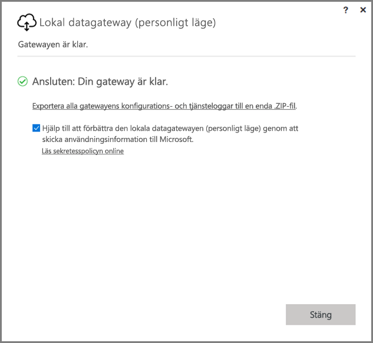
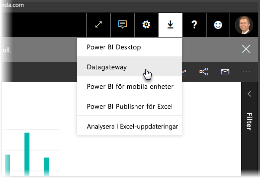
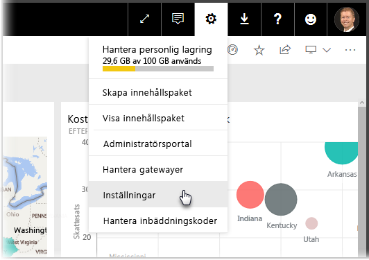
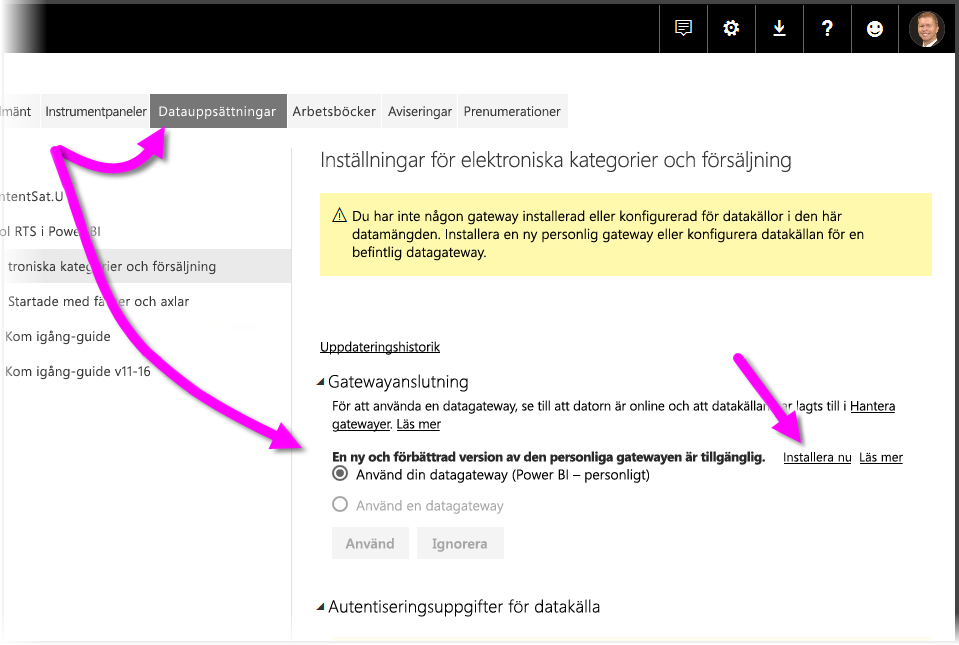
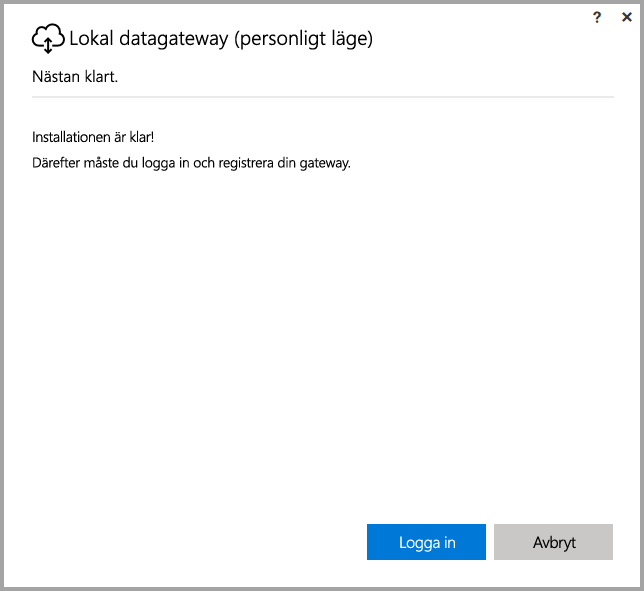
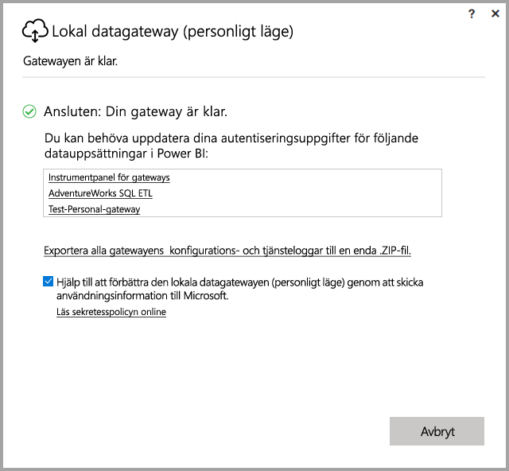

# <a name="on-premises-data-gateway-personal-mode"></a>Lokal datagateway (personligt läge)
Du kan använda lokala datakällor och skapa Power BI-rapporter och -instrumentpaneler med hjälp av en gateway. En **gateway** är programvara som möjliggör åtkomst till data som lagras i ett privat lokalt nätverk och sedan låter dig använda dessa data i onlinetjänster, till exempel **Power BI-tjänsten**. En **lokal datagateway (personligt läge)** är en nyligen utgiven uppdatering för Power BI-gateway som låter enskilda användare installera en gateway på den lokala datorn och få åtkomst till lokala data.



> [!NOTE]
> En **lokal datagateway (personligt läge)** ersätter den tidigare versionen av personlig gateway, som kallas **Power BI Gateway – Personal**. Den tidigare versionen av personlig gateway kommer att fortsätta fungera tills 31 juli 2017. Se nedanstående avsnitt för information om att uppdatera till den nya versionen.
> 
> 

## <a name="features-of-the-on-premises-data-gateway-personal-mode"></a>Funktioner hos lokal datagateway (personligt läge)
I och med lanseringen av **lokal datagateway (personlig läge)** finns nu en mängd funktioner och förbättringar. I den tidigare versionen av personlig gateway (som kallas **Power BI Gateway – Personal**) finns vissa begränsningar. Precis som med många andra Power BI-produkter har vi lyssnat på kundernas behov, önskemål och användning av produkten. Därmed har den **lokala datagatewayen (personligt läge)** gjorts om från grunden och innehåller följande funktioner och förbättringar:

* **Förbättrad tillförlitlighet** – den nya versionen av personlig gateway har förbättrad tillförlitlighet jämfört med den tidigare versionen, tack vare bättre kod och strukturella programvaruförbättringar.
* **Förbättrad utökningsbarhet** – som en del av strukturella programvaruförbättringar går det enkelt att lägga till fler funktioner i den personliga gatewayen när de blir tillgängliga.
* **Ta bort personlig gateway från Power BI-tjänsten** – med den nya versionen kan du nu ta bort din personliga gateway inifrån **Power BI-tjänsten**.
* **Konfigurations- och serviceloggar** – i den nya versionen kan du enkelt exportera konfigurations- och serviceloggar till en -zip-fil med ett enda klick.

## <a name="installing-on-premises-data-gateway-personal-mode"></a>Installera en lokal datagateway (personligt läge)
Så här installerar du en **lokal datagateway (personliga läge)** utan att ha installerat en tidigare version av gatewayen. Klicka på kugghjulsikonen i **Power BI-tjänsten** och välj **Datagateway**.



Du kan också hämta gatewayen från [den här platsen](https://go.microsoft.com/fwlink/?LinkId=820925&clcid=0x409). Du kan följa installationsstegen och eftersom installationsprocessen låter dig installera valfri version av gatewayen (standardgatewayen som kan delas med andra eller personligt läge) ska du välja **lokal datagateway (personligt läge)** när du uppmanas att välja vilken gatewayversion du vill installera.

### <a name="updating-from-the-previous-personal-gateway"></a>Uppdatera från föregående personlig gateway
Om du redan har installerat gatewayen **Power BI Gateway – Personal** uppmanas du för att installera den nya och förbättrade versionen av personlig gateway när du visar **Datauppsättningar** under  **Inställningar för** **Power BI-tjänsten**.



När du väljer en datamängd och väljer **gatewayanslutning** ser du ett meddelande om att en ny och förbättrad version av den personliga gatewayen är tillgänglig. Då väljer du **Installera nu**.



> [!NOTE]
> Om du kör den tidigare versionen av **Power BI Gateway – personal** som en förhöjd process bör den nya gatewayinstallationen också vara upphöjd så att dina autentiseringsuppgifter för datauppsättningen kan uppdateras automatiskt. I annat fall måste du uppdatera autentiseringsuppgifterna för datauppsättningen manuellt.
> 
> 

Du kommer att ledas genom uppdateringsprocessen och sedan se ett meddelande om att installationen har genomförts. Stäng inte än, det finns ett steg kvar.



Här är det sista steget. När den nya personliga gatewayen har installerats (och den senaste installationsskärmen fortfarande är synlig) loggar du in på **Power BI-tjänsten** och väntar tills du ser att gatewayen är online, enligt följande bild.



Om du har uppdaterat din personliga gateway på samma dator som tidigare gatewayen har installerats på kommer dina autentiseringsuppgifter att uppdateras automatiskt och alla uppdateringsaktiviteter kommer att gå genom den nya gatewayen. Om den föregående gatewayen har installerats på en annan dator uppmanas du att uppdatera dina inloggningsuppgifter på vissa datauppsättningar. I föregående bild kan du lägga märke till listan med datauppsättningar i fönstret. Listan visar datauppsättningar som kan kräva uppdaterade autentiseringsuppgifter. Varje datamängd som visas är en direktlänk som du kan klicka på för att enkelt uppdatera dina autentiseringsuppgifter.

Det var allt – nästan. När du har installerat den nya gatewayen behöver du inte längre den tidigare versionen, så du kan avinstallera den. Du kan göra detta genom att söka efter **Power BI Gateway – personal** på din dator och avinstallera den.

### <a name="determining-which-version-of-the-personal-gateway-you-have-installed"></a>Så här avgör du vilken version av den personliga gatewayen du har installerat
Gör så här för att avgöra vilken version av den personliga gatewayen som du har installerat för tillfället:

* Den tidigare versionen av personlig gateway kallas **Power BI Gateway – Personal** och använder Power BI-ikonen i dialogrutan för installationen.
* Den nya versionen av personlig gateway kallas **lokal datagateway (personligt läge)** och använder gateway-ikonen (ett moln med en upp-och-ner-pil längst ned).

Du kan gå till **Lägg till/ta bort program** och se om **Power BI Gateway – Personal** visas på listan. Om så är fallet bör du är den tidigare versionen av personlig gateway installerad.

## <a name="using-fast-combine-with-the-personal-gateway"></a>Använd kombinera snabbt med personlig gateway
Om du använde **Kombinera snabbt** med den äldre gatewayen måste du vidta följande åtgärder för att återaktivera **Kombinera snabbt** så att den fungerar med den **lokala datagatewayen (personliga läge)** :

1. Öppna följande fil i Utforskaren:
   
   ```
   %localappdata%\Microsoft\On-premises data gateway (personal mode)\Microsoft.PowerBI.DataMovement.Pipeline.GatewayCore.dll.config
   ```
2. Lägg till följande text längst ned i filen:
   
       ```
       <setting name="EnableFastCombine" serializeAs="String">```
       <value>true</value>
       </setting>
       ```
3. När borttagningen är klar börjar inställningen gälla efter cirka en minut. För att kontrollera att den fungerar kan du försöka att uppdatera på plats i **Power BI-tjänsten** och bekräfta att **Kombinera snabbt** fungerar.

## <a name="limitations-and-considerations"></a>Begränsningar och överväganden
Det finns några saker att tänka på när du använder den **lokala datagatewayen (personligt läge)**, enligt beskrivningen i följande lista.

* Om du använder **Windows Hello** eller en PIN-kod för att logga in på Windows kan du stöta på följande fel: 
  * *Det användarkonto som du har valt matchar inte kraven för programmet. Använd ett annat konto.*
  * Du kan åtgärda felet genom att markera *Använd ett annat konto* och logga in igen. 

Följande datakällor stöds inte för närvarande i **lokal datagateway (personligt läge)**:

* ADO.NET 
* CurrentWorkbook
* FTP
* HDFS
* SAP BusinessObjects         
* Spark

Stöd för Spark är planerat för den andra hälften av kalenderåret 2017.

## <a name="frequently-asked-questions-faq"></a>Vanliga frågor och svar
* Kan jag köra den **lokala datagatewayen (personligt läge)** sida vid sida med en **lokal datagateway** (kallades tidigare för företagsgatewayen)?
  
  * **Svar:** Ja, med den nya versionen kan båda köras samtidigt.
* Kan jag köra **lokal datagateway (personligt läge)** som tjänst?
  
  * **Svar:** Nej. **lokal datagateway (personligt läge)** kan endast köras som ett program. Om du behöver köra gatewayen som en tjänst och/eller i adminläge bör du överväga en [**lokal datagateway**](service-gateway-onprem.md) (kallades tidigare för företagsgatewayen).
* Hur ofta uppdateras **lokal datagateway (personligt läge)**?
  
  * **Svar:** Vi planerar att uppdatera din personliga gateway varje månad.
* Varför måste jag ange autentiseringsuppgifter?
  
  * **Svar:** Många situationer kan utlösa en begäran om autentiseringsuppgifter. De vanligaste är att du har ominstallerat den **lokala datagatewayen (personligt läge)** på en annan dator än din **Power BI – personal**-gateway. Det kan också vara ett problem i datakällan och Power BI kunde inte utföra en test-anslutning eller också uppstod ett avbrott eller systemfel. Du kan uppdatera dina autentiseringsuppgifter i **Power BI-tjänsten** genom att gå till **kugghjulsikonen**, välja **Inställningar** och sedan **datauppsättningar**. Hitta datauppsättningen i fråga och klicka på *Uppdatera autentiseringsuppgifterna*.
* Hur länge kommer min tidigare personliga gateway vara offline under uppgraderingen?
  
  * **Svar:** Det tar högst ett par minuter att uppgradera den personliga gatewayen till den nya versionen. 
* Vad händer om jag inte migrerar till ny personlig gateway innan 31 juli 2017?
  
  * **Svar:** Om du uppdaterar dina rapporter med den aktuella gatewayen så kommer dina uppdateringar att avbrytas. Det enda sättet att ställa in ett nytt uppdateringsschema är att installera och konfigurera den nya gatewayen.
* Jag använder R-skript. Stöds detta?
  
  * **Svar:** R-skript stöds för personligt läge.
* Varför ser jag inte på meddelandet för att uppdatera min gateway i **Power BI-tjänsten**?
  
  * **Svar:** Detta beror sannolikt på att du har en eller flera datauppsättningar som omfattar en datakälla som inte stöds för tillfället.

## <a name="next-steps"></a>Nästa steg
[Konfigurera proxyinställningar för Power BI-gatewayerna](service-gateway-proxy.md)  
Har du fler frågor? [Prova Power BI Community](http://community.powerbi.com/)

