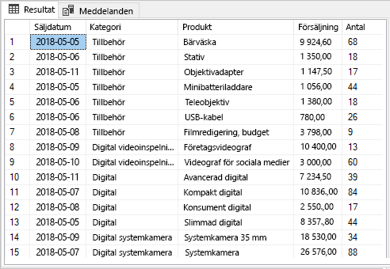
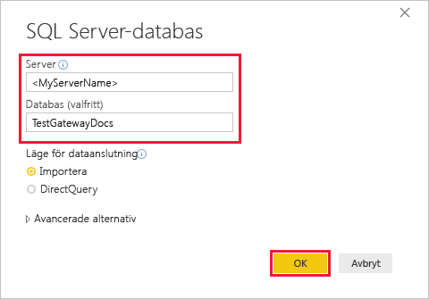
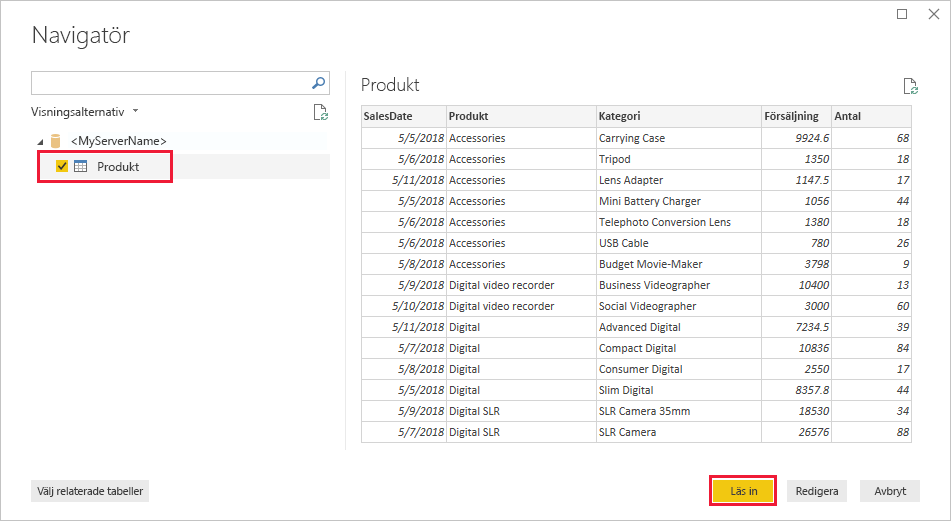
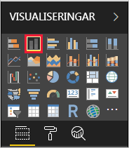
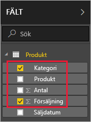
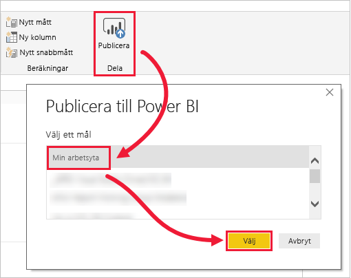
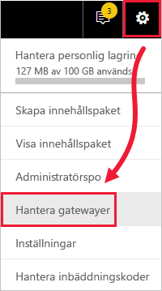
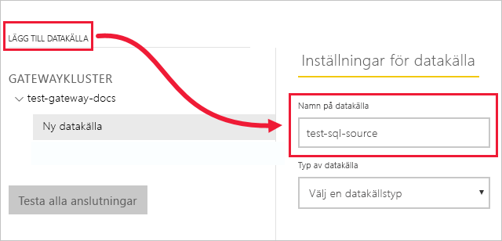
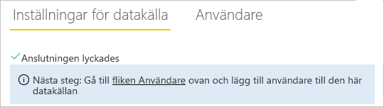

# <a name="tutorial-connect-to-on-premises-data-in-sql-server"></a>Självstudie: Ansluta till lokala data i SQL Server

En lokal datagateway är en programvara som du installerar i ett lokalt nätverk. Det möjliggör åtkomst till data i nätverket. I de här självstudierna skapar du en rapport i Power BI Desktop baserad på exempeldata som importerats från SQL Server. Sedan publicerar du rapporten till Power BI-tjänsten och konfigurerar en gateway så att tjänsten kan komma åt data lokalt. Den här åtkomsten innebär att tjänsten kan uppdatera dina data för att hålla rapporten uppdaterad.

I de här självstudierna får du lära dig att
> [!div class="checklist"]
> * skapa en rapport från data i SQL Server
> * publicera rapporten i Power BI-tjänsten
> * lägga till SQL Server som en gatewaydatakälla
> * uppdatera data i rapporten.

Om du inte har registrerat dig för Power BI [registrerar du dig för en kostnadsfri utvärderingsversion](https://app.powerbi.com/signupredirect?pbi_source=web) innan du börjar.


## <a name="prerequisites"></a>Förutsättningar

* [Installera Power BI Desktop](https://powerbi.microsoft.com/desktop/)
* [Installera SQL Server](https://docs.microsoft.com/sql/database-engine/install-windows/install-sql-server) på en lokal dator 
* [Installera en lokal datagateway](service-gateway-install.md) på samma lokala dator (i produktion hade det i normalfallet varit en annan dator)


## <a name="set-up-sample-data"></a>Konfigurera exempeldata

Börja med att lägga till exempeldata till SQL Server, så att du kan använda dessa data i resten av självstudierna.

1. I SQL Server Management Studio (SSMS) ansluter du till din instans av SQL Server och skapar en testdatabas.

    ```sql
    CREATE DATABASE TestGatewayDocs
    ```

2. Lägg till en tabell i databasen som du har skapat och infoga data.

    ```sql
    USE TestGatewayDocs

    CREATE TABLE Product (
        SalesDate DATE,
        Category  VARCHAR(100),
        Product VARCHAR(100),
        Sales MONEY,
        Quantity INT
    )

    INSERT INTO Product VALUES('2018-05-05','Accessories','Carrying Case',9924.60,68)
    INSERT INTO Product VALUES('2018-05-06','Accessories','Tripod',1350.00,18)
    INSERT INTO Product VALUES('2018-05-11','Accessories','Lens Adapter',1147.50,17)
    INSERT INTO Product VALUES('2018-05-05','Accessories','Mini Battery Charger',1056.00,44)
    INSERT INTO Product VALUES('2018-05-06','Accessories','Telephoto Conversion Lens',1380.00,18)
    INSERT INTO Product VALUES('2018-05-06','Accessories','USB Cable',780.00,26)
    INSERT INTO Product VALUES('2018-05-08','Accessories','Budget Movie-Maker',3798.00,9)
    INSERT INTO Product VALUES('2018-05-09','Digital video recorder','Business Videographer',10400.00,13)
    INSERT INTO Product VALUES('2018-05-10','Digital video recorder','Social Videographer',3000.00,60)
    INSERT INTO Product VALUES('2018-05-11','Digital','Advanced Digital',7234.50,39)
    INSERT INTO Product VALUES('2018-05-07','Digital','Compact Digital',10836.00,84)
    INSERT INTO Product VALUES('2018-05-08','Digital','Consumer Digital',2550.00,17)
    INSERT INTO Product VALUES('2018-05-05','Digital','Slim Digital',8357.80,44)
    INSERT INTO Product VALUES('2018-05-09','Digital SLR','SLR Camera 35mm',18530.00,34)
    INSERT INTO Product VALUES('2018-05-07','Digital SLR','SLR Camera',26576.00,88)
    ```

3. Välj dina data från tabellen för att verifiera dem.

    ```sql
    SELECT * FROM Product
    ```

    


## <a name="build-and-publish-a-report"></a>Skapa och publicera en rapport

Nu när du har exempeldata att arbeta med, ansluter du till SQL Server i Power BI Desktop och skapar en rapport baserad på dessa data. Därefter publicerar du rapporten i Power BI-tjänsten.

1. I Power BI Desktop går du till fliken **Start** och klickar på **Hämta data** > **SQL Server**.

2. Under **Server** anger du namnet på servern och under **Databas** anger du ”TestGatewayDocs”. Välj **OK**. 

    

3. Verifiera dina autentiseringsuppgifter och välj sedan **Anslut**.

4. Under **Navigatör** väljer du tabellen **Produkt** och sedan **Läs in**.

    

5. Välj **Stående stapeldiagram** på panelen **Visualiseringar** i **rapportvyn** i Power BI Desktop.

        

6. Välj stapeldiagrammet på rapportarbetsytan. I panelen **Fält** väljer du fälten **Produkt** och **Försäljning**.  

    

    Diagrammet bör nu se ut som på följande bild.

    

    Observera att **SLR Camera** är den nuvarande försäljningsledaren. Detta ändras när du uppdaterar dina data och uppdaterar rapporten senare i de här självstudierna.

7. Spara rapporten med namnet ”TestGatewayDocs.pbix”.

8. På fliken **Start** väljer du **Publicera** > **Min arbetsyta** > **Välj**. Logga in på Power BI-tjänsten om du uppmanas att göra det. 

    

9. På skärmen **Klart!** väljer du att **öppna ”TestGatewayDocs.pbix” i Power BI**.


## <a name="add-sql-server-as-a-gateway-data-source"></a>Lägga till SQL Server som en gatewaydatakälla

I Power BI Desktop ansluter du direkt till SQL Server, men för Power BI-tjänsten krävs en gateway som fungerar som en brygga. Nu lägger du till din instans av SQL Server som datakälla för den gateway som du skapade i föregående artikel (som visas under [Förutsättningar](#prerequisites)). 

1. Välj kugghjulsikonen  > **Hantera gatewayer** i det övre högra hörnet av Power BI-tjänsten.

    

2. Välj **Lägg till datakälla** och ange ”test-sql-source” för **Namn på datakälla**.

    

3. Välj **Typ av datakälla** för **SQL Server** och ange sedan andra värden så som det visas på bilden.

    


   |          Alternativ           |                                               Värde                                                |
   |---------------------------|----------------------------------------------------------------------------------------------------|
   |   **Namn på datakälla**    |                                          test-sql-source                                           |
   |   **Typ av datakälla**    |                                             SQL Server                                             |
   |        **Server**         | Namnet på SQL Server-instansen (måste vara identiskt med vad du har angett i Power BI Desktop) |
   |       **Databas**        |                                          TestGatewayDocs                                           |
   | **Autentiseringsmetod** |                                              Windows                                               |
   |       **Användarnamn**        |             Det konto, som michael@contoso.com, som du använder för att ansluta till SQL Server             |
   |       **Lösenord**        |                   Lösenordet för kontot som används för att ansluta till SQL Server                    |


4. Välj **Lägg till**. Du ser *Anslutningen lyckades* när processen lyckas.

    

    Du kan nu använda den här datakällan för att ta med data från SQL Server i Power BI-instrumentpaneler och rapporter.


## <a name="configure-and-use-data-refresh"></a>Konfigurera och använda datauppdatering

Du har en rapport som publicerats till Power BI-tjänsten och SQL Server-datakällan har konfigurerats. Med dessa på plats ska du nu göra en ändring i tabellen Produkt och den ändringen flödar genom gatewayen till den publicerade rapporten. Du kan också konfigurera schemalagd uppdatering för att hantera eventuella framtida ändringar.

1. Uppdatera data i tabellen Produkt i SQL Server Management Studio.

    ```sql
    UPDATE Product
    SET Sales = 32508, Quantity = 252
    WHERE Product='Compact Digital'     

    ```

2. I det vänstra navigeringsfönstret i Power BI-tjänsten väljer du **Min arbetsyta**.

3. Under **Datauppsättningar** väljer du **Mer** (**...** ) > **Uppdatera nu** för datauppsättningen **TestGatewayDocs**.

    

4. Välj **Min arbetsyta** > **Rapporter** > **TestGatewayDocs**. Se hur uppdateringen flödade igenom. Försäljningsledaren är nu **Compact Digital**. 

    

5. Välj **Min arbetsyta** > **Rapporter** > **TestGatewayDocs**. Välj **Mer** (**. . .**) > **Uppdatera schema**.

6. Under **Uppdatera schema**, ställer du in uppdateringen till **På** och väljer sedan **Verkställ**. Datauppsättningen uppdateras dagligen som standard.

    

## <a name="clean-up-resources"></a>Rensa resurser
Om du inte vill använda dina exempeldata längre, kör du `DROP DATABASE TestGatewayDocs` i SQL Server Management Studio. Om du inte vill använda SQL Server-datakällan, [tar du bort datakällan](service-gateway-manage.md#remove-a-data-source). 


## <a name="next-steps"></a>Nästa steg
I de här självstudierna har du lärt dig att
> [!div class="checklist"]
> * skapa en rapport från data i SQL Server
> * publicera rapporten i Power BI-tjänsten
> * lägga till SQL Server som en gatewaydatakälla
> * uppdatera data i rapporten.

Går vidare till nästa artikel för att lära dig mer
> [!div class="nextstepaction"]
> [Hantera en Power BI-gateway](service-gateway-manage.md)

