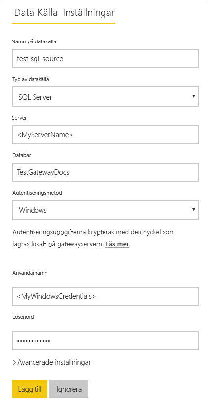
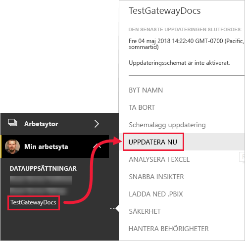

# <a name="refresh-data-from-an-on-premises-sql-server-database"></a>Uppdatera data från en lokal SQL Server-databas

I den här självstudien kommer du att lära dig hur du uppdaterar en Power BI-datauppsättning från en relationsdatabas som finns lokalt i ditt lokala nätverk. Specifikt för den här självstudien används en SQL Server-exempeldatabas, som Power BI måste komma åt via en lokal datagateway.

I den här självstudien går du igenom följande steg:

> [!div class="checklist"]
> * Skapa och publicera en Power BI Desktop-fil (.pbix), som importerar data från en lokal SQL Server-databas.
> * Konfigurera inställningarna för käll- och datauppsättning i Power BI för SQL Server-anslutningar via en datagateway.
> * Konfigurera ett uppdateringsschema för att säkerställa att din Power BI-datauppsättning är uppdaterad med senaste data.
> * Uppdatera din datauppsättning på begäran.
> * Granska uppdateringshistoriken för att analysera resultatet för de senaste uppdateringscyklerna.
> * Rensa bland resurserna genom att ta bort artefakter som skapats i den här självstudien.

## <a name="prerequisites"></a>Förutsättningar

- Registrera dig för en [kostnadsfri utvärderingsversion av Power BI](https://app.powerbi.com/signupredirect?pbi_source=web), om du inte redan har en, innan du börjar.
- [Installera Power BI Desktop](https://powerbi.microsoft.com/desktop/) på en lokal dator.
- [Installera SQL Server](/sql/database-engine/install-windows/install-sql-server) på en lokal dator och återställa [exempeldatabasen från en säkerhetskopia](https://github.com/Microsoft/sql-server-samples/releases/download/adventureworks/AdventureWorksDW2017.bak). För mer information om AdventureWorks, se [Installation och konfiguration av AdventureWorks](/sql/samples/adventureworks-install-configure).
- [Installera en lokal datagateway](service-gateway-onprem.md) på samma lokala dator som SQL Server (i produktion hade det i normalfallet varit en annan dator).

> [!NOTE]
> Om du inte är gateway-administratör och inte vill installera en gateway själv så kontaktar du gateway-administratören i din organisation. Administratören kan skapa den nödvändiga definitionen av datakällan för att ansluta din datauppsättning till SQL Server-databasen.

## <a name="create-and-publish-a-power-bi-desktop-file"></a>Skapa och publicera en Power BI Desktop-fil

Gör enligt nedan för att skapa en grundläggande Power BI-rapport med AdventureWorksDW-exempeldatabasen. Publicera rapporten till Power BI-tjänsten så att du kan få en datauppsättning i Power BI, som du sedan kan konfigurera och uppdatera i efterföljande steg.

1. I Power BI Desktop går du till fliken **Start** och väljer **Hämta data** \> **SQL Server**.

2. I dialogrutan **SQL Server-databas** anger du namnen för **Server** och **Databas (valfritt)**. Kontrollera att **Läge för dataanslutning** är satt till **Import** och välj sedan **OK**.

    

    Vi använder inte **Avancerade alternativ** i den här självstudien, men observera att du kan ange ett SQL-uttryck och ange andra alternativ som att använda [SQL Server-redundans](/sql/database-engine/availability-groups/windows/failover-clustering-and-always-on-availability-groups-sql-server).

    

3. Verifiera dina **autentiseringsuppgifter** och välj sedan **Anslut**.

    > [!NOTE]
    > Om du inte kan autentisera kontrollerar du att du väljer rätt autentiseringsmetod och använder ett konto med åtkomst till databasen. I testmiljöer kan du använda databasautentisering med ett explicit användarnamn och lösenord. I produktionsmiljöer använder du vanligen Windows-autentisering. Se [Felsökning av uppdateringsscenarier](refresh-troubleshooting-refresh-scenarios.md) och kontakta databasadministratören för att få mer hjälp.

1. Om dialogrutan **Krypteringsstöd** visas väljer du **OK**.

2. I dialogrutan **Navigator** väljer du tabellen **DimProduct** och sedan **Läs in**.

    

3. Välj **Stående stapeldiagram** på panelen **Visualiseringar** i **rapportvyn** i Power BI Desktop.

    

4. Välj stapeldiagrammet på rapportarbetsytan. I panelen **Fält** väljer du fälten **EnglishProductName** och **ListPrice**.

    

5. Dra **EndDate** till **Rapportnivåfilter**. Under **Basfiltrering** markerar du bara kryssrutan för **(Tom)**.

    

    Diagrammet bör nu se ut som på följande bild.

    

    Observera att fem **Road-250**-produkter listas med högsta listpriset. Detta ändras när du uppdaterar dina data och uppdaterar rapporten senare i den här självstudien.

6. Spara rapporten med namnet ”AdventureWorksProducts.pbix”.

7. På fliken **Start** väljer du **Publicera** \> **Min arbetsyta** \> **Välj**. Logga in på Power BI-tjänsten om du uppmanas att göra det.

8. På skärmen **Klart!** väljer du **att öppna ”AdventureWorksProducts.pbix” i Power BI**.

    [Publicera till Power BI](./media/service-gateway-sql-tutorial/publish-to-power-bi.png)

## <a name="connect-a-dataset-to-a-sql-server-database"></a>Ansluta en datauppsättning till en SQL Server-databas

I Power BI Desktop anslöt du direkt till din lokala SQL Server-databas, men Power BI-tjänsten behöver en gateway för att fungera som en brygga mellan molnet och ditt lokala nätverk. Följ dessa steg för att lägga till en lokal SQL Server-databas som en datakälla till en gateway och sedan ansluta din datauppsättning till den här datakällan.

1. Logga in i Power BI. Välj kugghjulsikonen i det övre högra hörnet och välj sedan **Inställningar**.

    

2. På fliken **Datauppsättningar** väljer du datauppsättningen **AdventureWorksProducts**, så att du kan ansluta till en lokal SQL Server-databas via en gateway.

3. Expandera **Gatewayanslutning** och kontrollera att minst en gateway visas. Om du inte har en gateway läser du igenom [Förutsättningar](#prerequisites) tidigare i den här självstudien för att hitta en länk till produktdokumentationen för att installera och konfigurera en gateway.

    

4. Under **Åtgärder** expanderar du växlingsknappen för att visa datakällorna. Välj sedan länken **Lägg till i gateway**.

    

    > [!NOTE]
    > Om du inte är gateway-administratör och inte vill installera en gateway själv så kontaktar du gateway-administratören i din organisation. Administratören kan skapa den nödvändiga definitionen av datakällan för att ansluta din datauppsättning till SQL Server-databasen.

5. På administratörssidan för **Gateway**, på fliken **Inställningar för datakälla**, anger och bekräftar du följande information. Välj sedan **Lägg till**.

    | Alternativ | Värde |
    | --- | --- |
    | Namn på datakälla | AdventureWorksProducts |
    | Typ av datakälla | SQL Server |
    | Server | Namnet på SQL Server-instansen, t.ex. SQLServer01 (måste vara samma som du angav i Power BI Desktop). |
    | Databas | Namnet på SQL Server-databasen, t.ex. AdventureWorksDW (måste vara samma som du angav i Power BI Desktop). |
    | Autentiseringsmetod | Windows eller Basic (vanligtvis Windows). |
    | Användarnamn | Kontot du använder för att ansluta till SQL Server. |
    | Lösenord | Lösenordet för kontot som används för att ansluta till SQL Server. |

    

6. På fliken **Datauppsättningar** expanderar du avsnittet **Gatewayanslutning** igen. Välj den datagateway som du har konfigurerat, med **status** aktiverad på datorn där du installerade den och välj **Använd**.

    

## <a name="configure-a-refresh-schedule"></a>Konfigurera ett uppdateringsschema

Nu har du anslutit din datauppsättning i Power BI till din SQL Server-databas lokalt, via en datagateway. Följ stegen nedan för att konfigurera ett uppdateringsschema. Uppdatera din datauppsättning enligt ett schema, för att se till att dina rapporter och instrumentpaneler alltid är uppdaterade med senaste data.

1. I navigeringsfönstret öppnar du **Min arbetsyta** \> **Datauppsättningar**. Välj ellipsen (**...**) för datauppsättningen **AdventureWorksProducts**. Välj sedan **Uppdateringsschema**.

    > [!NOTE]
    > Kontrollera att du väljer ellipsen för **AdventureWorksProducts**-datauppsättningen och inte de tre punkterna för rapporten med samma namn. Snabbmenyn för **AdventureWorksProducts**-rapporten innehåller inte alternativet **Uppdateringsschema**.

2. I avsnittet **Schemalagd uppdatering**, under **Håll dina data uppdaterade**, anger du uppdateringsfunktionen till **På**.

3. Välj en lämplig **uppdateringsfrekvens**, (i det här exemplet **Dagligen**). Under **Tid** väljer du sedan **Lägg till en annan tid**, för att ange önskad uppdateringstid (6:30 AM och PM i det här exemplet).

    

    > [!NOTE]
    > Du kan konfigurera upp till 8 dagliga tider om din datauppsättning finns på en delad kapacitet eller 48 tider på Power BI Premium.

4. Låt kryssrutan **Skicka ett e-postmeddelande om uppdateringsfel** vara aktiverad och välj **Använd**.

## <a name="perform-an-on-demand-refresh"></a>Utföra en uppdatering på begäran

Nu när du har konfigurerat ett uppdateringsschema så uppdaterar Power BI datauppsättningen vid nästa schemalagda tidpunkt, inom en marginal på högst 15 minuter. Om du vill uppdatera datan tidigare, till exempel för att testa din gateway och konfigurationen av datakällan, utför du en uppdatering på begäran med alternativet **Uppdatera nu** i datamängdsmenyn i navigeringsfönstret. På begäran-uppdateringar påverkar inte nästa schemalagda uppdateringstid men de räknas mot den dagliga uppdateringsgränsen, enligt beskrivningen i det tidigare avsnittet.

För att illustrera detta kan du simulera en ändring av exempeldata genom att uppdatera tabellen DimProduct i databasen AdventureWorksDW med SQL Server Management Studio (SSMS).

```sql

UPDATE [AdventureWorksDW].[dbo].[DimProduct]
SET ListPrice = 5000
WHERE EnglishProductName ='Road-250 Red, 58'

```

Följ nu dessa steg så att uppdaterade data kan överföras via gateway-anslutningen till datauppsättningen och till rapporter i Power BI.

1. I navigeringsfönstret i Power BI-tjänsten väljer du att expandera **Min arbetsyta**.

2. Under **Datauppsättningar**, för datauppsättningen **AdventureWorksProducts** väljer du ellipsen (**. . .**). Välj sedan **Uppdatera nu**.

    

    I det övre högra hörnet ser du att Power BI förbereds för att utföra den begärda uppdateringen.

3. Välj **Min arbetsyta\> Rapporter \> AdventureWorksProducts**. Se hur uppdaterade data överförs och nu är produkten med högsta listpris **Road-250 röd, 58**.

    

## <a name="review-the-refresh-history"></a>Granska uppdateringshistorik

Vi rekommenderar att du regelbundet kontrollerar resultatet av uppdateringscyklerna i historiken för uppdatering. Databasautentiseringsuppgifter kan vara ogiltiga eller så kanske den valda gatewayen var offline vid tiden för en schemalagd uppdatering. Följ stegen nedan för att kontrollera uppdateringshistoriken och leta efter problem.

1. Välj kugghjulsikonen i det övre högra hörnet av användargränssnittet för Power BI och välj sedan **Inställningar**.

2. Växla till **Datauppsättningar** och välj sedan den datauppsättning du vill kontrollera, t.ex. **AdventureWorksProducts**.

3. Välj länken **Uppdateringshistorik** för att öppna dialogrutan **Uppdateringshistorik**.

    

4. På fliken **Schemalagd** ser du de senaste schemalagda och kommande uppdateringarna, med tider för **start** och **slut**, och **status** för **slutförda**, vilket betyder att Power BI genomfört uppdateringarna. För misslyckade uppdateringar visas ett felmeddelande och du kan granska felinformationen.

    

    > [!NOTE]
    > Fliken OneDrive gäller endast för datauppsättningar som är anslutna till Power BI Desktop-filer, Excel-arbetsböcker eller CSV-filer på OneDrive eller SharePoint Online. Detta förklaras mer detaljerat i [Datauppdatering i Power BI](refresh-data.md).

## <a name="clean-up-resources"></a>Rensa resurser

När du inte vill använda dina exempeldata längre tar du bort databasen i SQL Server Management Studio (SSMS). Om du inte vill använda SQL Server-datakällan tar du bort datakällan från din datagateway. Du bör också överväga att avinstallera datagatewayen om du bara har installerat den för den här självstudien. Du bör också ta bort datauppsättningen AdventureWorksProducts och rapporten AdventureWorksProducts som Power BI skapade när du laddade upp filen AdventureWorksProducts.pbix.

## <a name="next-steps"></a>Nästa steg

I den här självstudien har du utforskat hur man importerar data från en lokal SQL Server-databas till en Power BI-datauppsättning och hur man uppdaterar datauppsättningen regelbundet, både efter schema och på begäran, för att hålla rapporter och instrumentpaneler som använder den här datauppsättningen uppdaterade i Power BI. Nu du kan lära dig mer om hur du hanterar datagatewayer och datakällor i Power BI. Det kan också vara en bra idé att granska den konceptuella artikeln om datauppdatering i Power BI.

- [Hantera en lokal datagateway](/data-integration/gateway/service-gateway-manage)
- [Hantera din datakälla – Import/schemalagd uppdatering](service-gateway-enterprise-manage-scheduled-refresh.md)
- [Datauppdatering i Power BI](refresh-data.md)
