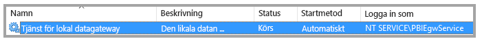
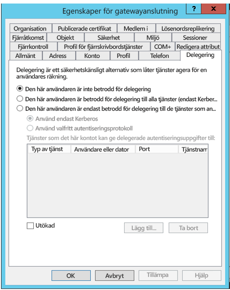
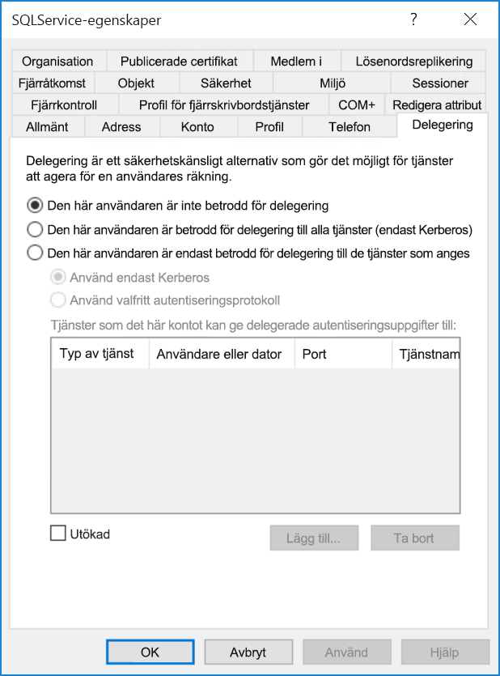
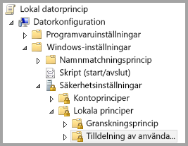
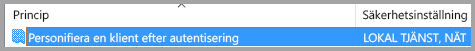
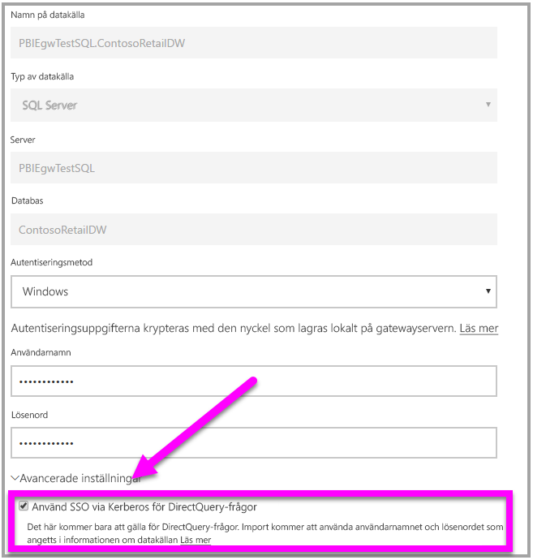

# <a name="use-resource-based-kerberos-for-single-sign-on-sso-from-power-bi-to-on-premises-data-sources"></a>Använda resursbaserad Kerberos för enkel inloggning (SSO) från Power BI till lokala datakällor

Använd [resursbaserade Kerberos-begränsad delegering](/windows-server/security/kerberos/kerberos-constrained-delegation-overview) för att aktivera anslutning med enkel inloggning för Windows Server 2012 och senare versioner, vilket tillåter att klientdels- och serverdelstjänster finns på olika domäner. För att det här ska fungera så måste serverdelstjänstens domän lita på klientdelstjänstens domän.

## <a name="preparing-for-resource-based-kerberos-constrained-delegation"></a>Förbereda för resursbaserad Kerberos-begränsad delegering

Flera objekt måste konfigureras för att Kerberos-begränsad delegering ska fungera korrekt, inklusive _Tjänsternas huvudnamn_ (SPN) och delegeringsinställningar på tjänstkonton. 

### <a name="prerequisite-1-operating-system-requirements"></a>Förutsättning 1: Operativsystemskrav

Resursbaserad begränsad delegering kan bara vara konfigurerad på en domänkontrollant som kör Windows Server 2012 R2 eller Windows Server 2012 eller högre.

### <a name="prerequisite-2-install-and-configure-the-on-premises-data-gateway"></a>Förutsättning 2: Installera och konfigurera den lokala datagatewayen

Den här versionen av den lokala datagatewayen stöder en uppgradering på plats, samt _inställningsövertagning_ för befintliga gatewayer.

### <a name="prerequisite-3-run-the-gateway-windows-service-as-a-domain-account"></a>Förutsättning 3: Kör gatewayens Windows-tjänst som ett domänkonto

I en standardinstallation körs gatewayen som ett datorlokalt tjänstkonto för (särskilt _NT Service\PBIEgwService_), som till exempel det som visas i följande bild:



För att aktivera **Kerberos-begränsad delegering så måste gatewayen köras som ett domänkonto, om inte din Azure AD redan har synkroniserats med din lokala Active Directory (med Azure AD DirSync/Connect). Mer information om att växla kontot till ett domänkonto finns i [Ändra gatewayen till ett domänkonto](service-gateway-sso-kerberos.md).

Om Azure AD DirSync/Connect har konfigurerats och användarkonton har synkroniserats så behöver inte gatewaytjänsten utföra lokala AD-sökningar vid körning. Du kan använda ditt lokala tjänst-SID (i stället för att kräva ett domänkonto) för gatewaytjänsten. Konfigurationsstegen för Kerberos-begränsad delegering som beskrivs i den här artikeln motsvarar den konfigurationen (de tillämpas helt enkelt på gatewayens datorobjekt i Active Directory i stället för domänkontot).

### <a name="prerequisite-4-have-domain-admin-rights-to-configure-spns-setspn-and-kerberos-constrained-delegation-settings"></a>Förutsättning 4: Ha domänadministratörsbehörighet för att konfigurera SPN:er (SetSPN) och Kerberos-begränsade delegeringsinställningar

Även om det är tekniskt möjligt för en domänadministratör att tillfälligt eller permanent tilldela behörighet till någon annan för att konfigurera SPN:er och Kerberos-delegering, utan att kräva domänadministratörsbehörighet, är det inte något vi rekommenderar. I följande avsnitt redovisar vi de konfigurationssteg som krävs för **Förutsättning 3** i detalj.

## <a name="configuring-kerberos-constrained-delegation-for-the-gateway-and-data-source"></a>Konfigurera Kerberos-begränsad delegering för gatewayen och datakällan

Om du vill konfigurera systemet korrekt, måste du konfigurera eller verifiera följande två objekt:

1. Konfigurera vid behov ett SPN för gatewaytjänstens domänkonto.

1. Konfigurera delegeringinställningarna på gatewaytjänstens domänkonto.

Observera att du måste vara domänadministratör för att utföra dessa två konfigurationssteg.

I följande avsnitt beskrivs de här stegen i tur och ordning.

### <a name="configure-an-spn-for-the-gateway-service-account"></a>Konfigurera ett SPN för gatewaytjänstkontot

Börja med att kontrollera om ett SPN redan har skapats för det domänkonto som används som gatewaytjänstkonto, och följ då dessa steg:

1. Starta **Active Directory-användare och datorer** som domänadministratör.

1. Högerklicka på domänen, välj **Hitta** och ange gatewaytjänstkontots kontonamn.

1. Högerklicka på gatewayens tjänstkonto i sökresultatet och välj **Egenskaper**.

1. Om fliken **Delegering** visas i dialogrutan **Egenskaper** hade ett SPN redan skapats och du kan gå vidare till nästa underavsnitt om att konfigurera delegeringsinställningar.

    Om det inte finns någon **Delegering**-flik i dialogrutan **Egenskaper** kan du manuellt skapa ett SPN på det kontot som lägger till **Delegering**-fliken (detta är den enklaste metoden för att konfigurera delegeringsinställningarna). Du kan skapa ett SPN med hjälp av [setspn-verktyget](https://technet.microsoft.com/library/cc731241.aspx) som medföljer Windows (du behöver domänadministratörsbehörighet för att skapa ett SPN).

    Tänk dig till exempel att gatewaytjänstkontot är PBIEgwTest\GatewaySvc och att datorn där gatewaytjänsten körs kallas **Machine1**. För att ställa in SPN:et för gatewaytjänstkontot för den datorn i det här exemplet skulle du köra följande kommando:

      

    Då den åtgärden är slutförd kan vi gå vidare till att konfigurera delegeringsinställningarna.

### <a name="configure-delegation-settings"></a>Konfigurera delegeringsinställningar

I följande steg så förutsätter vi att det finns en lokal miljö med två datorer på olika domäner: en gatewaydator och en databasserver som kör SQL Server. För det här exemplet så förutsätter vi även följande inställningar och namn:

- Gatewaydatorns namn: **PBIEgwTestGW**
- Gatewaytjänstkonto: **PBIEgwTestFrontEnd\GatewaySvc** (kontots visningsnamn: Gatewayanslutning)
- Datornamn för SQL Server-datakällan: **PBIEgwTestSQL**
- Tjänstkonto för SQL Server-datakällan: **PBIEgwTestBackEnd\SQLService**

Baserat på dessa exempelnamn och -inställningar så blir konfigurationsstegen följande:

1. Med hjälp av **Active Directory Users and Computers**, som är en Microsoft Management Console (MMC) snapin-modul, på domänkontrollanten för **PBIEgwTestFront-end**-domänen, ser du till att inga inställningar för delegering tillämpas för gatewaytjänstkontot.

    

1. Med hjälp av **Active Directory Users and Computers**, på domänkontrollanten för **PBIEgwTestBack-end**-domänen, ser du till att inga inställningar för delegering tillämpas för serverdelstjänstkontot. Se dessutom till att attributet msDS-AllowedToActOnBehalfOfOtherIdentity för det här kontot inte har angetts. Du hittar attributet i Attributredigeraren som det visas i följande bild:

    

1. Skapa en grupp i **Active Directory Users and Computers**, på domänkontrollanten för domänen **PBIEgwTestBack-end**. Lägg till gatewayens tjänstkonto till den här gruppen enligt följande bild. Bilden visar en ny grupp med namnet _ResourceDelGroup_ där gatewaytjänstkontot **GatewaySvc** lagts till i den här gruppen.

    

1. Öppna Kommandotolken och kör följande kommandon i domänkontrollanten för domänen **PBIEgwTestBack-end** för att uppdatera attributet msDS-AllowedToActOnBehalfOfOtherIdentity för serverdelstjänstkontot:

    ```powershell
    $c = Get-ADGroup ResourceDelGroup
    Set-ADUser SQLService -PrincipalsAllowedToDelegateToAccount $c
    ```

1. Du kan verifiera att uppdateringen avspeglas i fliken Attributredigeraren i egenskaperna för serverdelstjänstkontot i **Active Directory Users and Computers.**

Slutligen måste gatewaytjänstkontot på den dator som kör gatewaytjänsten (**PBIEgwTestGW** i vårt exempel), beviljas den lokala principen Personifiera en klient efter autentisering. Du kan utföra/kontrollera detta med Redigeraren för lokala grupprinciper (**gpedit**).

1. På gatewaydatorn kör du: _gpedit.msc_.

1. Gå till **Lokal datorprincip > Datorkonfiguration > Windows-inställningar > Säkerhetsinställningar > Lokala principer > Tilldelning av användarrättigheter**, enligt följande bild.

    

1. I listan med principer under **Tilldelning av användarrättigheter** väljer du **Personifiera en klient efter autentisering**.

    

1. Högerklicka på och öppna **Egenskaper** för **Personifiera en klient efter autentisering** och kontrollera listan över konton. Den måste innehålla gatewaytjänstkontot ( **PBIEgwTestFront-end**  **\GatewaySvc** ).

1. I listan med principer under **Tilldelning av användarrättigheter** väljer du **Agera som del av operativsystemet (SeTcbPrivilege)**. Se till att gatewaytjänstkontot även finns med i listan över konton.

1. Starta om den **lokala datagatewaytjänsten**.

## <a name="running-a-power-bi-report"></a>Köra en Power BI-rapport

När alla konfigurationssteg som beskrivs tidigare i den här artikeln har slutförts kan du använda sidan **Hantera gateway** i Power BI för att konfigurera datakällan. Under **Avancerade inställningar** aktiverar du sedan enkel inloggning och publicerar sedan rapporter och datauppsättningar med bindning till datakällan.



Den här konfigurationen fungerar i de flesta fall. Med Kerberos kan det dock förekomma olika konfigurationer beroende på din miljö. Om rapporten fortfarande inte kan läsas in, behöver du kontakta domänadministratören för att undersöka saken vidare.

## <a name="next-steps"></a>Nästa steg

Mer information om den **lokala datagatewayen** och **DirectQuery** finns i följande resurser:

- [Lokal datagateway](service-gateway-onprem.md)
- [DirectQuery i Power BI](desktop-directquery-about.md)
- [Datakällor som stöds av DirectQuery](desktop-directquery-data-sources.md)
- [DirectQuery och SAP BW](desktop-directquery-sap-bw.md)
- [DirectQuery och SAP HANA](desktop-directquery-sap-hana.md)