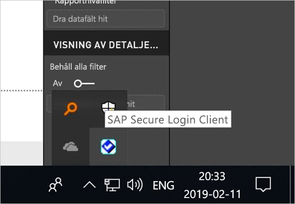

# <a name="use-kerberos-single-sign-on-for-sso-to-sap-bw-using-commoncryptolib-sapcryptodll"></a>Använda enkel inloggning med Kerberos för enkel inloggning till SAP BW med hjälp av CommonCryptoLib (sapcrypto.dll)

I den här artikeln beskrivs hur du konfigurerar din SAP BW-datakälla för att aktivera enkel inloggning från Power BI-tjänsten med hjälp av CommonCryptoLib (sapcrypto.dll).

> [!NOTE]
> Innan du försöker uppdatera en SAP BW-baserad rapport som använder enkel inloggning med Kerberos ska du slutföra både stegen i den här artikeln och stegen i [Konfigurera enkel inloggning med Kerberos](service-gateway-sso-kerberos.md). Användning av CommonCryptoLib som ditt SNC-bibliotek möjliggör anslutningar med enkel inloggning till både SAP BW-programservrar och SAP BW-meddelandeservrar.

## <a name="configure-sap-bw-to-enable-sso-using-commoncryptolib"></a>Konfigurera SAP BW för att aktivera enkel inloggning med hjälp av CommonCryptoLib

> [!NOTE]
> Den lokala datagatewayen är 64-bitars programvara och kräver därför 64-bitarsversionen av CommonCryptoLib (sapcrypto.dll) för att utföra BW SSO. Om du tänker testa anslutningen med enkel inloggning till din SAP BW-server i SAP-gränssnittet innan du försöker använda en anslutning med enkel inloggning via gatewayen (rekommenderas) behöver du även 32-bitarsversionen av CommonCryptoLib, eftersom SAP-gränssnittet är 32-bitars programvara.

1. Se till att din BW-server är korrekt konfigurerad för enkel inloggning med Kerberos via CommonCryptoLib. Om den är det kan du använda enkel inloggning för att komma åt din BW-server (antingen direkt eller via en SAP BW-meddelandeserver) med ett SAP-verktyg som SAP-gränssnittet som har konfigurerats till att använda CommonCryptoLib. 

   Mer information om konfigurationssteg finns i [Enkel inloggning med SAP: Autentisera med Kerberos/SPNEGO](https://blogs.sap.com/2017/07/27/sap-single-sign-on-authenticate-with-kerberosspnego/). BW-servern ska använda CommonCryptoLib som SNC-bibliotek och ha ett SNC-namn som börjar med *CN=* , till exempel *CN=BW1*. Mer information om krav för SNC-namn (i synnerhet för parametern snc/identity/as) finns i [SNC-parametrar för Kerberos-konfiguration](https://help.sap.com/viewer/df185fd53bb645b1bd99284ee4e4a750/3.0/360534094511490d91b9589d20abb49a.html).

1. Om du inte redan har gjort det installerar du x64-versionen av [SAP .NET-anslutningsprogrammet](https://support.sap.com/en/product/connectors/msnet.html) på den dator där gatewayen har installerats. 
   
   Du kan kontrollera om komponenten har installerats genom att försöka ansluta till din BW-server i Power BI Desktop från gatewaydatorn. Om du inte kan ansluta med 2.0-implementeringen betyder det att .NET-anslutningsprogrammet inte är installerat, eller inte har installerats på GAC.

1. Se till att SAP Secure Login Client (SLC) inte körs på den dator där gatewayen är installerad. 

   SLC cachelagrar Kerberos-biljetter på ett sätt som kan störa gatewayens förmåga att använda Kerberos för enkel inloggning. 

1. Om SLC är installerat avinstallerar du det eller kontrollerar att du avslutar SAP-klienten för säker inloggning. Högerklicka på ikonen i systemfältet och välj **Logga ut** och **Avsluta** innan du försöker upprätta en SSO-anslutning via gatewayen. 

   Du kan inte använda SLC på Windows Server-datorer. Mer information finns i [SAP-anteckningen 2780475](https://launchpad.support.sap.com/#/notes/2780475) (s-användare krävs).

   

1. Om du avinstallerar SLC eller väljer **Logga ut** och **Avsluta** öppnar du ett kommandoradsfönster och anger `klist purge` för att rensa eventuella cachelagrade Kerberos-biljetter innan du försöker ansluta med enkel inloggning via gatewayen.

1. Ladda ned 64-bitars CommonCryptoLib (sapcrypto.dll) version *8.5.25 eller senare* från SAP Launchpad och kopiera den till en mapp på gatewaydatorn. I samma katalog dit du kopierade sapcrypto.dll skapar du en fil som heter sapcrypto.ini med följande innehåll:

    ```
    ccl/snc/enable_kerberos_in_client_role = 1
    ```

    .ini-filen innehåller konfigurationsinformation som krävs av CommonCryptoLib för att aktivera enkel inloggning i gatewayscenariot.

    > [!NOTE]
    > De här filerna måste lagras på samma plats. Med andra ord ska _/path/to/sapcrypto/_ innehålla både sapcrypto.ini och sapcrypto.dll.

    Både gatewayens tjänstanvändare och den AD-användare (Active Directory) som tjänstanvändaren personifierar behöver läs- och körningsbehörigheter för båda filerna. Vi rekommenderar att du beviljar gruppen Autentiserade användare behörigheter i både .ini- och .dll-filerna. I testsyfte kan du även uttryckligen bevilja dessa behörigheter till både gatewayens tjänstanvändare och den Active Directory-användare du använder för testning. I den här skärmbilden har vi beviljat gruppen Autentiserade användare **läs- &amp; körningsbehörigheter** för sapcrypto.dll:

    

1. Om du inte redan har en SAP BW-datakälla som är associerad med den gateway som du vill att anslutningen med enkel inloggning ska gå genom, lägger du till en sådan på sidan **Hantera gatewayer** i Power BI-tjänsten. Om du redan har en sådan datakälla redigerar du den. 
    - Välj **SAP Business Warehouse** som **Typ av datakälla** om du vill skapa en anslutning med enkel inloggning till en BW-programserver. 
    - Välj **Sap Business Warehouse Message Server** om du vill skapa en anslutning med enkel inloggning till en BW-meddelandeserver.

1. För **SNC-bibliotek** väljer du antingen miljövariabeln **SNC\_LIB** eller **SNC\_LIB\_64**, eller **Anpassad**. 

   - Om du väljer alternativet **SNC\_LIB** måste du sätta värdet för miljövariabeln **SNC\_LIB\_64** på gatewaydatorn till den absoluta sökvägen för 64-bitarskopian av sapcrypto.dll på gatewaydatorn. Ett exempel är *C:\Users\Test\Desktop\sapcrypto.dll*.

   - Om du väljer **Anpassad** klistrar du in den absoluta sökvägen till *sapcrypto.dll* i fältet Anpassad SNC-bibliotekssökväg på sidan **Hantera gatewayer**. 

1. För **SNC-partnernamn** anger du BW-serverns SNC-namn. Under **Avancerade inställningar** kontrollerar du att **Använd enkel inloggning via Kerberos för DirectQuery-frågor** är markerat. Fyll i de andra fälten som om du hade upprättat en Windows-autentiseringsanslutning från PBI Desktop.

1. Skapa systemmiljövariabeln **CCL\_PROFILE** och sätt värdet till sökvägen för sapcrypto.ini.

    

    .dll- och .ini-filen för sapcrypto måste ligga på samma plats. I exemplet ovan ligger både sapcrypto.ini och sapcrypto.dll på skrivbordet.

1. Starta om gatewaytjänsten.

    

1. [Köra en Power BI-rapport](service-gateway-sso-kerberos.md#run-a-power-bi-report)

## <a name="troubleshooting"></a>Felsökning

Om du inte kan uppdatera rapporten i Power BI-tjänsten kan du använda gatewayspårning, CPIC-spårning och CommonCryptoLib-spårning till att felsöka problemet. CPIC-spårning och CommonCryptoLib är SAP-produkter, så Microsoft kan inte ge någon support för dem.

### <a name="gateway-logs"></a>Gateway-loggar

1. Återskapa problemet.

2. Öppna [gateway-appen](https://docs.microsoft.com/data-integration/gateway/service-gateway-app) och välj **Exportera loggar** på fliken **Diagnostik**.

      

### <a name="cpic-tracing"></a>CPIC-spårning

1. För att aktivera CPIC-spårning anger du två miljövariabler: **CPIC\_TRACE** och **CPIC\_TRACE\_DIR**. 

   Den första variabeln anger spårningsnivån och den andra variabeln anger katalogen för spårningsfilen. Katalogen måste vara en plats som medlemmar i gruppen Autentiserade användare kan skriva till. 
 
2. Sätt **CPIC\_TRACE** till *3* och **CPIC\_TRACE\_DIR** till valfri katalog som du vill att spårningsfilerna ska skrivas till. Till exempel:

   

3. Återskapa problemet och kontrollera att **CPIC\_TRACE\_DIR** innehåller spårningsfiler.
 
    CPIC-spårning kan diagnostisera problem på högre nivå, till exempel ett fel vid inläsningen av biblioteket sapcrypto.dll. Här är till exempel ett kodfragment från en CPIC-konfigurationsfil där ett .dll-inläsningsfel inträffade:

    ```
    [Thr 7228] *** ERROR => DlLoadLib()==DLENOACCESS - LoadLibrary("C:\Users\test\Desktop\sapcrypto.dll")
    Error 5 = "Access is denied." [dlnt.c       255]
    ```

    Om du stöter på ett problem men har ställt in Läs- och körbehörigheter på sapcrypto.dll och sapcrypto.ini enligt beskrivningen [i avsnittet ovan](#configure-sap-bw-to-enable-sso-using-commoncryptolib) kan du prova att ange samma Läs- och körbehörighet för mappen som innehåller filerna.

    Om du fortfarande inte kan läsa in .dll-filen kan du försöka aktivera [granskning för filen](/windows/security/threat-protection/auditing/apply-a-basic-audit-policy-on-a-file-or-folder). Du kan undersöka de resulterande granskningsloggarna i Windows-loggboken för att hjälpa dig att avgöra varför filen inte kan läsas in. Leta efter en felpost som initierats av den personifierade Active Directory-användaren. För den personifierade användaren `MYDOMAIN\mytestuser` kan till exempel ett haveri i granskningsloggen se ut ungefär så här:

    ```
    A handle to an object was requested.

    Subject:
        Security ID:        MYDOMAIN\mytestuser
        Account Name:       mytestuser
        Account Domain:     MYDOMAIN
        Logon ID:       0xCF23A8

    Object:
        Object Server:      Security
        Object Type:        File
        Object Name:        <path information>\sapcrypto.dll
        Handle ID:      0x0
        Resource Attributes:    -

    Process Information:
        Process ID:     0x2b4c
        Process Name:       C:\Program Files\On-premises data gateway\Microsoft.Mashup.Container.NetFX45.exe

    Access Request Information:
        Transaction ID:     {00000000-0000-0000-0000-000000000000}
        Accesses:       ReadAttributes
                
    Access Reasons:     ReadAttributes: Not granted
                
    Access Mask:        0x80
    Privileges Used for Access Check:   -
    Restricted SID Count:   0
    ```

### <a name="commoncryptolib-tracing"></a>CommonCryptoLib-spårning 

1. Aktivera CommonCryptoLib-spårning genom att lägga till de här raderna i filen sapcrypto.ini som du skapade tidigare:

    ```
    ccl/trace/level=5
    ccl/trace/directory=<drive>:\logs\sectrace
    ```

2. Ändra alternativet `ccl/trace/directory` till en plats som medlemmar i gruppen Autentiserade användare kan skriva till. 

3. Alternativt så kan du skapa en ny .ini-fil för att ändra det här beteendet. I samma katalog som sapcrypto.ini och sapcrypto.dll skapar du en fil som heter sectrace.ini med följande innehåll. Ersätt alternativet `DIRECTORY` med en plats på datorn som medlemmar i gruppen Autentiserade användare kan skriva till:

    ```
    LEVEL = 5
    DIRECTORY = <drive>:\logs\sectrace
    ```

4. Återskapa nu problemet och kontrollera att platsen som **DIRECTORY** pekar på innehåller spårningsfiler. 

5. Inaktivera CPIC- och CCL-spårningen när du är färdig.

    Mer information om CommonCryptoLib-spårning finns i [SAP Note 2491573](https://launchpad.support.sap.com/#/notes/2491573) (du måste vara SAP s-användare).

## <a name="next-steps"></a>Nästa steg

Du kan läsa mer om den lokala datagatewayen och DirectQuery i de här resurserna:

* [Vad är en lokal datagateway?](/data-integration/gateway/service-gateway-onprem)
* [DirectQuery i Power BI](desktop-directquery-about.md)
* [Datakällor som stöds av DirectQuery](desktop-directquery-data-sources.md)
* [DirectQuery och SAP BW](desktop-directquery-sap-bw.md)
* [DirectQuery och SAP HANA](desktop-directquery-sap-hana.md)
