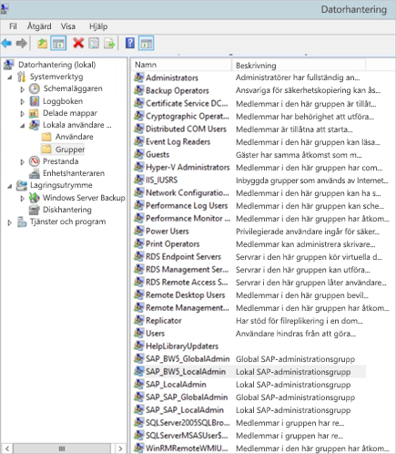
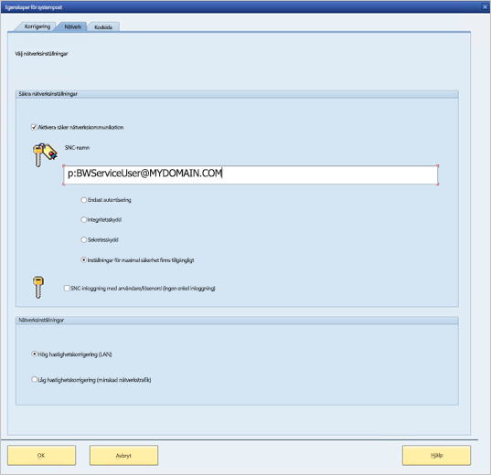

# <a name="use-kerberos-for-single-sign-on-sso-to-sap-bw-using-gx64krb5"></a>Använda Kerberos för enkel inloggning (SSO) till SAP BW med hjälp av gx64krb5

I den här artikeln beskrivs hur du konfigurerar din SAP BW-datakälla för att aktivera enkel inloggning från Power BI-tjänsten med hjälp av gx64krb5.

> [!NOTE]
> Du kan slutföra stegen i den här artikeln utöver stegen i [Konfigurera enkel inloggning med Kerberos](service-gateway-sso-kerberos.md) för att aktivera uppdatering baserad på enkel inloggning för SAP BW-programserverbaserade rapporter i Power BI-tjänsten. Microsoft rekommenderar dock att du använder CommonCryptoLib, inte gx64krb5, som SNC-bibliotek. SAP har inte längre något stöd för gx64krb5, och de steg som krävs för att konfigurera det för gatewayen är betydligt mer komplicerade jämfört med CommonCryptoLib. Information om hur du konfigurerar enkel inloggning med hjälp av CommonCryptoLib finns i [Konfigurera SAP BW för enkel inloggning med hjälp av CommonCryptoLib](service-gateway-sso-kerberos-sap-bw-commoncryptolib.md). Du bör använda CommonCryptoLib _eller_ gx64krb5 som SNC-bibliotek. Slutför inte konfigurationsstegen för båda biblioteken.

Den här guiden är omfattande. Om du redan har slutfört några av stegen som beskrivs kan du hoppa över dem. Du kanske exempelvis redan har konfigurerat din SAP BW-Server för enkel inloggning med gx64krb5.

## <a name="set-up-gx64krb5-on-the-gateway-machine-and-the-sap-bw-server"></a>Konfigurera gx64krb5 på gatewaydatorn och SAP BW-servern

> [!NOTE]
> Biblioteket gx64krb5 stöds inte längre av SAP. Mer information finns i [SAP-anteckningen 352295](https://launchpad.support.sap.com/#/notes/352295). Observera att gx64krb5 inte tillåter anslutningar med enkel inloggning från datagatewayen till SAP BW Message-servrar, du kan bara ansluta till SAP BW Application-servrar. Den här begränsningen gäller inte om du använder [CommonCryptoLib](service-gateway-sso-kerberos-sap-bw-commoncryptolib.md) som SNC-bibliotek. Även om andra SNC-bibliotek också kan fungera för BW SSO så stöds de inte officiellt av Microsoft.

Både klienten och servern måste använda biblioteket gx64krb5 för att upprätta en anslutning med enkel inloggning via gatewayen. Både klienten och servern måste alltså använda samma SNC-bibliotek.

1. Ladda ned gx64krb5.dll från [SAP Note 2115486](https://launchpad.support.sap.com/) (du måste vara SAP s-användare). Se till att du har minst version 1.0.11.x. Ladda även ned gsskrb5.dll (32-bitarsversionen av biblioteket) om du vill testa anslutningen med enkel inloggning i SAP-gränssnittet innan du försöker ansluta med enkel inloggning via gatewayen (rekommenderas). Du behöver 32-bitarsversionen för testning med SAP-gränssnittet eftersom SAP-gränssnittet endast finns i 32-bitarsversion.

1. Placera gx64krb5.dll på en plats på gatewaydatorn som är tillgänglig för de som använder gatewaytjänsten. Om du vill testa anslutningen med enkel inloggning via SAP-gränssnittet skapar du också en kopia av gsskrb5.dll på datorn och ställer in miljövariabeln **SNC_LIB** så att den pekar på sökvägen. Både de som använder gatewaytjänsten och AD-användarna som tjänstanvändaren personifierar behöver läs- och körningsbehörigheter för kopian av gx64krb5.dll. Vi rekommenderar att du beviljar gruppen Autentiserade användare behörigheter för .dll-filen. I testsyfte kan du även uttryckligen ge dessa behörigheter till både gatewaytjänstanvändaren och den AD-användaren du använder i testet.

1. Om BW-servern inte redan är konfigurerad för enkel inloggning med gx64krb5.dll placerar du en till kopia av .dll-filen på SAP BW-servern, på en plats som SAP BW-servern kommer åt. 

    Mer information om hur du konfigurerar gx64krb5.dll för användning med en SAP BW-server finns i [SAP-dokumentationen](https://launchpad.support.sap.com/#/notes/2115486) (du måste vara SAP s-användare).

1. Ställ in miljövariablerna **SNC_LIB** och **SNC_LIB_64** på klientdatorn och serverdatorn: 
    - Om du använder gsskrb5.dll anger du dess absoluta sökväg i variabeln **SNC_LIB**. 
    - Om du använder gx64krb5.dll anger du dess absoluta sökväg i variabeln **SNC_LIB_64**.

## <a name="configure-an-sap-bw-service-user-and-enable-snc-communication-on-the-bw-server"></a>Konfigurera en SAP BW-tjänstanvändare och aktivera SNC-kommunikation på BW-servern

Slutför det här avsnittet om du inte redan har konfigurerat SAP BW-servern för SNC-kommunikation (till exempel enkel inloggning) med hjälp av gx64krb5.

> [!NOTE]
> Det här avsnittet förutsätter att du redan har skapat en tjänstanvändare för BW och kopplat ett lämpligt SPN till den (till exempel ett namn som börjar med *SAP/* ).

1. Ge tjänstanvändaren åtkomst till din SAP BW-programserver:

    1. Lägg till tjänstanvändaren i gruppen Lokala administratörer på SAP BW-servern. Öppna **datorhanteringsprogrammet** och identifiera gruppen Lokala administratörer för din server. 

        

    1. Dubbelklicka på gruppen Lokala administratörer och välj sedan **Lägg till** för att lägga till din tjänstanvändare i gruppen. 

    1. Välj **Kontrollera namn** för att kontrollera att du har angett namnet på rätt sätt och välj sedan **OK**.

1. Ange SAP BW-serverns tjänstanvändare som den användare som startar SAP BW-servertjänsten på SAP BW-serverdatorn:

    1. Öppna **Kör** och ange sedan **Services.msc**. 

    1. Leta rätt på tjänsten som motsvarar instansen av SAP BW-programservern, högerklicka på den och välj sedan **Egenskaper**.

        

    1. Växla till fliken **Logga in** och ändra användaren till din SAP BW-tjänstanvändare. 

    1. Ange användarens lösenord och välj sedan **OK**.

1. Logga in på din server i SAP-inloggningen och ange följande profilparametrar med hjälp av RZ10-transaktionen:

    1. Ange profilparametern **snc/identity/as** till *p:&lt;den SAP BW-tjänstanvändare du skapade&gt;* . Till exempel *p:BWServiceUser\@MYDOMAIN.COM*. Observera att det är *p:* som står före användarens UPN, snarare än *p:CN=* som står före UPN-värdet när du använder CommonCryptoLib som SNC-bibliotek.

    1. Ställ in profilparametern **snc/gssapi\_lib** på *&lt;sökvägen till gx64krb5.dll på BW-servern&gt;* . Placera biblioteket på en plats som SAP BW-programservern kan komma åt.

    1. Ställ in följande ytterligare profilparametrar och ändra värdena efter behov. De sista fem alternativen innebär att klienter kan ansluta till SAP BW-servern med hjälp av SAP-inloggning utan att ha konfigurerat SNC.

        | **Inställning** | **Värde** |
        | --- | --- |
        | snc/data\_protection/max | 3 |
        | snc/data\_protection/min | 1 |
        | snc/data\_protection/use | 9 |
        | snc/accept\_insecure\_cpic | 1 |
        | snc/accept\_insecure\_gui | 1 |
        | snc/accept\_insecure\_r3int\_rfc | 1 |
        | snc/accept\_insecure\_rfc | 1 |
        | snc/permit\_insecure\_start | 1 |

    1. Sätt egenskapen **snc/enable** till värdet 1.

1. När du har ställt in de här profilparametrarna öppnar du SAP-hanteringskonsolen på serverdatorn och startar om SAP BW-instansen. 

   Om servern inte startar kontrollerar du att du har angett profilparametrarna på rätt sätt. Du kan läsa mer om inställningar för profilparametrar i [SAP-dokumentationen](https://help.sap.com/saphelp_nw70ehp1/helpdata/en/e6/56f466e99a11d1a5b00000e835363f/frameset.htm). Du kan också läsa avsnittet [Felsökning](#troubleshooting) i den här artikeln.

## <a name="map-an-sap-bw-user-to-an-active-directory-user"></a>Mappa en SAP BW-användare till en Active Directory-användare

Om du inte redan har gjort det mappar du en Active Directory-användare till en användare på SAP BW-programservern och testar anslutningen med enkel inloggning i SAP-inloggningen.

1. Logga in på SAP BW-servern via SAP-inloggningen. Kör transaktion SU01.

1. Som **Användare** anger du SAP BW-användaren som du vill aktivera anslutning med enkel inloggning för. Välj ikonen **Redigera** (pennikonen) uppe till vänster i fönstret för SAP-inloggning.

    

1. Välj fliken **SNC**. I inmatningsrutan för SNC-namn anger du *p:&lt;din Active Directory-användare&gt;@&lt;din domän&gt;* . I SNC-namnet måste *p:* stå före Active Directory-användarens UPN. Observera att UPN-värdet är skiftlägeskänsligt.

   Den Active Directory-användare som du anger måste tillhöra den person eller organisation som du vill aktivera åtkomst med enkel inloggning till SAP BW-programservern för. Om du till exempel vill aktivera åtkomst med enkel inloggning för användaren testuser\@TESTDOMAIN.COM anger du *p:testuser\@TESTDOMAIN.COM*.

    

1. Välj ikonen **Spara** (bilden av en diskett) uppe till vänster på skärmen.

## <a name="test-sign-in-via-sso"></a>Testa att logga in med enkel inloggning

Kontrollera att du kan logga in på servern via SAP-inloggningen med enkel inloggning som den Active Directory-användare du precis aktiverade åtkomst med enkel inloggning för:

1. Logga in på en dator i din domän där SAP-inloggning är installerat som den Active Directory-användare du nyss aktiverade enkel inloggning för. Starta SAP-inloggning och skapa en ny anslutning.

1. Kopiera filen gsskrb5.dll som du laddade ned tidigare till en plats på datorn du precis loggade in på. Sätt miljövariabeln **SNC_LIB** till den här platsens absoluta sökväg.

1. Starta SAP-inloggning och skapa en ny anslutning.

1. På skärmen **Skapa ny systempost** väljer du **Användarspecificerade system** och sedan **Nästa**.

    

1. Fyll i lämpliga uppgifter på nästa sida, inklusive programserver, instansnummer och system-ID. Välj sedan **Slutför**.

1. Högerklicka på den nya anslutningen, välj **Egenskaper** och sedan fliken **Nätverk**. 

1. I textrutan **SNC-namn** anger du *p:&lt;SAP BW-tjänstanvändarens UPN&gt;* . Till exempel *p:BWServiceUser\@MYDOMAIN.COM*. Välj **OK**.

    

1. Dubbelklicka på den anslutning som du precis skapade för att försöka upprätta en anslutning med enkel inloggning till din SAP BW-server. 

   Om den här anslutningen lyckas går du vidare till nästa avsnitt. Annars granskar du de tidigare stegen i dokumentet för att se till att de har slutförts korrekt, eller så läser du avsnittet [Felsökning](#troubleshooting) nedan. Om du inte kan ansluta till SAP BW-servern via enkel inloggning i den här kontexten så kan du inte heller ansluta till SAP BW-servern med hjälp av enkel inloggning i gatewaykontexten.

## <a name="add-registry-entries-to-the-gateway-machine"></a>Lägg till registerposter i gateway-datorn

Lägg till nödvändiga registerposter i registret på den dator där gatewayen är installerad, samt på de datorer som ska ansluta från Power BI Desktop. Lägg till registerposterna med följande kommandon:

- ```REG ADD HKLM\SOFTWARE\Wow6432Node\SAP\gsskrb5 /v ForceIniCredOK /t REG_DWORD /d 1 /f```

- ```REG ADD HKLM\SOFTWARE\SAP\gsskrb5 /v ForceIniCredOK /t REG_DWORD /d 1 /f```

## <a name="add-a-new-sap-bw-application-server-data-source-to-the-power-bi-service-or-edit-an-existing-one"></a>Lägga till en ny datakälla för SAP BW-programservern i Power BI-tjänsten eller redigera en befintlig

1. Ange SAP BW-programserverns **Värdnamn**, **Systemnummer** och **klient-ID** i konfigurationsfönstret för datakällan, på samma sätt som när du loggar in på SAP BW-servern från Power BI Desktop.

1. I fältet **SNC-partnernamn** anger du *p:&lt;det SPN du mappade till SAP BW-tjänstanvändaren&gt;* . Om SPN-värdet till exempel är SAP/BWServiceUser\@MYDOMAIN.COM anger du *p:SAP/BWServiceUser\@MYDOMAIN.COM* i fältet **SNC-partnernamn**.

1. Som SNC-bibliotek väljer du **SNC\_LIB** eller **SNC\_LIB\_64**. Kontrollera att **SNC\_LIB\_64** på gatewaydatorn pekar på gx64krb5.dll. Du kan också välja alternativet **Anpassad** och ange den absoluta sökvägen till gx64krb5.dll på gatewaydatorn.

1. Välj **Använd SSO via Kerberos för DirectQuery-frågor** och sedan **Tillämpa**. Om testanslutningen inte fungerar kontrollerar du att de föregående stegen för installation och konfiguration slutförts korrekt.

1. [Köra en Power BI-rapport](service-gateway-sso-kerberos.md#run-a-power-bi-report)

## <a name="troubleshooting"></a>Felsökning

### <a name="troubleshoot-gx64krb5-configuration"></a>Felsöka gx64krb5-konfigurationen

Om du får något av följande problem följer du dessa steg för att felsöka gx64krb5-installationen och anslutningarna med enkel inloggning:

* Du får fel meddelanden när du utför installationsstegen för gx64krb5. Till exempel kanske inte SAP BW-servern startar när du har ändrat profilparametrarna. Felsök de här problemen i serverloggarna (...work\dev\_w0 på serverdatorn). 

* Du kan inte starta SAP BW-tjänsten på grund av ett inloggningsfel. Du kan ha angett fel lösenord när du ställde in *startanvändaren* för SAP BW. Verifiera lösenordet genom att logga in som SAP BW-tjänstanvändaren på en dator i Active Directory-miljön.

* Om du får felmeddelanden om autentiseringsuppgifterna för den underliggande datakällan (till exempel SQL Server) som förhindrar att servern startas, kontrollerar du att du har gett tjänstanvändaren åtkomst till SAP BW-databasen.

* Du kan få följande meddelande: *(GSS-API) Det angivna målet är okänt eller kan inte nås*. Det här felet innebär vanligen att du har angett fel SNC-namn. Se till att du bara använder *p:* , inte *p:CN=* eller något annat innan tjänstanvändarens UPN-värde i klientprogrammet.

* Du kan få följande meddelande: *(GSS-API) Ett ogiltigt namn har angetts*. Kontrollera att *p:* är värdet för profilparametern för serverns SNC-identitet.

* Du kan få följande meddelande: *(SNC-fel) Det gick inte att hitta den angivna modulen*. Det här felet uppstår ofta om du placerar gx64krb5.dll på en plats där det behövs högre behörighet (administratörsbehörighet) för åtkomst.

### <a name="troubleshoot-gateway-connectivity-issues"></a>Felsöka problem med gatewayanslutningen

1. Kontrollera gatewayloggarna. Öppna programmet för gatewaykonfiguration och välj **Diagnostik** och sedan **Exportera loggar**. De senaste felen hamnar i slutet av de loggfiler du undersöker.

    

1. Aktivera SAP BW-spårning och granska de genererade loggfilerna. Det finns flera olika typer av SAP BW-spårning (som CPIC-spårning):

   a. För att aktivera CPIC-spårning anger du två miljövariabler: **CPIC\_TRACE** och **CPIC\_TRACE\_DIR**.

      Den första variabeln anger spårningsnivån och den andra variabeln anger katalogen för spårningsfilen. Katalogen måste vara en plats som medlemmar i gruppen Autentiserade användare kan skriva till. 
 
    b. Ställ in **CPIC\_TRACE** på *3* och **CPIC\_TRACE\_DIR** på den katalog du vill skriva spårningsfilerna till. Till exempel:

      

    c. Återskapa problemet och kontrollera att **CPIC\_TRACE\_DIR** innehåller spårningsfiler. 
    
    d. Undersök innehållet i spårningsfilerna för att fastställa blockeringsproblemet. Till exempel kanske du upptäcker att gx64krb5.dll inte lästs in korrekt eller att en annan Active Directory-användare än den som du förväntade dig initierade anslutningsförsöket för enkel inloggning.

## <a name="next-steps"></a>Nästa steg

Du kan läsa mer om den lokala datagatewayen och DirectQuery i de här resurserna:

* [Vad är en lokal datagateway?](/data-integration/gateway/service-gateway-onprem)
* [DirectQuery i Power BI](desktop-directquery-about.md)
* [Datakällor som stöds av DirectQuery](desktop-directquery-data-sources.md)
* [DirectQuery och SAP BW](desktop-directquery-sap-bw.md)
* [DirectQuery och SAP HANA](desktop-directquery-sap-hana.md)
