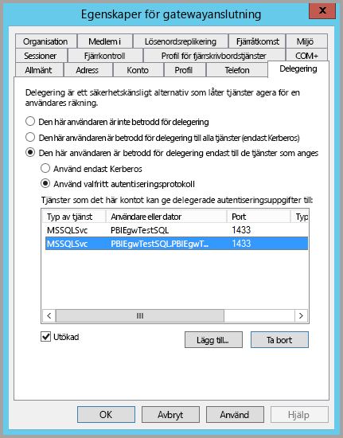
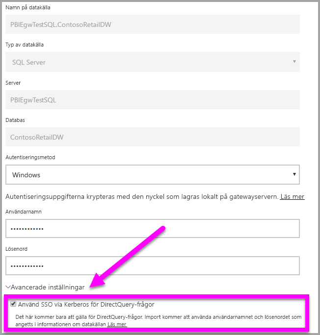
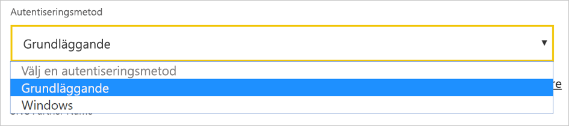
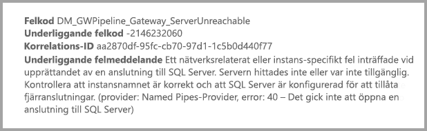

# <a name="use-kerberos-for-single-sign-on-sso-from-power-bi-to-on-premises-data-sources"></a>Använda Kerberos för enkel inloggning (SSO) från Power BI till lokala datakällor

Använd [Kerberos-begränsad delegering](/windows-server/security/kerberos/kerberos-constrained-delegation-overview) för att aktivera sömlös anslutning med enkel inloggning. När enkel inloggning aktiveras blir det enkelt för Power BI-rapporter och instrumentpaneler att uppdatera data från lokala källor.

## <a name="supported-data-sources"></a>Datakällor som stöds

Vi stöder för närvarande följande datakällor:

* SQL Server
* SAP HANA
* SAP BW
* Teradata
* Spark
* Impala

Vi har även stöd för SAP HANA med [Security Assertion Markup Language (SAML)](service-gateway-sso-saml.md).

### <a name="sap-hana"></a>SAP HANA

För att aktivera enkel inloggning för SAP HANA följer du först de här stegen:

* Kontrollera att SAP HANA-servern har den lägsta version som krävs, vilket beror på nivån för SAP HANA-serverplattformen:
  * [HANA 2 SPS 01 Rev 012.03](https://launchpad.support.sap.com/#/notes/2557386)
  * [HANA 2 SPS 02 Rev 22](https://launchpad.support.sap.com/#/notes/2547324)
  * [HANA 1 SP 12 Rev 122.13](https://launchpad.support.sap.com/#/notes/2528439)
* Installera SAP:s senaste HANA ODBC-drivrutin på gatewaydatorn.  Den lägsta möjliga versionen är HANA ODBC version 2.00.020.00 från augusti 2017.

Mer information om hur du konfigurerar enkel inloggning för SAP HANA med hjälp av Kerberos finns i [Enkel inloggning med Kerberos](https://help.sap.com/viewer/b3ee5778bc2e4a089d3299b82ec762a7/2.0.03/1885fad82df943c2a1974f5da0eed66d.html) i säkerhetsguiden för SAP HANA. Se även länkarna på sidan, särskilt SAP-kommentaren 1837331 – HOWTO HANA DBSSO Kerberos/Active Directory.

## <a name="prepare-for-kerberos-constrained-delegation"></a>Förbereda för Kerberos-begränsad delegering

Du måste konfigurera flera objekt för att Kerberos-begränsad delegering ska fungera korrekt, inklusive *Tjänstens huvudnamn* (SPN) och delegeringsinställningar för tjänstkonton.

### <a name="prerequisite-1-install-and-configure-the-microsoft-on-premises-data-gateway"></a>Förutsättning 1: Installera och konfigurera den lokala Microsoft-datagatewayen

Den här versionen av den lokala datagatewayen stöder en uppgradering på plats, samt inställningsövertagning för befintliga gatewayer.

### <a name="prerequisite-2-run-the-gateway-windows-service-as-a-domain-account"></a>Förutsättning 2: Kör gatewayens Windows-tjänst som ett domänkonto

I en standardinstallation körs gatewayen som ett lokalt tjänstkonto (specifikt *NT Service\PBIEgwService*).


För att aktivera Kerberos-begränsad delegering måste gatewayen köras som ett domänkonto, såvida inte din Azure Active Directory-instans redan har synkroniserats med din lokala Active Directory-instans (med Azure AD DirSync/Connect). Information om hur du växlar till ett domänkonto finns i [Ändra gatewaytjänstkontot](/data-integration/gateway/service-gateway-service-account).

> [!NOTE]
> Om Azure AD Connect har konfigurerats och användarkonton har synkroniserats, behöver inte gatewaytjänsten utföra några lokala Azure AD-sökningar vid körningen. Du kan använda ditt lokala tjänst-SID (i stället för att kräva ett domänkonto) för gatewaytjänsten. Konfigurationsstegen för Kerberos-begränsad delegering som beskrivs i den här artikeln motsvarar den konfigurationen. De tillämpas helt enkelt på gatewayens datorobjekt i Azure AD, i stället för på domänkontot.

### <a name="prerequisite-3-have-domain-admin-rights-to-configure-spns-setspn-and-kerberos-constrained-delegation-settings"></a>Förutsättning 3: Ha domänadministratörsbehörighet för att konfigurera SPN:er (SetSPN) och Kerberos-begränsade delegeringsinställningar

Vi rekommenderar inte att en domänadministratör tillfälligt eller permanent tilldelar behörighet till någon annan för att konfigurera SPN:er och Kerberos-delegering, utan att kräva domänadministratörsbehörighet. I följande avsnitt beskriver vi de rekommenderade konfigurationsstegen i detalj.

## <a name="configure-kerberos-constrained-delegation-for-the-gateway-and-data-source"></a>Konfigurera Kerberos-begränsad delegering för gatewayen och datakällan

Som domänadministratör konfigurerar du ett SPN för gatewaytjänstens domänkonto och delegeringsinställningarna för gatewaytjänstens domänkonto.

### <a name="configure-an-spn-for-the-gateway-service-account"></a>Konfigurera ett SPN för gatewaytjänstkontot

Börja med att kontrollera om ett SPN redan har skapats för det domänkonto som används som gatewayens tjänstkonto:

1. Öppna **Active Directory-användare och datorer** som domänadministratör.

2. Högerklicka på domänen, välj **Sök** och ange kontonamnet för gatewayens tjänstkonto.

3. Högerklicka på gatewayens tjänstkonto i sökresultatet och välj **Egenskaper**.

4. Om fliken **Delegering** visas i dialogrutan **Egenskaper** har ett SPN redan skapats. Du kan gå vidare till att konfigurera delegeringsinställningarna.

    Om fliken **Delegering** saknas i dialogrutan **Egenskaper**, kan du skapa ett SPN för det kontot manuellt. Fliken **Delegering** läggs till. Använd [setspn-verktyget](https://technet.microsoft.com/library/cc731241.aspx) som medföljer Windows (du måste ha domänadministratörsbehörighet för att kunna skapa ett SPN).

    Anta till exempel att gatewaytjänstkontot är ”PBIEgwTest\GatewaySvc” och att datorn där gatewaytjänsten körs kallas **Dator1**. Om du vill ange SPN:et för gatewayens tjänstkonto på datorn i det här exemplet, kör du följande kommando:

    

    Då den åtgärden är slutförd kan vi gå vidare till att konfigurera delegeringsinställningarna.

### <a name="configure-delegation-settings-on-the-gateway-service-account"></a>Konfigurera delegeringinställningarna på gatewaytjänstkontot

Det andra konfigurationskravet rör delegeringsinställningarna på gatewaytjänstkontot. Det finns flera olika verktyg som du kan använda för att utföra dessa steg. Här använder vi Active Directory-användare och datorer, vilket är en snapin-modul i Microsoft Management Console (MMC) som administrerar och publicerar information i katalogen. Det är tillgängligt på domänkontrollanter som standard. Du kan också utföra aktiveringen genom konfiguration av Windows-funktionen på andra datorer.

Vi behöver konfigurera Kerberos-begränsad delegering med protokollövergång. Med begränsad delegering måste du vara uttrycklig med vilka tjänster som du vill delegera till. Till exempel accepterar endast SQL Server eller SAP HANA-servern delegeringsanrop från gatewayens tjänstkonto.

Det här avsnittet förutsätter att du redan har konfigurerat SPN:er för dina underliggande datakällor (som SQL Server, SAP HANA, Teradata och Spark). Mer information om hur du konfigurerar dessa datakällors server-SPN:er finns i den tekniska dokumentationen för respektive databasserver. Se även rubriken *What SPN does your app require?* (Vilket SPN kräver din app?) i blogginlägget [My Kerberos Checklist](https://techcommunity.microsoft.com/t5/SQL-Server-Support/My-Kerberos-Checklist-8230/ba-p/316160) (Min Kerberos-checklista).

I följande steg förutsätter vi att det finns en lokal miljö med två datorer: en gatewaydator och en databasserver som kör SQL Server. För det här exemplet förutsätter vi även att följande inställningar och namn finns:

* Gatewaydatorns namn: **PBIEgwTestGW**
* Gatewaytjänstkonto: **PBIEgwTest\GatewaySvc** (kontots visningsnamn: Gateway-port)
* Datornamn för SQL Server-datakällan: **PBIEgwTestSQL**
* Tjänstkonto för SQL Server-datakälla: **PBIEgwTest\SQLService**

Så här konfigurerar du delegeringsinställningarna:

1. Öppna **Active Directory-användare och datorer** med domänadministratörsbehörighet.

2. Högerklicka på gatewayens tjänstkonto (**PBIEgwTest\GatewaySvc**) och välj **Egenskaper**.

3. Välj fliken **delegering**.

4. Välj **Lita på den här datorn enbart för delegering till angivna tjänster** > **Använd valfritt autentiseringsprotokoll**.

5. Under **Tjänster som det här kontot kan ge delegerade autentiseringsuppgifter till** väljer du **Lägg till**.

6. I den nya dialogrutan väljer du **Användare eller datorer**.

7. Ange tjänstkontot för datakällan. Till exempel kan en SQL Server-datakälla ha ett tjänstkonto såsom **PBIEgwTest\SQLService**. När kontot har lagts till väljer du **OK**.

8. Välj det SPN som du skapade för databasservern. I vårt exempel börjar SPN:et med **MSSQLSvc**. Om du har lagt till både FQDN- och NetBIOS-SPN:et för din databastjänst, väljer du båda. Du kanske bara ser en.

9. Välj **OK**. Du bör nu se SPN:et i listan.

    Du kan även markera **Expanderat** för att visa både FQDN och NetBIOS SPN. Dialogrutan ser ut ungefär som följande om du har valt **Expanderat**. Välj **OK**.

    

Slutligen måste gatewaytjänstkontot på den dator som kör gatewaytjänsten (**PBIEgwTestGW** i vårt exempel) beviljas den lokala principen **Personifiera en klient efter autentisering** samt **Agera som en del av operativsystemet (SeTcbPrivilege)** . Du kan utföra och kontrollera den här konfigurationen med Redigeraren för lokala grupprinciper (**gpedit**).

1. På gatewaydatorn kör du: *gpedit.msc*.

1. Gå till **Lokal datorprincip** > **Datorkonfiguration** > **Windows-inställningar** > **Säkerhetsinställningar** > **Lokala principer** > **Tilldelning av användarrättigheter**.

    

1. I principlistan under **Tilldelning av användarrättigheter** väljer du **Personifiera en klient efter autentisering**.

    

    Högerklicka och öppna **Egenskaper**. Kontrollera listan med konton. Det måste innehålla gatewaytjänstkontot (**PBIEgwTest\GatewaySvc**).

1. I principlistan under **Tilldelning av användarrättigheter** väljer du **Agera som del av operativsystemet (SeTcbPrivilege)** . Se till att gatewaytjänstkontot även finns med i listan över konton.

1. Starta om den **lokala datagatewaytjänsten**.

Om du använder SAP HANA rekommenderar vi att du följer dessa ytterligare steg, som kan ge en liten prestandaförbättring.

1. Sök efter och öppna den här konfigurationsfilen i gatewayens installationskatalog: *Microsoft.PowerBI.DataMovement.Pipeline.GatewayCore.dll.config*.

1. Leta upp egenskapen *FullDomainResolutionEnabled* och ändra dess värde till *True* (Sant).

    ```xml
    <setting name=" FullDomainResolutionEnabled " serializeAs="String">
          <value>True</value>
    </setting>
    ```

## <a name="run-a-power-bi-report"></a>Köra en Power BI-rapport

När alla konfigurationssteg har slutförts kan du använda sidan **Hantera gateway** i Power BI för att konfigurera datakällan. Under **Avancerade inställningar** aktiverar du sedan enkel inloggning och publicerar rapporter och datamängder med bindning till datakällan.



Den här konfigurationen fungerar i de flesta fall. Med Kerberos kan det dock förekomma olika konfigurationer beroende på din miljö. Om rapporten fortfarande inte kan läsas in, bör du kontakta domänadministratören för att undersöka saken vidare.

## <a name="configure-sap-bw-for-sso-using-commoncryptolib"></a>Konfigurera SAP BW för enkel inloggning med hjälp av CommonCryptoLib

Nu när du förstår hur Kerberos fungerar med en gateway kan du konfigurera enkel inloggning för SAP Business Warehouse (SAP BW). Följande steg förutsätter att du redan har [förberett för Kerberos-begränsad delegering](#prepare-for-kerberos-constrained-delegation) enligt beskrivningen tidigare i den här artikeln.

> [!NOTE]
> De här anvisningarna beskriver konfiguration av enkel inloggning för SAP BW-**programservrar**. Microsoft stöder för närvarande inte anslutningar med enkel inloggning till SAP BW-**meddelandeservrar**.

1. Se till att BW-servern är korrekt konfigurerad för enkel inloggning med Kerberos. Om den är det bör du kunna använda enkel inloggning för att få åtkomst till BW-servern med ett SAP-verktyg, till exempel SAP GUI. Mer information om konfigurationssteg finns i [Enkel inloggning med SAP: Autentisera med Kerberos/SPNEGO](https://blogs.sap.com/2017/07/27/sap-single-sign-on-authenticate-with-kerberosspnego/). BW-servern ska använda CommonCryptoLib som SNC-bibliotek och ha ett SNC-namn som börjar med "CN=", till exempel "CN=BW1". Mer information om krav för SNC-namn finns i [SNC-parametrar för Kerberos-konfiguration](https://help.sap.com/viewer/df185fd53bb645b1bd99284ee4e4a750/3.0/en-US/360534094511490d91b9589d20abb49a.html) (parametern snc/identity/as).

1. Om du inte redan har gjort det slutför du stegen under [Förbereda för Kerberos-begränsad delegering](https://docs.microsoft.com/power-bi/service-gateway-sso-kerberos#prepare-for-kerberos-constrained-delegation). Se till att gatewayens tjänstanvändare har konfigurerats att presentera delegerade autentiseringsuppgifter för den tjänstanvändare som representerar BW-programservern i din Active Directory-miljö.

1. Om du inte redan har gjort det installerar du x64-versionen av [SAP .NET-anslutningsprogrammet](https://support.sap.com/en/product/connectors/msnet.html) på den dator där gatewayen har installerats. Du kan kontrollera om komponenten har installerats genom att försöka ansluta till din BW-server i Power BI Desktop. Om du inte kan ansluta med 2.0-implementeringen betyder det att .NET-anslutningsprogrammet inte är installerat.

1. Se till att SAP Secure Login Client (SLC) inte körs på den dator där gatewayen är installerad. SLC cachelagrar Kerberos-biljetter på ett sätt som kan störa gatewayens förmåga att använda Kerberos för enkel inloggning. Om SLC är installerat avinstallerar du det eller ser till att avsluta SAP Secure Login Client: högerklicka på ikonen i systemfältet och välj Logga ut och Avsluta innan du provar en anslutning med enkel inloggning med hjälp av gatewayen. SLC stöds inte för användning på Windows Server-datorer. Mer information finns i [SAP-anteckningen 2780475](https://launchpad.support.sap.com/#/notes/2780475) (s-användare krävs).

    

    Om du avinstallerar SLC eller väljer **Logga ut** och **Avsluta** öppnar du ett kommandoradsfönster och anger `klist purge` för att rensa cachelagrade Kerberos-biljetter innan du provar en anslutning med enkel inloggning via gatewayen.

1. Ladda ned CommonCryptoLib (sapcrypto.dll) version **8.5.25 eller senare** från SAP Launchpad och kopiera den till en mapp på gatewaydatorn. I samma katalog dit du kopierade sapcrypto.dll skapar du en fil som heter sapcrypto.ini med följande innehåll:

    ```
    ccl/snc/enable_kerberos_in_client_role = 1
    ```

    .ini-filen innehåller konfigurationsinformation som krävs av CommonCryptoLib för att aktivera enkel inloggning i gatewayscenariot.

    > [!NOTE]
    > De här filerna måste lagras på samma plats. Med andra ord ska _/path/to/sapcrypto/_ innehålla både sapcrypto.ini och sapcrypto.dll.

    Både gatewayens tjänstanvändare och den AD-användare (Active Directory) som tjänstanvändaren kommer att personifiera behöver läs- och körningsbehörigheter för båda filerna. Vi rekommenderar att du beviljar gruppen Autentiserade användare behörigheter för både ini.- och .dll-filerna. I testsyfte kan du även uttryckligen bevilja dessa behörigheter till både gatewayens tjänstanvändare och den personifierade användaren. I skärmbilden nedan har vi beviljat gruppen Autentiserade användare **läs- &amp; körningsbehörigheter** för sapcrypto.dll:

    

1. Om du inte har en SAP Business Warehouse Server-datakälla går du till sidan **Hantera gatewayer** i Power BI-tjänsten och lägger till en datakälla. Om du redan har en BW-datakälla som är associerad med den gateway som du vill att anslutningen med enkel inloggning ska flöda genom förbereder du att redigera den.

    För **SNC-bibliotek** väljer du antingen miljövariabeln **SNC\_LIB eller SNC\_LIB\_64** eller **Anpassad**. Om du väljer alternativet **SNC\_LIB** måste du ange värdet för miljövariabeln SNC\_LIB\_64 på gatewaydatorn till den absoluta sökvägen för kopian av sapcrypto.dll på gatewaydatorn, till exempel C:\Användare\Test\Desktop\sapcrypto.dll. Om du väljer **Anpassad** klistrar du in den absoluta sökvägen till sapcrypto.dll i det fält för anpassad SNC-bibliotekssökväg som visas på sidan **Hantera gatewayer**.

    Under **Avancerade inställningar** kontrollerar du att kryssrutan **Använd enkel inloggning via Kerberos för DirectQuery-frågor** är markerad. Det användarnamn som du anger måste ha behörighet att ansluta till BW-servern och används främst för att testa datakällans anslutning när du har skapat den. Användaren används även för att uppdatera rapporter som skapats från importbaserade datamängder om du har sådana. Om du väljer **Grundläggande** autentisering måste du ange en BW-användare. Om du väljer **Windows**-autentisering måste du ange en Windows Active Directory-användare som är mappad till en BW-användare via SU01-transaktionen i SAP GUI. Resten av fälten (**Systemnummer **,** Klient-ID **,** SNC-partnernamn** och så vidare) måste matcha den information som du skulle ange i Power BI Desktop för att ansluta till din BW-server via enkel inloggning. Välj **Tillämpa** och kontrollera att testanslutningen lyckas.

    

1. Skapa en CCL\_PROFILE-systemmiljövariabel och peka den på sapcrypto.ini:

    

    Kom ihåg att sapcrypto.dll- och .ini-filerna måste finnas på samma plats. I det exempel som visas ovan där sapcrypto.ini finns på skrivbordet bör ska sapcrypto.dll också finnas på skrivbordet.

1. Starta om gatewaytjänsten:

    

1. Publicera en **DirectQuery-baserad** BW-rapport från Power BI Desktop. Den här rapporten måste använda data som är tillgängliga för den BW-användare som är mappad till den Azure Active Directory-användare (AAD) som loggar in på Power BI-tjänsten. Du måste använda DirectQuery i stället för import på grund av hur uppdateringen fungerar. När importbaserade rapporter uppdateras använder gatewayen de autentiseringsuppgifter som du angav i fälten **Användarnamn** och **Lösenord** när du skapade BW-datakällan. Med andra ord används **inte** enkel inloggning med Kerberos. När du publicerar bör du även kontrollera att du väljer den gateway som du har konfigurerat för enkel inloggning med BW om du har flera gatewayer. I Power BI-tjänsten bör du nu kunna uppdatera rapporten eller skapa en ny rapport baserat på den publicerade datamängden.

### <a name="troubleshooting"></a>Felsökning

Om du inte kan uppdatera rapporten i Power BI-tjänsten kan du använda gatewayspårning, CPIC-spårning och CommonCryptoLib-spårning för att diagnostisera problemet. CPIC-spårning och CommonCryptoLib är SAP-produkter, så Microsoft kan inte tillhandahålla direkt support för dem. För Active Directory-användare som ska beviljas åtkomst med enkel inloggning till BW kan vissa Active Directory-konfigurationer kräva att användarna är medlemmar i gruppen Administratörer på den dator där gatewayen är installerad.

1. **Gatewayloggar:** Du reproducerar problemet genom att öppna [gatewayappen](https://docs.microsoft.com/data-integration/gateway/service-gateway-app), gå till fliken **Diagnostik** och välja **Exportera loggar**:

    

1. **CPIC-spårning:** För att aktivera CPIC-spårning anger du två miljövariabler: CPIC\_TRACE och CPIC\_TRACE\_DIR. Den första variabeln anger spårningsnivån och den andra variabeln anger katalogen för spårningsfil. Katalogen måste vara en plats som medlemmar i gruppen Autentiserade användare kan skriva till. Ange CPIC\_TRACE till 3 och CPIC\_TRACE\_DIR till valfri katalog som du vill att spårningsfiler ska skrivas till.

    

    Återskapa problemet och kontrollera att CPIC\_TRACE\_DIR innehåller spårningsfiler.

1. **CommonCryptoLib-spårning:** Aktivera CommonCryptoLib-spårning genom att lägga till två rader i den sapcrypto.ini-fil som du skapade tidigare:

    ```
    ccl/trace/level=5
    ccl/trace/directory=<drive>:\logs\sectrace
    ```

    Se till att ändra alternativet _ccl/trace/directory_ till en plats som medlemmar i gruppen Autentiserade användare kan skriva till. Alternativt så kan du skapa en ny .ini-fil för att ändra det här beteendet. I samma katalog som sapcrypto.ini och sapcrypto.dll skapar du en fil som heter sectrace.ini med följande innehåll.  Ersätt alternativet DIRECTORY (katalog) med en plats på din dator som Autentiserade användare kan skriva till:

    ```
    LEVEL = 5
    
    DIRECTORY = <drive>:\logs\sectrace
    ```

    Reproducera nu problemet och kontrollera att den plats som DIRECTORY pekar på innehåller spårningsfiler. Se till att inaktivera CPIC- och CCL-spårning när du är klar.

    Mer information om CommonCryptoLib-spårning finns i [SAP-anteckningen 2491573](https://launchpad.support.sap.com/#/notes/2491573) (s-användare krävs).

## <a name="configure-sap-bw-for-sso-using-gsskrb5gx64krb5"></a>Konfigurera SAP BW för enkel inloggning med hjälp av gsskrb5/gx64krb5

Om du inte kan använda CommonCryptoLib som SNC-bibliotek kan du använda gsskrb5/gx64krb5 i stället. Konfigurationsstegen är dock betydligt mer komplexa, och SAP erbjuder inte längre stöd för gsskrb5.

Den här guiden försöker vara så omfattande som möjligt. Om du redan har slutfört några av de här stegen kan du hoppa över dem. Du kanske till exempel redan har skapat en tjänstanvändare för SAP BW-servern och mappat ett SPN till den, eller du har redan installerat `gsskrb5`-biblioteket.

### <a name="set-up-gsskrb5gx64krb5-on-client-machines-and-the-sap-bw-server"></a>Konfigurera gsskrb5/gx64krb5 på klientdatorer och SAP BW-servern

> [!NOTE]
> `gsskrb5/gx64krb5` stöds inte längre aktivt av SAP. Mer information finns i [SAP-anteckningen 352295](https://launchpad.support.sap.com/#/notes/352295). Observera också att `gsskrb5/gx64krb5` inte tillåter SSO-anslutningar från datagatewayen till SAP BW-meddelandeservrar. Endast anslutningar till SAP BW-programservrar är möjliga. Nu går det att använda sapcrypto/CommonCryptoLib som SNC-bibliotek, vilket gör konfigurationsprocessen enklare. 

`gsskrb5` måste användas av både klienten och servern när en SSO-anslutning ska slutföras via gatewayen.

1. Ladda ned `gsskrb5` eller `gx64krb5` beroende på vilka bitar du vill ha, från [SAP Note 2115486](https://launchpad.support.sap.com/) (SAP s-user krävs). Se till att du har minst version 1.0.11.x.

1. Placera biblioteket på en plats på din gatewaydator som är tillgänglig för din gatewayinstans (och även av SAP-gränssnittet om du vill kunna testa SSO-anslutningen med SAP-inloggning).

1. Placera en annan kopia på SAP BW-serverdatorn på en plats som är tillgänglig för SAP BW-servern.

1. På klient- och serverdatorerna anger du `SNC_LIB`- och `SNC_LIB_64`-miljövariablerna till att peka på platsen för gx64krb5.dll respektive gx64krb5.dll. Observera att du endast behöver ett av dessa bibliotek, inte båda.

### <a name="create-a-sap-bw-service-user-and-enable-snc-communication"></a>Skapa en användare av SAP BW-tjänsten och aktivera SNC-kommunikation

Utöver den gatewaykonfiguration som du redan har gjort, finns det några fler SAP BW-specifika steg. Avsnittet [Konfigurera delegeringsinställningarna på gatewaytjänstkontot](#configure-delegation-settings-on-the-gateway-service-account) i dokumentationen förutsätter att du redan har konfigurerat SPN:er för de underliggande datakällorna. Så här slutför du gatewaykonfigurationen för SAP BW:

1. På servern för en Active Directory-domänkontrollant skapar du en tjänstanvändare (i början är det bara en vanlig Active Directory-användare) för SAP BW-programservern i din Active Directory-miljö. Tilldela sedan ett SPN till den.

    SAP rekommenderar att inleda SPN med `SAP/`, men det kan också vara möjligt att använda andra prefix, till exempel `HTTP/`. Vad som kommer efter `SAP/` är upp till dig. Ett alternativ är att använda användarnamnet för SAP BW-serverns tjänstanvändare. Exempel: Om du skapar `BWServiceUser@\<DOMAIN\>` som tjänstanvändare kan du använda SPN:et `SAP/BWServiceUser`. Ett sätt att konfigurera SPN-mappningen är med kommandot setspn. Om till exempel ska ange SPN för den tjänstanvändare som vi nyss skapade, kör du följande kommando från ett kommandofönstret i en domänkontrollant: `setspn -s SAP/ BWServiceUser DOMAIN\ BWServiceUser`. Mer information finns i SAP BW-dokumentationen.

1. Ge tjänstanvändaren åtkomst till din SAP BW-programserver:

    1. Lägg till tjänstanvändaren i gruppen Lokala administratörer för SAP BW-servern på SAP BW-serverdatorn. Öppna datorhanteringsprogrammet och dubbelklicka på gruppen Lokala administratörer för din server.

        

    1. Dubbelklicka på gruppen Lokala administratörer och välj sedan **Lägg till** för att lägga till din tjänstanvändare i gruppen. Välj **Kontrollera namn** för att se till att du har angett namnet på rätt sätt. Välj **OK**.

1. Ange SAP BW-serverns tjänstanvändare som den användare som startar SAP BW-servertjänsten på SAP BW-serverdatorn.

    1. Öppna **Kör** och ange ”Services.msc”. Leta efter den tjänst som motsvarar din SAP BW-programserverinstans. Högerklicka på den och välj **Egenskaper**.

        

    1. Växla till fliken **Logga in** och ändra användaren till din SAP BW-tjänstanvändare. Ange användarens lösenord och välj **OK**.

1. Logga in på din server i SAP-inloggningen och ange följande profilparametrar med hjälp av RZ10-transaktionen:

    1. Ange profilparametern snc/identity/as till p:\<den SAP BW-tjänstanvändare som du har skapat\>, till exempel p:BWServiceUser@MYDOMAIN.COM. Observera det p: som föregår tjänstanvändarens UPN. Det är inte p:CN= som när Common Crypto Lib används som SNC-bibliotek.

    1. Ange profilparametern snc/gssapi\_lib till \<vägen till gsskrb5.dll/gx64krb5.dll på serverdatorn (det bibliotek som du använder beror på hur många bitar operativsystemet är på)\>. Kom ihåg att placera biblioteket på en plats som SAP BW-programservern kan komma åt.

    1. Ange även följande ytterligare profilparametrar och ändra värdena efter behov. Observera att de sista fem alternativen innebär att klienterna kan ansluta till SAP BW-servern med hjälp av SAP-inloggning utan att ha SNC konfigurerat.

        | **Inställning** | **Värde** |
        | --- | --- |
        | snc/data\_protection/max | 3 |
        | snc/data\_protection/min | 1 |
        | snc/data\_protection/use | 9 |
        | snc/accept\_insecure\_cpic | 1 |
        | snc/accept\_insecure\_gui | 1 |
        | snc/accept\_insecure\_r3int\_rfc | 1 |
        | snc/accept\_insecure\_rfc | 1 |
        | snc/permit\_insecure\_start | 1 |

    1. Ange egenskapen snc/enable till 1.

1. När du har angett profilparametrarna öppnar du SAP-hanteringskonsolen på serverdatorn och startar om SAP BW-instansen. Om servern inte startar kontrollerar du att du har angett profilparametrarna på rätt sätt. Mer information om inställningar för profilparametrar finns i [SAP-dokumentationen](https://help.sap.com/saphelp_nw70ehp1/helpdata/en/e6/56f466e99a11d1a5b00000e835363f/frameset.htm). Du kan också läsa felsökningsinformationen senare i det här avsnittet om det uppstår problem.

### <a name="map-a-sap-bw-user-to-an-active-directory-user"></a>Mappa en SAP BW-användare till en Active Directory-användare

Mappa en Active Directory-användare till en SAP BW-programserveranvändare och testa anslutningen med enkel inloggning i SAP-inloggningen.

1. Logga in på SAP BW-servern med hjälp av SAP-inloggning. Kör transaktion SU01.

1. Som **Användare** anger du den SAP BW-användare som du vill aktivera anslutningar med enkel inloggning för (i föregående skärmbild angav vi behörigheterna för BIUSER). Välj ikonen **Redigera** (bilden av en penna) längst upp till vänster i fönstret för SAP-inloggning.

    

1. Välj fliken **SNC**. I inmatningsrutan för SNC-namn anger du p:\<din Active Directory-användare\>@\<din domän\>. Observera det obligatoriska p: som måste stå före Active Directory-användarens UPN. Den Active Directory-användare som du anger måste tillhöra den person eller organisation som du vill aktivera åtkomst med enkel inloggning till SAP BW-programservern för. Om du till exempel vill aktivera åtkomst med enkel inloggning för användaren testuser\@TESTDOMAIN.COM anger du p:testuser@TESTDOMAIN.COM.

    

1. Välj **Spara**-ikonen (bilden av en diskett) i det övre vänstra hörnet på skärmen.

### <a name="test-sign-in-by-using-sso"></a>Testa att logga in med enkel inloggning

Kontrollera att du kan logga in på servern. Använd SAP-inloggning med enkel inloggning som den Active Directory-användare som du precis har aktiverat åtkomst med enkel inloggning för.

1. Logga in på en dator där SAP-inloggning är installerat som den Active Directory-användare som du nyss aktiverade enkel inloggning för. Starta SAP-inloggning och skapa en ny anslutning.

1. I fönstret **Create New System Entry** (Skapa ny systempost) väljer du **User Specified System** (Användarspecifierat system) > **Nästa**.

    

1. Fyll i lämpliga uppgifter på nästa sida, inklusive programserver, instansnummer och system-ID. Välj sedan **Slutför**.

1. Högerklicka på den nya anslutningen och välj **Egenskaper**. Välj fliken **Nätverk**. I textrutan **SNC-namn** anger du p:\<SAP BW-tjänstanvändarens UPN\>, till exempel p:BWServiceUser@MYDOMAIN.COM. Välj sedan **OK**.

    

1. Dubbelklicka på den anslutning som du precis skapade för att försöka upprätta en anslutning med enkel inloggning till din SAP BW-server. Om den här anslutningen lyckas går du vidare till nästa steg. Annars granskar du de föregående stegen i det här dokumentet för att se till att de har slutförts korrekt eller läser avsnittet om felsökning nedan. Observera att om du inte kan ansluta till SAP BW-servern med enkel inloggning i det här sammanhanget, så kommer du inte kunna ansluta till SAP BW-servern med enkel inloggning i gatewayen.

### <a name="troubleshoot-installation-and-connections"></a>Felsöka installation och anslutningar

Om det uppstår problem följer dessa steg för att felsöka gsskrb5-installationen och anslutningarna med enkel inloggning från SAP-inloggningen.

* Det kan vara användbart att visa serverloggarna (...work\dev\_w0 på serverdatorn) vid felsökning av eventuella fel som uppstår vid slutförandet av gsskrb5-konfigurationsstegen. Detta gäller särskilt om SAP BW-servern inte startas när profilparametrarna har ändrats.

* Om det inte går att starta SAP BW-tjänsten på grund av ett inloggningsfel, har du kanske angett fel lösenord när du konfigurerade SAP BW ”start-as”-användaren. Verifiera lösenordet genom att logga in på en dator i Active Directory-miljön som SAP BW-tjänstanvändaren.

* Om det uppstår fel för att SQL-autentiseringsuppgifterna förhindrar att servern startas, kontrollerar du att du har beviljats åtkomst som tjänstanvändare till SAP BW-databasen.

* Du kan få följande meddelande: ”(GSS-API) det angivna målet är okänt eller kan inte nås”. Detta innebär vanligen att du har angett fel SNC-namn. Se till att endast använda ”p:”, inte ”p:CN=” eller något annat i klientprogrammet, förutom tjänstanvändarens UPN.

* Du kan få följande meddelande: ”(GSS-API) Ett ogiltigt namn har angetts”. Kontrollera att ”p:” finns i värdet för serverns SNC-identitetsprofilparameter.

* Du kan få följande meddelande: ”(SNC-fel) den angivna modulen kunde inte hittas”. Detta beror vanligtvis på att `gsskrb5.dll/gx64krb5.dll` har placerats någonstans som kräver utökade privilegier (administratörsrättigheter) för åtkomst.

### <a name="add-registry-entries-to-the-gateway-machine"></a>Lägg till registerposter i gateway-datorn

Lägg till nödvändiga registerposter i registret på den dator där gatewayen är installerad. Här följer kommandona som ska köras:

1. REG ADD HKLM\SOFTWARE\Wow6432Node\SAP\gsskrb5 /v ForceIniCredOK /t REG\_DWORD /d 1 /f

1. REG ADD HKLM\SOFTWARE\SAP\gsskrb5 /v ForceIniCredOK /t REG\_DWORD /d 1 /f

### <a name="set-configuration-parameters-on-the-gateway-machine"></a>Ange konfigurationsparametrar för gateway-datorn

Det finns två alternativ för att ställa in konfigurationsparametrar, beroende på om du har Azure AD Connect konfigurerat så att användarna kan logga in på Power BI-tjänsten som Azure AD-användare.

Följ dessa steg om du har konfigurerat Azure AD Connect.

1. Öppna konfigurationsfilen för huvudgatewayen, `Microsoft.PowerBI.DataMovement.Pipeline.GatewayCore.dll`. Som standard finns den här filen på C:\Program Files\On-premises data gateway (Lokal datagateway).

1. Se till att egenskapen **FullDomainResolutionEnabled** har angetts som **True** och att **SapHanaSsoRemoveDomainEnabled** har angetts som **False**.

1. Spara konfigurationsfilen.

1. På fliken **Tjänster** i Aktivitetshanteraren högerklickar du på gatewaytjänsten och väljer **Starta om**.

    

Om du inte har konfigurerat Azure AD Connect, följer du dessa steg för varje användare av Power BI-tjänsten som du vill mappa till en Azure AD-användare. De här stegen kopplar manuellt en användare i Power BI-tjänsten till en Active Directory-användare med behörighet att logga in på SAP BW.

1. Öppna konfigurationsfilen för huvudgatewayen, `Microsoft.PowerBI.DataMovement.Pipeline.GatewayCore.dll`. Som standard finns den här filen på C:\Program Files\On-premises data gateway (Lokal datagateway).

1. Ange **ADUserNameLookupProperty** som `msDS-cloudExtensionAttribute1` och **ADUserNameReplacementProperty** som `SAMAccountName`. Spara konfigurationsfilen.

1. På fliken **Tjänster** i Aktivitetshanteraren högerklickar du på gatewaytjänsten och väljer **Starta om**.

    

1. Ange `msDS-cloudExtensionAttribute1`-egenskapen för Active Directory-användaren. Detta är den användare som du mappade till en SAP BW-användare. Ange egenskapen för Power BI-tjänstanvändaren som du vill aktivera enkel inloggning med Kerberos för. Ett sätt att ange `msDS-cloudExtensionAttribute1`-egenskapen på är med hjälp av snapin-modulen Active Directory-användare och datorer för MMC. (Du kan också använda andra metoder.)

    1. Logga in på en domänkontrollantdator som administratörsanvändare.

    1. Öppna mappen **Användare** i snapin-modulens fönster och dubbelklicka på den Active Directory-användare som du mappade till en SAP BW-användare.

    1. Välj fliken **Redigera attribut**.

        Om du inte ser den här fliken behöver du söka efter instruktioner om hur du aktiverar den, eller använda en annan metod för att ange egenskapen. Välj ett av attributen och sedan M-tangenten för att gå till de Active Directory-egenskaper som börjar med bokstaven ”m”. Leta upp `msDS-cloudExtensionAttribute1`-egenskapen och dubbelklicka på den. Ange värdet till det användarnamn som du använder för att logga in på Power BI-tjänsten i formuläret YourUser@YourDomain.

    1. Välj **OK**.

        

    1. Välj **Tillämpa**. Kontrollera att rätt värde har angetts i kolumnen **Värde**.

### <a name="add-a-new-sap-bw-application-server-data-source-to-the-power-bi-service"></a>Lägga till en ny datakälla för SAP BW-programservern i Power BI-tjänsten

Lägg till SAP BW-datakällan i din gateway genom att följa anvisningarna tidigare i den här artikeln om att [köra en rapport](#run-a-power-bi-report).

1. I konfigurationsfönstret för datakällan anger du programserverns **Värddatornamn**, **Systemnummer** och **klient-ID** på samma sätt som när du loggar in på SAP BW-servern från Power BI Desktop.

1. I fältet **SNC-partnernamn** anger du p: \<det SPN som du mappade till SAP BW-tjänstanvändaren\>. Om SPN-namnet till exempel är SAP/BWServiceUser@MYDOMAIN.COM, ska du ange p:SAP/BWServiceUser@MYDOMAIN.COM i fältet **SNC-partnernamn**.

1. För SNC-biblioteket väljer du **SNC_LIB** eller **SNC_LIB_64**. Använd **SNC_LIB** för 32-bitars scenarier och **SNC_LIB_64** för 64-bitars scenarier. Se till att de här miljövariablerna pekar på gsskrb5.dll respektive gx64krb5.dll, beroende på hur många bitar du kör.

1. Om du har valt **Windows** som **Autentiseringsmetod** ska **Användarnamn** och **Lösenord** vara användarnamnet och lösenordet för en Active Directory-användare med behörighet att logga in på SAP BW-servern med enkel inloggning. Med andra ord måste de tillhöra en Active Directory-användare som har mappats till en SAP BW-användare via SU01-transaktionen. Om du har valt **Grundläggande** ska **Användarnamn** och **Lösenord** anges till en SAP BW-användares namn respektive lösenord. Dessa autentiseringsuppgifter används endast om rutan **Använd SSO via Kerberos för DirectQuery-frågor** inte har markerats.

1. Välj rutan **Använd SSO via Kerberos för DirectQuery-frågor** och välj **Använd**. Om testanslutningen inte fungerar kontrollerar du att de föregående stegen för installation och konfiguration slutförts korrekt.

    Gatewayen använder alltid autentiseringsuppgifterna som har skrivits in för att upprätta en testanslutning till servern och för att utföra schemalagda uppdateringar av importbaserade rapporter. Gatewayen försöker endast upprätta en anslutning för enkel inloggning om **Använd SSO via Kerberos för DirectQuery-frågor** väljs, och användaren försöker använda en direkt frågebaserad rapport eller datauppsättning.

### <a name="test-your-setup"></a>Testa konfigurationen

Publicera en DirectQuery-rapport från Power BI Desktop till Power BI-tjänsten för att testa konfigurationen. Kontrollera att du är inloggad på Power BI-tjänsten som en Azure AD-användare eller en användare som du har mappat till egenskapen `msDS-cloudExtensionAttribute1` för en Azure AD-användare. Om konfigurationen har slutförts bör du kunna skapa en rapport från den publicerade datamängden i Power BI-tjänsten. Du bör också kunna hämta data via visuella objekt i rapporten.

### <a name="troubleshoot-gateway-connectivity-issues"></a>Felsöka problem med gatewayanslutningen

1. Kontrollera gatewayloggarna. Öppna programmet för gatewaykonfiguration och välj **Diagnostik** > **Exportera loggar**. De senaste felen hamnar längst ned i de loggfiler som du undersöker.

    

1. Aktivera SAP BW-spårning och granska de genererade loggfilerna. Det finns flera olika typer av SAP BW-spårning. Mer information finns i SAP-dokumentationen.

## <a name="errors-from-an-insufficient-kerberos-configuration"></a>Fel från en otillräcklig Kerberos-konfiguration

Om den underliggande databasservern och gatewayen inte är korrekt konfigurerade för Kerberos-begränsad delegering, kan du få följande felmeddelande om att data inte kunde läsas in:


Den tekniska informationen som åtföljer felmeddelandet (DM_GWPipeline_Gateway_ServerUnreachable) kan se ut ungefär så här:



Resultatet är att gatewayen inte kunde personifiera den ursprungliga användaren korrekt och att databasanslutningsförsöket misslyckades.

## <a name="next-steps"></a>Nästa steg

Mer information om den **lokala datagatewayen** och **DirectQuery** finns i följande resurser:

* [Vad är en lokal datagateway?](/data-integration/gateway/service-gateway-onprem)
* [DirectQuery i Power BI](desktop-directquery-about.md)
* [Datakällor som stöds av DirectQuery](desktop-directquery-data-sources.md)
* [DirectQuery och SAP BW](desktop-directquery-sap-bw.md)
* [DirectQuery och SAP HANA](desktop-directquery-sap-hana.md)
