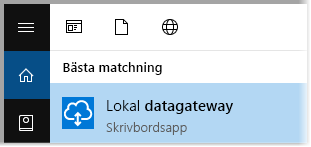
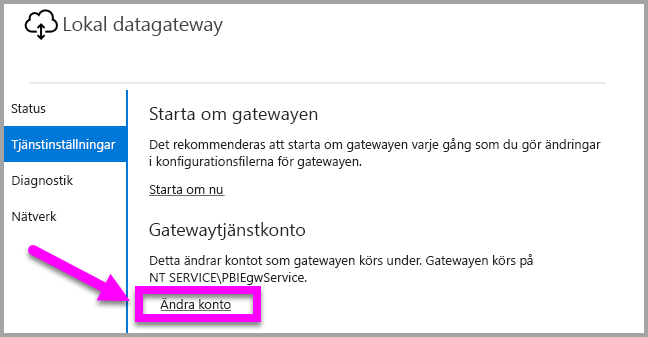

# <a name="use-kerberos-for-single-sign-on-sso-from-power-bi-to-on-premises-data-sources"></a>Använda Kerberos för enkel inloggning (SSO) från Power BI till lokala datakällor

Använd [Kerberos-begränsad delegering](/windows-server/security/kerberos/kerberos-constrained-delegation-overview) för att aktivera sömlös anslutning för enkel inloggning. När enkel inloggning aktiveras blir det enkelt för Power BI-rapporter och instrumentpaneler att uppdatera data från lokala källor.

## <a name="supported-data-sources"></a>Datakällor som stöds

Vi stöder för närvarande följande datakällor:

* SQL Server
* SAP HANA
* SAP BW
* Teradata
* Spark
* Impala

Vi har även stöd för SAP HANA med [Security Assertion Markup Language (SAML)](service-gateway-sso-saml.md).

### <a name="sap-hana"></a>SAP HANA

För att aktivera enkel inloggning för SAP HANA följer du först de här stegen:

* Kontrollera att SAP HANA-servern har den lägsta versionen som krävs, vilket beror på nivån för SAP Hana-serverplattformen:
  * [HANA 2 SPS 01 Rev 012.03](https://launchpad.support.sap.com/#/notes/2557386)
  * [HANA 2 SPS 02 Rev 22](https://launchpad.support.sap.com/#/notes/2547324)
  * [HANA 1 SP 12 Rev 122.13](https://launchpad.support.sap.com/#/notes/2528439)
* Installera SAP:s senaste HANA ODBC-drivrutin på gatewaydatorn.  Den lägsta möjliga versionen är HANA ODBC version 2.00.020.00 från augusti 2017.

Mer information om att installera och konfigurera enkel inloggning för SAP HANA med Kerberos, finns i avsnittet [Enkel inloggning med Kerberos](https://help.sap.com/viewer/b3ee5778bc2e4a089d3299b82ec762a7/2.0.03/1885fad82df943c2a1974f5da0eed66d.html) i säkerhetsguiden för SAP HANA och länkarna från den sidan, särskilt SAP anteckning 1837331 – SÅ GÖR DU HANA DBSSO Kerberos/Active Directory].

## <a name="preparing-for-kerberos-constrained-delegation"></a>Förbereda för Kerberos-begränsad delegering

Flera objekt måste konfigureras för att Kerberos-begränsad delegering ska fungera korrekt, inklusive *Tjänsternas huvudnamn* (SPN) och delegeringsinställningar på tjänstkonton.

### <a name="prerequisite-1-install--configure-the-on-premises-data-gateway"></a>Förutsättning 1: Installera och konfigurera den lokala datagatewayen

Den här versionen av den lokala datagatewayen stöder en uppgradering på plats, samt inställningsövertagning för befintliga gatewayer.

### <a name="prerequisite-2-run-the-gateway-windows-service-as-a-domain-account"></a>Förutsättning 2: Kör gatewayens Windows-tjänst som ett domänkonto

I en standardinstallation körs gatewayen som ett datorlokalt tjänstkonto för (särskilt *NT Service\PBIEgwService*), som till exempel det som visas i följande bild:


För att aktivera **Kerberos-begränsad delegering** måste gatewayen köras som ett domänkonto, om inte din Azure AD redan har synkroniserats med din lokala Active Directory (med hjälp av Azure AD DirSync/Connect). Om du vill växla kontot till ett domänkonto kan du läsa [Ändra gatewayen till ett domänkonto](#switching-the-gateway-to-a-domain-account) senare i den här artikeln.

> [!NOTE]
> Om Azure AD DirSync/Connect har konfigurerats och användarkonton har synkroniserats behöver inte gatewaytjänsten utföra lokala AD-sökningar vid körning och du kan använda ditt lokala tjänst-SID (i stället för att kräva ett domänkonto) för gatewaytjänsten. Konfigurationsstegen för Kerberos-begränsad delegering som beskrivs i den här artikeln motsvarar den konfigurationen (de tillämpas helt enkelt på gatewayens datorobjekt i Active Directory i stället för domänkontot).

### <a name="prerequisite-3-have-domain-admin-rights-to-configure-spns-setspn-and-kerberos-constrained-delegation-settings"></a>Förutsättning 3: Se till att du har administratörsbehörighet för att konfigurera inställningar för SPN:er (SetSPN) och Kerberos-begränsad delegering

Även om det är tekniskt möjligt för en domänadministratör att tillfälligt eller permanent tilldela behörighet till någon annan för att konfigurera SPN:er och Kerberos-delegering, utan att kräva domänadministratörsbehörighet, är det inte något vi rekommenderar. I följande avsnitt redovisar vi de konfigurationssteg som krävs för **Förutsättning 3** i detalj.

## <a name="configuring-kerberos-constrained-delegation-for-the-gateway-and-data-source"></a>Konfigurera Kerberos-begränsad delegering för gatewayen och datakällan

Om du vill konfigurera systemet korrekt, måste du konfigurera eller verifiera följande två objekt:

1. Konfigurera vid behov ett SPN för gatewaytjänstens domänkonto.

2. Konfigurera delegeringinställningarna på gatewaytjänstens domänkonto.

Observera att du måste vara domänadministratör för att utföra dessa två konfigurationssteg.

I följande avsnitt beskrivs de här stegen i tur och ordning.

### <a name="configure-an-spn-for-the-gateway-service-account"></a>Konfigurera ett SPN för gatewaytjänstkontot

Börja med att kontrollera om ett SPN redan har skapats för det domänkonto som används som gatewaytjänstkonto, och följ då dessa steg:

1. Starta **Active Directory-användare och datorer** som domänadministratör.

2. Högerklicka på domänen, välj **Hitta** och ange gatewaytjänstkontots kontonamn.

3. Högerklicka på gatewayens tjänstkonto i sökresultatet och välj **Egenskaper**.

4. Om fliken **Delegering** visas i dialogrutan **Egenskaper** hade ett SPN redan skapats och du kan gå vidare till nästa underavsnitt om att konfigurera delegeringsinställningar.

    Om det inte finns någon **Delegering**-flik i dialogrutan **Egenskaper** kan du manuellt skapa ett SPN på det kontot som lägger till **Delegering**-fliken (detta är den enklaste metoden för att konfigurera delegeringsinställningarna). Du kan skapa ett SPN med hjälp av [setspn-verktyget](https://technet.microsoft.com/library/cc731241.aspx) som medföljer Windows (du behöver domänadministratörsbehörighet för att skapa ett SPN).

    Anta till exempel att gatewaytjänstkontot är ”PBIEgwTest\GatewaySvc” och att datorn där gatewaytjänsten körs kallas **Dator1**. För att ställa in SPN:et för gatewaytjänstkontot för den datorn i det här exemplet skulle du köra följande kommando:

    

    Då den åtgärden är slutförd kan vi gå vidare till att konfigurera delegeringsinställningarna.

### <a name="configure-delegation-settings-on-the-gateway-service-account"></a>Konfigurera delegeringinställningarna på gatewaytjänstkontot

Det andra konfigurationskravet rör delegeringsinställningarna på gatewaytjänstkontot. Det finns flera olika verktyg som du kan använda för att utföra dessa steg. I den här artikeln använder vi **Active Directory-användare och datorer**, vilket är en snapin-modul i Microsoft Management Console (MMC) som du kan använda för att administrera och publicera information i katalogen. Det är tillgängligt på domänkontrollanter som standard. Du kan också utföra aktiveringen genom konfiguration av **Windows-funktionen** på andra datorer.

Vi behöver konfigurera **Kerberos-begränsad delegering** med protokollövergång. Med begränsad delegering måste du vara uttrycklig med vilka tjänster som du vill delegera till. Till exempel accepterar endast din SQL Server eller din SAP HANA-server delegeringsanrop från gatewaytjänstkontot.

Det här avsnittet förutsätter att du redan har konfigurerat SPN:er för dina underliggande datakällor (som SQL Server, SAP HANA, Teradata, Apache Spark och så vidare). Mer information om hur du konfigurerar dessa datakällors server-SPN:er finns i den tekniska dokumentationen för respektive databasserver. Du kan också titta på blogginlägget som beskriver [*vilket SPN som din app kräver*](https://blogs.msdn.microsoft.com/psssql/2010/06/23/my-kerberos-checklist/).

I följande steg förutsätter vi att det finns en lokal miljö med två datorer: en gatewaydator och en databasserver som kör SQL Server. För det här exemplet förutsätter vi även att följande inställningar och namn finns:

* Gatewaydatorns namn: **PBIEgwTestGW**
* Gatewaytjänstkonto: **PBIEgwTest\GatewaySvc** (kontots visningsnamn: Gateway-port)
* Datornamn för SQL Server-datakällan: **PBIEgwTestSQL**
* Tjänstkonto för SQL Server-datakälla: **PBIEgwTest\SQLService**

Baserat på dessa exempelnamn och -inställningar, blir konfigurationsstegen följande:

1. Starta **Active Directory-användare och datorer** med domänadministratörsbehörighet.

2. Högerklicka på gatewayens tjänstkonto (**PBIEgwTest\GatewaySvc**) och välj **Egenskaper**.

3. Välj fliken **Delegering**.

4. Välj **Lita på den här datorn enbart för delegering till angivna tjänster**.

5. Välj **Använd valfritt autentiseringsprotokoll**.

6. Under **Tjänster som det här kontot kan ge delegerade autentiseringsuppgifter till** väljer du **Lägg till**.

7. I den nya dialogrutan väljer du **Användare eller datorer**.

8. Ange tjänstkontot för SQL Server-databastjänsten (**PBIEgwTest\SQLService**) och välj **OK**.

9. Välj det SPN som du skapade för databasservern. I vårt exempel börjar SPN:et med **MSSQLSvc**. Om du har lagt till både FQDN- och NetBIOS-SPN:et för din databastjänst, väljer du båda. Du kan hända att du bara ser en.

10. Välj **OK**. Du bör nu se SPN:et i listan.

11. Du kan även markera **Expanderat** för att visa både FQDN och NetBIOS SPN.

12. Dialogrutan ser ut ungefär som följande om du har markerat **Expanderat**. Välj **OK**.

    

Till slut måste gatewaytjänstkontot på den dator som kör gatewaytjänsten (**PBIEgwTestGW** i vårt exempel), beviljas den lokala principen ”Personifiera en klient efter autentisering”. Du kan utföra/kontrollera detta med Redigeraren för lokala grupprinciper (**gpedit**).

1. På gatewaydatorn kör du: *gpedit.msc*.

1. Gå till **Lokal datorprincip > Datorkonfiguration > Windows-inställningar > Säkerhetsinställningar > Lokala principer > Tilldelning av användarrättigheter**, enligt följande bild.

    

1. I listan med principer under **Tilldelning av användarrättigheter** väljer du **Personifiera en klient efter autentisering**.

    

    Högerklicka på och öppna **Egenskaper** för **Personifiera en klient efter autentisering** och kontrollera listan över konton. Det måste innehålla gatewaytjänstkontot (**PBIEgwTest\GatewaySvc**).

1. I listan med principer under **Tilldelning av användarrättigheter** väljer du **Agera som del av operativsystemet (SeTcbPrivilege)**. Se till att gatewaytjänstkontot även finns med i listan över konton.

1. Starta om den **lokala datagatewaytjänsten**.

Om du använder SAP HANA rekommenderar vi att du följer dessa ytterligare steg, som kan ge en liten prestandaförbättring.

1. Hitta och öppna den här konfigurationsfilen i installationskatalogen för gateway: *Microsoft.PowerBI.DataMovement.Pipeline.GatewayCore.dll.config*.

1. Leta upp egenskapen *FullDomainResolutionEnabled* och ändra dess värde till *True* (Sant).

    ```xml
    <setting name=" FullDomainResolutionEnabled " serializeAs="String">
          <value>True</value>
    </setting>
    ```

## <a name="running-a-power-bi-report"></a>Köra en Power BI-rapport

När alla konfigurationssteg som beskrivs tidigare i den här artikeln har slutförts kan du använda sidan **Hantera gateway** i Power BI för att konfigurera datakällan. Under **Avancerade inställningar** aktiverar du sedan enkel inloggning och publicerar sedan rapporter och datauppsättningar med bindning till datakällan.


Den här konfigurationen fungerar i de flesta fall. Med Kerberos kan det dock förekomma olika konfigurationer beroende på din miljö. Om rapporten fortfarande inte kan läsas in, behöver du kontakta domänadministratören för att undersöka saken vidare.

## <a name="switching-the-gateway-to-a-domain-account"></a>Ändra gatewayen till ett domänkonto

Tidigare i den här artikeln diskuterade vi att man kan byta gatewayen från ett lokalt tjänstkonto till att köras som ett domänkonto med hjälp av användargränssnittet för den **lokala datagatewayen**. Här följer de steg som krävs för att göra detta.

1. Starta den **lokala datagatewayens** konfigurationsverktyg.

   

2. Välj **inloggningknappen** på huvudsidan och logga in med ditt Power BI-konto.

3. När inloggningen är klar väljer du fliken **Tjänstinställningar**.

4. Välj **Ändra konto** för att starta den guidade genomgången, enligt följande bild.

   

## <a name="configuring-sap-bw-for-sso"></a>Konfigurera SAP BW för enkel inloggning

Nu när du förstår hur Kerberos fungerar med en gateway kan du konfigurera enkel inloggning för SAP Business Warehouse (SAP BW). Följande steg förutsätter att du redan har [förberett för Kerberos-begränsad delegering](#preparing-for-kerberos-constrained-delegation) enligt beskrivningen tidigare i den här artikeln.

Den här guiden försöker vara så omfattande som möjligt. Om du redan har slutfört några av de här stegen kan du hoppa över dem: Om du till exempel redan har skapat en tjänstanvändare för BW-servern och mappat ett SPN-namn till den, eller om du redan har installerat gsskrb5-biblioteket.

### <a name="setup-gsskrb5-on-client-machines-and-the-bw-server"></a>Konfigurera gsskrb5 på klientdatorer och BW-servern

> [!NOTE]
> gsskrb5 stöds inte längre aktivt av SAP. Mer information finns i [SAP-anteckningen 352295](https://launchpad.support.sap.com/#/notes/352295). Observera också att gsskrb5 inte tillåter SSO-anslutningar från datagatewayen till BW-meddelandeservrar. Endast anslutningar till BW-programservrar är möjliga.

gsskrb5 måste användas av både klienten och servern att slutföra en SSO-anslutning via gatewayen. Common Crypto-biblioteket (sapcrypto) stöds inte för närvarande.

1. Ladda ned gsskrb5/gx64krb5 från [SAP-anteckning 2115486](https://launchpad.support.sap.com/) (SAP s-användare krävs). Kontrollera att du har minst version 1.0.11.x av gsskrb5. dll och gx64krb5.dll.

1. Placera biblioteket på en plats på din gatewaydator som är tillgänglig för din gatewayinstans (och även av SAP-gränssnittet om du vill testa SSO-anslutningen med hjälp av SAP-gränssnittet/-inloggning).

1. Placera en annan kopia på BW-serverdatorn på en plats som är tillgänglig av BW-servern.

1. På klientdatorerna och serverdatorerna anger du SNC\_LIB- och SNC\_LIB\_64-miljövariablerna till att peka på platserna för gsskrb5.dll respektive gx64krb5.dll.

### <a name="create-a-bw-service-user-and-enable-snc-communication-using-gsskrb5-on-the-bw-server"></a>Skapa en BW-tjänstanvändare och aktivera SNC-kommunikation med gsskrb5 på BW-servern

Utöver den gatewaykonfiguration som du redan har gjort finns det några ytterligare SAP BW-specifika steg. Avsnittet [**Konfigurera delegeringsinställningarna på gatewaytjänstkontot**](#configure-delegation-settings-on-the-gateway-service-account) i dokumentationen förutsätter att du redan har konfigurerat SPN:er för de underliggande datakällorna. Så här slutför du gatewaykonfigurationen för SAP BW:

1. På en kontrollserver för Active Directory-domänen skapar du en tjänstanvändare (i början är det bara en vanlig Active Directory-användare) för BW-programservern i din Active Directory-miljö. Tilldela sedan ett SPN till den.

    SAP rekommenderar att börja SPN med SAP/, men det bör också vara möjligt att använda andra prefix, till exempel HTTP/. Det som kommer efter SAP/ är upp till dig. Ett alternativ är att använda användarnamnet för BW-serverns tjänstanvändare. Om du till exempel skapar BWServiceUser@\<DOMÄN\> som din tjänstanvändare kan du använda SPN SAP/BWServiceUser. Ett sätt att konfigurera SPN-mappningen är med kommandot setspn. Om till exempel ska konfigurera SPN på den tjänstanvändare som vi just skapade kör du följande kommando från ett kommandofönstret på en domänkontrollantdator: `setspn -s SAP/ BWServiceUser DOMAIN\ BWServiceUser`. Mer information finns i SAP BW-dokumentationen.

1. Ge tjänstanvändaren åtkomst till din BW-programserver:

    1. På BW-serverdatorn lägger du till tjänstanvändaren till gruppen för lokala administratörer för BW-servern: öppna datorhanteringsprogrammet och dubbelklicka på gruppen för lokala administratörer för servern.

        

    1. Dubbelklicka på gruppen för lokala administratörer och välj sedan **Lägg till** för att lägga till din BW-tjänstanvändare i gruppen. Använd knappen **Kontrollera namn** för att kontrollera att du har angett i namnet på rätt sätt. Välj **OK**.

1. Ange BW-serverns tjänstanvändare som den användare som startar BW-servertjänsten på BW serverdatorn.

    1. Öppna programmet ”Kör” och ange ”Services.msc”. Leta efter den tjänst som motsvarar din BW-programserverinstans. Högerklicka på den och välj **Egenskaper**.

        

    1. Växla till fliken **Log on** (Inloggning) och ändra användaren till din BW-tjänstanvändare enligt vad som anges ovan. Ange användarens lösenord och välj **OK**.

1. Logga in på din server i SAP-gränssnittet/-inloggningen och ange följande profilparametrar med hjälp av RZ10-transaktionen:

    1. Ange parametern snc/identity/as till p:\<den BW-tjänstanvändare som du har skapat\>, till exempel p:BWServiceUser@MYDOMAIN.COM. Observera p: som föregår tjänstanvändarens UPN; det är inte p:CN = som när Common Crypto Lib används som SNC-bibliotek.

    1. Ange profilparametern snc/gssapi\_lib till \<vägen till gsskrb5.dll/gx64krb5.dll på serverdatorn (det bibliotek som du använder beror på hur många bitar operativsystemet är på)\>. Kom ihåg att placera biblioteket på en plats som BW-programservern kan komma åt.

    1. Ange även följande ytterligare profilparametrar och ändra värdena efter behov. Observera att de sista fem alternativen gör att klienter kan ansluta till BW-servern med hjälp av SAP-inloggning/-gränssnitt utan att ha SNC konfigurerat.

        | **Inställning** | **Värde** |
        | --- | --- |
        | snc/data\_protection/max | 3 |
        | snc/data\_protection/min | 1 |
        | snc/data\_protection/use | 9 |
        | snc/accept\_insecure\_cpic | 1 |
        | snc/accept\_insecure\_gui | 1 |
        | snc/accept\_insecure\_r3int\_rfc | 1 |
        | snc/accept\_insecure\_rfc | 1 |
        | snc/permit\_insecure\_start | 1 |

    1. Ange egenskapen snc/enable till 1.

1. När du har angett profilparametrarna öppnar du SAP-hanteringskonsolen på serverdatorn och startar om BW-instansen. Om servern inte startar kontrollerar du att du har angett profilparametrarna på rätt sätt. Mer information om inställningar för profilparametrar finns i [SAP-dokumentationen](https://help.sap.com/saphelp_nw70ehp1/helpdata/en/e6/56f466e99a11d1a5b00000e835363f/frameset.htm). Du kan också läsa felsökningsinformationen senare i det här avsnittet om det uppstår problem.

### <a name="map-a-bw-user-to-an-active-directory-user"></a>Mappa en BW-användare till en Active Directory-användare

Mappa en Active Directory-användare till en SAP BW-programserveranvändare och testa anslutningen för enkel inloggning i SAP-gränssnittet/-inloggningen.

1. Logga in till BW-servern med hjälp av SAP-gränssnittet/-inloggningen. Kör transaktion SU01.

1. För **Användare** anger du den BW-användare som du vill aktivera SSO-anslutningar för (i skärmbilden ovan anger vi behörigheterna för BIUSER). Välj ikonen **Redigera** nära området längst upp till vänster i fönstret för SAP-inloggning (bilden med en penna).

    

1. Välj fliken **SNC**. I inmatningsrutan för SNC-namn anger du p:\<din Active Directory-användare\>@\<din domän\>. Observera det obligatoriska p: som måste stå före Active Directory-användarens UPN. Den Active Directory-användare som du anger måste tillhöra den person eller organisation som du vill aktivera åtkomst med enkel inloggning till BW-programservern för. Om du till exempel vill aktivera åtkomst med enkel inloggning för användaren [testuser@TESTDOMAIN.COM](mailto:testuser@TESTDOMAIN.COM) anger du p:testuser@TESTDOMAIN.COM.

    

1. Välj Spara-ikonen (disketten nära det övre vänstra hörnet av skärmen).

### <a name="test-sign-in-using-sso"></a>Testa inloggning med SSO

Kontrollera att du kan logga in på servern med hjälp av SAP-inloggning/SAP-gränssnittet via enkel inloggning som den Active Directory-användare som du precis har aktiverat åtkomst med enkel inloggning för.

1. Logga in på en dator där SAP-inloggning är installerad *som den Active Directory-användare du precis har aktiverat åtkomst med enkel inloggning för* och starta SAP-gränssnittet/-inloggning. Skapa en ny anslutning.

1. I fönstret **Create New System Entry** (Skapa ny systempost) väljer du **User Specified System** (Användarspecifierat system) och sedan **Nästa**.

    

1. Fyll i lämpliga uppgifter på nästa sida, inklusive programservern, instansnumret och system-ID, och välj sedan **Slutför**.

1. Högerklicka på den nya anslutningen och välj **Egenskaper**. Välj fliken **Nätverk**. I fönstret **SNC-namn** anger du p:\<BW-tjänstanvändarens UPN\>, till exempel p:BWServiceUser@MYDOMAIN.COM, välj sedan **OK**.

    

1. Dubbelklicka på den anslutning som du precis skapade för att försöka upprätta en SSO-anslutning till din BW-server. Om den här anslutningen lyckas går du vidare till nästa steg. Annars granskar du de föregående stegen i det här dokumentet för att se till att de har slutförts korrekt eller läser avsnittet om felsökning nedan. Observera att om du inte kan ansluta till BW-servern via enkel inloggning i det här sammanhanget så kommer du inte kunna ansluta till BW-servern med enkel inloggning i gatewaykontexten.

### <a name="troubleshoot-installation-and-connections"></a>Felsöka installation och anslutningar

Om det uppstår problem följer dessa steg för att felsöka gsskrb5-installationen och SSO-anslutningarna från SAP-gränssnittet/-inloggningen.

1. Det kan vara användbart att visa serverloggarna (...work\dev\_w0 på serverdatorn) vid felsökning av eventuella fel som uppstår vid slutförande av gsskrb5-konfigurationsstegen, särskilt om BW-servern inte startas när profilparametrarna har ändrats.

1. Om det inte går att starta BW-tjänsten på grund av ett ”inloggningsfel” har du kanske angett fel lösenord när du ställde in BW ”start-as”-användaren. Verifiera lösenordet genom att logga in på en dator i Active Directory-miljön som BW-tjänstanvändaren.

1. Om det uppstår fel om SQL-autentiseringsuppgifter som förhindrar att servern startar kontrollerar du att du har beviljats åtkomst som tjänstanvändare till BW-databasen.

1. ”(GSS-API) specified target is unknown or unreachable” ((GSS-API) det angivna målet är okänt eller kan inte nås): det här beror vanligen på att fel SNC-namn har angetts. Se till att endast använda ”p:”, inte ”p:CN=” eller något annat i klientprogrammet, annat än tjänstanvändarens UPN.

1. ”(GSS-API) An invalid name was supplied” ((GSS-API) Ett ogiltigt namn har angetts): se till att ”p:” är i värdet serverns SNC-identitetsprofilparameter.

1. ”(SNC error) the specified module could not be found” ((SNC-fel) det gick inte att hitta den angivna modulen): detta beror vanligtvis på att gsskrb5.dll/gx64krb5.dll har placerats någonstans där det krävs utökade privilegier (administratörsrättigheter) för att få åtkomst.

### <a name="add-registry-entries-to-the-gateway-machine"></a>Lägg till registerposter i gateway-datorn

Lägg till nödvändiga registerposter i registret på den dator där gatewayen är installerad.

1. Kör följande kommandon i ett kommandoradsfönster:

    1. REG ADD HKLM\SOFTWARE\Wow6432Node\SAP\gsskrb5 /v ForceIniCredOK /t REG\_DWORD /d 1 /f

    1. REG ADD HKLM\SOFTWARE\SAP\gsskrb5 /v ForceIniCredOK /t REG\_DWORD /d 1 /f

### <a name="set-configuration-parameters-on-the-gateway-machine"></a>Ange konfigurationsparametrar för gateway-datorn

Det finns två alternativ för att ställa in konfigurationsparametrar, beroende på om du har Azure AD DirSync konfigurerat så att användare kan logga in till Power BI-tjänsten som en Azure Ad-användare.

Följ dessa steg om du har Azure AD DirSync konfigurerat.

1. Öppna gatewayens huvudsakliga konfigurationsfil, *Microsoft.PowerBI.DataMovement.Pipeline.GatewayCore.dll*. Som standard finns den här filen på *C:\Programfiler\Lokal datagateway*.

1. Se till att egenskapen **FullDomainResolutionEnabled** har angetts till True och **SapHanaSsoRemoveDomainEnabled** är inställd på False.

1. Spara konfigurationsfilen.

1. Starta om Gateway-tjänsten via fliken Tjänster i Aktivitetshanteraren (högerklicka, Starta om)

    

Om du inte har Azure AD DirSync konfigurerat, följ dessa steg för **varje användare av Power BI-tjänsten som du vill mappa till en Azure AD-användare**. De här stegen kopplar manuellt en användare i Power BI-tjänsten till en Active Directory-användare med behörighet att logga in till BW.

1. Öppna gatewayens huvudsakliga konfigurationsfil, Microsoft.PowerBI.DataMovement.Pipeline.GatewayCore.dll. Som standard finns den här filen på C:\Program Files\On-premises data gateway (Lokal datagateway).

1. Ange **ADUserNameLookupProperty** till msDS-cloudExtensionAttribute1 och **ADUserNameReplacementProperty** till SAMAccountName. Spara konfigurationsfilen.

1. Starta om Gateway-tjänsten via fliken **Tjänster** i Aktivitetshanteraren (högerklicka, **Starta om**).

    

1. Ange egenskapen msDS-cloudExtensionAttribute1 för den Active Directory-användare som du mappade till en BW-användare till den Power BI-tjänstanvändare som du vill aktivera Kerberos-SSO för. Ett sätt att ange egenskapen msDS-cloudExtensionAttribute1 är via MMC-snapin-modulen för Active Directory-användare och datorer (observera att även andra metoder kan användas).

    1. Logga in på en domänkontrollantdator som administratörsanvändare.

    1. Öppna mappen **Användare** i snapin-modulens fönster och dubbelklicka på den Active Directory-användare som du mappade till en BW-användare.

    1. Välj fliken **Redigera attribut**.

        Om du inte ser den här fliken behöver du söka efter instruktioner för att aktivera den eller använda en annan metod för att ange egenskapen msDS-cloudExtensionAttribute1. Välj ett av attributen och sedan tangenten ”m” för att gå till den Active Directory-egenskap som börjar med ”m”. Leta upp egenskapen msDS-cloudExtensionAttribute1 och dubbelklicka på den. Ange värdet till det användarnamn som du använder för att logga in på Power BI-tjänsten i formuläret YourUser@YourDomain.

    1. Välj **OK**.

        

    1. Välj **Tillämpa**. Kontrollera att rätt värde har angetts i kolumnen Värde.

### <a name="add-a-new-bw-application-server-data-source-to-the-power-bi-service"></a>Lägga till en ny BW-programserverdatakälla i Power BI-tjänsten

Lägg till BW-datakällan till din gateway: Följ anvisningarna tidigare i den här artikeln om att [köra en rapport](#running-a-power-bi-report).

1. I konfigurationsfönstret för datakälla anger du programserverns **Värddatornamn**, **Systemnummer** och **klient-ID** på samma sätt som när du loggar in på BW-servern från Power BI Desktop. För **Autentiseringsmetod** väljer du **Windows**.

1. I fältet **SNC-partnernamn** ange p: \<den SPN som du har mappat till BW-tjänstanvändaren\>. Om SPN-namnet till exempel är SAP/BWServiceUser@MYDOMAIN.COM, ska du ange p:SAP/BWServiceUser@MYDOMAIN.COM i fältet **SNC-partnernamn**.

1. För SNC-biblioteket väljer du SNC\_LIB eller SNC\_LIB\_64.

1. **Användarnamn** och **Lösenord** ska vara användarnamnet och lösenordet för en Active Directory-användare med behörighet att logga in på BW-servern via enkel inloggning (en Active Directory-användare som har mappats till en BW-användare via SU01-transaktionen). Dessa autentiseringsuppgifter används endast om rutan **Använd SSO via Kerberos för DirectQuery-frågor** *inte* har markerats.

1. Välj rutan **Använd SSO via Kerberos för DirectQuery-frågor** och välj **Använd**. Om testanslutningen inte fungerar kontrollerar du att de föregående stegen för installation och konfiguration slutförts korrekt.

    Gatewayen använder alltid autentiseringsuppgifterna som har skrivits in för att upprätta en testanslutning till servern och för att utföra schemalagda uppdateringar av importbaserade rapporter. Gatewayen försöker endast upprätta en anslutning för enkel inloggning om **Använd SSO via Kerberos för DirectQuery-frågor** väljs, och användaren försöker använda en direkt frågebaserad rapport eller datauppsättning.

### <a name="test-your-setup"></a>Testa konfigurationen

Publicera en DirectQuery-rapport från Power BI Desktop till Power BI-tjänsten för att testa konfigurationen. Kontrollera att du är inloggad på Power BI-tjänsten som en Azure AD-användare eller en användare som du har kopplat till egenskapen msDS-cloudExtensionAttribute1 för en Azure AD-användare. Om installationen har slutförts bör du kunna skapa en rapport som baseras på den publicerade datamängden i Power BI-tjänsten och hämta data genom de visuella objekten i rapporten.

### <a name="troubleshooting-gateway-connectivity-issues"></a>Felsöka problem med gatewayanslutning

1. Kontrollera gatewayloggarna. Öppna programmet för gatewaykonfiguration, välj **Diagnostik** och välj **Exportera loggar**. De senaste felen hamnar längst ned i de loggfiler som du undersöker.

    

1. Aktivera BW-spårning och granska de genererade loggfilerna. Det finns flera olika typer av BW-spårning. Mer information finns i SAP-dokumentationen.

## <a name="errors-from-an-insufficient-kerberos-configuration"></a>Fel från en otillräcklig Kerberos-konfiguration

Om den underliggande databasservern och gatewayen inte är korrekt konfigurerade för **Kerberos-begränsad delegering**, kan du få följande felmeddelande:


Och den tekniska informationen som åtföljer felmeddelandet (DM_GWPipeline_Gateway_ServerUnreachable) kan se ut ungefär så här:


Kontentan är att gatewayen inte kunde personifiera den ursprungliga användaren korrekt och att databasanslutningsförsöket misslyckades.

## <a name="next-steps"></a>Nästa steg

Mer information om den **lokala datagatewayen** och **DirectQuery** finns i följande resurser:

* [Lokal datagateway](service-gateway-onprem.md)
* [DirectQuery i Power BI](desktop-directquery-about.md)
* [Datakällor som stöds av DirectQuery](desktop-directquery-data-sources.md)
* [DirectQuery och SAP BW](desktop-directquery-sap-bw.md)
* [DirectQuery och SAP HANA](desktop-directquery-sap-hana.md)