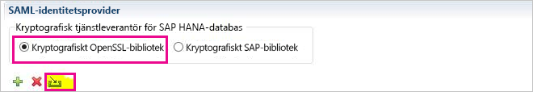
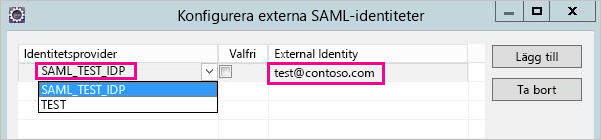
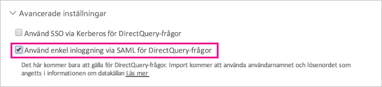

# <a name="use-security-assertion-markup-language-saml-for-sso-from-power-bi-to-on-premises-data-sources"></a>Använda Security Assertion Markup Language (SAML) för enkel inloggning från Power BI till lokala datakällor

Använd [Security Assertion Markup Language (SAML)](https://www.onelogin.com/pages/saml) för att aktivera sömlös anslutning för enkel inloggning. När enkel inloggning aktiveras blir det enkelt för Power BI-rapporter och instrumentpaneler att uppdatera data från lokala källor samtidigt som behörigheter på användarnivå på dessa källor respekteras.

## <a name="supported-data-sources"></a>Datakällor som stöds

Vi stöder för närvarande SAP HANA med SAML. Mer information om att installera och konfigurera enkel inloggning för SAP HANA med hjälp av SAML finns i ämnet om [SAML SSO för BI-plattform till HANA](https://wiki.scn.sap.com/wiki/display/SAPHANA/SAML+SSO+for+BI+Platform+to+HANA) i SAP HANA-dokumentationen.

Vi har stöd för ytterligare datakällor (inklusive HANA) med [Kerberos](service-gateway-sso-kerberos.md).

Tänk på att det för HANA **starkt** rekommenderas att du aktiverar kryptering innan du upprättar en SAML SSO-anslutning (det vill säga att du bör konfigurera HANA-servern till att acceptera krypterade anslutningar och även konfigurera gatewayen till att använda kryptering vid kommunikation med HANA-servern). HANA ODBC-drivrutinen kan **inte** kryptera SAML-försäkran som standard, och utan kryptering aktiverat skickas den signerade SAML-försäkran från gatewayen till HANA-servern okrypterat och kan vara utsatt för avlyssning och återanvändning av tredje part. Instruktioner om hur du aktiverar kryptering för HANA med hjälp av OpenSSL-biblioteket finns i [Aktivera kryptering för SAP HANA](/power-bi/desktop-sap-hana-encryption).

## <a name="configuring-the-gateway-and-data-source"></a>Konfigurera gatewayen och datakällan

För att använda SAML måste du etablera en förtroenderelation mellan de HANA-servrar som du vill aktivera SSO för och gatewayen, som fungerar som SAML-identitetsprovider (IdP) i det här scenariot. Det finns olika sätt att etablera den här relationen. Ett sätt är att importera X509-certifikatet för gateway-IdP:n till HANA-servrarnas förtroendelager. Ett annat sätt är att låta gatewayens X509-certifikat signeras av en rotcertifikatutfärdare (CA) som är betrodd av HANA-servrarna. Vi beskriver den senare metoden i den här guiden, men du kan använda en annan metod om det är enklare.

Observera också att även om OpenSSL används som kryptografiprovider för HANA-servern i den här guiden så rekommenderar SAP att du använder det kryptografiska SAP-biblioteket (kallas även CommonCryptoLib eller sapcrypto) i stället för OpenSSL för att slutföra de här installationsstegen där vi etablerar förtroenderelationen. Läs den officiella SAP-dokumentationen för mer information.

Följande steg beskriver hur du etablerar en förtroenderelation mellan en HANA-server och gatewayens IdP genom att registrera gateway-IdP:ns X509-certifikat med hjälp av en rotcertifikatutfärdare som är betrodd av HANA-servern. Du kommer att skapa denna rotcertifikatutfärdare.

1. Skapa rotcertifikatutfärdarens X509-certifikat och den privata nyckeln. Om du till exempel vill skapa rotcertifikatutfärdarens X509-certifikat och den privata nyckeln i .pem-format:

   ```
   openssl req -new -x509 -newkey rsa:2048 -days 3650 -sha256 -keyout CA_Key.pem -out CA_Cert.pem -extensions v3_ca
   ```

    Se till att rotcertifikatutfärdarens privata nyckel är korrekt skyddad – om den erhålls av tredje part kan den användas för att få obehörig åtkomst till HANA-servern.

    Lägg till certifikatet (till exempel CA_Cert.pem) till HANA-serverns förtroendelager så att HANA-servern ska lita på alla certifikat som signerats av rotcertifikatutfärdaren som du just har skapat. Du hittar platsen för HANA-serverns förtroendelager genom att undersöka konfigurationsinställningen **ssltruststore**. Om du har följt SAP-dokumentationen som beskriver hur du konfigurerar OpenSSL kan HANA-servern redan lita på en rotcertifikatutfärdare som du kan återanvända. Information finns i artikeln [How to Configure Open SSL for SAP HANA Studio to SAP HANA Server](https://archive.sap.com/documents/docs/DOC-39571) (Så konfigurerar du Open SSL för SAP HANA Studio till SAP HANA-server). Om du har flera HANA-servrar som du vill aktivera SAML SSO för kan du kontrollera att alla servrar litar på den här rotcertifikatutfärdaren.

1. Skapa X509-certifikat för gatewayens IdP. Om du till exempel vill skapa en begäran för signering av certifikat (IdP_Req.pem) och en privat nyckel (IdP_Key.pem) som är giltiga under ett år kör du följande kommando:

   ```
   openssl req -newkey rsa:2048 -days 365 -sha256 -keyout IdP_Key.pem -out IdP_Req.pem -nodes
   ```

   Signera begäran för certifikatsignering med hjälp av rotcertifikatutfärdaren som du har konfigurerat att dina HANA-servrar ska lita på. Om du till exempel vill registrera IdP_Req.pem med CA_Cert.pem och CA_Key.pem (certifikatet och nyckeln för rotcertifikatutfärdaren) kör du följande kommando:

   ```
   openssl x509 -req -days 365 -in IdP_Req.pem -sha256 -extensions usr_cert -CA CA_Cert.pem -CAkey CA_Key.pem -CAcreateserial -out IdP_Cert.pem
   ```

Det resulterande IdP-certifikatet ska gälla i ett år (se alternativet för dagar). Nu importerar du IdP:ns certifikat i HANA Studio för att skapa en ny SAML-identitetsprovider.

1. I SAP HANA Studio högerklickar du på din SAP HANA-server och navigerar sedan till **Säkerhet** &gt; **Open Security Console (Öppna säkerhetskonsol)** &gt; **SAML Identity Provider (SAML-identitetsprovider)** &gt; **OpenSSL Cryptographic Library (kryptografiskt bibliotek för OpenSSL)** .

    

1. Välj **Importera**, gå till IdP_Cert.pem och importera den.

1. I SAP HANA Studio väljer du mappen **Säkerhet**.

    

1. Expandera **Användare** och välj sedan den användare som du vill mappa din Power BI-användare till.

1. Välj **SAML** och sedan **Konfigurera**.

    

1. Välj den identitetsprovider som du skapade i steg 2. För **Extern identitet** anger du Power BI-användarens UPN (det vill säga den e-postadress som användaren loggar in på Power BI med) och väljer sedan **Lägg till**. Observera att om du har konfigurerat din gateway att använda konfigurationsalternativet *ADUserNameReplacementProperty* ska du ange det värde som ska ersätta Power BI-användarens ursprungliga UPN. Om du till exempel ställer in *ADUserNameReplacementProperty* på **SAMAccountName** bör du ange användarens **SAMAccountName**.

    

Nu när du har konfigurerat gatewayens certifikat och identitet konverterar du certifikatet till pfx-format och konfigurerar gatewayen till att använda certifikatet.

1. Konvertera certifikatet till pfx-format genom att köra följande kommando. Observera att det här kommandot namnger den resulterande PFX-filen samlcert.pfx och anger "root" som filens lösenord.

    ```
    openssl pkcs12 -export -out samltest.pfx -in IdP_Cert.pem -inkey IdP_Key.pem -passin pass:root -passout pass:root
    ```

1. Kopiera pfx-filen till gatewaydatorn:

    1. Dubbelklicka på samltest.pfx och välj sedan **Lokal dator** &gt; **Nästa**.

    1. Ange lösenordet och välj sedan **Nästa**.

    1. Välj **Placera alla certifikat i nedanstående arkiv**, sedan **Bläddra** &gt; **Personligt** &gt; **OK**.

    1. Välj **Nästa** och sedan **Slutför**.

    

1. Bevilja gatewaytjänstkontot åtkomst till den privata nyckeln för certifikatet:

    1. På gatewaydatorn kör du Microsoft Management Console (MMC).

        

    1. Under **Arkiv** väljer du **Lägg till/ta bort snapin-modul**.

        

    1. Välj **Certifikat** &gt; **Lägg till** och välj sedan **Datorkonto** &gt; **Nästa**.

    1. Välj **Lokal dator** &gt; **Slutför** &gt; **OK**.

    1. Expandera **Certifikat** &gt; **Personligt** &gt; **Certifikat** och leta upp certifikatet.

    1. Högerklicka på certifikatet och navigera till **Alla uppgifter** &gt; **Hantera privata nycklar**.

        

    1. Lägg till gatewaytjänstkontot till listan. Som standard är kontot **NT SERVICE\PBIEgwService**. Du kan ta reda på vilket konto som kör gatewaytjänsten genom att köra **services.msc** och leta upp **Tjänst för lokal datagateway**.

        

Slutligen följer du dessa steg för att lägga till tumavtrycket för certifikatet till gatewaykonfigurationen.

1. Kör följande PowerShell-kommando för att visa certifikaten på datorn.

    ```powershell
    Get-ChildItem -path cert:\LocalMachine\My
    ```

1. Kopiera tumavtrycket för det certifikat som du skapade.

1. Gå till gatewaykatalogen, vilken som standard är *C:\Program Files\On-premises data gateway (Lokal datagateway)* .

1. Öppna **PowerBI.DataMovement.Pipeline.GatewayCore.dll.config** och leta upp avsnittet *SapHanaSAMLCertThumbprint*. Klistra in det tumavtryck som du kopierade.

1. Starta om gatewaytjänsten.

## <a name="running-a-power-bi-report"></a>Köra en Power BI-rapport

Nu kan du använda sidan **Hantera gateway** i Power BI för att konfigurera SAP HANA-datakällan, och aktivera enkel inloggning under **Avancerade inställningar**. Du kan sedan publicera rapporter och datamängder med bindning till den datakällan.



## <a name="troubleshooting"></a>Felsökning

När du har konfigurerat enkel inloggning kan följande felmeddelande visas i Power BI-portalen: *”De tillhandahållna autentiseringsuppgifterna kan inte användas för SapHana-källan.”* Det här felet indikerar att SAML-autentiseringsuppgifterna avvisades av SAP HANA.

Autentiseringsspårning på serversidan ger detaljerad information för felsökning av problem med autentisering på SAP HANA. Följ de här stegen för att konfigurera spårning för din SAP HANA-server.

1. Aktivera autentiseringsspårning genom att köra följande fråga på SAP HANA-servern.

    ```
    ALTER SYSTEM ALTER CONFIGURATION ('indexserver.ini', 'SYSTEM') set ('trace', 'authentication') = 'debug' with reconfigure 
    ```

1. Återskapa ditt problem.

1. Öppna administrationskonsolen i HANA Studio och gå till fliken **Diagnosis Files** (diagnostikfiler).

1. Öppna den senaste spårningen av indexservern och sök efter SAMLAuthenticator.cpp.

    Du bör hitta ett detaljerat felmeddelande som anger den grundläggande orsaken, som i följande exempel.

    ```
    [3957]{-1}[-1/-1] 2018-09-11 21:40:23.815797 d Authentication   SAMLAuthenticator.cpp(00091) : Element '{urn:oasis:names:tc:SAML:2.0:assertion}Assertion', attribute 'ID': '123123123123123' is not a valid value of the atomic type 'xs:ID'.
    [3957]{-1}[-1/-1] 2018-09-11 21:40:23.815914 i Authentication   SAMLAuthenticator.cpp(00403) : No valid SAML Assertion or SAML Protocol detected
    ```

1. När du har slutfört felsökningen kan du stänga av autentiseringsspårningen genom att köra följande fråga.

    ```
    ALTER SYSTEM ALTER CONFIGURATION ('indexserver.ini', 'SYSTEM') UNSET ('trace', 'authentication');
    ```

## <a name="next-steps"></a>Nästa steg

Mer information om den **lokala datagatewayen** och **DirectQuery** finns i följande resurser:

* [Vad är en lokal datagateway?](/data-integration/gateway/service-gateway-onprem)
* [DirectQuery i Power BI](desktop-directquery-about.md)
* [Datakällor som stöds av DirectQuery](desktop-directquery-data-sources.md)
* [DirectQuery och SAP BW](desktop-directquery-sap-bw.md)
* [DirectQuery och SAP HANA](desktop-directquery-sap-hana.md)
