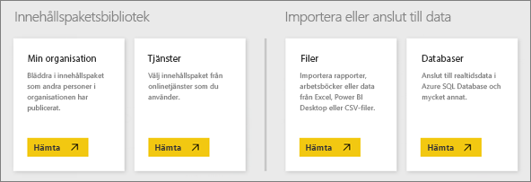

# Datakällor för Power BI-tjänsten
Datan finns centralt i Power BI. När du utforskar data, skapar diagram och instrumentpaneler, eller ställer frågor i Frågor och svar, hämtar alla dessa visualiseringar och svar som du ser sina underliggande data från en datauppsättning. Men var kommer datauppsättningen från? Från en datakälla.

I den här artikeln ska vi gå igenom de olika typer av datakällor som du kan ansluta till från Power BI-tjänsten. Kom ihåg att det även finns många andra typer av datakällor som du kan hämta data från. Men de källorna kan kräva att du först använder Power BI Desktop eller Excels avancerade funktioner för datafrågor och modellering. Vi ska se mer på detta senare. Just nu ska vi titta på olika typer av datakällor som du kan ansluta till direkt från Power BI-tjänstens webbplats.

Du kan hämta data från någon av dessa datakällor i Power BI genom att klicka på **Min arbetsyta** > **Hämta data**.

## Filer

**Excel** (.xlsx, .xlsm) – Excel är unikt eftersom en arbetsbok både kan innehålla data som du själv har lagt in i kalkylbladen och eftersom du kan fråga efter och läsa in data från externa datakällor med Power Query (Hämta och transformera i Excel 2016) eller Power Pivot. Du kan importera data som finns i tabeller i kalkylblad (datan *måste* finnas i en tabell), eller importera data som har lästs in i en datamodell. Läs mer i [Hämta data från Excel](service-get-data-from-files.md).

**Power BI Desktop** (.pbix) – Du kan använda Power BI Desktop till att fråga efter och läsa in data från externa datakällor, utöka datamodellen med mått och relationer samt skapa rapporter. Du kan importera din Power BI Desktop-fil till Power BI-webbplatsen. Power BI Desktop passar bäst för mer avancerade användare som har en god förståelse för sina datakällor, datafrågor och omvandling samt datamodelleringsbegrepp. Läs mer i [Ansluta till data i Power BI Desktop](desktop-connect-to-data.md).

**Kommaavgränsat värde** (.csv) – Filer är enkla textfiler med datarader. Varje rad kan innehålla ett eller flera värden, avgränsade med kommatecken. Exempelvis kan en .csv-fil som innehåller namn- och adressdata ha ett antal rader där varje rad innehåller värden för förnamn, efternamn, gatuadress, ort, region och så vidare. Du kan inte importera data till en .csv-fil, men många program som t.ex. Excel kan spara enkla tabelldata som en .csv-fil.

För andra filtyper som t.ex. XML-tabeller (.xml) eller textfiler (.txt), kan du använda Hämta och transformera för att fråga, transformera och läsa in data i en Excel- eller Power BI Desktop-fil först. Du kan sedan importera Excel- eller Power BI Desktop-filen till Power BI.

Var du lagrar dina filer gör också en stor skillnad. OneDrive för företag erbjuder störst flexibilitet och integrering med Power BI. Du kan spara filerna på den lokala enheten om du vill, men om du behöver uppdatera dina data krävs några extra steg. Mer information finns i de länkade artiklarna.

## Innehållspaket

Innehållspaketen innehåller alla data och rapporter som du behöver och de har redan förberetts åt dig. Det finns två typer av innehållspaket i Power BI: De som kommer från tjänster som Google Analytics, Marketo eller Salesforce och de som skapas och delas med andra användare i din organisation.

**Tjänster** – Det finns bokstavligt talat dussintals tjänster med innehållspaket för Power BI och fler läggs hela tiden. För de flesta tjänster måste du ha ett konto. Läs mer i [Ansluta till tjänster](service-connect-to-services.md).

**Organisation** – Om du och andra användare i din organisation har ett Power BI Pro-konto kan du skapa, dela och använda innehållspaket. Läs mer i [Organisationsinnehållspaket](service-organizational-content-pack-introduction.md).

## Databaser

**Databaser i molnet** – Från Power BI-tjänsten kan du ha en live-anslutning till Azure SQL Database, Azure SQL Data Warehouse, Spark i Azure HDInsight och SQL Server Analysis Services med DirectQuery. Anslutningar från Power BI till dessa databaser sker live, det vill säga att när du har anslutit till en Azure SQL Database och du börjar utforska data genom att skapa rapporter i Power BI, kommer en fråga att ställas direkt till databasen varje gång du segmenterar dina data eller lägger till ett annat fält i en visualisering. Läs mer i [Azure och Power BI](service-azure-and-power-bi.md).

**Databaser lokalt** – Från Power BI-tjänsten kan du ansluta direkt till databaser i SQL Server Analysis Services-tabellmodellen. Du måste ha en Power BI Enterprise Gateway. Om du är osäker på hur du ansluter till din organisations tabellmodelldatabas tar du kontakt med din administratör eller IT-avdelning. Läs mer i [SQL Server Analysis-tabelldata i Power BI](sql-server-analysis-services-tabular-data.md).

För andra typer av databaser i din organisation behöver du först använda Power BI Desktop eller Excel för att ansluta till, fråga och läsa in data i en datamodell. Du kan sedan importera filen till Power BI där en datauppsättning skapas. Om du har konfigurerat schemalagd uppdatering använder Power BI anslutningsinformationen från filen tillsammans med uppdateringsinställningarna som du har konfigurerat till att ansluta direkt till datakällan och fråga efter uppdateringar. Uppdateringarna läses sedan in i datauppsättningen i Power BI. Läs mer i [Ansluta till data i Power BI Desktop](desktop-connect-to-data.md).

## Vad gör jag om mina data kommer från en annan källa?
Det finns bokstavligt talat hundratals olika datakällor som du kan använda med Power BI. Men oavsett var du hämtar data från måste datan vara i ett format som Power BI-tjänsten kan använda för att skapa rapporter och instrumentpaneler, besvara frågor med Frågor och svar och så vidare.

Vissa datakällor har redan sina data i ett format som är redo för Power BI-tjänsten, som t.ex. innehållspaket från tjänstleverantörer som Google Analytics och Twilio. Databaser i SQL Server Analysis Services-tabellmodellerna är också redo. Och du kan ansluta live till databaser i molnet som Azure SQL Database och Spark i HDInsight.

I andra fall kan det vara nödvändigt att fråga efter och läsa in de data som du vill använda i en fil. Anta exempelvis att du har logistikdata i en informationslagerdatabas på en server i din organisation. Du kan inte ansluta direkt till databasen i Power BI-tjänsten för att utforska datan (om det inte är en tabellmodelldatabas). Men du kan använda Power BI Desktop eller Excel för att fråga och läsa in logistikdata i en datamodell som du sedan sparar som en fil. Du kan sedan importera filen till Power BI där en datauppsättning skapas.

Du tänker förmodligen ”Men logistikdata i den databasen ändras ju varje dag. Hur kontrollerar jag att min datauppsättning i Power BI har uppdaterats? – Anslutningsinformationen från Power BI Desktop eller Excel-filen importeras till datauppsättningen tillsammans med informationen. Om du konfigurerar en schemalagd uppdatering eller gör en manuell uppdatering av datauppsättningen använder Power BI anslutningsinformationen från datauppsättningen, tillsammans med några andra inställningar, till att ansluta direkt till databasen, fråga efter uppdateringar och läsa in uppdateringarna i datauppsättningen. En Power BI-gateway kommer troligen krävas för att skydda all dataöverföring mellan din lokala server och Power BI. Dina visualiseringar i rapporter och instrumentpaneler uppdateras automatiskt.

Bara för att du inte kan ansluta till din datakälla direkt från Power BI-tjänsten innebär det alltså inte att du inte kan hämta data till Power BI. Det krävs bara några fler steg och kanske viss hjälp från IT-avdelningen. Se [Datakällor i Power BI Desktop](desktop-data-sources.md) om du vill veta mer.

## Visa mer information
Du har säkert sett att termerna datauppsättning och datakälla används mycket i Power BI. De används ofta synonymt men är faktiskt två olika saker, även om de är relaterade.

En ***datauppsättning*** skapas automatiskt i Power BI när du använder Hämta data för att ansluta till och importera data från ett innehållspaket, en fil eller om du ansluter till en live-datakälla. En datauppsättning innehåller information om datakällan, autentiseringsuppgifterna för datakällan, och i de flesta fall en delmängd med data som kopierats från datakällan. I de flesta fall när du skapar visualiseringar i rapporter och instrumentpaneler tittar du på data i datauppsättningen.

En ***datakälla*** är den plats som datan i en datauppsättning egentligen kommer från. Det kan vara en onlinetjänst som Google Analytics eller QuickBooks, en databas i molnet som Azure SQL Database, eller en databas eller fil på en lokal dator eller server i din organisation.

### Datauppdatering
Om du sparar filerna på din lokala enhet eller en enhet någonstans i din organisation, kanske du måste ha en Power BI-gateway för att kunna uppdatera datauppsättningen i Power BI. Och datorn där filen sparas måste vara igång när en uppdatering görs. Du kan också importera filen igen, eller använda Publicera från Excel eller Power BI Desktop, men de är inte automatiserade processer.

Om du sparar filer på OneDrive för företag eller SharePoint – gruppwebbplatser och ansluter till eller importerar dem till Power BI, kommer din datauppsättning, dina rapporter och din instrumentpanel alltid vara uppdaterad. Eftersom både OneDrive och Power BI finns i molnet, kan Power BI ansluta direkt till den sparade filen cirka en gång i timmen och söka efter uppdateringar. Om någon sådan hittas uppdateras datauppsättningen och alla visualiseringar automatiskt.

Innehållspaket från tjänster uppdateras automatiskt. I de flesta fall en gång om dagen. Du kan uppdatera manuellt, men om du ser uppdaterade data eller ej beror på tjänstleverantören. Innehållspaket från andra i din organisation beror på vilka datakällor som använts och hur den person som skapade innehållspaketet har konfigurerat uppdateringen.

Azure SQL Database, Azure SQL Data Warehouse och Spark på Azure HDInsight är unika eftersom de är datakällor i molnet. Eftersom Power BI-tjänsten också finns i molnet kan Power BI ansluta till dem live med DirectQuery. Det som visas i Power BI är alltid synkroniserat och det finns inget behov av att konfigurera uppdateringar.

SQL Server Analysis Services är unikt eftersom när du ansluter till den från Power BI är det en live-anslutning precis som en Azure-databas i molnet, men själva databasen finns på en server i din organisation. Den här typen av anslutning kräver en Power BI-gateway, vilket vanligtvis konfigureras av en IT-avdelning.

Datauppdatering är en mycket viktig del av Power BI och det blir för mycket att gå igenom allt här. Om du vill ha en djupare kunskap kan du läsa mer i [Datauppdatering i Power BI](refresh-data.md).

## Överväganden och begränsningar
Följande överväganden och begränsningar gäller för alla datakällor som används i Power BI-tjänsten. Det finns andra begränsningar som gäller för specifika funktioner, men listan nedan gäller för den övergripande Power BI-tjänsten:

* **Storleksgräns för datauppsättning** – Det finns en gräns på 1 GB för varje datauppsättning i Power BI-tjänsten.
* **Radgräns** – Det maximala antalet rader i dina datauppsättning (om du inte använder DirectQuery) är 2 miljarder, där tre av dessa rader är reserverade (vilket innebär att högst 1 999 999 997 rader kan användas). Det maximala antalet rader när du använder DirectQuery är 1 miljon.
* **Kolumngräns** – Det maximala antalet kolumner som tillåts i en datauppsättning över alla tabeller i datauppsättningen är 16 000. Detta gäller för Power BI-tjänsten och för datauppsättningar som används i Power BI Desktop. Power BI använder en intern radnummerkolumn per tabell som ingår i datauppsättningen, vilket innebär att det maximala antalet kolumner är 16 000 minus 1 för varje tabell som används i datauppsättningen.

