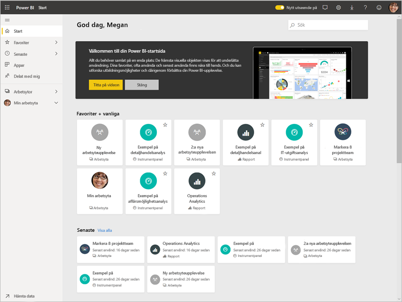
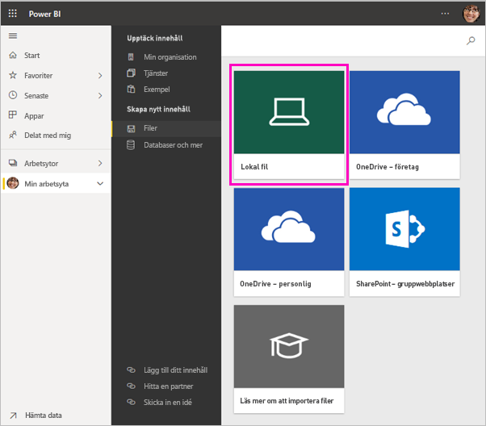
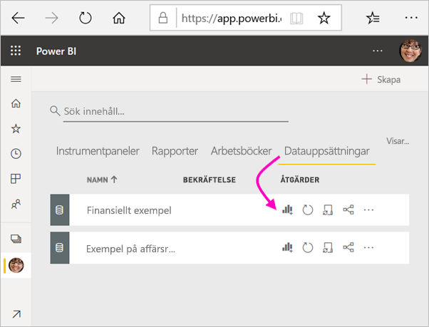
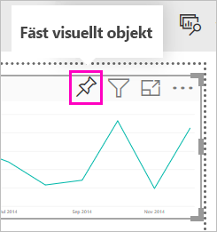
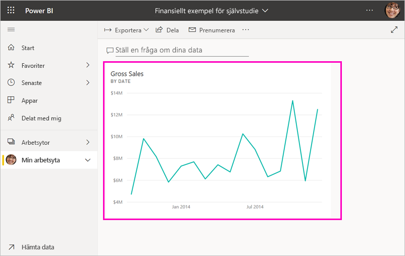
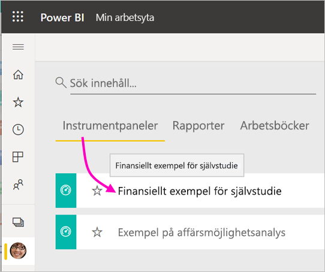
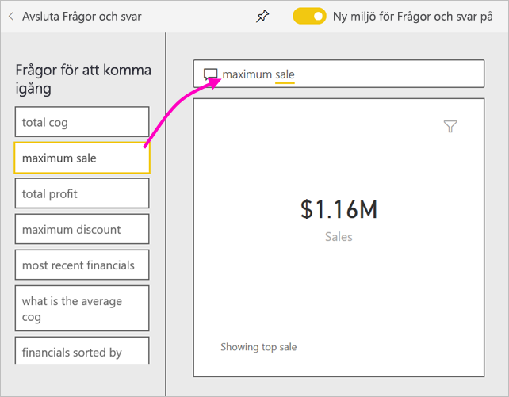
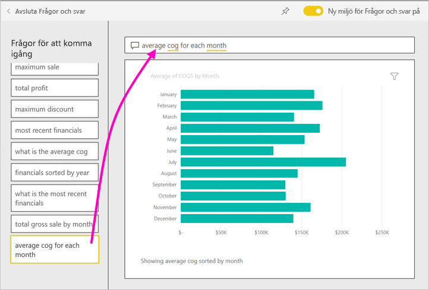
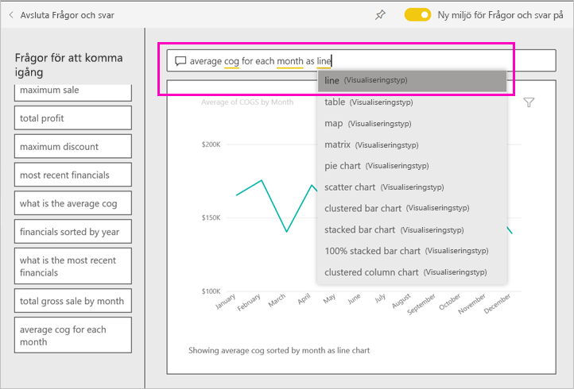

# Självstudie: Kom igång med Power BI-tjänsten
Den här självstudien är en introduktion till några av funktionerna i *Power BI-tjänsten*. I självstudien ansluter du till data, skapar en rapport och en instrumentpanel och ställer frågor om dina data. Du kan göra mycket mer i Power BI-tjänsten. Den här självstudien är bara en aptitretare. Om du vill förstå hur Power BI-tjänsten passar ihop med andra Power BI-erbjudanden rekommenderar vi att du läser [Vad är Power BI](fundamentals/power-bi-overview.md).

I den här självstudien går du igenom följande steg:

> [!div class="checklist"]
> * Logga in på ditt Power BI-onlinekonto, eller registrera dig om du inte har ett konto.
> * Öppna Power BI-tjänsten.
> * Hämta några data och öppna dem i rapportvyn.
> * Använd dessa data för att skapa visualiseringar och spara dem som en rapport.
> * Skapa en instrumentpanel genom att fästa paneler från rapporten.
> * Lägg till ytterligare visualiseringar på instrumentpanelen med verktyget för frågor och svar på naturligt språk.
> * Ändra storlek på, ordna om och interagera med panelerna på instrumentpanelen.
> * Rensa resurser genom att ta bort datamängden, rapporten och instrumentpanelen.

> [!TIP]
> Föredrar du en kostnadsfri självstudiekurs istället? [Registrera dig för vår kurs Analysera och visualisera data på EdX](https://aka.ms/edxpbi).

## Registrera dig för Power BI-tjänsten
Om du inte har något Power BI-konto [registrerar du dig för en kostnadsfri Power BI Pro-utvärderingsversion](https://app.powerbi.com/signupredirect?pbi_source=web) innan du börjar.

När du har ett konto anger du *app.powerbi.com* i webbläsaren för att öppna Power BI-tjänsten. 

## Steg 1: Hämta data

När du vill skapa en Power BI-rapport börjar du ofta i Power BI Desktop. Den här gången ska vi börja från början och skapa en rapport i Power BI-tjänsten.

I den här självstudien får vi data från en CSV-fil. Vill du hänga på? [Ladda ned CSV-filen med finansiella exempel](https://go.microsoft.com/fwlink/?LinkID=521962).

1. [Logga in till Power BI](https://www.powerbi.com/). Har du inte något konto? Inga problem, du kan registrera dig för en kostnadsfri utvärderingsversion.
2. Power BI öppnas i webbläsaren. Välj **Hämta data** längst ned i navigeringsfönstret.

    Sidan **Hämta data** öppnas.   

3. Under avsnittet **Skapa nytt innehåll** väljer du **Filer**. 
   
   
4.  Välj **Lokal fil**.
   
    

5. Bläddra till filen på datorn och välj **Öppna**.

5. I den här självstudien väljer vi **Importera** för att lägga till Excel-filen som en datauppsättning som vi sedan kan använda för att skapa rapporter och instrumentpaneler. Om du väljer **Ladda upp** laddas hela Excel-arbetsboken upp till Power BI, där du kan öppna och redigera den i Excel Online.
   
   
6. När din datauppsättning är klar väljer du **Datauppsättningar** och sedan **Skapa rapport** bredvid datauppsättningen **Finansiellt exempel** för att öppna rapportredigeraren. 

    

    Rapportarbetsytan är tom. På höger sida visas fönstren **Filter**, **Visualiseringar** och **Fält**.

    

7. Observera att alternativet **Läsvy** finns i det övre navigeringsfönstret. Eftersom du har det här alternativet innebär det att du för närvarande är i Redigeringsvy. Ett bra sätt för dig att bekanta dig med rapportredigeraren är att [ta en rundtur](service-the-report-editor-take-a-tour.md).

    

    I redigeringsvyn kan du skapa och ändra dina rapporter eftersom du är *ägare* till rapporten. Det innebär att du är *skapare*. När du delar din rapport med kollegor kan de bara interagera med rapporten i läsvyn. Kollegorna är alltså *konsumenter*. Lär dig mer om [Läsvy och Redigeringsvy](consumer/end-user-reading-view.md).

## Steg 2: Skapa ett diagram i en rapport
Nu när du har anslutit till dina data kan du börja utforska omgivningarna.  När du har hittat något intressant, kan du skapa en instrumentpanel för att övervaka det och se hur det ändras med tiden. Nu ska vi se hur det fungerar.
    
1. I rapportredigeraren börjar vi i fönstret **Fält** till höger på sidan för att skapa en visualisering. Markera kryssrutorna **Bruttoförsäljning** och **Datum**.
   
   

    Power BI analyserar informationen och skapar en visualisering. Om du markerade **Datum** först visas en tabell. Om du markerade **Bruttoförsäljning** först visas ett stapeldiagram. 

2. Växla till ett annat sätt att visa dina data. Nu visar vi dessa data som ett linjediagram. Välj ikonen för linjediagram i fönstret **Visualiseringar**.
   
   

3. Det här diagrammet ser intressant ut så vi *fäster* det på en instrumentpanel. Hovra över visualiseringen och välj fästikonen. När du fäster visualiseringen sparas den på instrumentpanelen och hålls uppdaterad så att du kan se det senaste värdet direkt.
   
   

4. Eftersom den här rapporten är ny uppmanas du att spara den innan du kan fästa en visualisering på instrumentpanelen. Ge rapporten ett namn (till exempel *Försäljning över tid*) och välj sedan **Spara**. 

5. Välj **Ny instrumentpanel** och ge det namnet *Finansiellt exempel för självstudie*. 
   
   
   
6. Välj **fäst**.
   
    Ett meddelande (nära det övre högra hörnet) anger att visualiseringen har lagts till som en panel på instrumentpanelen.
   
    

7. Välj **Gå till instrumentpanelen** för att se den nya instrumentpanelen med linjediagrammet som du fäste som en panel på instrumentpanelen. 
   
   
   
8. Välj den nya panelen på instrumentpanelen för att gå tillbaka till rapporten. Power BI visar rapporten i läsvyn. 

1. Du kan gå tillbaka till redigeringsvyn genom att välja **Fler alternativ** (...) i det översta navigeringsfältet > **Redigera**. När du är i redigeringsvyn kan du fortsätta att utforska och fästa paneler.

    

## Steg 3: Utforska med frågor och svar

Om du vill utforska dina data snabbt kan du prova med att ställa en fråga i rutan Frågor och svar. Frågor och svar skapar frågor om dina data på ett naturligt språk. Rutan Frågor och svar finns längst upp (**Ställ en fråga om dina data**). I en rapport finns den i det översta navigeringsfönstret (**Ställ en fråga**).

1. Om du vill gå tillbaka till instrumentpanelen väljer du **Min arbetsyta** i det svarta **Power BI**-fältet.

    

1. Välj din instrumentpanel på fliken **Instrumentpaneler**.

    

1. Välj **Ställ en fråga om dina data**. Frågor och svar visar automatiskt ett antal förslag.

    

    > [!NOTE]
    > Om du inte kan se förslagen aktiverar du **Nya frågor och svar-upplevelsen**.

2. Några av förslagen returnerar ett enda värde. Välj till exempel **maximal försäljning**.

    Frågor och svar söker efter svar och visar dem i form av en *kortvisualisering*.

    

3. Välj fästikonen  för att visa den här visualiseringen på instrumentpanelen Finansiellt exempel för självstudie.

1. Rulla ned i listan **Frågor för att komma igång** och välj **average cog for each month** (genomsnittlig kostnad för sålda varor för varje månad). 

    

1. Fäst även det liggande stapeldiagrammet på instrumentpanelen **Finansiellt exempel för självstudie**.

1. Placera markören efter *by month* (efter månad) i rutan Frågor och svar och skriv *as line* (som linje). Välj **linje (Visualiseringstyp)** . 

    

4. Välj **Avsluta frågor och svar** för att återgå till instrumentpanelen, där du kan se de nya panelerna du skapade. 

   

   Du kan se att panelen fortfarande är ett stapeldiagram, trots att du ändrade diagrammet till ett linjediagram. Det beror på att panelen var ett stapeldiagram när du fäste den. 

## Steg 4: Flytta paneler

Instrumentpanelen är bred. Vi kan ordna om panelerna så att vi kan utnyttja instrumentpanelens utrymme på ett bättre sätt.

1. Dra i det nedre högra hörnet av panelen med linjediagrammet *Bruttoförsäljning* uppåt tills den fäster på plats i samma höjd som panelen Försäljning och släpp sedan panelen.

    

    Nu har de två panelerna samma höjd.

    

1. Dra panelen med stapeldiagrammet *Genomsnittlig kostnad för sålda varor* tills den passar under linjediagrammet *Bruttoförsäljning*.

    Det ser bättre ut.

    

## Steg 5: Interagera med paneler

Nu ska vi titta på en sista interaktion innan du börjar skapa dina egna instrumentpaneler och rapporter. Du får olika resultat när du väljer olika paneler. 

1. Välj först panelen med linjediagrammet *Bruttoförsäljning* som du har fäst i rapporten. 

    Rapporten öppnas i läsvyn i Power BI. 

2. Välj Bakåt-knappen i webbläsaren. 

1. Nu väljer du panelen med stapeldiagrammet *Genomsnittlig kostnad för sålda varor* som du skapade i Frågor och svar. 

    Rapporten öppnas inte i Power BI. Frågor och svar öppnas i stället, eftersom du skapade det här diagrammet där.

## Rensa resurser
Nu när du är klar med självstudien kan du ta bort datauppsättningen, rapporten och instrumentpanelen. 

1. Kontrollera i navigeringsfönstret att du är i **Min arbetsyta**.
2. Välj fliken **Datauppsättningar** och hitta datauppsättningen du importerade för den här självstudien.  
3. Välj **Fler alternativ** (...) > **Ta bort**.

    

    När du tar bort datauppsättningen visas varningsmeddelandet **Alla rapporter och instrumentpanelsflikar som innehåller data från den här datauppsättningen kommer också att tas bort**.

4. Välj **Ta bort**.

## Nästa steg

Du kan göra instrumentpaneler ännu bättre genom att lägga till fler visualiseringspaneler och [byta namn och storlek på dem, länka till dem och placera om dem](service-dashboard-edit-tile.md).

