# Självstudie: Kom igång med Power BI-tjänsten (app.powerbi.com)
Dessa självstudier hjälper dig att komma igång med ***Power BI-tjänsten***. Om du vill förstå hur Power BI-tjänsten passar ihop med andra Power BI-erbjudanden, så rekommenderar vi starkt att du börjar med att läsa [Vad är Power BI](power-bi-overview.md).

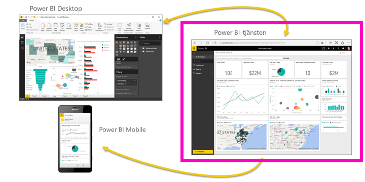

I den här självstudien går du igenom följande steg:

> [!div class="checklist"]
> * Hitta annat kom igång-innehåll för Power BI-tjänsten
> * Logga in på ditt Power BI-onlinekonto eller registrera dig om du inte har ett konto
> * Öppna Power BI-tjänsten
> * Hämta information och öppna den i rapportvyn
> * Använd informationen för att skapa visualiseringar och spara som en rapport
> * Skapa en instrumentpanel genom att fästa paneler från rapporten
> * Lägg till ytterligare visualisering på instrumentpanelen med verktyget för frågor och svar på naturligt språk
> * Rensa resurser genom att ta bort datauppsättningen, rapporten och instrumentpanelen

## Registrera dig för Power BI-tjänsten
Om du inte har registrerat dig för Power BI, [registrerar du dig för en kostnadsfri Power BI Pro-utvärderingsversion](https://app.powerbi.com/signupredirect?pbi_source=web) innan du börjar.

Om du redan har ett konto öppnar du en webbläsare och skriver in app.powerbi.com för att öppna Power BI-tjänsten. 

Om du behöver hjälp med Power BI Desktop, så läs [Kom igång med Desktop](desktop-getting-started.md). Om du behöver hjälp med Power BI Mobile, så läs [Power BI-appar för mobila enheter](consumer/mobile/mobile-apps-for-mobile-devices.md).

> [!TIP]
> Föredrar du en kostnadsfri självstudiekurs istället? [Registrera dig för vår kurs Analysera och visualisera data på EdX](http://aka.ms/edxpbi).

Besök vår [spelningslista på YouTube](https://www.youtube.com/playlist?list=PL1N57mwBHtN0JFoKSR0n-tBkUJHeMP2cP). En bra video är att börja med är Introduktion till Power BI-tjänsten:
> 
> <iframe width="560" height="315" src="https://www.youtube.com/embed/B2vd4MQrz4M" frameborder="0" allowfullscreen></iframe>
> 

## Vad är Power BI-tjänsten?
Microsofts Power BI-tjänst kallas ibland för Power BI online eller app.powerbi.com. Power BI hjälper dig att hålla dig uppdaterad med den information som är viktig för dig.  Tack vare Power BI-tjänsten hjälper ***instrumentpanelerna*** dig att ha koll på verksamhetens puls.  Instrumentpanelerna visar ***paneler*** i vilka du kan öppna ***rapporter*** genom att klicka, för att sedan utforska vidare.  Anslut till flera ***datauppsättningar*** så att alla relevanta data samlas på samma plats. Behöver du hjälp att förstå de olika byggstenarna i Power BI?  Mer information finns i [Power BI – grundläggande begrepp](consumer/end-user-basic-concepts.md).

Om du har viktiga data i Excel- eller CSV-filer, så kan du skapa en Power BI-instrumentpanel så att du kan hålla dig informerad var du än befinner dig och dela information med andra.  Prenumererar du på ett SaaS-program som Salesforce?  Kom igång direkt genom att ansluta till Salesforce och automatiskt skapa en instrumentpanel från dessa data, eller [ta en närmare titt på alla andra SaaS-appar](service-get-data.md) som du kan ansluta till. Om du arbetar för en organisation kan du kontrollera om några [appar](service-create-distribute-apps.md) har publicerats för dig.

Läs mer om alla andra sätt att [hämta data på för Power BI](service-get-data.md).

## Steg 1: Hämta data
Här är ett exempel på hämtning av data från en CSV-fil. Vill du följa den här självstudien? [Hämta den här CSV-exempelfilen](http://go.microsoft.com/fwlink/?LinkID=521962).

1. [Logga in till Power BI](http://www.powerbi.com/). Har du inte något konto? Inga problem, du kan registrera dig för en kostnadsfri utvärderingsversion.
2. Power BI öppnas i webbläsaren. Välj **Hämta data** längst ned i det vänstra navigeringsfältet.
   
   
3. Välj **Filer**. 
   
   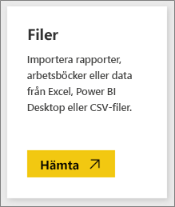
4. Bläddra till filen på datorn och välj **Öppna**. Om du har sparat den i OneDrive för företag, väljer du det alternativet. Om du har sparat den lokalt, väljer du **Lokal fil**. 
   
   
5. I den här självstudien väljer vi **Importera** så att vi kan lägga till Excel-filen som en datauppsättning som vi sedan kan använda för att skapa rapporter och instrumentpaneler. Om du väljer **Ladda upp** överförs hela Excel-arbetsboken till Power BI, där du kan öppna och redigera den i Excel Online.
   
   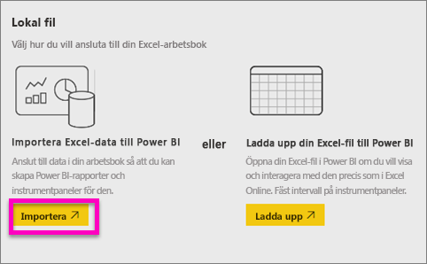
6. När din datauppsättning är klar öppnar du den i rapportredigeraren genom att välja **Visa datauppsättning**. 

    

    Eftersom vi inte har skapat några visualiseringar än är rapportarbetsytan tom.

    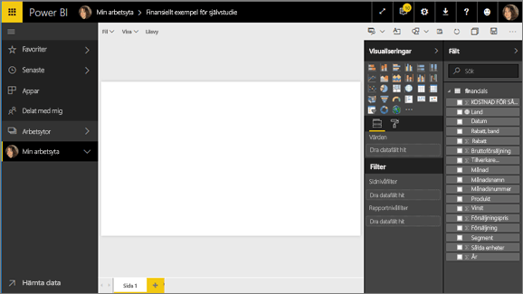

6. Ta en titt på den översta menyraden och lägg märke till att det finns ett alternativ som heter **Läsvy**. Eftersom alternativet Läsvy visas, innebär det att du för närvarande befinner dig i **redigeringsvyn**. 

    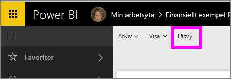

    I redigeringsvyn kan du skapa och ändra dina rapporter eftersom du är *ägare* till rapporterna. Det är du som är *skaparen*. När du delar din rapport med kollegor kan de bara interagera med rapporten i läsvyn. De är *konsumenter*. Lär dig mer om [Läsvy och Redigeringsvy](consumer/end-user-reading-view.md).
    
    Ett bra sätt för dig att bekanta dig med rapportredigeraren är att [ta en rundtur](service-the-report-editor-take-a-tour.md)
   > 
 

## Steg 2: Börja utforska din datauppsättning
Nu när du har anslutit till dina data kan du börja utforska omgivningarna.  När du har hittat något intressant, kan du skapa en instrumentpanel för att övervaka det och se hur det ändras med tiden. Nu ska vi se hur det fungerar.
    
1. I rapportredigeraren använder vi fönstret **Fält** till höger på sidan för att skapa en visualisering.  Markera kryssrutan intill **Bruttoförsäljning** och **Datum**.
   
   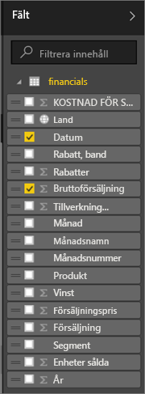

2. Power BI analyserar informationen och skapar en visualisering.  Om du markerade **Datum** först, så visas en tabell.  Om du markerade **Bruttoförsäljning** först, så visas ett diagram. Växla till ett annat sätt att visa dina data. Nu visar vi dessa data som ett linjediagram. Välj linjediagramsikonen (kallas även mall) från **visualiseringsfönstret**.
   
   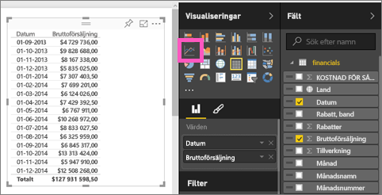

3. Det ser intressant ut så vi *fäster* det på en instrumentpanel. Hovra över visualiseringen och välj **stiftikonen**.  När du har fäst visualiseringen sparas den på instrumentpanelen och hålls uppdaterad så att du kan spåra det senaste värdet direkt.
   
   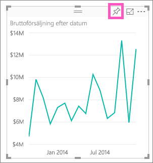

4. Eftersom detta är en ny rapport uppmanas du att spara den innan du kan fästa en visualisering på instrumentpanelen. Ge rapporten ett namn (till exempel *Försäljning över tid*) och välj **Spara och fortsätt**. 
   
   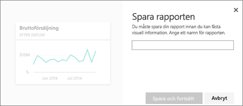
   
5. Vi fäster linjediagrammet på en ny instrumentpanel och ger det namnet ”Ekonomiskt exempel för självstudier”. 
   
   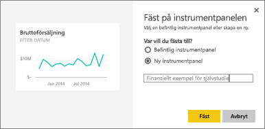
   
1. Välj **fäst**.
   
    Genom ett meddelande (nära det övre högra hörnet) får du reda på att visualiseringen har lagts till, som en panel, på instrumentpanelen.
   
    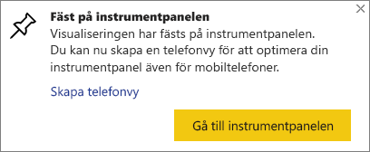

6. Välj **Gå till instrumentpanelen** för att se linjediagrammet fäst, som en panel, på din helt nya instrumentpanel. Du kan göra instrumentpanelen ännu bättre genom att lägga till fler visualiseringspaneler och [byta namn och storlek på dem, länka till dem och placera om dem](service-dashboard-edit-tile.md).
   
   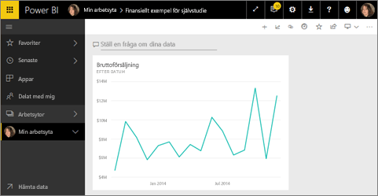
   
   Välj den nya panelen på instrumentpanelen och gå tillbaka till rapporten. Power BI för dig tillbaka till rapportredigeraren i läsvyn. Om du vill växla tillbaka till redigeringsvyn, väljer du **Redigera rapporten** från den översta menyraden. När du befinner dig i redigeringsvyn igen kan du fortsätta att utforska och fästa paneler. 

## Steg 3: Fortsätt att utforska med Frågor och svar (frågor på naturligt språk)
1. Om du vill utforska dina data snabbt, så försök med att ställa en fråga i rutan Frågor och svar. Frågerutan för Frågor och svar är placerad längst upp på instrumentpanelen (**Ställ en fråga om dina data**) och i menyraden överst i rapporten (**Ställ en fråga**). Försök till exempel att skriva ”vilket segment hade mest intäkter”.
   
   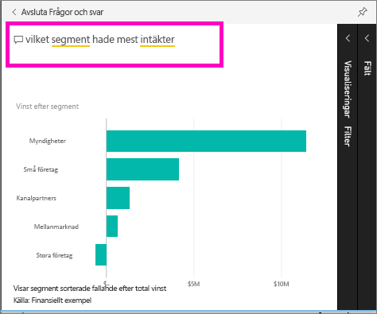

2. Frågor och svar söker efter svar och visar dem i form av en visualisering. Välj fästikonen  om du även vill visa den här visualiseringen på instrumentpanelen.
3. Fäst visualiseringen på instrumentpanelen ”Ekonomiskt exempel för självstudier”.
   
    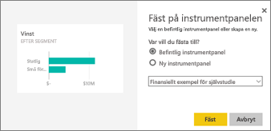

4. Gå tillbaka till instrumentpanelen där du ser den nya panelen.

   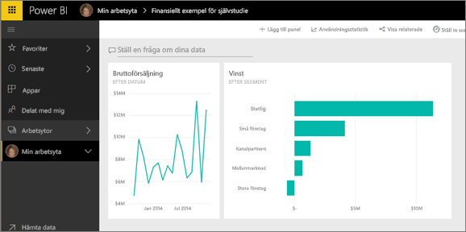

## Rensa resurser
Nu när du är klar med självstudien kan du ta bort datauppsättningen, rapporten och instrumentpanelen. 

1. Välj **Min arbetsyta** i det vänstra navigeringsfältet.
2. Välj fliken **Datauppsättningar** och hitta datauppsättningen du importerade för den här självstudien.  
3. Välj ellipsen (...) > **Ta bort**.

    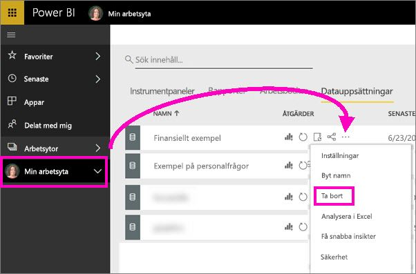

    När du tar bort datauppsättningen tas även rapporten och instrumentpanelen bort. 

## Nästa steg
Är du redo att testa mer?  Här följer några bra exempel på hur du kan utforska Power BI.

> [!div class="nextstepaction"]
> [Ansluta till onlinetjänster som du använder](service-connect-to-services.md)

