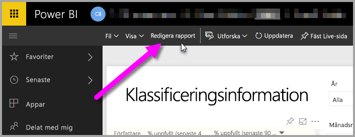
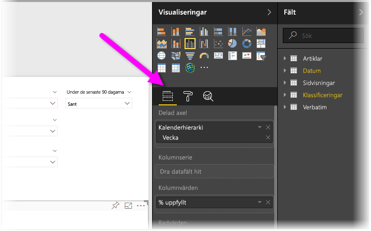
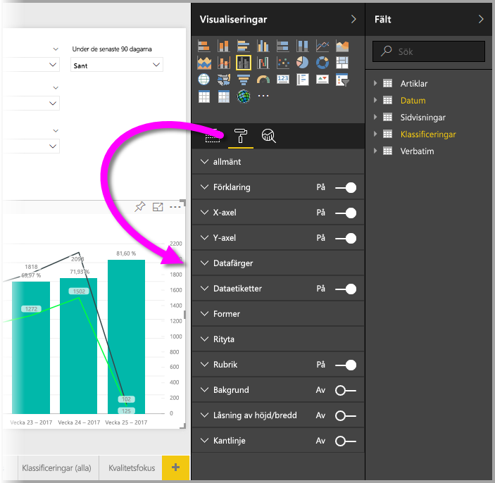
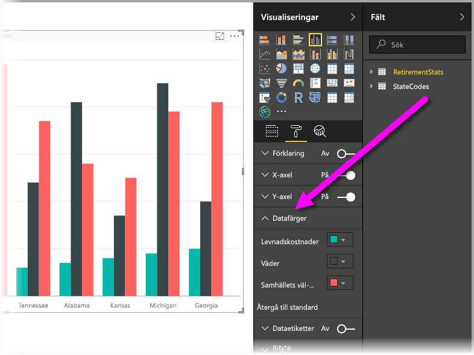
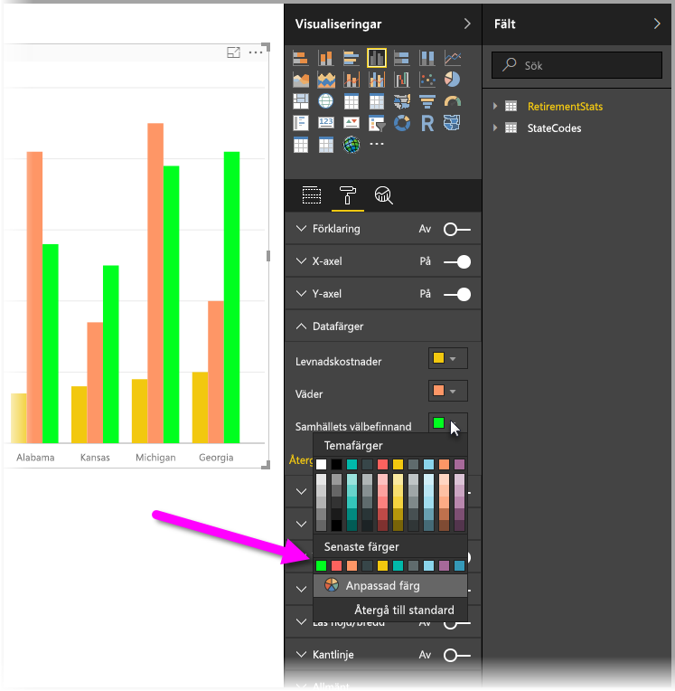
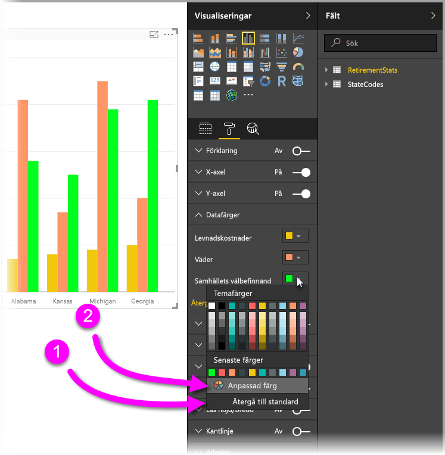
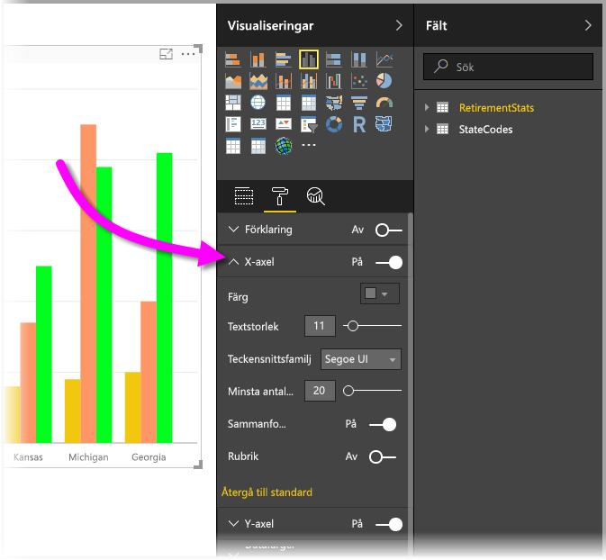

# Komma igång med färgformatering och axelegenskaper
I **Power BI** kan du ändra färg på dataserier, datapunkter och även visualiseringarnas bakgrund. Du kan också ändra hur x- och y-axeln visas, vilket ger dig fullständig kontroll över hur dina instrumentpaneler och rapporter visas.

Kom igång genom att markera en **rapport** i fönstret **Min arbetsyta**. Välj sedan **Redigera rapport** på menyn högst upp.  

När du redigerar en rapport och du har en vald visualisering visas fönstret **Visualiseringar**, där du kan lägga till eller ändra visualiseringar. Direkt under de tillgängliga visualiseringarna finns tre ikoner: **fältikonen** (en stack med staplar), **formatikonen** (en roller) och **analysikonen** (ett förstoringsglas). På bilden nedan har **fältikonen** valts, vilket indikeras med ett gult fält under ikonen.

När du väljer **Format** visar området under ikonen de färg- och axelanpassningar som är tillgängliga för den för tillfället valda visualiseringen.  

Du kan anpassa många element i respektive visualisering:

* Förklaring
* X-axeln
* X-axeln
* Datafärger
* Dataetiketter
* Former
* Ritytan
* Rubrik
* Bakgrund
* Låsning av höjd/bredd
* Kantlinje

> [!NOTE]
>  
> Alla dessa element visas inte med varje visualisering. Den visualisering du väljer påverkar vilka anpassningar som är tillgängliga. Någon x-axel visas t.ex. inte om du har markerat ett cirkeldiagram, eftersom cirkeldiagram inte har någon x-axel.
> 
> 

Observera också att om du inte har markerat någon visualisering så visas **filter** istället för ikoner, vilket gör att du kan använda filter för alla visualiseringar på sidan.

Låt oss se på några exempel: ett handlar om att arbeta med färger, och det andra handlar om att ändra en axels egenskaper. Efter det bör du vara redo att anpassa färger, axlar och etiketter mest hela dagen.

## Arbeta med färger
Låt oss gå igenom de olika stegen för hur man anpassar färger i ett diagram.

1. Välj ett **grupperat stående stapeldiagram** på rapportarbetsytan.
2. Välj sedan **formatikonen** så att du kan visa tillgängliga anpassningar.
3. Välj sedan den lilla nedåtpilen till vänster om **Datafärger**. Här ser du hur du kan anpassa datafärgerna, med alternativ som är specifika för den markerade visualiseringen.
4. **Datafärger** utvidgas nedåt, så att dess tillgängliga anpassningar visas.  
   

Låt oss göra några ändringar. Genom att välja nedåtpilen bredvid färgen kan du göra ändringar på varje tillgängliga dataserie. Låt oss färga **levnadskostnader** gult **väder** orange och **hälsa** grönt. Följande skärmbild visar hur jag ändrar **levnadskostnader**.  

Ändringarna visas på bilden nedan. Oj, det var ett ljust diagram. Här får du några användbara tips att tänka på när du arbetar med färger. Siffrorna i följande lista visas även på följande skärmbild, där de indikerar var du kan hitta och ändra dessa användbara element.

1. Gillar du inte färgerna? Inga problem. Det är bara att välja **Återgå till standard**, så återgår markeringen till standardinställningarna. Du kan göra det för en färg eller för hela visualiseringen.
2. Vill du ha en färg som inte visas på paletten? Då är det bara att välja **Egen färg**, och välja färg i spektrumet.  
   

Är du inte överförtjust i den ändring du just har gjort? Ångra med **CTRL + Z**, precis som du är van att göra i andra sammanhang.

## Ändra axelegenskaper
Det kan ofta vara användbart att ändra x-axeln eller y-axeln. På liknande sätt som du arbetar med färger kan du ändra en axel genom att välja nedåtpilen till vänster om den axel som du vill ändra, så som visas på följande bild.  

Om du vill komprimera alternativen för **x-axeln** så välj bara uppåtpilen intill **x-axeln**.

Du kan ta bort x-axelns etiketter helt och hållet genom att klicka på alternativknappen bredvid **x-axeln**. Du kan också ange om du vill aktivera eller inaktivera axelrubriker genom att välja alternativknappen bredvid **rubriken**.  

Det finns alla möjliga typer av färger att välja bland, och många andra anpassningar du kan använda till dina Power BI-rapporter och instrumentpaneler.

> [!NOTE]
>  
> Dessa färger, axlar och relaterade anpassningar är tillgängliga när ikonen **Format** är markerad, och de är också tillgängliga i Power BI Desktop.
> 
> 

## Nästa steg
Mer information finns i följande artikel:  

* [Tips för färgformatering i Power BI](service-tips-and-tricks-for-color-formatting.md)  

