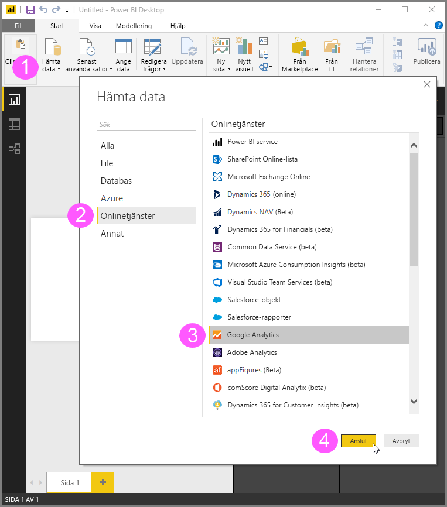
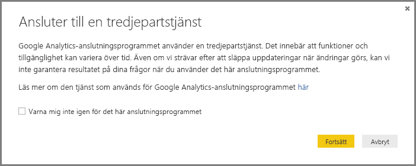
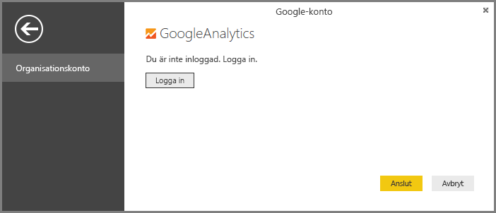

# Använda Google Analytics-anslutningsprogrammet för Power BI Desktop
> [!NOTE]
> Innehållspaketet och anslutningen för Google Analytics i Power BI Desktop använder sig av Google Analytics Core Reporting API. Det innebär att funktioner och tillgänglighet kan variera över tid.

Du kan ansluta till Google Analytics-data med hjälp av **Google Analytics**-anslutningsprogrammet. Gör så här för att ansluta:

1. I **Power BI Desktop** väljer du **Hämta data** från fliken **Start** i menyfliksområdet.
2. I fönstret **Hämta data** väljer du **Onlinetjänster** från kategorierna i det vänstra fönstret.
3. Välj **Google Analytics** från alternativen i det högra fönstret.
4. Längst ned i fönstret väljer du **Anslut**.  
   

En dialogruta visas som förklarar att anslutningsprogrammet är en tredjepartstjänst, varnar om hur funktioner och tillgänglighet kan ändras med tiden samt andra förtydliganden.  

När du väljer **Fortsätt** uppmanas du att logga in på Google Analytics.  

När du anger dina autentiseringsuppgifter visas ett meddelande om att Power BI vill ha offlineåtkomst. Detta är hur du använder **Power BI Desktop** för att få åtkomst till dina Google Analytics-data.  

När du har accepterat visar **Power BI Desktop** att du för närvarande är inloggad.  

Välj **Anslut**. Dina Google Analytics-data ansluts till **Power BI Desktop** och läser in datan.  

## Ändringar i API:n
Även om vi försöker släppa uppdateringar i takt med ändringarna, kan API:n ändras på ett sätt som påverkar resultaten för de frågor som vi genererar. I vissa fall kanske inte vissa frågor längre stöds. På grund av detta beroende kan vi inte garantera resultatet för dina frågor när du använder det här anslutningsprogrammet.

Mer information om ändringar i Google Analytics-API:n finns i deras [ändringslogg](https://developers.google.com/analytics/devguides/changelog).

