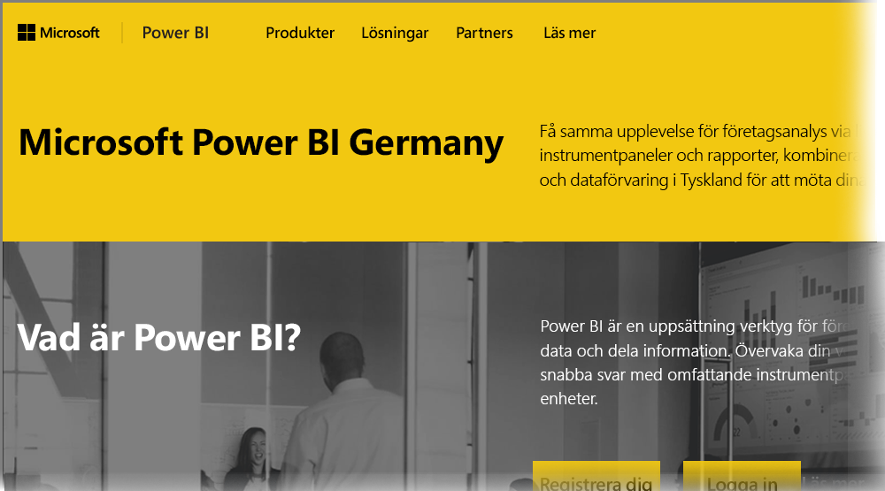

# Vanliga frågor för Power BI för tyska molnkunder
**Power BI-tjänsten** har en version som är tillgänglig för kunder i EU/Europeiska frihandelsavtalet (EU/EFTA), vilket ofta kallas Microsoft Cloud Deutschland (MCD). Den **Power BI-tjänsten** version som beskrivs i den här artikeln är utformad för kunder som tillhör myndigheter i EU-/EFTA-länder och är separat och skiljer sig från kommersiella versioner av **Power BI-tjänsten** eller Power BI-tjänster för andra myndigheter.

## Frågor och svar

Följande frågor och svar innehåller viktig information för Power BI Pro-tjänsten i Microsoft Cloud Deutschland (MCD), vilket är den molnlösning för Power BI som har utformats särskilt för EU/EFTA.

1. **Vad är Power BI-molntjänsten för Tyskland?**
   
   Power BI-tjänsten för kunder i EU/EFTA, som även kallas Microsoft Cloud Deutschland (MCD), är en EU/EFTA-kompatibel molnlösning där Power BI-tjänsten levereras från tyska datacenter. Alla kunddata i molnet för Power BI-tjänsten för EU/EFTA lagras i Tyskland med T-Systems i rollen som oberoende dataförvaltare i Tyskland där all fysisk och logisk åtkomst regleras av tysk lagstiftning. Power BI-molntjänsten för EU/EFTA kräver ett separat och åtskilt konto från kommersiella versioner av Power BI-tjänsten. Mer information om Microsoft Cloud Deutschland finns [här](https://www.microsoft.com/trustcenter/cloudservices/nationalcloud).
2. **Var kan jag hitta priser och registrera mig för Power BI-molnet för Tyskland?**
   
   Du kan hitta all information på startsidan för [Power BI-molnet för Tyskland](https://powerbi.microsoft.com/power-bi-germany/), inklusive information om priser. På den sidan kan du också hitta en länk för att registrera dig för **Power BI Pro-tjänsten** med en 30-dagars utvärderingsversion med 25 användarlicenser. Som en del av utvärderingsversionen kan du köpa eller lägga till ytterligare licenser vid behov. Vi erbjuder också Enterprise-avtal (EA) och prissättning för myndigheter och ideella organisationer. Kontakta din Microsoft-kundrepresentant för mer information.
3. **Jag har en tysk molnklient som del av Azure Germany och/eller Office 365 Germany-prenumerationer. Kan jag använda min befintlig klient för att registrera mig för Power BI Tyskland?**
   
   Ja. Som en del av inloggningsprocessen kan du logga in med ett befintligt klientadministratörkonto för molnet för Tyskland och lägga till Power BI Pro-licenser i din befintliga klient i molnet för Tyskland. Observera att klienter och användarkonton för molnet i Tyskland skiljer sig från Power BI-molntjänsten för Tyskland.
4. **Finns det en kostnadsfri version av Power BI-molntjänsten för Tyskland?**
   
   Nej. Vi erbjuder inte kostnadsfria licensversioner av Power BI-molntjänsten för Tyskland. Men vi rekommenderar att du registrerar dig för [den kostnadsfria versionen av Power BI i det offentliga molnet](https://powerbi.microsoft.com/get-started/) om dina affärsbehov uppfylls med gratisversionen av Power BI.
5. **Kan jag använda Power BI Desktop, Power BI Mobile, lokal datagateway och Publisher för Excel med Power BI-molntjänsten för Tyskland?**
   
   Ja. Vi har uppdaterat våra produkter för Power BI-klienter så att de fungerar sömlöst med Power BI-molntjänsten för Tyskland. Logga in med konto för Power BI-molntjänsten för Tyskland för att börja använda samma klientprodukter med Power BI-molntjänsten för Tyskland. Du kan hämta den senaste versionen av klientprodukterna från följande platser:
   
   * [Power BI Desktop](https://powerbi.microsoft.com/desktop/)
   * [Power BI Mobile](https://powerbi.microsoft.com/mobile/)
   * [Lokal datagateway](https://powerbi.microsoft.com/gateway/)
   * [Power BI Publisher för Excel](https://powerbi.microsoft.com/excel-dashboard-publisher/)
6. **Finns det några funktionsbegränsningar i Power BI-molntjänsten för Tyskland?**
   
   Följande funktioner i tjänsten är för närvarande inte tillgängliga i Power BI-molntjänsten för Tyskland:
   
   * Publicera på webben
   * ArcGIS-kartor från Esri
   * Power BI Embedded (avgränsad uppmätt ISV-licensiering, kommer att erbjudas via [Microsoft Azure Tyskland](https://azure.microsoft.com/overview/clouds/germany/) i framtiden)
7. **Var kan jag hitta specifik konfigureringsinformation för Power BI-molntjänsten för Tyskland för användning och integration i mina applikationer?**
   
   Vi har uppdaterat våra utvecklarexempel på [SaaS-inbäddning](https://github.com/Microsoft/PowerBI-Developer-Samples) med konfigurationsinformation för Tyskland och andra Power BI-molnlösningar. Ta en titt på mappen **molnkonfigurationerna** i exemplen för molnspecifika slutpunkter för konfigurering. I följande tabell visas olika konfigurationsslutpunkter för Power BI-molntjänsten för Tyskland (och offentligt moln som jämförelse).

| **Namnet på slutpunkten och/eller användning** | **URL till Power BI-molntjänsten för Tyskland** | **Motsvarande URL i offentligt moln (för jämförelse)** |
| --- | --- | --- |
| Startsida, registrera dig och logga In |[https://powerbi.microsoft.com/power-bi-germany/](https://powerbi.microsoft.com/power-bi-germany/) |[https://powerbi.microsoft.com/](https://powerbi.microsoft.com/) |
| Power BI-tjänsten, direkt inloggning |[https://app.powerbi.de/?noSignUpCheck=1](https://app.powerbi.de/?noSignUpCheck=1) |[https://app.powerbi.com/?noSignUpCheck=1](https://app.powerbi.com/?noSignUpCheck=1) |
| Tjänst-API |[https://api.powerbi.de/](https://api.powerbi.de/) |[https://api.powerbi.com/](https://api.powerbi.com/) |
| Office-portalen för användarlicenshantering, servicestatus och supportförfrågningar från administratörer |[https://portal.office.de/](https://portal.office.de/) |[https://portal.office.com/](https://portal.office.com/) |
| Utfärdar-Uri för AAD |[https://login.microsoftonline.de/common/oauth2/authorize/](https://login.microsoftonline.de/common/oauth2/authorize/) |[https://login.microsoftonline.com/common/oauth2/authorize/](https://login.microsoftonline.com/common/oauth2/authorize/) |
| Resurs-Uri för Power BI-tjänsten |[https://analysis.cloudapi.de/powerbi/api](https://analysis.cloudapi.de/powerbi/api) |[https://analysis.windows.net/powerbi/api](https://analysis.windows.net/powerbi/api) |
| Bibliotek med anpassade visuella objekt |[https://app.powerbi.de/visuals/](https://app.powerbi.de/visuals/) |[https://app.powerbi.com/visuals/](https://app.powerbi.com/visuals/) |
| Registrera en app för Power BI (inbäddade) |[https://app.powerbi.de/apps](https://app.powerbi.de/apps) |[https://app.powerbi.com/apps](https://app.powerbi.com/apps) |
| Azure Portal (inbäddade) |[https://portal.microsoftazure.de/](https://portal.microsoftazure.de/) |[https://portal.azure.com/](https://portal.azure.com/) |
| Community |[https://community.powerbi.com/](https://community.powerbi.com/) |[https://community.powerbi.com/](https://community.powerbi.com/) |

## Nästa steg
Det finns olika typer av saker du kan göra med Power BI. Mer information och utbildning, inklusive en artikel som visar hur du registrerar dig för tjänsten, ta en titt i följande resurser:

* [Guidad utbildning för Power BI](guided-learning/gettingstarted.yml?tutorial-step=1)
* [Komma igång med Power BI-tjänsten](service-get-started.md)
* [Vad är Power BI Desktop?](desktop-what-is-desktop.md)

