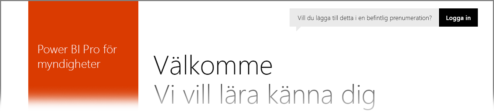

# Power BI för amerikanska myndighetskunder
**Power BI-tjänsten** har en version som är tillgänglig för amerikanska myndigheter som en del av **Office 365 US Government Community**-prenumerationer. Den version av **Power BI-tjänsten** som beskrivs i den här artikeln är utformad för kunder som tillhör amerikanska myndigheter och är separat och skiljer sig från kommersiella versioner av **Power BI-tjänsten**.

I följande avsnitt beskrivs de *funktioner* som är tillgängliga för i den version av **Power BI-tjänsten** som är avsedd för amerikanska myndigheter. Här klargörs även några av *begränsningarna*, här finns en lista med vanliga frågor och svar (**FAQ**), (även sådana om hur man registrerar sig) och länkar till mer information.

## Funktioner i Power BI-versionen för amerikanska myndigheter
Det är viktigt att tänka på att **Power BI för amerikanska myndigheter** endast är endast tillgänglig som en **Pro-licens**, och inte som en kostnadsfri licens. Vissa funktioner i Power BI-tjänsten är tillgängliga i den version av **Power BI** som är avsedd för amerikanska myndigheter.

Följande funktioner är tillgängliga för dem som använder **Power BI för amerikanska myndigheter**, då de även gäller **Pro**-licensfunktioner:

* Skapa och visa instrumentpaneler och rapporter
* [Datakapacitetsbegränsningar](service-admin-manage-your-data-storage-in-power-bi.md)
* [Schemalagd datauppdatering](refresh-data.md)
* Uppdateringsbara teaminstrumentpaneler
* Active Directory-grupper för delning och hantering av åtkomstkontroll
* [Importera data](service-get-data.md) och rapporter från Excel, CSV och Power BI Desktop-filer
* Data Management Gateway
* Alla data krypteras i Azure SQL- och Blob Storage för Power BI
* Ansluta till tjänster med [innehållspaket](service-connect-to-services.md)

## Anslutningen mellan myndigheter och offentliga Azure-molntjänster 

Azure fördelas mellan flera moln. Som standard tillåts klientorganisationer att öppna brandväggsregler till en molnspecifik instans, men nätverk mellan moln är annorlunda och kräver att man öppnar specifika brandväggsregler för kommunikation mellan tjänster. Om du är en Power BI-kund och du har befintliga SQL-instanser i det offentliga molnet som du behöver komma åt, måste du öppna specifika brandväggsregler IP-adressutrymmet för SQL till Azure Government-molnet för följande datacenter:

* USGov Iowa
* USGov Virginia
* USGov Texas
* USGov Arizona

Det finns IP-adressutrymmen tillgängliga i det offentliga molnet, men för myndighetsmolnet, måste du öppna ett Azure Support-ärende för att begära IP-adressintervallen för ovan listade datacenter. 

## Begränsningar av Power BI-versionen för amerikanska myndigheter
Några av de funktioner som är tillgängliga i den kommersiella versionen av **Power BI-tjänsten** är *inte* tillgängliga i **Power BI-tjänsten** för amerikanska myndigheter. Power BI-teamet arbetar aktivt med att göra dessa funktioner tillgängliga för kunder som tillhör amerikanska myndigheter och kommer att uppdatera den här artikeln när dessa funktioner blir tillgängliga.

* **Power BI för amerikanska myndigheter** är endast tillgängligy som en **Pro**-licens. Alla referenser till kostnadsfria Power BI-licenser i en administrationsportal (eller som användare) körs i ett kommersiellt Power BI-tjänstmoln.
* **Granskning** – granskning är inte tillgängligt via portalen för Office 365-säkerhet och regelefterlevnad.
* **Power BI-innehåll i Cortana** – Power BI-resultat visas inte i sökresultat för Cortana. Det inkluderar resultat för ditt Power BI-innehåll (instrumentpaneler, rapporter, appar) samt resultat som visar Cortana-optimerade rapportsidor för specifika nyckelord.
* **Delning med extern användare** – Delning är tillåtet inom en Power BI-klient, men du kan inte dela med användare utanför din Power BI-klient.

Om du har kostnadsfria **Power BI**-licenser som tilldelats ditt konto, körs dessa konton i en kommersiell version av **Power BI**-tjänsten, och ingår inte i erbjudandet om **Power BI för amerikanska myndigheter**. För dessa kostnadsfria konton kan följande problem uppstå:

* Gateway, Mobile och Desktop kan inte autentisera
* Du har inte åtkomst till kommersiella Azure-datakällor
* PBIX filer måste överföras manuellt
* Power BI-mobilappar är inte tillgängliga

Lös problemen genom att kontakta din kontorepresentant.

## Vanliga frågor (FAQ) för US Government-versionen av Power BI-tjänsten
Följande frågor (och svar) hjälper dig att snabbt få information som du behöver om tjänsten.

**Fråga:** Hur migrerar jag mina **Power BI**-affärsdata till **Power BI-tjänsten** för amerikanska myndigheter?

**Svar:** Din administratör måste skapa en ny instans av **Power BI** under en separat prenumeration som är specifik för amerikanska myndigheter. Sedan kan du replikera dina affärsdata i **Power BI-tjänsten** för amerikanska myndigheter, ta bort din kommersiella licens och associera din befintliga domän till den nya myndighetsspecifika tjänsten.

**Fråga:** Varför kan jag inte ansluta till ett specifikt innehållspaket?

**Svar:** måste du kontrollera att prenumerationen har aktiverats innan du ansluter till innehållspaketet.

**Fråga:** jag är intresserad av **Power BI** för min myndighetsorganisation. Hur kommer jag igång?

**Svar:** Registrering (ofta kallat *integration*) kan variera beroende på ditt befintliga licens och prenumeration. Mer information finns i artikeln [Registrera dig för Power BI US Government](service-govus-signup.md).

**Fråga:** Skiljer sig URL:en för att ansluta till **Power BI** för amerikanska myndigheter Government från URL:en för den kommersiella versionen av **Power BI**?

**Svar:** Ja, URL:erna skiljer sig åt. I följande tabell visas varje URL:

| URL för den kommersiella versionen | URL för versionen för amerikanska myndigheter |
| --- | --- |
| https://app.powerbi.com/ |[https://app.powerbigov.us](https://app.powerbigov.us) |

## Nästa steg
Det finns olika typer av saker du kan göra med Power BI. Mer information och utbildning, inklusive en artikel som visar hur du registrerar dig för tjänsten, hittar du i följande resurser:

* [Registrera dig för Power BI för amerikanska myndigheter](service-govus-signup.md)
* <a href="https://channel9.msdn.com/Blogs/Azure/Cognitive-Services-HDInsight-and-Power-BI-on-Azure-Government">Demonstration av Power BI för amerikanska myndigheter</a>
* [Guidad utbildning för Power BI](guided-learning/gettingstarted.yml#step-1)
* [Komma igång med Power BI-tjänsten](service-get-started.md)
* [Komma igång med Power BI Desktop](desktop-getting-started.md)

