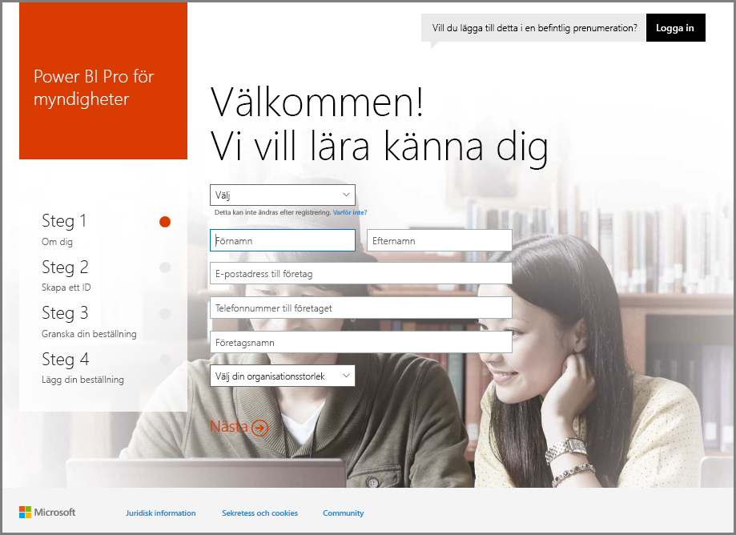
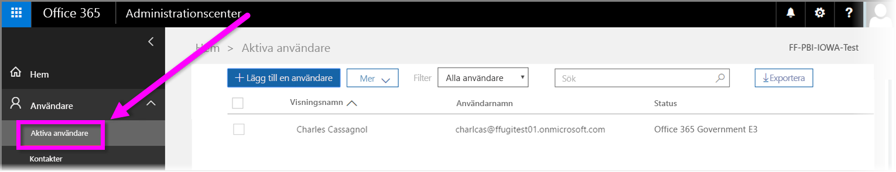

# Registrera din amerikanska myndighetsorganisation i Power BI-tjänsten
**Power BI-tjänsten** har en version som är tillgänglig för amerikanska myndigheter som en del av **Office 365 US Government Community**-prenumerationer. Den version av **Power BI-tjänsten** som beskrivs i den här artikeln är utformad för kunder som tillhör amerikanska myndigheter. Den är separat och skiljer sig från kommersiella versioner av **Power BI-tjänsten**.

Mer information om **Power BI-tjänsten** för tillhör amerikanska myndigheter, inklusive dess funktioner och begränsningar finns på [Power BI för amerikanska myndigheter – översikt](service-govus-overview.md).

> [!NOTE]
> Den här artikeln är avsedd för administratörer som har behörighet att registrera organisationer som tillhör amerikanska myndigheter för Power BI. Om du är en slutanvändare ska du kontakta administratören om att få en prenumeration på Power BI för amerikanska myndigheter.
> 
> 

## Välj rätt registreringsprocessen för din organisation som tillhör en amerikansk myndighet
Din myndighetsorganisation kan vara ny till **Office Government Cloud** eller redan ha en prenumeration. Följande avsnitt innehåller information om registreringsstegen beroende på var du befinner dig med Office Government Cloud och Power BI och varierar beroende på din befintliga prenumeration.

När du har registrerat dig för Power BI US Government fungerar vissa funktioner kanske inte förrän sälj- eller supportrepresentant har slutfört övergångsprocessen. För mer information om dessa funktioner, gå till [Power BI för myndigheter i USA – Översikt](service-govus-overview.md). För att slutföra övergångsprocessen för att aktivera dessa funktioner, kontakta din sälj- eller supportrepresentant.

### Myndigheter i USA som är nya Office Cloud-kunder
Om organisationen är en ny **Office Government Cloud**-kund gör du följande:

> [!NOTE]
> De här stegen bör utföras av portaladministratören.
>

1. Gå till [https://products.office.com/government/office-365-web-services-for-government](https://products.office.com/government/office-365-web-services-for-government).

>[!NOTE]
>Om du inte vill registrera dig för Office Government Cloud just nu bör du prata med din säljrepresentant.
>

2. Välj Office G3 och fyll i formuläret för en utvärderingsversion av Office
3. När du är en Office Cloud-kund fortsätter du med stegen nedan för ”befintliga Office Government Cloud-kunder”

### Befintliga Office Government Cloud-kunder
Om din organisation är en befintlig **Office Government Cloud**-kund men ni saknar en **Power BI**-prenumeration (kostnadsfri eller annan) ska du följa dessa steg:

> [!NOTE]
> De här stegen bör utföras av portaladministratören.
> 
> 

1. Logga in på ditt befintliga konto för Office Government Cloud och gå till administrationsportalen
2. Välj **Fakturering**.
3. Välj **Köp tjänsten**.
4. Välj alternativet Power BI Pro Government och välj mellan **Försök** och **Köp nu**
5. Slutföra din order
6. Tilldela användare till kontot.
   
   
7. Logga in på **Power BI-tjänsten** för US Government-kunder på [https://app.powerbigov.us](https://app.powerbigov.us)

## Ytterligare inloggningsinformation
Nedan visas ytterligare information för att registrera dig för **Power BI US Government** i olika licensmigrationsfall.

### Direkt omställning från utvärderingsversionen till fullversionen av Power BI
* Klicka på och slutför Fakturering > Köp tjänsten > Power BI Pro Gov och välj köp och inte utvärderingsversion
* Fyll i det nödvändiga och hämta licenserna
* Ta bort Power BI Pro-utvärderingsversion eller ta bort de gamla licenserna och tilldela nya till användare
* Logga in på [https://app.powerbigov.us](https://app.powerbigov.us)

### Återförsäljaromställning från utvärderingsversionen till fullversionen av Power BI
Gå till **Fakturering > Prenumerationer** och välj prenumerationen **Power BI Pro för myndigheter**. Följande visas:

* Tillgänglig
* Tilldelad
* Länkar för att tilldela till användare
* Om du fortfarande har tilldelats utvärderingsversionen:
  * Klicka på **Tilldelad** under testprenumerationen och ta bort användarna du vill lägga till i den betalda versionen
  * Gå till betald prenumeration och tilldela dessa användare

### Anvisningar för vitlistning
*Vitlistning* är en process som utvecklingsteamet för Power BI använder för att flytta kunder från den kommersiella molnmiljön till en säker molnmiljö för myndigheter. Detta säkerställer att funktionerna i US Government Cloud fungerar som förväntat. Alla befintliga (eller nya) amerikanska myndigheter som är våra kunder som köper **Power BI**-tjänster för myndigheter för första gången *måste* utföra följande vitlistningsprocess. Processen måste göras innan installation eller migrering till US Government **Power BI**-tjänster. 

Om du vill få din klientorganisation *vitlistad* för US Government-molnet kontaktar du Microsoft-kontoteamet för hjälp med vitlistning. Endast administratörer kan göra denna begäran. Processen för *vitlistning* tar cirka tre veckor, då teknikteamet för Power BI utför lämpliga ändringar för din klient så att den fungerar korrekt i molnet för amerikanska myndigheter.

Kunder som migrerar från **Kostnadsfria** Power BI-licenser till **Power BI US Government** (och per definition migrerar till de associerade **Pro**-licensfunktioner som beskrivs ovan i den här artikeln) kan påträffa problem som beskrivs i följande avsnitt i den här artikeln tills klienten har *vitlistats* av Power BI-utvecklingsteamet.

### Blandad kostnadsfria och fulla licenser för klienter hos amerikanska myndigheter
Om du har både kostnadsfria och US Government Pro-licenser i din klient kommer både licenser att bli kvar, men någon av licenserna kommer inte att fungera korrekt. Om din klient har godkänts i *vitlistning*sprocessen inträffar följande:

* Användare med kostnadsfri licens kommer inte längre att kunna logga in på Power BI med hjälp av **Power BI Desktop** och kan uppleva avvikande funktionalitet som beskrivs i följande avsnitt.
* Alla klienter som tilldelats US Government Pro-licenser fungerar som väntat, inklusive användning av gateway, Power BI Desktop och Mobile-appar.

När du använder en blandning av kostnadsfria och Pro-licenser på en klient som tillhör amerikanska myndigheter och går igenom *vitlistningsprocessen* kan följande förväntas:

**Inför _vitlistning_** :

* Användare med kostnadsfria licenser använder det kommersiella molnet
* Pro-licenser för amerikanska myndigheter visas i portalen och administratören kan välja att tilldela dessa myndigheter till användare. Pro-användare hos amerikanska myndigheter kommer inte att förlora några data från sina kostnadsfria licenser så snart som administratören har tilldelat en Pro-licens. Tilldelade användare har åtkomst till Power BI Pro-funktioner för amerikanska myndigheter, men följande punktlista med funktionsluckor kan kvarstå tills klienten har *vitlistats*:
  
  * Gateway, Mobile och Power BI Desktop kan inte autentisera
  * Du har inte åtkomst till kommersiella Azure-datakällor
  * PBIX filer måste överföras manuellt från den kommersiella Power BI-tjänsten
  * Power BI-mobilappar är inte tillgängliga

**Efter _vitlistning_** :

* Användare av den kostnadsfria versionen som använder den kommersiella Power BI-tjänsten kan fortsätta att göra detta men de kan inte längre autentisera.
* Pro-användarna som använder molntjänsten för amerikanska myndigheter kan använda tjänsten **Power BI för amerikanska myndigheter** som förväntat.

För att identifiera användare på din klient som använder en kostnadsfri licens för Power BI kan administratören köra en licensrapport, där kostnadsfria licenser visas som **Power BI Standard**.

## Nästa steg
Det finns olika typer av saker du kan göra med Power BI. Mer information och utbildning, inklusive en artikel som visar hur du registrerar dig för tjänsten, hittar du i följande resurser:

* [Översikt över Power BI för amerikanska myndigheter](service-govus-overview.md)
* [Guidad utbildning för Power BI](guided-learning/index.yml)
* [Komma igång med Power BI-tjänsten](service-get-started.md)
* [Vad är Power BI Desktop?](desktop-what-is-desktop.md)

