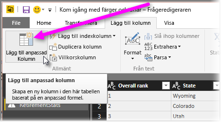

# Histogram
Du kan skapa histogram på många olika sätt i Power BI. Vi börjar med det enklaste och går vidare därifrån.

## Enkla histogram
Kom igång genom att bestämma vilken fråga som histogrammet ska byggas på.  Använd alternativet *Referens* för frågan och skapa en ny fråga och ge den namnet *FieldName-histogram*. Använd alternativet **Gruppera efter** på menyfliksområdet **Transformera** och välj aggregeringen **Räkna rader**. Se till att datatypen är ett tal för den resulterande aggregeringskolumnen. Sedan kan du visualisera data på rapportsidan. Den här metoden är snabb och enkel att bygga, men fungerar inte bra om du har många datapunkter och den tillåter inte borstning av flera visuella objekt.

## Skapa ett historgram genom att definiera bucketar
Bestäm vilken fråga som histogrammet ska byggas på. Använd alternativet *Referens* för frågan och skapa en ny fråga och ge den namnet *FieldName*.  Nu ska du definiera bucketarna med en regel. Använd alternativet **Lägg till anpassad kolumn** på menyfliksområdet **Lägg till kolumn** och skapa en anpassad regel.

Se till att datatypen är ett tal för den resulterande aggregeringskolumnen. Nu kan du skap histogrammet genom att använda gruppen med teknik som beskrivs i **Enkla histogram** (tidigare i den här artikeln). Det här alternativet hanterar fler datapunkter, men hjälper ändå inte med borstning.

## Definiera ett histogram som stöder borstning
Med borstning avses när visuella data länkas samman, så att när en användare väljer en datapunkt i ett visuellt objekt, så markerar eller filtrerar övriga visuella objekt de datapunkter som relaterar till den valda datapunkten.  Eftersom vi hanterar data i databasfrågor, måste vi skapa en relation mellan tabellerna, och se till att vi vet vilka detaljelement som relaterar till bucketen i histogrammet och vice versa.

Starta processen med hjälp av alternativet *Referens* för den fråga som innehåller det fält utifrån vilket du vill skapa ett histogram.  Ge den nya frågan namnet *Bucketar*.  Låt oss i det här exemplet kalla den ursprungliga frågan *Information*.  Ta sedan bort alla kolumner utom den kolumn som du ska använda som bucket för histogrammet.  Använd nu frågefunktionen *Ta bort dubbletter*. Den finns på snabbmenyn som visas när du markerar kolumnen. Det återstående värdena i kolumnen kommer då att vara unika. Om du har decimaltal kan du först använda tipset om hur man definierar bucketar när man skapar histogram för att få en hanterbar uppsättning bucketar.  Nu är det dags att kontrollera de data som visas i frågeförhandsvisningen. Om du ser tomma värden eller nullvärden måste du åtgärda dessa innan du kan skapa någon relation. Mer information finns i ”Skapa en relation om mina data har nullvärden eller tomma värden”. Med det kan vara problematiskt att använda den här metoden på grund av behovet att sortera. Hur du gör för att få bucketarna att sortera korrekt beskrivs i ”Sorteringsordning: få kategorier att visas i önskad ordning”. 

> [!NOTE]
> Det kan vara bra att tänka på sorteringsordningen innan du skapar några visuella objekt.   
> 
> 

Nästa steg i processen är att definiera en relation mellan *bucketerna* och *informationsfrågorna* i bucketkolumnen.  Välj *Hantera relationer* i menyfliksområdet i *Power BI Desktop*.  Skapa en relation där *bucketar* finns i den vänstra tabellen och *information* i den högra, och markera det fält som du använder för histogrammet. 

Det avslutande steget är att skapa histogrammet. Dra bucketfältet från tabellen *Bucketar*. Ta bort standardfältet från det resulterande stapeldiagrammet.  Dra nu histogramfältet från tabellen *Information* tabell till samma visuella objekt. Ändra standardmängden till Antal i fältkällan. Histogrammet är resultatet. Om du skapar ett annat visuellt objekt, t.ex. en trädkarta från tabellen Information, så välj en datapunkt i trädkartan om du vill se histogrammet markera och visa den valda datapunkten i förhållande till trenden för hela datauppsättningen.

