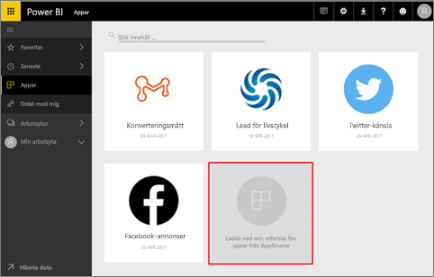
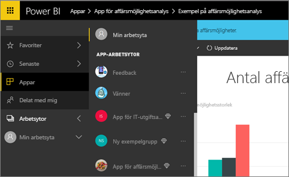
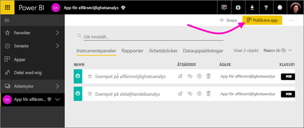
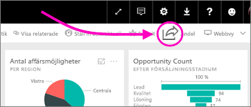

# Hur samarbetar och delar jag i Power BI?

Du har skapat instrumentpaneler och rapporter. Du kanske även använder dem för att samarbeta med dina kollegor. Då vill du att andra ska ha åtkomst till dem. Vad är det bästa sättet att distribuera dem?

I den här artikeln jämför vi alternativen för att samarbeta och dela i Power BI: 

* Samarbeta med kolleger för att skapa beskrivande rapporter och instrumentpaneler i *apparbetsytor*.
* Paketera dessa instrumentpaneler och rapporter i *appar* och publicera dem till en större grupp eller hela organisationen.
* Dela instrumentpaneler och rapporter med några få personer från tjänsten eller Power BI-appar.
- Skriva ut rapporter.
* Publicera på webben för offentliga webbplatser, där vem som helst i världen kan se och interagera med den.

Oavsett vilket alternativ du väljer för att dela en instrumentpanel behöver du antingen en [Power BI Pro-licens](service-free-vs-pro.md) eller också måste innehållet finnas i en [Premium-kapacitet](service-premium.md). Licenskraven kan variera för kollegorna som ser dina instrumentpaneler, beroende på vilket alternativ du väljer. Det följande avsnittet beskriver detta i större detalj. 

*Appar i Power BI-tjänsten*

## Samarbeta med kollegor på en apparbetsyta

När team arbetar tillsammans behöver de åtkomst till samma dokument så att de snabbt kan samarbeta. Apparbetsytor i Power BI ger just den plats där team samlas och delar ägarskap och hantering av viktiga instrumentpaneler, rapporter, datauppsättningar och arbetsböcker. Ibland organiserar Power BI-användare sina arbetsytor baserat på organisationsstrukturer, och i andra fall skapar de dem för särskilda projekt. Andra organisationer använder fortfarande flera arbetsytor för att lagra olika versioner av rapporter eller instrumentpaneler som de använder. 

Apparbetsytor ger roller som bestämmer vilka behörigheter dina medarbetare har. Du kan använda dessa roller för att bestämma vem som kan hantera hela arbetsytan eller bara tillföra innehåll till den.

Vissa användare lägger av naturliga skäl innehåll i sin Min arbetsyta och delar det. Apparbetsytor är bättre för samarbete än Min arbetsyta eftersom de ger medägarskap för innehåll. Du och hela teamet kan enkelt göra uppdateringar eller ge andra användare åtkomst. Min arbetsyta är bäst lämpat för enskilda användare som lägger till personligt innehåll eller innehåll som används en enstaka gång.

Låt oss anta att du har en färdig instrumentpanel som du behöver dela med dina kollegor. Vad är det bästa sättet att ge dem åtkomst till instrumentpanelen? Svaret beror på ett antal faktorer. Om en viss kollega måste äga instrumentpanelen och hålla den uppdaterad, eller behöver åtkomst till allt innehåll på apparbetsytan, kan det vara bäst att lägga till den kollegan i arbetsytan. Om kollegan bara behöver se just den instrumentpanelen och inte allt innehåll på arbetsytan kan du återigen välja bland en uppsättning alternativ. Om instrumentpanelen är en del av en större uppsättning innehåll som du behöver distribuera till många kollegor är publicering av en app sannolikt det bästa valet. Om kollegan dock bara behöver den specifika instrumentpanelen kan det bästa tillvägagångssättet vara att dela instrumentpanelen. 

Läs mer om att [skapa apparbetsytor](service-create-workspaces.md).

**Visste du att?** Power BI har en ny arbetsyta i förhandsversion. Läs [Skapa de nya arbetsytorna (förhandsversion)](service-create-the-new-workspaces.md) för att ta reda på hur arbetsytor kommer att ändras i framtiden. 

## Distribuera data och insikter genom att skapa en app

Anta att du vill distribuera instrumentpanelen till en bred publik. Du och dina medarbetare har skapat en *apparbetsyta* och skapat och förfinat instrumentpaneler, rapporter och datauppsättningar på apparbetsytan. Nu väljer du de instrumentpaneler och rapporter du vill ha och publicerar dem som en app – antingen till en grupp eller till hela organisationen. 

Apparna är lätta att hitta och installera på Power BI-tjänsten ([https://powerbi.com](https://powerbi.com)). Du kan skicka en direktlänk till appen till dina företagsanvändare eller de kan söka efter den i AppSource. Om din Power BI-administratör ger dig behörighet kan du installera en app automatiskt i dina medarbetares Power BI-konton. Läs mer om att [publicera dina appar](service-create-distribute-apps.md). 

När de har installerat en app kan de se den i webbläsaren eller på mobilenheten.

För att användare ska kunna se din app måste de antingen ha en Power BI Pro-licens eller också måste appen lagras på en Power BI Premium-kapacitet. Läs [Vad är Power BI Premium?](service-premium.md) för mer information.

Du kan även publicera appar till dem som är utanför din organisation. De kan visa och interagera med appinnehållet men kan inte dela det med andra.

## Dela instrumentpaneler och rapporter
Anta att du har skapat en instrumentpanel och en rapport på din egen Min arbetsyta eller på en apparbetsyta och du vill att några andra personer ska ha åtkomst till den. Ett sätt att komma åt den är att *dela* den. 

Du behöver en Power BI Pro-licens för att dela innehåll, liksom de som du delar det med. Annars måste innehållet vara på en arbetsyta i en [Premium-kapacitet](service-premium.md). När du delar en instrumentpanel eller rapport kan mottagare som du delar med se den och interagera med den, men inte redigera den. De ser samma data som visas på instrumentpanelen och i rapporterna, såvida inte säkerhet på radnivå (RLS) tillämpas på den underliggande datauppsättningen. De medarbetare som du delar den med kan dela den med sina medarbetare, om du tillåter dem att göra så. 

Du kan dela en instrumentpanel med personer utanför din organisation. De kan även visa och interagera med instrumentpanelen eller rapporten, men de kan inte dela den. 

Mer om att [dela instrumentpaneler och rapporter](service-share-dashboards.md) från Power BI-tjänsten. Du kan också lägga till ett filter till en länk och [dela en filtrerad vy av rapporten](service-share-reports.md).

## Kommentera och dela från Power BI-mobilapparna
Du kan kommentera på en panel, rapport eller visualisering och sedan dela den med vem som helst med hjälp av Power BI-mobilapparna för iOS- och Android-enheter. 

Du delar en ögonblicksbild av paneler, rapporten eller visualiseringen och mottagarna ser den precis som den var när du skickade e-postmeddelandet. E-postmeddelandet innehåller också en länk till instrumentpanelen eller rapporten. Om de har en licens för Power BI Pro, eller om innehållet ligger i en [Premium kapacitet](service-premium.md), och du redan har delat objektet med dem, kan de öppna den. Du kan skicka ögonblicksbilder av paneler till alla &#151; inte bara medarbetare i samma e-postdomän.

Mer om [delning och kommentering för paneler, rapporter och visuella objekt](consumer/mobile/mobile-annotate-and-share-a-tile-from-the-mobile-apps.md) från iOS- och Android-appar.

Du kan också [dela en ögonblicksbild av en panel](consumer/mobile/mobile-windows-10-phone-app-get-started.md) från Power BI-appen för Windows 10-enheter.

## Skriva ut eller spara som PDF eller andra statiska filer
Du kan skriva ut eller spara som PDF (eller andra statiska filformat) hela instrumentpaneler, paneler, rapportsidor eller visualiseringar från Power BI-tjänsten. Rapporter kan bara skrivas ut en sida i taget – det går inte att skriva ut hela rapporten på samma gång. Mer om att [skriva ut eller spara som en statisk fil](service-print.md).

## Publicera på webben

> [!WARNING]
> Använd endast **Publicera på webben** för att dela innehåll offentligt, inte för intern delning.

Du kan publicera Power BI-rapporter till hela Internet genom att bädda in interaktiva visuella objekt i blogginlägg, webbplatser, sociala medier och andra former av onlinekommunikation på valfri enhet. Alla på Internet kan se dina rapporter och du har ingen kontroll över vem som kan se vad du har publicerat. De behöver inte en licens för Power BI. Du kan bara publicera rapporter som du kan redigera på webben. Du kan inte publicera rapporter på webben om de har delats med dig eller om de finns i en app. Mer om att [publicera på webben](service-publish-to-web.md).

## Nästa steg
* [Dela instrumentpaneler med kollegor och andra](service-share-dashboards.md)
* [Skapa och publicera en app i Power BI](service-create-distribute-apps.md)
* Har du feedback till oss? Gå till [Power BI Community-webbplatsen](https://community.powerbi.com/) med dina förslag.
* Har du fler frågor? [Testa Power BI Community](http://community.powerbi.com/).

